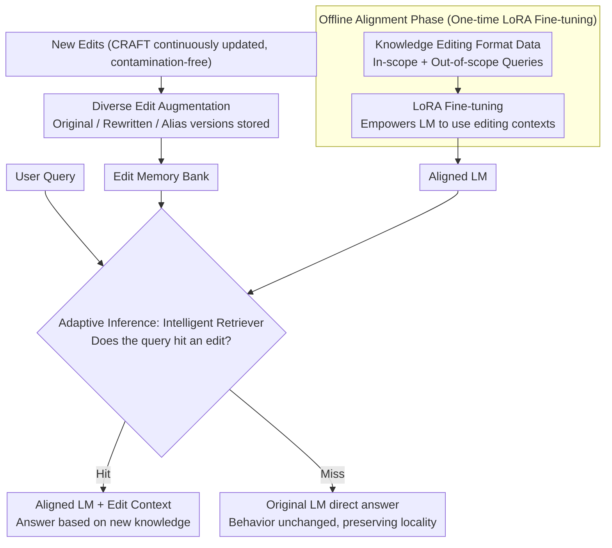

# Aligning Language Models with Real-time Knowledge Editing

**Conference**: ACL 2026  
**arXiv**: [2508.01302](https://arxiv.org/abs/2508.01302)  
**Code**: [GitHub](https://github.com/JamyDon/CRAFT-KEDAS)  
**Area**: Knowledge Editing  
**Keywords**: Real-time Knowledge Editing, Knowledge Alignment, Dataset Contamination, Diverse Augmentation, Adaptive Inference

## TL;DR

Introduces CRAFT (a continuously updated Chinese financial knowledge editing dataset) and KEDAS (a knowledge editing alignment paradigm based on diverse edit augmentation and adaptive inference) to resolve the difficulty of balancing success rate, locality, and portability in real-time knowledge editing scenarios.

## Background & Motivation

**Background**: Knowledge editing aims to efficiently modify outdated knowledge in LMs without complete retraining. Current mainstream evaluation datasets (ZsRE, MQuAKE, RippleEdits) are static and cannot be updated once released.

**Limitations of Prior Work**: (1) Static datasets suffer from severe data leakage—most knowledge has already been seen by LMs during pre-training, leading to unfair evaluation; (2) WikiBigEdit is real-time but requires processing hundreds of GBs of sparse Wiki data; (3) Existing methods fail to achieve a balance between editing success rate, locality, and portability.

**Key Challenge**: Parameter modification methods (e.g., ROME, WISE) lead to severe model degradation during continuous editing; retrieval-based methods (e.g., IKE, EREN) suffer from unstable performance due to a lack of alignment; alignment-based methods (e.g., LTE) show poor locality due to overfitting.

**Goal**: Construct a continuously updated, contamination-free real-time knowledge editing dataset and propose a knowledge editing method capable of balanced performance across all metrics.

**Key Insight**: Utilize continuously updated official Chinese financial statistical data (which LMs have not seen) to construct the dataset and redefine knowledge editing as an LM alignment problem.

**Core Idea**: Empower the LM with knowledge editing capabilities through one-time offline alignment (LoRA fine-tuning), and then use an adaptive router during inference to decide whether to use the original model or the aligned model, fundamentally solving the locality problem.

## Method

### Overall Architecture

KEDAS redefines "knowledge editing" as an alignment problem of "teaching the LM to use editing prompts," divided into offline and online stages. In the offline stage, LoRA is used to fine-tune the LM once on data in a knowledge editing format, granting it the ability to "update answers based on the editing context"; in the online stage, only the external memory is modified—new knowledge is stored in the memory in diversified forms. During inference, an intelligent retriever first determines if the query "hits" a specific edit, then adaptively routes between the "original LM" and the "LoRA aligned LM" paths. This ensures editing capabilities are injected once, subsequent edits involve zero parameter changes, and locality is guaranteed by the router.

### Key Designs

**1. CRAFT Dataset: Avoiding contamination with continuously updated official data**

Static benchmarks (ZsRE, MQuAKE, RippleEdits) are fixed upon release, and most knowledge within them has been seen by LMs during pre-training, distorting evaluation results. CRAFT utilizes continuously released official Chinese financial and statistical data (GDP, population, etc.), ensuring the knowledge is naturally unseen by LMs and can be refreshed over time. It also designs "paired edits" as composite reasoning tests and provides three types of evaluation: alias portability, temporal locality, and commonsense locality—the paired structure specifically examines the model's ability to integrate multiple edits (composite portability) rather than just modifying single points.

**2. Diverse Edit Augmentation: Storing one piece of knowledge in multiple phrasings**

User phrasing for the same event can vary greatly. If edits are stored in only one form, retrieval often misses due to expression mismatches. Diverse edit augmentation stores each edit simultaneously as original QA pairs, rewritten versions, and alias versions. This significantly improves retrieval hit rates, ensuring subsequent routing decisions are built on the foundation of "recalling everything that should be recalled."

**3. Adaptive Inference Path: Preserving locality fundamentally with routing**

The essence of poor locality is that edits affect unrelated queries. KEDAS utilizes an intelligent retriever with filtered augmentation to first judge if a query is related to any edit: if relevant, it proceeds to the LoRA aligned model with the edit context to answer; if irrelevant, it uses the original LM directly, without any change in behavior. Because the aligned model is not activated for unrelated queries, knowledge forgetting caused by overfitting is bypassed, which is the key reason it outperforms pure alignment methods like LTE in locality.

### Selection Example

Taking the edit "The latest GDP for a certain province has been updated" as an example: during storage, it is augmented into original questions, rewritten questions, and questions containing aliases before entering memory. During inference, if a user asks "What was the total economic volume of that province last year?", the retriever hits this edit, the query is routed to the LoRA aligned model along with the editing context, and the updated value is output. If the user instead asks an unrelated commonsense question like "What is the capital city of that province?", the retriever determines it is irrelevant, and the query is handed directly to the original LM. The model's behavior is completely unaffected by this edit—thus achieving success, portability, and locality simultaneously.

### Loss & Training

The alignment phase uses LoRA fine-tuning. The training data simultaneously covers queries within the editing scope and those outside it, allowing the model to learn "how to use edits when they are applicable" and "not to change when they are irrelevant." Once this one-time alignment is completed, all subsequent edits only manipulate the memory and no longer touch the model parameters.

## Key Experimental Results

### Main Results

| Method | Editing Success Rate | Locality | Portability | Overall |
|------|----------|--------|---------|------|
| ROME (Param Modification) | High $\rightarrow$ Degrading | Poor | Poor | Unbalanced |
| IKE (Retrieval) | Medium | Medium | Medium | Unstable |
| LTE (Alignment) | High | Poor (Overfitting) | Medium | Unbalanced |
| KEDAS (Ours) | High | High | High | **Excellent Overall** |

### Ablation Study

| Configuration | Key Metric | Description |
|------|---------|------|
| Data Leakage Analysis | CRAFT exposure rate $\approx 0$ | Most traditional datasets have been seen by LMs |
| Remove Diverse Augmentation | Retrieval recall decreased | Multi-form storage improved robustness |
| Remove Adaptive Inference | Locality decreased | Routing mechanism is the key guarantee for locality |

### Key Findings
- Knowledge leakage in existing datasets is severe—the exposure rates of five LMs on traditional datasets are much higher than on CRAFT.
- Parameter modification methods like ROME degrade rapidly during continuous editing, failing to meet real-time editing requirements.
- KEDAS significantly outperforms all baselines on both CRAFT and traditional datasets, achieving a balance across all metrics for the first time.

## Highlights & Insights
- The revelation of the data leakage problem serves as a warning to the field of knowledge editing—evaluation results may not reflect true capabilities.
- The "align once, edit for a lifetime" paradigm elegantly separates alignment costs from editing flexibility.
- The adaptive inference path cleverly solves the trade-off between editing and not editing—allowing for edits without parameter modification.

## Limitations & Future Work
- CRAFT currently only covers Chinese and financial/statistical domains; generalization to other languages and domains requires further verification.
- The quality of the adaptive retriever acts as a bottleneck for system performance.
- Efficiency of memory management for extremely large-scale edits (e.g., million-level) was not discussed.
- Future research could explore more efficient alignment strategies and cross-lingual real-time editing.

## Related Work & Insights
- **vs ROME/MEMIT**: Parameter modification methods degrade during continuous editing; KEDAS avoids this issue via external memory.
- **vs LTE**: While both are alignment methods, KEDAS solves the overfitting problem of LTE via the adaptive inference path.
- **vs RAG**: KEDAS not only retrieves edits but also aligns the LM's ability to utilize them, which is more effective than pure RAG.

## Rating
- Novelty: ⭐⭐⭐⭐ Innovation in both the CRAFT dataset and the KEDAS paradigm.
- Experimental Thoroughness: ⭐⭐⭐⭐⭐ Dual verification on CRAFT and traditional datasets, including data leakage analysis.
- Writing Quality: ⭐⭐⭐⭐ Clear problem definition and systematic methodology description.
- Value: ⭐⭐⭐⭐⭐ Provides dual contributions to the field of knowledge editing in terms of both datasets and methodology.

<!-- RELATED:START -->

## Related Papers

- [\[ACL 2025\] Context-Robust Knowledge Editing for Language Models](../../ACL2025/knowledge_editing/context-robust_knowledge_editing_for_language_models.md)
- [\[ICML 2026\] Reverse-Engineering Model Editing on Language Models](../../ICML2026/knowledge_editing/reverse-engineering_model_editing_on_language_models.md)
- [\[AAAI 2026\] Multiplicative Orthogonal Sequential Editing for Language Models (MOSE)](../../AAAI2026/knowledge_editing/multiplicative_orthogonal_sequential_editing_for_language_models.md)
- [\[ICML 2026\] The Labyrinth and the Thread: Rethinking Regularizations in Sequential Knowledge Editing for Large Language Models](../../ICML2026/knowledge_editing/the_labyrinth_and_the_thread_rethinking_regularizations_in_sequential_knowledge_.md)
- [\[ICML 2026\] Revisiting Parameter-Based Knowledge Editing in Large Language Models: Theoretical Limits and Empirical Evidence](../../ICML2026/knowledge_editing/revisiting_parameter-based_knowledge_editing_in_large_language_models_theoretica.md)

<!-- RELATED:END -->
