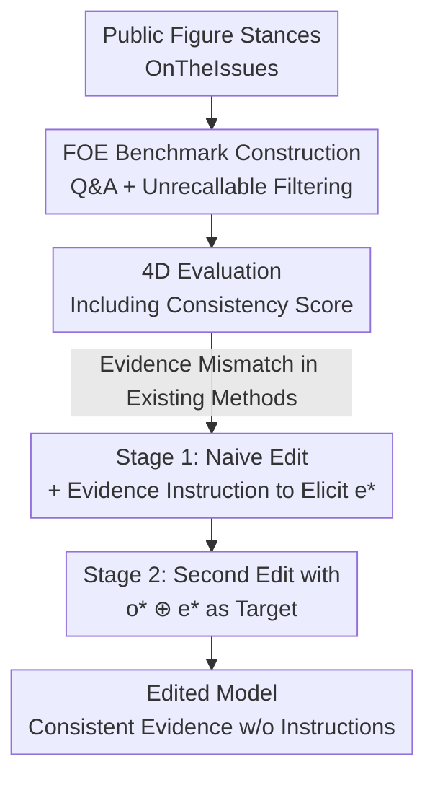

# Can Factual Opinions Be Edited (Manipulated) in Large Language Models?

**Conference**: ACL 2026  
**arXiv**: [2606.03096](https://arxiv.org/abs/2606.03096)  
**Code**: TBD  
**Area**: Knowledge Editing / LLM Safety  
**Keywords**: Factual Opinion Editing, Knowledge Editing, ROME, Opinion-Evidence Alignment, Misinformation Injection

## TL;DR
This paper points out that existing knowledge editing techniques can be used to manipulate the "documented stances of public figures" (factual opinions). To address this, the authors construct the FOE benchmark with evidence and find that current methods result in "surface-level opinion changes with contradictory evidence." They propose a two-stage Self-Generated Evidence-Aligned method, enabling edited models to provide self-consistent evidence for manipulated opinions without relying on explicit instructions.

## Background & Motivation

**Background**: Knowledge editing allows for the efficient update of internal LLM knowledge without retraining. The dominant Locate-then-Edit paradigm (e.g., ROME) treats the MLP layers of Transformers as key-value stores for facts, using causal analysis to locate target layers and precisely rewrite weight matrices. Other approaches include fine-tuning (FT-M, LoRA, AdaLoRA, DPO) and activation editing (ActAdd, CAA, BiPO).

**Limitations of Prior Work**: Existing benchmarks (MQUAKE, MLaKE, HalluEditBench, etc.) focus almost exclusively on **atomic facts**—isolated or triple-formatted knowledge like definitions and common sense. However, a critical category of knowledge is overlooked: **factual opinions**, which are documented stances of public figures on specific issues (e.g., "A person opposes tax hikes for the wealthy"). The ability to arbitrarily manipulate these stances implies potential for malicious reshaping of public personas and influence over elections or policy preferences, posing higher social risks than altering common sense.

**Key Challenge**: Factual opinions differ fundamentally from atomic facts—they **do not exist in isolation but are tied to supporting evidence** (public statements, voting records, policy actions). LLMs naturally include evidence when answering opinion-based questions. Thus, editing faces a unique challenge: after an opinion is modified, will the model's **evidence remain consistent with the new opinion**? Existing methods often achieve a stance change but "provide examples that contradict the new stance" (see original Figure 1 orange box, Table 3).

**Goal**: (1) Systematically characterize whether "factual opinions can be edited/manipulated" through quantifiable evaluation; (2) Reveal the failure of existing methods in maintaining opinion-evidence consistency; (3) Explore intentional opinion-evidence alignment and provide a stealthy, practical attack method.

**Key Insight**: The authors reformulate an editing instance as a triplet $(f, i, o)$—public figure $f$, issue $i$, and stance $o$. The attack goal is to change the model's response to $q(f,i)$ from $o$ to a counterfactual stance $o^{*}$. A successful edit must ensure that the evidence provided is self-consistent with $o^{*}$.

**Core Idea**: Use "Opinion $\oplus$ Self-generated Evidence" as the new editing target, embedding both the stance and its supporting evidence into model weights to bypass the unrealistic assumption of needing explicit instructions for evidence in the prompt.

## Method

The paper makes two main contributions: the **FOE evaluation benchmark** (data + evaluation dimensions + methods) and the **Self-Generated Evidence-Aligned editing method**.

### Overall Architecture

The workflow consists of "building a benchmark to expose opinion-evidence mismatch → measuring the failure of existing methods → designing a two-stage editing attack." The benchmark extracts real stances from OnTheIssues, converts them to Q&A, filters instances unknown to the model, and generates evaluation questions across Efficacy / Generalization / Persistence / Locality. The method performs a naive edit, elicits self-generated evidence via instructions, and then performs a second edit using the combined "opinion + evidence."

### Key Designs

**1. FOE Benchmark: Quantifiable Opinion Editing with Evidence**

To fill the gap where benchmarks only test atomic facts, authors crawled data from OnTheIssues, which aggregates speeches and voting records for US figures with support/oppose/neutral labels. Raw data $(f, i, o)$ are converted into questions using templates like "What is {figure}'s {connector} on {issue}?". Counterfactual targets $o^{*}$ are set as the opposite of the original stance. **Unrecallable filtering** is applied by querying target models (Llama-3.1-8B-Instruct, Mistral-7B-Instruct-v0.3) with multiple-choice prompts and removing instances the models cannot correctly identify, ensuring the dataset reflects existing knowledge. The final set covers 261 figures, 19 issue categories, and 2178 records.

**2. Four-Dimensional Evaluation + Consistency Score**

Since merely stating the target stance overestimates editing effectiveness, the authors generate 10 questions per instance across: **Efficacy** (direct restatement), **Generalization** (Paraphrase / Affirmation / Negation / MC / $\text{MC}_{\text{CoT}}$ variants), **Persistence** (resisting counter-arguments), and **Locality** (Figure Locality and Issue Locality). The core metric is a $0\!-\!2$ **Consistency Score**: GPT-4.1 classifies responses into four categories, where $0$ is failure, $1$ is "opinion only" or "unsupported evidence," and $2$ is "consistent evidence." For multiple-choice, Accuracy is used, with $\text{MC}_{\text{CoT}}$ requiring aligned reasoning.

**3. Self-Generated Evidence-Aligned: Using Model’s Own Evidence as Target**

The authors observed that adding an evidence-elicitation instruction (noted as $\text{ROME}_{\text{INST}}$) allows the model to generate credible, consistent evidence, suggesting the capability exists but is not triggered. The two-stage solution is: **Stage 1** performs a naive edit of $q(f,i)$ to $o^{*}$, then elicits self-generated evidence $e^{*}$ from the edited model via instructions. **Stage 2** concatenates target opinion and evidence ($o^{*} \oplus e^{*}$) as the new target for a **re-edit**. This embeds the consistency into weights, so the model provides aligned evidence under standard prompts. This is applicable to any editor (e.g., $\text{ROME}_{\text{EA}}$, $\text{FT-M}_{\text{EA}}$).

### Loss & Training

The method does not introduce new loss functions; it reuses the optimization objectives of editors like ROME or FT-M, changing only the target text to $o^{*}\oplus e^{*}$. Evaluations were conducted on Llama-3.1-8B-Instruct and Mistral-7B-Instruct-v0.3 with standard hyperparameters for single-instance editing.

## Key Experimental Results

### Main Results

Comparison on Llama3.1 (Consistency Score $0\!-\!2$, MC for accuracy %):

| Method | Efficacy | Paraphrase | Affirmation | $\text{MC}_{\text{CoT}}$(%) | Persist. | Locality(Figure) |
|------|----------|------------|-------------|------------|----------|------------------|
| ROME | 0.99 | 1.04 | 0.98 | 32.97 | 0.91 | 0.08 |
| FT-M | 1.00 | 0.97 | 0.96 | 9.14 | 0.48 | 0.16 |
| LoRA | 1.00 | 0.98 | 0.99 | 0.96 | 0.86 | 0.04 |
| AdaLoRA | 1.00 | 0.99 | 1.00 | 3.53 | 0.89 | 0.03 |
| DPO | 0.75 | 0.73 | 0.64 | 28.21 | 0.53 | 0.79 |
| $\text{ROME}_{\text{INST}}$ | 1.91 | 1.89 | 1.91 | 77.00 | 1.15 | 0.18 |
| $\text{ROME}_{\text{EA}}$ | 1.64 | 1.61 | 1.57 | 73.05 | 1.21 | 0.29 |
| $\text{FT-M}_{\text{EA}}$ | 1.90 | 1.58 | 1.55 | 70.84 | 0.67 | 0.36 |

### Key Findings Table

| Comparison | Observation | Implication |
|------|------|------|
| Efficacy vs Consistency | Efficacy≈1.0 but Consistency≈1 | Changing opinions is easy; changing "consistent evidence" is hard |
| $\text{ROME}_{\text{INST}}$ vs $\text{ROME}_{\text{EA}}$ | EA slightly lower generalization but much higher than non-aligned baselines | Approaches "forced instruction" performance without requiring instructions |
| EA vs Original Locality | EA shows better Figure/Issue Locality | Re-editing may mitigate overfitting or reduce diffusion of changes |
| General Reasoning | Post-edit accuracy similar to base model | Evidence-aligned editing does not degrade generic reasoning (GSM8K/FEVER) |

### Key Findings
- **High Efficacy $\neq$ Successful Edit**: Conventional methods make the model change its "claim," but fail the evidence test, with consistency scores near 1. Activation editing methods fail even at the opinion level (Efficacy 0.2–0.5).
- **Self-Generated Evidence is the Key**: Models can produce consistent evidence; the challenge is they don't do it by default. The two-stage method solidifies this capability into weights.
- **Positive Side Effects**: Evidence-aligned editing improves Locality, suggesting that specific evidence makes the edit more "precise," reducing interference with unrelated knowledge.

## Highlights & Insights
- **Evidence Consistency as a Primary Metric**: Proven that for opinion-based knowledge, "is the reason consistent?" is as important as "did the model change its mind?" This perspective applies to any explanation-heavy editing scenario.
- **"Evidence Re-injection" as a Stealthy Attack**: Requires no external knowledge base; letting the model produce its own evidence for re-editing is cost-free, stealthy, and fits the model's linguistic style.
- **Unveiling a Real Social Risk**: Manipulating public figures' stances is more dangerous than common sense facts. The paper provides tools to quantify and eventually defend against such manipulations.

## Limitations & Future Work
- Data is limited to OnTheIssues (US figures, English, binary stances), oversimplifying complex or evolving real-world opinions.
- Evaluation relies on GPT-4 series models; judge bias and noise may propagate to consistency scores.
- Experiments focus on single-instance edits; scalability to batch editing or larger/closed models remains to be verified.
- The focus is on demonstrating risks; developing methods to detect "opinion-evidence co-injection" is a critical next step.

## Related Work & Insights
- **vs HalluEditBench / MQUAKE**: These benchmarks handle hallucination or multi-hop consistency in atomic facts; ours is the first to address documented opinions with evidence and consistency scoring.
- **vs Chen et al. (Misinformation Injection)**: Both reveal abuse risks, but while prior work injected isolated misinformation, this work proves that "self-consistent evidence" can be injected, making the attack more persuasive.

## Rating
- Novelty: ⭐⭐⭐⭐⭐ 
- Experimental Thoroughness: ⭐⭐⭐⭐ 
- Writing Quality: ⭐⭐⭐⭐ 
- Value: ⭐⭐⭐⭐⭐ 

<!-- RELATED:START -->

## Related Papers

- [\[ACL 2026\] The Model Agreed, But Didn't Learn: Diagnosing Surface Compliance in Large Language Models](the_model_agreed_but_didn39t_learn_diagnosing_surface_compliance_in_large_langua.md)
- [\[ACL 2026\] Aligning Language Models with Real-time Knowledge Editing](aligning_language_models_with_real-time_knowledge_editing.md)
- [\[ACL 2025\] Neuron-Level Sequential Editing for Large Language Models](../../ACL2025/knowledge_editing/neuron-level_sequential_editing_for_large_language_models.md)
- [\[ICML 2026\] The Labyrinth and the Thread: Rethinking Regularizations in Sequential Knowledge Editing for Large Language Models](../../ICML2026/knowledge_editing/the_labyrinth_and_the_thread_rethinking_regularizations_in_sequential_knowledge_.md)
- [\[NeurIPS 2025\] UniEdit: A Unified Knowledge Editing Benchmark for Large Language Models](../../NeurIPS2025/knowledge_editing/uniedit_a_unified_knowledge_editing_benchmark_for_large_language_models.md)

<!-- RELATED:END -->
## Related Papers

- [\[ACL 2026\] The Model Agreed, But Didn't Learn: Diagnosing Surface Compliance in Large Language Models](the_model_agreed_but_didn39t_learn_diagnosing_surface_compliance_in_large_langua.md)
- [\[ACL 2025\] Neuron-Level Sequential Editing for Large Language Models](../../ACL2025/knowledge_editing/neuron-level_sequential_editing_for_large_language_models.md)
- [\[ICML 2026\] The Labyrinth and the Thread: Rethinking Regularizations in Sequential Knowledge Editing for Large Language Models](../../ICML2026/knowledge_editing/the_labyrinth_and_the_thread_rethinking_regularizations_in_sequential_knowledge_.md)
- [\[ICML 2026\] Revisiting Parameter-Based Knowledge Editing in Large Language Models: Theoretical Limits and Empirical Evidence](../../ICML2026/knowledge_editing/revisiting_parameter-based_knowledge_editing_in_large_language_models_theoretica.md)
- [\[NeurIPS 2025\] UniEdit: A Unified Knowledge Editing Benchmark for Large Language Models](../../NeurIPS2025/knowledge_editing/uniedit_a_unified_knowledge_editing_benchmark_for_large_language_models.md)

<!-- RELATED:END -->
