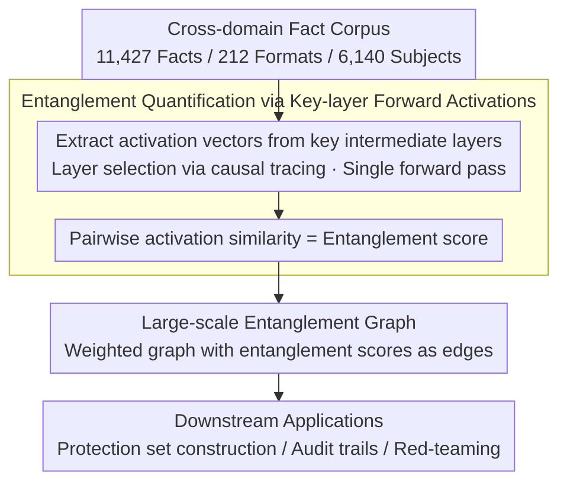

# CLaRE-ty Amid Chaos: Quantifying Representational Entanglement to Predict Ripple Effects in LLM Editing

**Conference**: ACL 2026 Findings  
**arXiv**: [2603.19297](https://arxiv.org/abs/2603.19297)  
**Code**: [https://github.com/manitbaser/CLaRE](https://github.com/manitbaser/CLaRE)  
**Area**: Model Editing/Knowledge Editing  
**Keywords**: Model editing, ripple effects, representational entanglement, forward activations, entanglement graph

## TL;DR

CLARE proposes a lightweight representational method that quantifies the degree of entanglement between facts through forward activations of a single intermediate layer. It is used to predict ripple effects in model editing, achieving an average improvement of 62.2% in Spearman correlation compared to gradient-based methods, while being 2.74x faster with 2.85x less memory consumption.

## Background & Motivation

**Background**: Model editing updates specific factual associations by modifying model weights, but often triggers ripple effects—unintended behavioral changes propagating to other outputs, even across the hidden space.

**Limitations of Prior Work**: (1) Ripple effects can extend to semantically unrelated facts, causing cross-domain interference; (2) existing methods (e.g., GradSim) use gradient similarity, which is computationally expensive and correlates poorly with cross-domain ripple effects; (3) there is a lack of systematic studies on large-scale cross-domain ripple effects.

**Key Challenge**: Model editing requires precise prediction of which facts will be affected, but existing methods are both slow and inaccurate.

**Goal**: Propose a lightweight, high-precision ripple effect prediction method and construct a large-scale entanglement graph.

**Key Insight**: Replace gradient computation with forward activations, using only single-layer activations to quantify entanglement.

**Core Idea**: Entanglement between facts can be quantified by the similarity of forward activation representations at key layers without calculating gradients.

## Method

### Overall Architecture

The question CLARE addresses is: how to predict which facts will be implicated by a specific edit without computing gradients. The approach redefines "entanglement between facts" as "whether the forward activations left by two fact prompts in a key intermediate layer are similar." The overall workflow begins with use a cross-domain factual corpus as the foundation; for each fact prompt, activation vectors are extracted from the model's key layers. Pairwise activation similarities are then calculated to obtain entanglement scores. Finally, these scores are aggregated into a large-scale entanglement graph for downstream tasks such as protection set construction, audit trails, and red-teaming.

### Key Designs

**1. Cross-domain fact corpus: Expanding research scope from neighbors to global propagation.**

Previous ripple effect studies mostly focused on 1–2 hop semantic neighbors, failing to expose the phenomenon where edits diffuse to semantically unrelated facts. To systematically characterize this global propagation, CLARE integrates 11,427 facts from three existing datasets, covering 212 prompt formats and 6,140 unique subjects. This unified corpus allows the authors to observe ripple effects spreading to domains entirely unrelated to the edited fact and verify that forward activations outperform gradients in predicting such cross-domain propagation.

**2. Entanglement quantification via key-layer forward activations: Replacing gradients with a single forward pass.**

To measure whether two facts are entangled, traditional approaches (like GradSim) require full backpropagation for every fact to compare gradient directions, with computational and memory costs scaling linearly with the number of facts. CLARE compresses this task into the forward pass: for each fact prompt, it extracts activation vectors only from a key intermediate layer identified by causal tracing. The similarity between the activation vectors of two facts serves as the entanglement score. Since activations are obtained via a single forward pass, the process avoids constructing and storing backpropagation graphs, making it 2.74x faster with a 2.85x reduction in peak memory. Its effectiveness stems from the observation that representations in key layers encode the internal "location" of a fact; facts with nearby locations are more likely to implicate each other during editing.

**3. Large-scale entanglement graph construction: Mapping pairwise scores to a global topology of model knowledge.**

An individual entanglement score only describes a pair of facts. To serve global tasks like protection set construction and auditing, a graph representing the overall structure of model knowledge is required. CLARE calculates pairwise entanglement scores for 11,427 facts to build a weighted entanglement graph and releases corresponding graphs for multiple models. With this graph, downstream applications can directly query "which neighbors are at highest risk when editing a specific fact," enabling robust protection set construction, traceable audit trails, and cost-controlled red-teaming without re-running expensive similarity scans for every edit.

> CLARE relies solely on forward propagation to extract activations and does not involve any model training or parameter updates.

## Key Experimental Results

### Main Results

- CLARE achieves an average improvement of 62.2% in Spearman correlation over GradSim (with a maximum increase of 0.31).
- It is 2.74x faster and requires 2.85x less peak GPU memory.
- Storage requirements are only a small fraction of the baseline.

### Ablation Study

- Results are consistent across various editing techniques (ROME, MEMIT) and multiple models.
- Protection sets supported by the entanglement graph significantly reduce side effects of editing.

### Key Findings

- Forward activations are more predictive of cross-domain ripple effects than gradients.
- Ripple effects can propagate to facts that are semantically entirely unrelated.
- Activations from a single layer are sufficient to capture key entanglement information.

## Highlights & Insights

- Replacing gradient computation with forward activations is a simple yet effective insight.
- The release of large-scale entanglement graphs provides a valuable resource for the community.
- Application scenarios like audit trails and red-teaming demonstrate strong practical value.

## Limitations & Future Work

- The selection of the key layer may depend on the model architecture.
- The entanglement graph is static and may not reflect changes after multiple sequential edits.
- Future work could explore dynamic entanglement graphs and larger-scale factual libraries.

## Related Work & Insights

- Represents a significant improvement over GradSim and RippleEdits.
- Provides a new toolset for the safety and interpretability of model editing.
- The concept of entanglement graphs can be generalized to broader research in model safety and interpretability.

## Rating

- Novelty: ⭐⭐⭐⭐⭐ Quantifying entanglement via forward activations is a significant methodological innovation.
- Experimental Thoroughness: ⭐⭐⭐⭐⭐ Comprehensive validation across 11,427 facts, multiple models, and various editing techniques.
- Writing Quality: ⭐⭐⭐⭐ Clear motivation with concise methodological descriptions.

<!-- RELATED:START -->

## Related Papers

- [\[ACL 2025\] ChainEdit: Propagating Ripple Effects in LLM Knowledge Editing through Logical Rule-Guided Chains](../../ACL2025/knowledge_editing/chainedit_propagating_ripple_effects_in_llm.md)
- [\[ACL 2026\] FABLE: Fine-grained Fact Anchoring for Unstructured Model Editing](fable_fine-grained_fact_anchoring_for_unstructured_model_editing.md)
- [\[ICML 2026\] CrispEdit: Low-Curvature Projections for Scalable Non-Destructive LLM Editing](../../ICML2026/knowledge_editing/crispedit_low-curvature_projections_for_scalable_non-destructive_llm_editing.md)
- [\[ACL 2026\] EvoEdit: Evolving Null-space Alignment for Robust and Efficient Knowledge Editing](evoedit_evolving_null-space_alignment_for_robust_and_efficient_knowledge_editing.md)
- [\[ICML 2026\] From Backward Spreading to Forward Replay: Revisiting Target Construction in LLM Parameter Editing](../../ICML2026/knowledge_editing/from_backward_spreading_to_forward_replay_revisiting_target_construction_in_llm_.md)

<!-- RELATED:END -->
