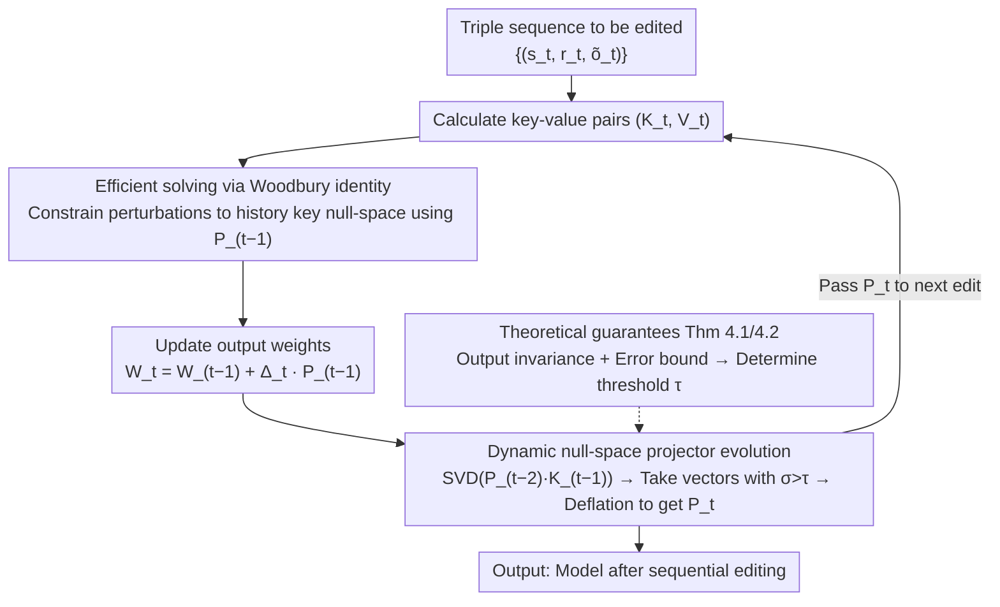

# EvoEdit: Evolving Null-space Alignment for Robust and Efficient Knowledge Editing

**Conference**: ACL 2026 Findings  
**arXiv**: [2510.13851](https://arxiv.org/abs/2510.13851)  
**Code**: [GitHub](https://github.com/) (Code availability mentioned in the paper)  
**Area**: Knowledge Editing  
**Keywords**: Knowledge Editing, Null-space Projection, Sequential Editing, Large Language Models, Catastrophic Forgetting

## TL;DR

Ours proposes EvoEdit, which achieves large-scale sequential knowledge editing by dynamically evolving a null-space projector. It efficiently injects new knowledge while maintaining existing knowledge, preserving SOTA performance at the 10K editing scale and running 3.5x faster than AlphaEdit.

## Background & Motivation

**Background**: Large Language Models (LLMs) require frequent updates to maintain factual accuracy. Prevailing knowledge editing methods follow the "locate-then-edit" paradigm (e.g., ROME and MEMIT), which identifies parameters storing specific facts and applies perturbations to inject new knowledge.

**Limitations of Prior Work**: Existing methods perform acceptably for single edits but suffer from "catastrophic interference" in sequential editing scenarios. Cumulative updates destroy previously integrated knowledge, causing performance to plummet or the model to collapse after only a few hundred edits.

**Key Challenge**: There is a fundamental conflict between new knowledge injection and old knowledge preservation—parameter updates must modify weights to encode new facts, but these modifications inevitably interfere with the encoding of existing facts. AlphaEdit uses a fixed null-space projector to mitigate this, but ignores null-space drift caused by sequential editing; LangEdit recomputes the null-space each time, but SVD of the covariance matrix is numerically unstable.

**Goal**: Design a sequential editing framework scalable to tens of thousands of edits that ensures editing efficacy without destroying existing knowledge or model capabilities.

**Key Insight**: The authors observe that the fixed projector in AlphaEdit produces null-space drift during sequential editing, manifested by a sharp increase in $\|PK_p\|_F$ as the number of edits grows. This forces the model to compromise between acquiring new knowledge and suppressing interference.

**Core Idea**: Dynamically evolve the null-space projector—incrementally update the projector after each edit via SVD on incremental key matrices rather than recomputing the full covariance matrix, achieving an optimal balance between numerical stability and computational efficiency.

## Method

### Overall Architecture

EvoEdit follows the locate-then-edit paradigm, treating the FFN layer's output weight matrix $W_{out}$ as a "key-value" associative memory. It injects new facts by applying perturbations within the null-space of this matrix. Its core challenge is catastrophic interference during sequential editing—fixed projectors drift, while step-wise recomputation is unstable. The overall process is: given a sequence of triples $\{(s_t, r_t, \tilde{o}_t)\}$, calculate key-value pairs $(K_t, V_t)$ at each step, apply the projector $P_{t-1}$ evolved from the previous step to constrain perturbations to a subspace that does not touch historical knowledge, solve for the weight increment and update the model, while incrementally evolving the projector to $P_t$ for the next step.

### Key Designs

**1. Dynamic null-space projector evolution: Incrementally aligning the projector with the null-space of historical keys.** 

AlphaEdit uses a fixed projector calculated once; as edits accumulate, the norm of the projected incremental keys $\|PK_p\|_F$ increases by orders of magnitude (null-space drift), forcing a compromise between new knowledge and interference suppression. LangEdit recomputes the full covariance SVD at each step, facing numerical instability from ill-conditioned matrices. EvoEdit takes a middle path: it performs SVD only on the projected incremental key matrix $P_{t-2}K_{t-1}$ at each step, extracts singular vectors $Q_{t-1}$ with singular values above threshold $\tau$, and updates the projector via deflation $P_{t-1} = P_{t-2} - Q_{t-1}Q_{t-1}^\top$. Since the number of columns in $K_{t-1}$ is much smaller than the full matrix, this SVD is efficient and stable, keeping the projector aligned with the null-space of all historical keys and eliminating drift at the source.

**2. Efficient solving via Woodbury identity: Moving inversion costs from the hidden dimension to the editing dimension.** 

The closed-form solution for standard null-space methods $\Delta P_{t-1} = R_t K_t^\top P_{t-1}(K_t K_t^\top P_{t-1} + I)^{-1}$ requires inverting a large $d_K \times d_K$ matrix, where $d_K$ is typically in the thousands, making $O(d_K^3)$ a bottleneck for sequential editing. EvoEdit utilizes the low-rank representation $P = I - QQ^\top$ and the Woodbury matrix identity to rewrite the expression as $\Delta = R_t(K_t^\top P_{t-1} K_t + I_r)^{-1} K_t^\top P_{t-1}$. This changes the inversion target to a small matrix of editing dimension $r$. Consequently, overall complexity drops from $O(d_K^3)$ to $O(d_K(rn + n^2) + n^3)$, where the hidden dimension appears only linearly—this allows it to reduce solving time for 500 edits from 39.9s to 0.1s, a 3.5x overall speedup.

**3. Theoretical guarantees of output invariance and error bounds: Providing a basis for truncation threshold selection.** 

Incremental evolution and truncation introduce approximations, requiring theoretical guarantees that interference remains controlled. Theorem 4.1 proves that without truncation, the projector's null-space is exactly equivalent to the column space of all historical edited keys, i.e., $\text{Null}(P_{t-1}) = \text{Range}(\hat{K}_{t-1})$, ensuring strictly invariant outputs for historical knowledge. Theorem 4.2 further provides a global error bound under truncation, and Corollary 4.3 translates the projector's approximation error into an interference bound for historical knowledge. This framework turns the choice of threshold $\tau$ from empirical tuning into a bounded and controllable selection, ensuring that each edit step does not exceed limits and destroy integrated knowledge.

### Loss & Training

The optimization objective at each step is to minimize the editing residual plus a regularization term: $\min_{\Delta_t} \|(W_{t-1} + \Delta_t P_{t-1})K_t - V_t\|^2 + \|\Delta_t P_{t-1}\|^2$. The preservation of historical knowledge does not need to be explicitly written into the objective because the projector ensures $\Delta_t P_{t-1} \hat{K}_{t-1} = 0$, automatically placing perturbations in the null-space of historical keys. The regularization term $\|\Delta_t P_{t-1}\|^2$ is used to constrain the perturbation magnitude and stabilize convergence.

## Key Experimental Results

### Main Results

2K sequential editing (Llama-3-8B, CounterFact):

| Method | Eff.↑ | Gen.↑ | Spe.↑ | Flu.↑ | Consis.↑ |
|------|-------|-------|-------|-------|----------|
| MEMIT | 65.65 | 64.65 | 51.56 | 437.43 | 6.58 |
| AlphaEdit | 98.90 | 94.22 | 67.88 | 622.49 | 32.40 |
| **EvoEdit** | **99.67** | **94.93** | **69.99** | **623.09** | **32.64** |

10K sequential editing (Llama-3-8B, CounterFact):

| Method | Eff.↑ | Gen.↑ | Spe.↑ | Flu.↑ | Consis.↑ |
|------|-------|-------|-------|-------|----------|
| MEMIT | 49.73 | 49.24 | 51.54 | 389.31 | 3.45 |
| AlphaEdit | 66.78 | 58.27 | 51.79 | 489.91 | 4.59 |
| **EvoEdit** | **98.29** | **91.21** | **63.91** | **613.88** | **33.22** |

### Ablation Study

Efficiency analysis (Total runtime for 500 edits, Qwen2.5-7B, BS=100):

| Method | Solve(s)↓ | Total(s)↓ | Gain |
|------|-----------|-----------|--------|
| AlphaEdit | 39.9 | 39.9 | - |
| EvoEdit | 0.1 | 11.3 | 3.53× |

GPU Memory (1000 edits, Llama-3-8B):

| Method | Peak Alloc. (GB) | Peak Reserved (GB) |
|------|------------------|-------------------|
| AlphaEdit | 34.79 | 35.36 |
| EvoEdit | 31.73 (-14%) | 32.74 (-15%) |

### Key Findings

- At 10K edits, EvoEdit maintains an Efficacy of 98.29%, while AlphaEdit drops to 66.78%, a gap of 31.5 percentage points.
- Retention rate of the first 100 edits after 2000 steps: EvoEdit drops only 2% (rewrite accuracy), while AlphaEdit drops 53%.
- In general capability tests (SST/MRPC/MMLU/NLI), ROME/MEMIT collapse after 400-800 edits, whereas EvoEdit remains stable throughout.

## Highlights & Insights

- Upgrades null-space projection from "static one-time calculation" to "dynamic sequential evolution," offering a concise idea with solid theoretical grounding.
- The experimental scale of 10K edits significantly exceeds prior work, truly testing the practical limits of knowledge editing.
- The application of the Woodbury identity cleverly shifts the computational bottleneck from the hidden dimension to the editing dimension, achieving improvements in both theoretical complexity and actual speed.

## Limitations & Future Work

- Experiments covered a limited range of models and datasets and did not test the impact of correlations between edited facts on performance.
- The null-space shrinks as the number of edits increases; in the long term, available projection space is finite, and whether this can scale to millions of edits remains an open question.
- Potential risks of misuse in knowledge editing (injecting improper knowledge/biases).

## Related Work & Insights

- AlphaEdit and LangEdit are the most direct predecessors, representing the "fixed projector" and "full recomputation" paradigms, respectively; EvoEdit finds the middle path.
- Echoes the idea of Elastic Weight Consolidation (EWC) in continual learning, but EvoEdit provides stronger protection guarantees via null-space projection.
- Insight: Other scenarios requiring sequential updates (e.g., incremental adapter merging) could also benefit from the dynamic null-space alignment approach.

## Rating

- Novelty: ⭐⭐⭐⭐ Dynamic null-space evolution is a natural yet effective idea with substantial theoretical analysis.
- Experimental Thoroughness: ⭐⭐⭐⭐⭐ Multi-model and multi-scale testing, including 10K editing scale and comprehensive evaluation of efficiency, memory, and general capabilities.
- Writing Quality: ⭐⭐⭐⭐ Clear structure, complete theoretical derivations, and informative figures and tables.

<!-- RELATED:START -->

## Related Papers

- [\[ACL 2025\] Mitigating Negative Interference in Multilingual Sequential Knowledge Editing through Null-Space Constraints](../../ACL2025/knowledge_editing/mitigating_negative_interference_in_multilingual_sequential_knowledge_editing_th.md)
- [\[ICLR 2026\] EAMET: Robust Massive Model Editing via Embedding Alignment Optimization](../../ICLR2026/knowledge_editing/eamet_robust_massive_model_editing_via_embedding_alignment_optimization.md)
- [\[ICLR 2026\] When Large Multimodal Models Confront Evolving Knowledge: Challenges and Explorations](../../ICLR2026/knowledge_editing/when_large_multimodal_models_confront_evolving_knowledge_challenges_and_explorat.md)
- [\[ACL 2025\] Efficient Knowledge Editing via Minimal Precomputation](../../ACL2025/knowledge_editing/efficient_knowledge_editing.md)
- [\[ICML 2026\] KORE: Enhancing Knowledge Injection for Large Multimodal Models via Knowledge-Oriented Controls](../../ICML2026/knowledge_editing/kore_enhancing_knowledge_injection_for_large_multimodal_models_via_knowledge-ori.md)

<!-- RELATED:END -->
