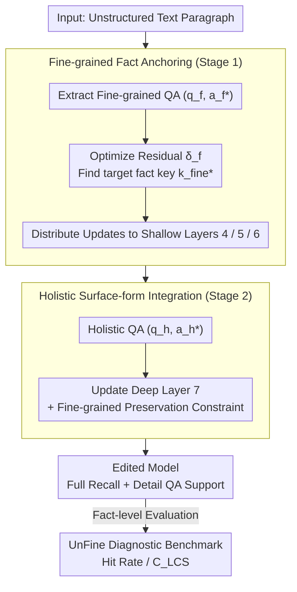

# FABLE: Fine-grained Fact Anchoring for Unstructured Model Editing

**Conference**: ACL 2026 Findings  
**arXiv**: [2604.12559](https://arxiv.org/abs/2604.12559)  
**Code**: [https://github.com/caskcsg/FABLE](https://github.com/caskcsg/FABLE)  
**Area**: Knowledge Editing / LLM  
**Keywords**: Model Editing, Unstructured Knowledge, Fine-grained Fact Injection, Hierarchical Key-Value Storage, UnFine Benchmark

## TL;DR
This paper identifies that existing unstructured model editing methods, while capable of holistic recall of edited text, fail to provide access to fine-grained facts. It proposes the FABLE framework, which uses a two-stage hierarchical strategy to anchor fine-grained facts in shallow layers and integrate holistic narratives in deep layers, and constructs the UnFine diagnostic benchmark for systematic evaluation.

## Background & Motivation

**Background**: Model editing aims to update specific knowledge in LLMs by modifying a small number of parameters. Structured editing (e.g., ROME, MEMIT) has achieved success on <subject, relation, object> triplets. Recent works like UnKE and AnyEdit extend editing to unstructured text, enabling models to memorize and recall full paragraphs holistically.

**Limitations of Prior Work**: Existing unstructured editing methods support holistic recall but cannot support fine-grained fact access. As shown in Figure 1, an UnKE-edited model can recite the full text, but cannot provide accurate answers when questioned about specific details within that text. The model learns a high-level mapping from questions to surface-form representations rather than encoding underlying atomic facts into knowledge storage.

**Key Challenge**: There is a mismatch between holistic recall and fine-grained fact access. In the unidirectional information flow of a Transformer, surface-form generation amplifies rather than corrects underlying factual representations—if shallow layers fail to encode facts correctly, deep-layer narrative generation cannot remedy the error.

**Goal**: Design a model editing method that simultaneously supports holistic text recall and fine-grained fact access.

**Key Insight**: Leveraging the "early decoding" phenomenon in Transformers—shallow layers excel at capturing local fine-grained features, while deep layers integrate these into global semantic representations. Therefore, fine-grained facts should be anchored in shallow layers first, followed by surface-form integration in deeper layers.

**Core Idea**: Decouple the key generator into two levels—a fine-grained fact key generator (shallow layers, for injecting discrete facts) and a holistic semantic key generator (deep layers, for integration into coherent narratives), implementing a "facts first, generation later" mechanism.

## Method

### Overall Architecture

FABLE aims to solve the fragmentation in unstructured editing where a model "can recite the whole paragraph but cannot answer details." The model typically learns a high-level mapping to surface forms rather than writing atomic facts into knowledge storage. Its solution is to split the $N$-layer Transformer key generator into two levels based on depth: the fine-grained key generator $\mathcal{F}_{\text{fine}}$ in shallow layers (Layer 1 to $L_f$) anchors discrete facts, while the holistic key generator $\mathcal{F}_{\text{hol}}$ in deep layers (Layer $L_f+1$ to $L_h$) integrates facts into coherent narratives. Finally, the value generator $\mathcal{V}$ (Layer $L_h+1$ to $N$) produces the output. Editing follows two stages: first injecting fine-grained facts shallowly, then making minimal adjustments to deep layers to ensure narrative fluency, with a constraint in the second stage to prevent overwriting factual signals. Finally, the UnFine diagnostic benchmark evaluates editing performance at the factual level.

### Key Designs

**1. Fine-grained Fact Anchoring (Stage 1): Writing discrete facts into shallow layers as the foundation for the information flow.**

The unidirectional flow of Transformers dictates that if factual encoding is incorrect in shallow layers, deep-layer narrative generation will only amplify the error. Thus, facts must be anchored early. For each fine-grained QA pair $(q_f, a_f^*)$, FABLE optimizes a residual vector $\delta_f$ to find a key $k_{\text{fine}}^* = k_{\text{fine}} + \delta_f$ that triggers the target fact. The objective balances editing efficacy (tail token shift), prefix consistency (maintaining preceding tokens), and locality (preventing side effects on unrelated samples). Parameter updates are distributed across Layers 4, 5, and 6, ensuring facts are firmly rooted without destabilizing any single layer.

**2. Holistic Surface-form Integration (Stage 2): Building narratives atop anchored facts without erasing factual signals.**

Shallow facts alone are insufficient; the model must organize them into fluent narratives in deep layers. Stage 2 employs a similar optimization to Stage 1 but updates only a single deep layer $L_h=7$ using a holistic QA pair $(q_h, a_h^*)$. A critical addition is the "fine-grained preservation constraint"—requiring that updates to $\mathcal{F}_{\text{hol}}$ do not overwrite the factual signals injected in Stage 1. This resolves signal conflicts between stages, ensuring narrative capability is built upon a factual foundation.

**3. UnFine Diagnostic Benchmark: Separating "understanding facts" from "memorizing surface forms" via fact-level metrics.**

Existing evaluations rely on holistic outputs (ROUGE-L, BERT-Score), which cannot distinguish between true understanding and rote memorization. UnFine complements existing unstructured datasets (UnKEBench, AKEW-CF, AKEW-MQ) with fine-grained QA pairs and extracted knowledge phrases. It introduces two fact-level indicators: Hit Rate (exact phrase matching) and $C_{\text{LCS}}$ (Longest Common Subsequence coverage), directly testing whether the model has mastered specific facts within the edited text.

### A Complete Example

Consider injecting an unstructured paragraph about a person: Stage 1 extracts fine-grained QAs (e.g., "What year was this person born?", "Which institution do they work for?"), optimizes $\delta_f$, and distributes updates to Layers 4-6 to anchor these atomic facts. Stage 2 then uses a holistic QA (e.g., "Recite this biography") to update Layer 7, enabling fluent recall while the preservation constraint ensures the birth year and institution are not overwritten. The edited model achieves both high BERT-Score/ROUGE-L (recall) and high Hit Rate/$C_{\text{LCS}}$ (detail accuracy).

### Loss & Training

Both stages utilize closed-form optimization. Stage 1 updates Layers 4, 5, and 6 using approximately 5x the number of fine-grained QAs relative to the seed. Stage 2 updates Layer 7 using a single holistic QA. Locality is maintained by including 20 unrelated samples randomly drawn from the Alpaca dataset for each edited sample.

## Key Experimental Results

### Main Results

| Method | Holistic (BERT-Score) | Holistic (Rouge-L) | Fine-grained (HR) | Fine-grained ($C_{\text{LCS}}$) |
|------|-------------------|----------------|-----------|------------------------|
| UnKE | High | High | Low | Low |
| AnyEdit | High | High | Low | Low |
| FABLE | **High** | **High** | **Significant Gain** | **Significant Gain** |

### Ablation Study

| Configuration | Holistic | Fine-grained | Description |
|------|--------|--------|------|
| Full FABLE | High | High | Complete two-stage process |
| Stage 2 Only | High | Low | Lacks fine-grained anchoring |
| Stage 1 Only | Low | High | Lacks narrative integration |
| w/o Preservation Constraint | High | Medium | Stage 2 overwrites factual signals |

### Key Findings
- FABLE significantly improves fine-grained fact access while maintaining SOTA holistic editing performance.
- Existing methods exhibit high holistic scores but low fine-grained scores, validating the hypothesis that "surface-form recall $\neq$ fact understanding."
- Injecting facts into shallow layers (Layers 4-6) is superior to deep layers, confirming the utility of the "early decoding" phenomenon.
- The fine-grained preservation constraint is essential for two-stage synergy.

## Highlights & Insights
- **Recall vs. Access Distinction**: Highlights a neglected fundamental issue in unstructured editing—recitation does not equal comprehension. This insight applies to RAG and knowledge enhancement.
- **Hierarchical Theoretical Basis**: Leverages Transformer information flow and early decoding to support the "shallow facts + deep narrative" design.
- **UnFine Benchmark Contribution**: HR and $C_{\text{LCS}}$ provide more precise evaluations than ROUGE/BERT-Score for factual accuracy.

## Limitations & Future Work
- Complexity increases due to the need for manual or LLM-driven fine-grained QA extraction.
- Layer selection (4-6 for facts, 7 for narrative) may vary across different model architectures.
- Cumulative effects of sequential editing require further exploration.
- Cross-architecture applicability remains to be verified beyond the primary tested models.

## Related Work & Insights
- **vs. ROME/MEMIT**: While they focus on structured triplets, FABLE extends to fine-grained unstructured text editing.
- **vs. UnKE**: UnKE enables holistic recall but fails detail access; FABLE resolves this via hierarchical decoupling.
- **vs. AnyEdit**: AnyEdit broadens editing scope but suffers from unreliable fine-grained factual integrity.

## Rating
- Novelty: ⭐⭐⭐⭐⭐ Identifies core limitations and provides an elegant hierarchical solution.
- Experimental Thoroughness: ⭐⭐⭐⭐ Extensive testing across three datasets and multiple baselines.
- Writing Quality: ⭐⭐⭐⭐⭐ Precise definitions, thorough theoretical analysis, and clear methodology.
- Value: ⭐⭐⭐⭐ Significant advancement in the field; UnFine benchmark sets a new evaluation standard.

<!-- RELATED:START -->

## Related Papers

- [\[ICLR 2026\] Fine-tuning Done Right in Model Editing](../../ICLR2026/knowledge_editing/fine-tuning_done_right_in_model_editing.md)
- [\[ACL 2026\] The Model Agreed, But Didn't Learn: Diagnosing Surface Compliance in Large Language Models](the_model_agreed_but_didn39t_learn_diagnosing_surface_compliance_in_large_langua.md)
- [\[ACL 2026\] CLaRE-ty Amid Chaos: Quantifying Representational Entanglement to Predict Ripple Effects in LLM Editing](clare-ty_amid_chaos_quantifying_representational_entanglement_to_predict_ripple_.md)
- [\[ACL 2026\] HiEdit: Lifelong Model Editing with Hierarchical Reinforcement Learning](hiedit_lifelong_model_editing_with_hierarchical_reinforcement_learning.md)
- [\[AAAI 2026\] Model Editing as a Double-Edged Sword: Steering Agent Ethical Behavior](../../AAAI2026/knowledge_editing/model_editing_as_a_double-edged_sword_steering_agent_ethical_behavior_toward_ben.md)

<!-- RELATED:END -->
