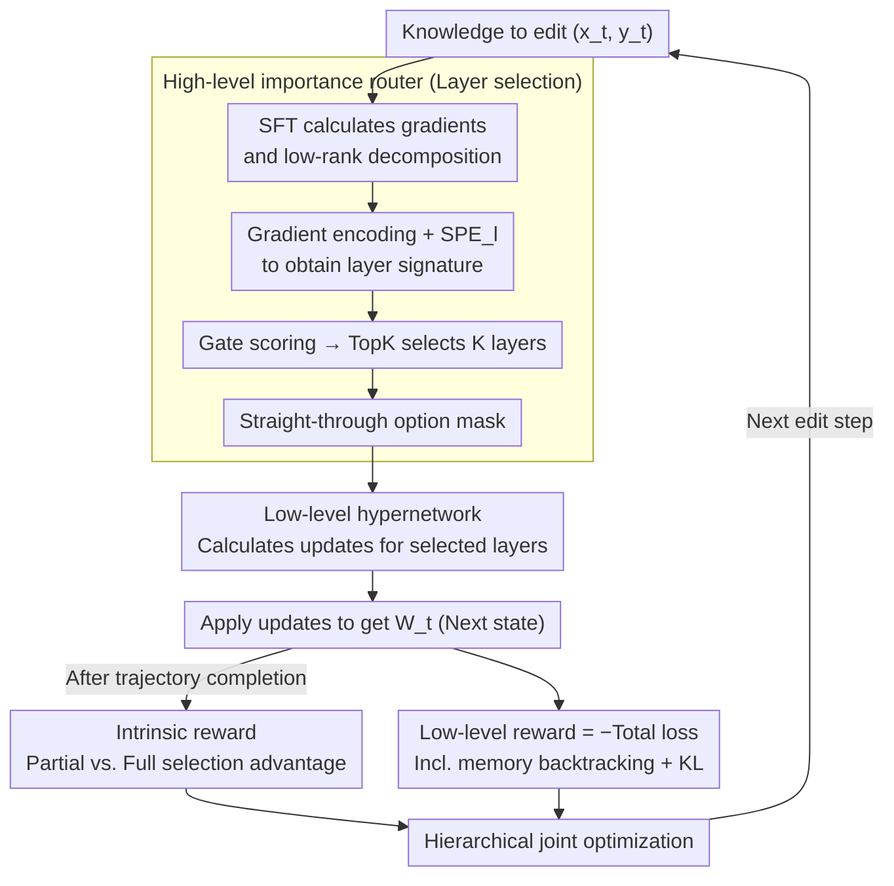

# HiEdit: Lifelong Model Editing with Hierarchical Reinforcement Learning

**Conference**: ACL 2026  
**arXiv**: [2604.11214](https://arxiv.org/abs/2604.11214)  
**Code**: https://github.com/yangfanww/hiedit  
**Area**: Knowledge Editing / Lifelong Learning / Hierarchical Reinforcement Learning  
**Keywords**: lifelong model editing, hierarchical RL, hypernetwork, layer selection, sparse update

## TL;DR
HiEdit utilizes hierarchical reinforcement learning to decompose "lifelong model editing" into two subtasks: high-level layer selection and low-level gradient update calculation. This allows the hypernetwork to adaptively modify only half of the layers based on specific knowledge, improving the strong baseline RLEdit by an average of 8.48%.

## Background & Motivation

**Background**: Lifelong Model Editing (LME) aims to continuously inject new knowledge into deployed LLMs without retraining. The dominant paradigm involves "locating then editing": first identifying influential layers $\mathcal{W}$, and then applying disturbances $\tilde{\nabla}_{\mathcal{W}}$. Recently, RLEdit modeled the entire sequence editing as an RL task, allowing a hypernetwork to span tens of thousands of edits via PPO-style optimization.

**Limitations of Prior Work**: All existing methods apply disturbances to a "static and dense" set of layers. Regardless of the knowledge being edited, updates are applied to the same batch of layers (often 5–7 MLP layers). When running ZsRE sequence editing on Llama-3-8B, generalization and previous edits begin to collapse (catastrophic forgetting) after 5,000 steps.

**Key Challenge**: Research indicates that different knowledge activates different components within LLMs. However, using the same set of layers for every instance during the "locating" stage leads to over-modification of parameters irrelevant to the current knowledge. This also unnecessarily constrains the optimization space of the hypernetwork to a sub-optimal solution.

**Goal**: Transform "which layers to edit" from a static decision fixed offline into a learnable dynamic decision for each piece of knowledge.

**Key Insight**: Upgrade LME from a flat MDP to a Hierarchical MDP—where a high-level option selects layers and a low-level action calculates parameter updates, separating discrete layer selection from continuous update training.

**Core Idea**: Decouple "where to edit" from "how to edit" using hierarchical RL, and introduce an intrinsic reward to encourage sparse layer selection, achieving instance-aware and localized precision editing.

## Method

### Overall Architecture
HiEdit models each step of lifelong editing as a Hierarchical MDP $(\mathcal{S}, \mathcal{A}, \Omega, \mathcal{P}, r, \gamma)$, where the core involves splitting "which layers to edit" and "how to modify each layer" into subtasks handled by different hypernetworks. At step $t$, a standard SFT is performed on the knowledge $(x_t, y_t)$ to obtain the gradient matrices of all candidate layers $\nabla \mathcal{W}_t = \{\nabla \mathcal{W}_{t,1}, \dots, \nabla \mathcal{W}_{t,L}\}$, which are decomposed via low-rank decomposition as $\nabla \mathcal{W}_{t,l} = v_l u_l^\top$. The high-level hypernetwork $\pi_\phi$ processes these gradient signals to output an option mask $\omega_t \in \{0,1\}^L$ activating only $K$ layers. The low-level hypernetwork $\mathcal{H}_\theta$ then calculates the actual parameter updates $\tilde{\nabla} \mathcal{W}_{t,l} = \tilde v_l \tilde u_l^\top$ only for the activated layers. After the full editing trajectory, gradients are backpropagated based on both high-level and low-level rewards to update both hypernetworks.

### Key Designs

**1. High-level Importance Router: Dynamic Layer Selection**

A hidden inefficiency in lifelong editing is using the same dense layers for all knowledge during the "locating" phase, which modifies many irrelevant parameters. HiEdit passes each layer's gradient signature $(u_l \| v_l)$ through a layer-shared gradient encoder $\mathbf{W}_{\text{GradEnc}}$ and adds layer-specific scaling and bias $\mathbf{SPE}_l$ to obtain $h_l$. All $h_l$ are concatenated and fed into a gate network to output scores $z_t \in \mathbb{R}^L$. The $\mathbf{TopK}(z_t, K)$ operation retains only the $K$ highest-scoring layers to generate a mask $m_t$. To handle the non-differentiable TopK operation, HiEdit leverages a straight-through estimator $m_t = \mathbf{sg}(m_t - z_t) + z_t$, using a hard mask during the forward pass and passing gradients directly back to $z_t$ during the backward pass, enabling end-to-end learning of layer selection.

**2. Intrinsic Reward: Sparsity via Relative Advantage**

Directly penalizing the high-level policy for selecting more layers is difficult to tune and can sacrifice editing quality. HiEdit instead defines the high-level reward as the advantage of partial selection over full selection: $r_{\text{high},t} = r_{\text{low}}(s_t, \omega_t, a_t) - r_{\text{low}}(s_t, \mathbf{1}, a_t)$, where $\mathbf{1}$ denotes selecting all layers. The high-level network receives a positive reward only if editing just $K$ layers performs no worse than editing all layers. This contrastive signal effectively identifies which layers are truly useful for the current knowledge, encouraging sparsity without performance loss.

**3. Hierarchical Joint Optimization and Anti-Forgetting Regularization**

The low-level reward is the negative of the total loss $r_{\text{low},t} = -\mathcal{L}_t$, where $\mathcal{L}_t = \eta \|\tilde{\nabla} \mathcal{W}_t\|^2 + \sum_{i=t-k}^t \mu^{t-i} \mathcal{L}_{t,i}$. The single-step loss $\mathcal{L}_{t,i} = -\log p_{\mathcal{W}_t}(y_i|x_i) + \tilde\lambda \mathrm{KL}[p_{\mathcal{W}_{t-1}}(\cdot|\tilde x_i) \| p_{\mathcal{W}_t}(\cdot|\tilde x_i)]$ incorporates memory backtracking for the past $k$ steps to prevent forgetting and a KL term to constrain distributions for irrelevant inputs. Both hypernetworks are optimized based on cumulative discounted rewards $\sum \gamma^t r_{\beta,t}$ with $\gamma=1$ to treat every step in the long sequence equally.

### Loss & Training
Training and inference share the same TopK value $K$ to maintain sparsity-consistency and prevent distribution shift. Gradient backpropagation is performed at the trajectory level after a complete sequence of edits to ensure stability.

## Key Experimental Results

### Main Results
HiEdit was evaluated against 11 baselines (FT, ROME, MEMIT, PRUNE, RECT, AlphaEdit, MEND, MALMEN, DAFNet, RLEdit, etc.) using Llama-3-8B and Gemma-2-9B backbones across ZsRE and CounterFact datasets with 20,000 sequential edits.

| Model | Method | ZsRE-Eff. | ZsRE-Gen. | ZsRE-Spe. | ZsRE-Ret. | CounterFact-Eff. |
|------|------|-----------|-----------|-----------|-----------|------------------|
| Llama-3-8B | RLEdit | 81.43 | 79.49 | 42.73 | 70.72 | 66.35 |
| Llama-3-8B | HiEdit (rand) | 81.95 | 79.63 | 47.97 | 74.66 | 66.40 |
| Llama-3-8B | HiEdit (full) | **82.10** | **79.99** | **48.42** | **75.16** | **66.53** |
| Gemma-2-9B | AlphaEdit | 15.79 | 15.32 | 20.21 | 13.19 | 38.17 |
| Gemma-2-9B | RECT | 11.26 | 11.25 | 16.19 | 9.62 | 30.72 |

In long-term editing settings, traditional methods often drop to near zero on Gemma-2-9B. HiEdit improves RLEdit's average score on ZsRE by 8.48% while modifying only half the layers ($K=L/2$).

### Ablation Study

| Configuration | Key Effect | Description |
|------|---------|------|
| HiEdit-full | 82.10 / 75.16 | Learned TopK mask used in both training and inference. |
| HiEdit-rand | 81.95 / 74.66 | Random mask used during inference → still beats RLEdit, but Retention drops by 0.5. |
| RLEdit (dense) | 81.43 / 70.72 | No layer selection; Retention decreases significantly. |
| Static fixed K | < 81 | Fixed set of layers (non-learned); significantly worse than HiEdit. |

### Key Findings
- **Intrinsic reward is essential**: Removing the relative advantage reward causes the high-level policy to select all layers, collapsing back to RLEdit.
- **Sparsity helps**: Even random masks provide gains, suggesting that sparse updates naturally mitigate over-modification; however, learned masks provide an additional 0.5–1 point boost in Retention.
- **Longevity**: In 20k-step edits, closed-form methods (PRUNE/RECT) fail, while hypernetwork-based methods (RLEdit, HiEdit) remain stable, validating that structured exploration of the parameter update space is necessary.

## Highlights & Insights
- **Adopting MoE Router for LME**: Editors face the same problem as MoE—routing to the correct "experts" (layers). The gate + straight-through mechanism is an elegant cross-task adaptation.
- **Intrinsic Reward Design**: Using relative advantage instead of an absolute sparsity penalty avoids manual coefficient tuning and provides a template for other sparse-mask learning tasks.
- **Decoupled Architecture**: Dividing the massive $\{0,1\}^L \times \mathbb{R}^{d \times d}$ action space into a hierarchical MDP (RL for high-level, gradients for low-level) is a clean example of hybrid RL+SL optimization.

## Limitations & Future Work
- The high-level router only considers the current gradient signal and lacks explicit input of the "previous editing history."
- $K$ is a fixed hyperparameter ($K=L/2$); an ideal approach would allow the model to adaptively determine how many layers to activate per step.
- The framework was only validated on hypernetwork-based methods; integration with closed-form methods (e.g., AlphaEdit) hasn't been explored.

## Related Work & Insights
- **vs. RLEdit**: Upgrades flat RL to hierarchical RL by adding learnable layer selection. Using the same hypernetwork backbone within the HiEdit framework yields immediate performance gains.
- **vs. Closed-form (AlphaEdit/MEMIT)**: Closed-form solutions tend to diverge in long-term editing; HiEdit's learnable path is better suited for streaming LME scenarios.
- **vs. MoE Routing**: Shares the same core logic (gate + TopK + straight-through) but shifts the objective from "expert selection" to "knowledge-relevant layer selection."

## Rating
- **Novelty**: ⭐⭐⭐⭐ First work to model LME as a Hierarchical MDP; clever intrinsic reward design.
- **Experimental Thoroughness**: ⭐⭐⭐⭐ 2 backbones × 2 datasets × 11 baselines under rigorous long-term settings.
- **Writing Quality**: ⭐⭐⭐⭐ Clear motivation for HRL; logical flow.
- **Value**: ⭐⭐⭐⭐ Long-term model editing is a critical deployment need; few methods reliably pass the 5k-step forgetting threshold.

<!-- RELATED:START -->

## Related Papers

- [\[CVPR 2026\] SAME: Sparse and Anchored Model Editing for Heterogeneous Incremental Learning under Limited Data](../../CVPR2026/knowledge_editing/same_sparse_and_anchored_model_editing_for_heterogeneous_incremental_learning_un.md)
- [\[NeurIPS 2025\] MEMOIR: Lifelong Model Editing with Minimal Overwrite and Informed Retention for LLMs](../../NeurIPS2025/knowledge_editing/memoir_lifelong_model_editing_with_minimal_overwrite_and_informed_retention_for_.md)
- [\[ACL 2026\] Representation Interventions Enable Lifelong Knowledge Memory Control in LLMs](representation_interventions_enable_lifelong_knowledge_memory_control_in_llms.md)
- [\[AAAI 2026\] Is the Information Bottleneck Robust Enough? Towards Label-Noise Resistant Information Bottleneck Learning](../../AAAI2026/knowledge_editing/is_the_information_bottleneck_robust_enough_towards_label-noise_resistant_inform.md)
- [\[ICML 2025\] WikiBigEdit: Understanding the Limits of Lifelong Knowledge Editing in LLMs](../../ICML2025/knowledge_editing/wikibigedit_understanding_the_limits_of_lifelong_knowledge_editing_in_llms.md)

<!-- RELATED:END -->
