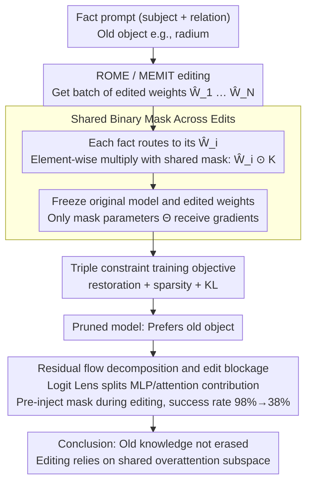

# One Mask to Rule Them All: On Hidden Facts after Editing and How to Find Them

**Conference**: ACL2026 Findings  
**arXiv**: [2605.28839](https://arxiv.org/abs/2605.28839)  
**Code**: https://github.com/holmov1/one-mask-ke  
**Area**: Knowledge Editing / Mechanistic Interpretability  
**Keywords**: ROME, MEMIT, knowledge editing, binary mask, overattention

## TL;DR
This paper discovers that ROME / MEMIT does not truly overwrite old knowledge but suppresses it through a shared overattention mechanism; a sparse binary mask can reverse most edits and reduce the success rate of new edits from 98% to 38%.

## Background & Motivation

**Background**: Knowledge editing aims to update specific facts without retraining LLMs. Locate-and-edit methods like ROME and MEMIT identify and directly modify MLP weights associated with target facts, which is widely interpreted as "overwriting the old fact with a new one." Common evaluations primarily focus on output behavior: whether the model outputs the new object for an edited prompt.

**Limitations of Prior Work**: Merely observing output behavior does not demonstrate that internal knowledge has been truly rewritten. Factual knowledge in Transformers often exists in redundant paths and self-repair mechanisms. If knowledge is distributed across multiple layers and paths, why would modifying a single or a few continuous layers allow the model to stably output new facts? This creates tension with the claim that "knowledge is truly overwritten."

**Key Challenge**: If ROME / MEMIT truly introduced fact-specific updates for every fact, different edits should rely on different weight locations. However, if multiple edits can be reversed by the same mask, it indicates these methods share a functional mechanism rather than just writing unique new facts.

**Goal**: The authors aim to answer three questions: whether a single mask can reverse edits for a large number of different facts; whether this mask can generalize to unseen edits and relations; and what internal mechanism it disrupts when reversing edits.

**Key Insight**: A compact binary mask is trained on edited MLP weight matrices. The mask does not retrain the original model or modify unedited layers; it only learns "which edited weights are necessary for maintaining the edit." If setting a small number of weights to zero restores the original fact, it indicates the old knowledge remains in the model.

**Core Idea**: Knowledge editing success relies on an overattention subspace shared across facts; the learned mask restores old knowledge by eliminating the overattention of subsequent layers rather than simply rolling back the maximum weight changes.

## Method

The paper first uses ROME / MEMIT to perform factual edits on the model, then fixes all edited weights and trains only a binary mask. This mask is applied to the edited weight matrices to form a pruned model. The training objective is to make the pruned model prefer the original object over the edited object while minimizing weight pruning and maintaining a language modeling distribution close to the original model.

### Overall Architecture

Given an original model $M$, a factual prompt $x$ contains a subject and a relation, e.g., "Marie Curie discovered," where the original object is "radium." Knowledge editing changes the object to $o^*$, yielding the edited model $M_e$. The paper obtains a set of edited weight matrices $\{\hat{W}_1, \ldots, \hat{W}_N\}$ from a batch of different facts and learns a shared mask $K$.

During training, each sample is routed to its corresponding edited matrix $\hat{W}_i$, which is then element-wise multiplied by the shared mask $\hat{W}_i \odot K$. Only the mask parameters $\Theta$ receive gradients; the original model and edited weights remain frozen. The mask trained this way cannot memorize a specific fact but must capture the weight structures that multiple edits commonly rely on.

Experiments use CounterFact. ROME experiments train masks on single edits; MEMIT supports batch editing, where authors edit 1,000 facts at once and train the mask on a single edited layer. Models include GPT-2 XL (1.5B), LLaMA-3.2 (3B), and Qwen2.5 (7B). The training set consists of 3,000 samples across 10 relations; the test set includes 1,700 held-out samples. Additional OOD experiments use 1,000 extra ROME edits and 10 unseen relations.

### Key Designs

**1. Shared Binary Mask Across Edits: Testing if different edits rely on the same weight locations using the same mask**

If knowledge editing were truly fact-specific, each fact should be written to different weights, and a shared mask should not generalize. The paper uses this as a criterion: training a binary mask where a value of 1 keeps an edited weight and 0 removes its contribution. Applying the same $K$ to a batch of different edited matrices while training only $K$ forces the mask to capture the weight structures that various edits depend on—if it can reverse or even block unseen edits, it proves ROME / MEMIT utilizes a shared mechanism rather than writing individual new facts.

**2. Triple Constraint Training Objective: Restoring old facts without damaging the model**

Pursuing only "edit reversal" can easily degrade into simply breaking the model to "restore" old answers by destroying language modeling. The paper adds three forces to the training objective: restoration loss requires the pruned model to assign a higher probability to the original object than the edited one; sparsity loss limits the proportion of pruned weights; and KL preservation loss keeps the pruned model's output distribution close to the original model. The combined objective is written as $\mathcal{L}_{KL}+\max(0,\mathcal{L}_{sparsity}-S_{max})+\max(0,\mathcal{L}_{restoration}+\delta)$. Sparsity and KL constraints force the mask to locate a small number of key pathways maintaining the edit instead of sacrificing overall capability.

**3. Residual Flow Decomposition and Edit Blockage: Proving that suppressed overattention explains reversal and is necessary for edit success**

A high RSR only shows the mask works, not why. The paper uses Logit Lens to decompose the contributions of MLPs and attention layers to the target token logit in residual streams across original, edited, and pruned models. It finds that after editing, MLP paths largely retain the trajectory of old knowledge, while it is the subsequent attention that is abnormally amplified. The mask's role is to eliminate these attention spikes. To further prove this subspace is not a bystander, authors pre-inject the mask during the editing process to see if ROME can bypass it—resulting in the editing success rate dropping from 98% to 38%, proving this overattention subspace is essential for the edit itself.

### Loss & Training

Binary masks are non-differentiable, so authors initialize trainable parameters $\Theta$, passing them through a sigmoid to get a soft mask $K \in (0,1)$; thresholding $\gamma$ is used for inference. Restoration loss is defined as $\mathcal{L}_{restoration}=-[\log P_{M_p}(o|x)-\log P_{M_p}(o^*|x)]$, with a margin $\delta$ to encourage the original object to significantly outperform the edited one. Sparsity loss calculates the ratio of pruned weights $\frac{1}{|K|}\sum(1-k_{a,b})$, and KL loss constrains behavioral consistency. Metrics include Reversal Success Rate (RSR), Top-1 Overlap, and WikiText-2 perplexity.

## Key Experimental Results

### Main Results

| Method | Model | Pruning Ratio | Train RSR / Top-1 | Test RSR / Top-1 | Orig / Edit / Mask PPL | Observation |
|------|------|----------|-------------------|------------------|---------------------------|------|
| ROME | GPT-2 XL | 10.0% | 83% / 78% | 82% / 77% | 17.80 / 44.51 / 25.68 | Minor pruning restores most edits and fixes PPL degradation |
| ROME | LLaMA-3.2 | 10.0% | 90% / 75% | 79% / 72% | 9.46 / 9.59 / 10.14 | Edits are stable, yet mask still reverses |
| ROME | Qwen-2.5 | 15.3% | 87% / 77% | 68% / 66% | 7.43 / 8.07 / 7.76 | Larger models require higher pruning ratios |
| MEMIT | GPT-2 XL | 4.5% | 82% / 81% | 74% / 78% | 17.80 / 17.90 / 19.00 | Distributed edits also rely on few key weights |
| MEMIT | LLaMA-3.2 | 8.8% | 87% / 67% | 78% / 65% | 9.46 / 10.78 / 12.53 | Test RSR maintains 78% |
| MEMIT | Qwen-2.5 | 7.9% | 88% / 67% | 70% / 60% | 7.43 / 7.66 / 7.74 | PPL barely changes but edit remains reversible |

### Key Findings

- A single mask can reverse approximately 80% of edits in the training set and maintain high RSR on test sets and OOD relations, strongly supporting the "shared editing mechanism" hypothesis.
- Residual flow decomposition shows that the MLP path largely retains the trajectory of old knowledge after editing; what is actually amplified are subsequent attentions. The mask's role is to eliminate these attention spikes.
- For ROME, editing can significantly damage PPL; the mask can restore some language modeling capability, e.g., GPT-2 XL decreasing from 44.51 to 25.68. For MEMIT, PPL changes are small, but the mask still reverses edits, indicating the edit maintenance mechanism and perplexity damage are distinct issues.

## Highlights & Insights

- The most impactful conclusion is that "edits do not erase knowledge." Old facts remain in the MLP/residual paths but are suppressed by edit-induced overattention, which is why a small mask can allow old facts to resurface.
- Generalizing a single mask to different facts and unseen relations provides strong causal evidence. This goes further than mere observation of attention drift, as it demonstrates that blocking the structure directly reverses or prevents editing.
- This work reinterprets overattention, previously seen as a side effect of editing, as the core mechanism for success. This perspective also explains why ROME / MEMIT struggle to propagate changes to related facts: they suppress retrieval rather than update the knowledge graph.
- The mask did not simply prune the largest $\Delta W$ but targeted positions with smaller update magnitudes but critical functions, suggesting that knowledge editing defense shouldn't just look at weight change size.

## Limitations & Future Work

- **Scope limited to locate-and-edit**: The paper primarily studies ROME and MEMIT, excluding other parameter modification or meta-learning methods like AlphaEdit, MEND, or MALMEN.
- **Parameter-preserving edits not considered**: Retrieval-based memory, external memories, or in-context editing may not rely on the same MLP weight subspace; the mask conclusions cannot be directly extrapolated.
- **Data limited to CounterFact**: CounterFact is a standard benchmark, but real-world updates, long contexts, and multi-hop associations may involve different internal mechanisms.
- **Mask as a defense clue, not a complete system**: Actual deployment requires detecting when a mask is needed, avoiding collateral damage to legitimate updates, and defending against adaptive bypasses.
- **Computational constraints**: The authors did not study meta-learning KE due to the high cost of training editing hypernetworks. Future work should compare internal mechanisms across different editing paradigms.

## Related Work & Insights

- **vs ROME / MEMIT Original Assumptions**: ROME / MEMIT are built on the intuition that MLP layers are associative memories where direct weight changes overwrite facts; this paper shows output changes are more like attention hijacking than actual knowledge overwriting.
- **vs Attention Drift / Superficial Editing Analysis**: Previous work viewed overattention to edited entities as a failure of specificity or a cause for old facts resurfacing under adversarial prompts; this paper further shows overattention is the structural mechanism for edit success itself.
- **vs Edit Detection Methods**: Existing works detect edited facts from internal representations; this paper provides a possible explanation: different edits leave a shared attention signature, allowing classifiers to learn universal patterns.
- **Insights**: Knowledge editing evaluation should look beyond rewrite success to include related fact propagation, internal retrieval paths, attention/MLP decomposition, and reversibility. For security defense, small shared masks could become a tool for open-weight models to defend against malicious edits.

## Rating
- Novelty: ⭐⭐⭐⭐⭐ Reversing and blocking edits with a shared mask directly challenges the "knowledge overwriting" assumption with strong mechanistic insight.
- Experimental Thoroughness: ⭐⭐⭐⭐☆ Covers ROME/MEMIT, three models, train/test/OOD, PPL, and residual flow analysis; lacks more editing methods and real-world update scenarios.
- Writing Quality: ⭐⭐⭐⭐☆ The chain of reasoning is clear and data is persuasive; some mechanism diagrams require context from the text.
- Value: ⭐⭐⭐⭐⭐ Highly valuable for knowledge editing, security defense, and mechanistic interpretability, reminding the community to re-evaluate the boundaries of locate-and-edit capabilities.

<!-- RELATED:START -->

## Related Papers

- [\[ICLR 2026\] Scaling Knowledge Editing in LLMs to 100,000 Facts with Neural KV Database](../../ICLR2026/knowledge_editing/scaling_knowledge_editing_in_llms_to_100000_facts_with_neural_kv_database.md)
- [\[ACL 2025\] ChainEdit: Propagating Ripple Effects in LLM Knowledge Editing through Logical Rule-Guided Chains](../../ACL2025/knowledge_editing/chainedit_propagating_ripple_effects_in_llm.md)
- [\[ACL 2025\] CKnowEdit: A New Chinese Knowledge Editing Dataset for Linguistics, Facts, and Logic Error Correction in LLMs](../../ACL2025/knowledge_editing/cknowedit_chinese_knowledge_editing_dataset_llms.md)
- [\[ACL 2026\] Can Factual Opinions Be Edited (Manipulated) in Large Language Models?](can_factual_opinions_be_edited_manipulated_in_large_language_models.md)
- [\[ICLR 2026\] EAMET: Robust Massive Model Editing via Embedding Alignment Optimization](../../ICLR2026/knowledge_editing/eamet_robust_massive_model_editing_via_embedding_alignment_optimization.md)

<!-- RELATED:END -->
