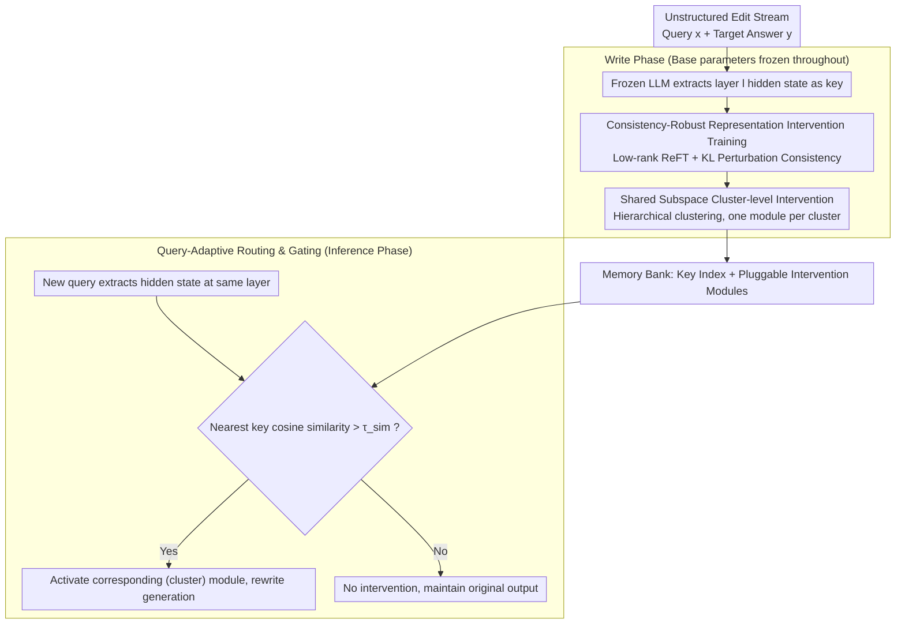

# Representation Interventions Enable Lifelong Knowledge Memory Control in LLMs

**Conference**: ACL2026  
**arXiv**: [2511.20892](https://arxiv.org/abs/2511.20892)  
**Code**: Not publicly available  
**Area**: Knowledge Editing  
**Keywords**: Knowledge Editing, Representation Intervention, Lifelong Memory Control, Router, Low-rank Subspace

## TL;DR
This paper proposes RILKE, which transforms lifelong knowledge editing from "modifying model weights" to "applying low-rank interventions in the hidden representation space." Through robust training, query-adaptive routing, and shared subspace modules, RILKE maintains near-perfect editing success rates and strong generalization after 1,000 unstructured knowledge edits while significantly reducing storage overhead.

## Background & Motivation
**Background**: Once the parametric knowledge of LLMs is fixed after training, it is difficult to update with real-world changes. Common solutions include continual pre-training, Retrieval-Augmented Generation (RAG), and model editing. Continual training is costly and prone to forgetting; RAG does not modify parameters but is limited by retrieval quality and conflicts with parametric memory; model editing attempts to directly change internal knowledge, making it suitable for low-cost factual corrections.

**Limitations of Prior Work**: Many editing methods still focus on structured triplets (e.g., "what is the attribute of a subject"). In reality, knowledge updates are often unstructured, long-form, and context-dependent. More critically, deployed models receive subsequent edits continuously. Success in a single edit does not guarantee stability after accumulation: weight editing leads to "edit collapse," and external memory modules may suffer from capacity issues and routing interference.

**Key Challenge**: Lifelong knowledge control requires satisfying three goals simultaneously: precise editing without contaminating irrelevant queries, triggering the same edit for paraphrased inputs, and maintaining sub-linear growth in storage and training costs as the number of edits increases. Existing methods typically struggle to balance all three.

**Goal**: The authors aim to write complex unstructured knowledge into LLMs in an accumulative, routable, and compressed manner, keeping model weights frozen while activating only the relevant knowledge intervention during inference.

**Key Insight**: Starting from the geometry of hidden representations, the authors observe that semantically similar questions are closer in the intermediate representation space. Furthermore, the ReFT intervention subspaces independently trained for similar knowledge points are more aligned. This suggests that knowledge editing does not necessitate weight changes; if local low-dimensional directions can be found in the representation space, they can control model output like "pluggable memories."

**Core Idea**: Manage lifelong knowledge using a "hidden representation index + low-rank representation intervention modules + similarity routing." Each query first retrieves corresponding memories in the representation space of the frozen model, then applies local interventions only to relevant representations.

## Method

### Overall Architecture
RILKE does not train a new knowledge base model. Instead, it treats the representation space of a specific intermediate layer of a frozen LLM as a stable "retrieval index" and attaches a set of routable, pluggable low-rank intervention modules. The input is a stream of sequential unstructured editing samples, each consisting of a query $x$ and a target answer $y$. The system first extracts the hidden state of each query at a designated layer using the frozen model as a key. It then trains a ReFT-style intervention module for that key (or its semantic cluster), enabling the model to generate the target answer without modifying original weights. During inference, the same layer representation is extracted for new queries, and the nearest key is retrieved via cosine similarity. If the similarity exceeds a gating threshold, the corresponding module is activated; otherwise, the original output is maintained. This process decomposes lifelong editing into a "stable key space + pluggable value modules," essentially bypassing parameter drift caused by repeated weight edits.

### Key Designs

**1. Consistency-Robust Representation Intervention Training: Expanding an edit from a "point" to a "semantic neighborhood"**

Fitting only the target answer on the original phrasing leads to overfitting, where the module fails on paraphrases. RILKE adopts the low-rank intervention form of ReFT, learning a transformation $\Phi(h)=h+R^\top(Ah+b-Rh)$ parameterized by $R,A,b$ on the hidden state $h$. The key assumption is that the hidden state of a paraphrase falls within an $\epsilon$-ball of the original query. Thus, during training, perturbations are actively added to the representations, and a KL term constrains the output distribution consistency between the original and perturbed states. The total objective is the language modeling cross-entropy plus a robust regularizer $\lambda_{robu}\,\mathrm{KL}(p(h)\|p(h+\epsilon))$. This serves as cheap data augmentation: without collecting actual paraphrases, output consistency within the hidden space neighborhood extends the edit from a single point to a local region. Ablations show this significantly improves paraphrase generalization with almost no loss in original query success rates.

**2. Shared Subspace Cluster-level Intervention: Compressing "one memory per knowledge" into "one memory per cluster"**

Attaching an adapter per edit causes storage to grow linearly. RILKE first performs hierarchical agglomerative clustering on layer representations (requiring intra-cluster similarity above a threshold and cluster size below a limit). A shared intervention module is then trained for each semantic cluster. During inference, the system still finds the nearest knowledge item but maps it to the shared module of its cluster. This compression is not a brute-force merge but is built on the empirical property that "the ReFT intervention subspaces of semantically similar knowledge are more aligned." Forcing dissimilar knowledge into the same cluster would push the edit vectors off-target. Experiments show the shared version reduces UnKE storage from ~43% of WISE (individual version) to ~13%, with only limited loss in paraphrase generalization.

**3. Query-Adaptive Routing and Gating: Selecting the right module and blocking irrelevant queries**

After training, the layer representation $h_x^l$ of each editing query is stored as a key. During inference, the new query representation $h_{\hat{x}}^l$ is compared against all keys via cosine similarity to route to the nearest module. If the maximum similarity is below a threshold $\tau_{sim}$ (set to 0.9 in experiments), no intervention is applied, suppressing "spurious activation." This step is valid because the key space does not drift after the base model is frozen, and semantically similar questions naturally cluster in this space, allowing paraphrases to be routed back to the same memory.

### Loss & Training
RILKE freezes LLaMA-3.1-8B-Instruct or Qwen2.5-7B-Instruct and only trains the representation intervention modules. Single knowledge points use teacher-forcing auto-regressive cross-entropy combined with KL consistency regularization after hidden representation perturbation. The shared subspace version first clusters by hidden states and then performs batch training for one module per cluster. Inference uses deterministic generation. Editing is evaluated using Rouge-L, BertScore, MMLU preservation, and reliability/generalization/locality metrics on ZsRE.

## Key Experimental Results

### Main Results
UnKE is the primary benchmark for unstructured knowledge editing. Below are the key results for 1,000 sequential edits on LLaMA-3.1-8B-Instruct; RILKE achieves near-perfect scores on original queries and significantly outperforms long-term editing baselines like WISE and GRACE on paraphrases, while maintaining MMLU performance close to the unedited model.

| Method | 1,000 edits Original BertS↑ | 1,000 edits paraphrase BertS↑ | MMLU↑ | ZsRE Avg↑ | Main Phenomenon |
|------|---------------------------|-------------------------------|-------|----------|----------|
| MEMIT | 0.033 | 0.034 | 0.188 | 0.00 | Significant collapse after cumulative edits |
| GRACE | 0.810 | 0.521 | 0.594 | 0.49 | Decent on original, lacks generalization |
| WISE | 0.681 | 0.673 | 0.584 | 0.73 | Stable but limited editing precision |
| RILKE | 1.000 | 0.963 | 0.622 | 0.88 | High success rate, high paraphrase generalization, low utility loss |

Storage costs also reflect the efficiency of representation intervention. The individual RILKE module is already more memory-efficient than WISE, and the shared subspace version further compresses the overhead to about one-third.

| Method | UnKE Storage Cost | Relative to WISE | Description |
|------|---------------|-----------|------|
| WISE | 224.0 MiB | 100% | Stores external memory/sub-modules |
| RILKE (Individual) | 96.1 MiB | 42.9% | One low-rank module per knowledge item |
| RILKE (Shared) | 29.4 MiB | 13.1% | One shared module per semantic cluster |

### Ablation Study
The robust training term primarily improves paraphrase generalization without harming the editing success rate of original queries. The shared subspace provides significant compression at the cost of limited generalization loss.

| Configuration | T=100 Original BertS↑ | T=100 paraphrase BertS↑ | T=1,000 Original BertS↑ | T=1,000 paraphrase BertS↑ |
|------|--------------------|--------------------------|----------------------|----------------------------|
| w/o $\mathcal{L}_{robu}$ | 1.000 | 0.959 | 0.999 | 0.909 |
| w/ $\mathcal{L}_{robu}$ | 1.000 | 0.984 | 1.000 | 0.963 |

| Configuration | Original BertS↑ | paraphrase BertS↑ | MMLU↑ | Description |
|------|----------------|--------------------|-------|------|
| RILKE (Individual) | 1.000 | 0.963 | 0.622 | Best precision and generalization |
| RILKE (Shared) | 0.999 | 0.901 | 0.621 | Slight generalization drop, significant storage reduction |
| Batched RILKE | 1.000 | 0.834 | - | Stronger effect with intra-cluster joint training |
| Sequential RILKE | 0.742 | 0.723 | - | Strict online absorption still outperforms AnyEdit/UnKE |

### Key Findings
- The semantic locality of the representation space is the true lever: paraphrases and original queries are closer together, providing a common foundation for both routing and robust training.
- Shared subspace is not just a compression trick but is based on the empirical property that "similar knowledge has similar intervention directions"; randomly batching dissimilar knowledge together significantly offsets the edit vectors.
- RILKE's strength lies in long-tail, unstructured, and multi-cumulative editing, specifically for scenarios where the model continuously receives new knowledge after deployment.

## Highlights & Insights
- The most ingenious aspect is decomposing knowledge editing into a "stable key space" and "pluggable value modules." By freezing the base model, the middle-layer representations become a searchable index, preventing parameter drift from repeated weight updates.
- Robust KL regularization behaves like expanding a point edit into a semantic neighborhood edit. It improves paraphrase performance without explicitly collecting large amounts of paraphrase data, suggesting that hidden space perturbation can act as cheap data augmentation.
- Shared subspaces offer a scalable direction for lifelong editing. In the future, combining online clustering, adapter merging, or periodic retraining could allow new knowledge to be written individually and then merged into cluster-level modules in the background.
- This paper serves as a reminder that knowledge editing does not always need to pursue "permanently writing facts into parameters." In many applications, reversible, routable, and auditable representation interventions may better fit engineering requirements.

## Limitations & Future Work
- The authors explicitly leave systemic risk analysis for future work, including malicious edits, bias amplification, and robustness under adverse editing strategies.
- The routing threshold is a core hyperparameter. A threshold too low causes "spurious activation" of irrelevant knowledge, while one too high misses paraphrases; large-scale open-domain scenarios might require calibration, confidence estimation, or multi-level retrieval.
- RILKE requires accessing and storing hidden representations at the target layer and training intervention modules specifically for the target model; modules cannot be directly transferred when changing models or layers.
- Shared subspaces sacrifice some paraphrase generalization, indicating that fine-grained conflicts may still exist between similar knowledge. Future work could consider intra-cluster Mixture-of-Adapters, dynamic rank, or conflict detection.
- While the editing effect is strong, there is less discussion on safety boundaries, reversibility, audit logs, and permission control; these factors will determine whether it can be used in real-world knowledge management systems.

## Related Work & Insights
- **vs ReFT**: ReFT provides the basic form of low-rank representation intervention; RILKE extends it to knowledge editing with the addition of paraphrase robustness, routing, and lifelong accumulation management.
- **vs MEMIT / locate-then-edit**: Methods like MEMIT directly modify weights, suitable for single or small amounts of factual editing; RILKE freezes weights and uses modular interventions to avoid "edit collapse" after repeated edits.
- **vs GRACE / WISE**: These external memory methods also preserve original parameters but typically learn control within a single sub-module or external memory; RILKE uses hidden representation keys for fine-grained routing and reduces storage via low-rank modules.
- **vs RAG**: RAG inserts retrieval evidence at the text level, which is susceptible to retrieval failures and conflicts with parametric knowledge; RILKE directly alters the generation trajectory at the representation layer, behaving more like conditioned control of the model's internal states.

## Rating
- Novelty: ⭐⭐⭐⭐⭐ Restructures lifelong knowledge editing through representation geometry, routing, and shared subspaces with a distinct and complete logic.
- Experimental Thoroughness: ⭐⭐⭐⭐ Covers UnKE, EditEverything, ZsRE, MMLU, and various ablations, though safety in real-world open domains requires more systemic evaluation.
- Writing Quality: ⭐⭐⭐⭐ Clear motivation and methodology chain; relationships between geometric properties and engineering hyperparameters could be further detailed.
- Value: ⭐⭐⭐⭐⭐ Provides direct insights for lifelong knowledge updates, corporate knowledge customization, and controllable model memory, especially suitable for scenarios requiring pluggable edits.

<!-- RELATED:START -->

## Related Papers

- [\[ICML 2025\] WikiBigEdit: Understanding the Limits of Lifelong Knowledge Editing in LLMs](../../ICML2025/knowledge_editing/wikibigedit_understanding_the_limits_of_lifelong_knowledge_editing_in_llms.md)
- [\[NeurIPS 2025\] MEMOIR: Lifelong Model Editing with Minimal Overwrite and Informed Retention for LLMs](../../NeurIPS2025/knowledge_editing/memoir_lifelong_model_editing_with_minimal_overwrite_and_informed_retention_for_.md)
- [\[NeurIPS 2025\] Edit Less, Achieve More: Dynamic Sparse Neuron Masking for Lifelong Knowledge Editing in LLMs](../../NeurIPS2025/knowledge_editing/edit_less_achieve_more_dynamic_sparse_neuron_masking_for_lifelong_knowledge_edit.md)
- [\[ACL 2026\] HiEdit: Lifelong Model Editing with Hierarchical Reinforcement Learning](hiedit_lifelong_model_editing_with_hierarchical_reinforcement_learning.md)
- [\[ICML 2025\] Representation Shattering in Transformers: A Synthetic Study with Knowledge Editing](../../ICML2025/knowledge_editing/representation_shattering_in_transformers_a_synthetic_study_with_knowledge_editi.md)

<!-- RELATED:END -->
