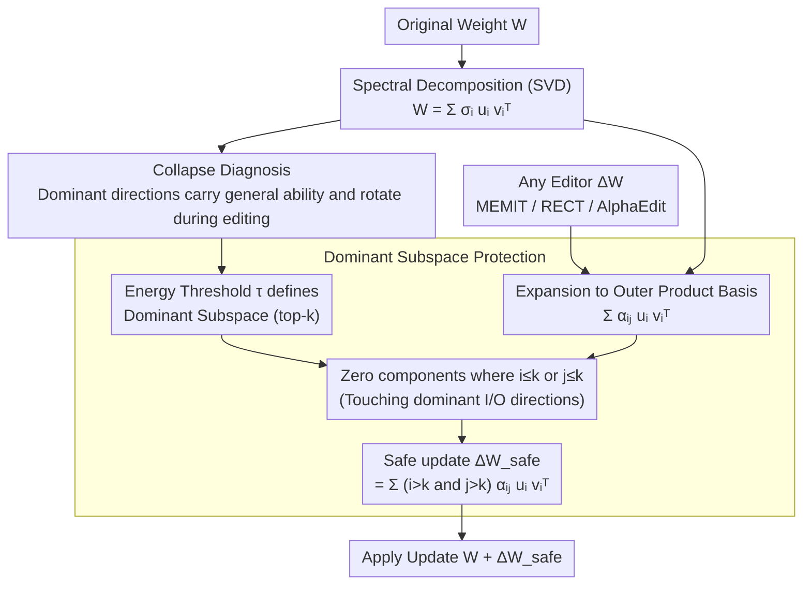

# Spectral Characterization and Mitigation of Sequential Knowledge Editing Collapse

**Conference**: ACL2026  
**arXiv**: [2601.11042](https://arxiv.org/abs/2601.11042)  
**Code**: No public code  
**Area**: Knowledge Editing / LLM Reliability / Parameter-efficient Correction  
**Keywords**: Sequential Knowledge Editing, Spectral Analysis, Singular Subspace, Model Collapse, REVIVE

## TL;DR
The paper explains why sequential knowledge editing causes LLM general ability collapse from the perspective of SVD spectral structure and proposes REVIVE. By filtering update components that interfere with the dominant singular subspace within the singular vector basis of the original weights, REVIVE enables editors like MEMIT, RECT, and AlphaEdit to maintain both editing success rates and general capabilities under 10,000 to 20,000 continuous edits.

## Background & Motivation
**Background**: Knowledge editing aims to modify specific facts without retraining LLMs, such as replacing outdated or incorrect knowledge with new information. Parameter modification methods like MEMIT, ROME, and MEND perform strongly on single or small-scale edits, and recent methods like RECT, PRUNE, AlphaEdit, and NSE have emerged for sequential editing.

**Limitations of Prior Work**: In real-world scenarios, editing often occurs continuously rather than as a one-time modification. As the number of edits increases, parameter modification methods gradually damage the general ability of the model, manifesting as collapse in GLUE tasks, decreased generation fluency, destruction of neighborhood knowledge, and even failure of the editing itself. Existing methods typically use update norms, historical editing directions, or external covariance as constraints but lack a structural explanation of the collapse mechanism.

**Key Challenge**: Editing requires changing local facts, but the general ability of the model relies on the highly organized global structure within the pre-trained weights. If sequential editing continuously perturbs these critical structures, even if each update appears small, the accumulation may push the model out of its original functional subspace.

**Goal**: The authors aim to answer two questions: first, in which spectral components of the weight matrix are the model's general abilities concentrated; second, whether a wrapper decoupled from specific editors can be designed to protect these key spectral directions without changing editing objectives.

**Key Insight**: The paper performs SVD on the FFN weight matrix, considering each rank-one component as an independent input-output mapping. Through reconstruction, perturbation, and monitoring of the sequential editing process, the authors find that dominant singular directions carry a large amount of general ability and are extremely sensitive to perturbations.

**Core Idea**: Sequential editing collapse stems from the gradual rotation and erosion of the dominant singular subspace; REVIVE protects general abilities by projecting updates into the original SVD basis and removing components that touch dominant input/output directions.

## Method

### Overall Architecture
The paper is divided into "Mechanism Analysis" and "Intervention Method": the former matches general abilities with spectral structures using LLaMA3-8B FFN weights, and the latter proposes REVIVE, a plug-and-play wrapper decoupled from the editor. REVIVE does not change how the editor calculates updates but inserts a spectral filter before applying the update: given an update $\Delta W$ from any editor, it first performs SVD on the original weight $W$ to obtain left/right singular vectors $u_i,v_j$ and singular values $\sigma_i$. An energy threshold $\tau$ identifies the dominant subspace, $\Delta W$ is then expanded onto this outer product basis $\sum_{i,j}\alpha_{ij}u_iv_j^\top$. Any components touching the dominant input/output directions are zeroed out, keeping the update in low-energy spectral regions to output a safe update.

### Key Designs

**1. Interpreting Weight Role from a Spectral Perspective: Where is General Ability Hidden?**

The starting point of REVIVE is to view FFN weights as a set of independent input-output mappings: $W=\sum_i \sigma_i u_iv_i^\top$. Each rank-one component projects input along $v_i$, scales by $\sigma_i$, and outputs along $u_i$. By reconstructing weights using only top energy components to run GLUE, the authors found that the top 5% of singular components can recover approximately 62.6% of original performance. This confirms that general abilities are highly concentrated in a few dominant directions; thus, the real risk of sequential editing is not the update norm but whether it interferes with these high-energy functional directions.

**2. Spectral Diagnosis of Sequential Editing Collapse: From "Too Many Edits Break Things" to "Dominant Directions Rotating Away"**

To verify the collapse mechanism, the authors sliced the spectrum into groups by energy (0-10%, 10-20%, etc.) and injected structural perturbations of the same Frobenius norm. Perturbing high-energy groups caused significant drops in GLUE F1, while low-energy perturbations had almost no effect. Subsequently, 2,000 COUNTERFACT edits were performed on LLaMA3 using MEMIT (100 per round), tracking efficacy, paraphrase accuracy, GLUE, Low-rank Subspace Similarity, and Singular Vector Similarity. Results showed that dominant directions gradually rotate and eventually become nearly orthogonal to their original states, with this drift synchronized with behavioral collapse—providing direct evidence for what REVIVE should protect.

**3. Dominant Subspace Protection: Filtering Harmful Updates from $\Delta W$**

Given an energy threshold $\tau$, the smallest $k$ is chosen such that the cumulative energy of top-$k$ singular values exceeds $\tau$. After expanding the update into $\alpha_{ij}u_iv_j^\top$, any term where $i\leq k$ or $j\leq k$ is zeroed out as it would affect the dominant output or input subspaces. The final safe update is $\Delta W_{safe}=\sum_{i>k}\sum_{j>k}\alpha_{ij}u_iv_j^\top$. The advantage of this filtering is that local facts can still be written into low-energy spectral directions while high-energy functional directions are preserved. It does not rely on external data or historical statistics, defining the protection target directly from the model's own spectral structure.

### Loss & Training
REVIVE is not a new training loss but a post-processing constraint for parameter-modifying editors. The only internal hyperparameter is the singular value energy threshold $\tau$, which experiments show is not sensitive within reasonable ranges. Experiments cover GPT2-XL, GPT-J, and LLaMA3, with focus on GPT-J and LLaMA3 using COUNTERFACT and ZSRE datasets. Sequential editing accumulates 100 edits per round up to 10,000, with extreme tests at 20,000 edits and the full ZSRE set (19,086 edits).

## Key Experimental Results

### Main Results

| Model / Method | COUNTERFACT Eff. | COUNTERFACT Para. | COUNTERFACT Neigh. | ZSRE Eff. | ZSRE Para. | Description |
|--------|------|------|------|------|------|------|
| LLaMA3 + MEMIT | 62.30 | 55.02 | 48.11 | 0.08 | 0.08 | ZSRE essentially collapses after 10,000 edits |
| LLaMA3 + MEMIT + REVIVE | 95.62 | 84.60 | 62.17 | 83.45 | 79.90 | Editing success and generalization recovered |
| LLaMA3 + RECT | 60.23 | 54.90 | 50.56 | 0.00 | 0.00 | Specialized sequential method still collapses |
| LLaMA3 + RECT + REVIVE | 92.69 | 79.95 | 63.09 | 84.20 | 80.27 | Significant plug-and-play gain |
| LLaMA3 + AlphaEdit | 62.48 | 56.90 | 52.31 | 90.57 | 85.66 | Strong ZSRE but low COUNTERFACT |
| LLaMA3 + AlphaEdit + REVIVE | 98.74 | 90.08 | 60.19 | 93.40 | 89.31 | Gains on both benchmarks |
| LLaMA3 + NSE | 77.59 | 44.42 | 86.12 | 45.61 | 45.04 | High Neigh. but weak generalization |
| LLaMA3 + NSE + REVIVE | 98.89 | 92.28 | 65.72 | 94.37 | 90.57 | Lower Neigh. but much higher quality |

### Ablation Study

| Analysis Item | Key Metric | Description |
|------|---------|------|
| Top 5% singular components reconstruction | ~62.6% original GLUE performance | General ability is highly concentrated in dominant subspace |
| High-energy group perturbation | MRPC/COLA/RTE/NLI drop significantly | Dominant directions are the most sensitive |
| Low-energy group perturbation | Minimal performance impact | Low-energy regions better suited for editing updates |
| MEMIT 2,000 edits analysis | Rapid decline after round 10 | Edit performance and GLUE collapse simultaneously |
| Low-rank Subspace Similarity | Significant drop after round 15 | Macro drift of the dominant subspace |
| Singular Vector Similarity | Near orthogonality by round 20 | Systematic rotation of individual singular directions |
| GPT-J Layer 3 norm, MEMIT | L2 norm 105.51 -> 20,946.66 | Unprotected updates cause abnormal weight explosion |
| GPT-J Layer 3 norm, MEMIT+REVIVE | L2 norm 105.51 -> 163.47 | REVIVE significantly suppresses explosion |

### Key Findings
- After 10,000 sequential edits, REVIVE improves LLaMA3 (MEMIT) ZSRE Efficiency from 0.08 to 83.45, indicating it prevents near-total collapse rather than just providing minor regularization.
- In extreme 20,000 COUNTERFACT edit settings, REVIVE improves Efficacy by +75.1% and Fluency by +53.1% compared to original methods, showing protection scales to longer chains.
- GLUE evaluations show that unprotected MEMIT and RECT reach near-zero performance after ~3,000 edits, and AlphaEdit collapses after ~8,000; REVIVE versions retain an average of 86.34% performance after 10,000.
- REVIVE is insensitive to $\tau$, implying dominant subspace boundaries do not require fine-tuning.

## Highlights & Insights
- The strength of the paper lies in the closed-loop between mechanism explanation and method design. It proves general abilities are concentrated and fragile, demonstrates that sequential editing distorts these directions, and uses the same spectral basis to construct protection.
- The plug-and-play nature of REVIVE is critical. As long as a knowledge editing method produces parameter updates, spectral filtering can be applied.
- "High-energy directions carry general abilities, low-energy directions carry local edits" is an insightful working hypothesis. It may also apply to continual fine-tuning, LoRA merging, and safety patches.
- The paper notes that neighborhood scores can sometimes be artificially inflated by "failed edits." REVIVE decreases NSE's Neighborhood score but significantly increases Efficacy/Paraphrase, indicating more authentic editing.

## Limitations & Future Work
- The dominant subspace is defined by singular value energy thresholds, which is empirically effective but not theoretically optimal. Functional importance might vary by layer or task.
- Analysis focuses on FFN layers as they are thought to store factual knowledge. Whether components like attention or layer norm have similar spectral vulnerabilities is not fully explored.
- Protecting dominant directions might limit complex edits that actually require high-energy updates. This work focuses on factual editing and does not cover style or capability injection.
- Evaluation remains centered on COUNTERFACT, ZSRE, and GLUE. Recent questions regarding the adequacy of knowledge editing evaluations are not addressed.
- Computational costs involve SVD and update decomposition; project costs in extremely large models or frequent online scenarios deserve attention.

## Related Work & Insights
- **vs MEMIT / ROME**: These modify FFNs to write facts, performing well individually but collapsing sequentially; REVIVE acts as a spectral guard for these updates.
- **vs RECT / PRUNE / AlphaEdit**: These sequential methods rely on empirical constraints or historical statistics; REVIVE defines protection from the original weight's spectral structure.
- **vs SVD-based editing**: Unlike works using SVD to locate knowledge, this work uses SVD to explain and prevent sequential collapse.
- **Insight**: For continual learning systems, monitoring dominant subspace drift could serve as an early warning for collapse before loss or local evaluation drops.

## Rating
- Novelty: ⭐⭐⭐⭐⭐ Seamless integration of spectral mechanism analysis and plug-and-play protection.
- Experimental Thoroughness: ⭐⭐⭐⭐⭐ Strong evidence across models, editors, and 10k/20k edit chains.
- Writing Quality: ⭐⭐⭐⭐ Rigorous logic and informative tables.
- Value: ⭐⭐⭐⭐⭐ Highly valuable for long-term knowledge editing stability and model maintenance.

<!-- RELATED:START -->

## Related Papers

- [\[ICML 2026\] The Labyrinth and the Thread: Rethinking Regularizations in Sequential Knowledge Editing for Large Language Models](../../ICML2026/knowledge_editing/the_labyrinth_and_the_thread_rethinking_regularizations_in_sequential_knowledge_.md)
- [\[ICLR 2026\] Energy-Regularized Sequential Model Editing on Hyperspheres](../../ICLR2026/knowledge_editing/energy-regularized_sequential_model_editing_on_hyperspheres.md)
- [\[AAAI 2026\] Multiplicative Orthogonal Sequential Editing for Language Models (MOSE)](../../AAAI2026/knowledge_editing/multiplicative_orthogonal_sequential_editing_for_language_models.md)
- [\[ACL 2025\] Neuron-Level Sequential Editing for Large Language Models](../../ACL2025/knowledge_editing/neuron-level_sequential_editing_for_large_language_models.md)
- [\[ACL 2025\] Mitigating Negative Interference in Multilingual Sequential Knowledge Editing through Null-Space Constraints](../../ACL2025/knowledge_editing/mitigating_negative_interference_in_multilingual_sequential_knowledge_editing_th.md)

<!-- RELATED:END -->
