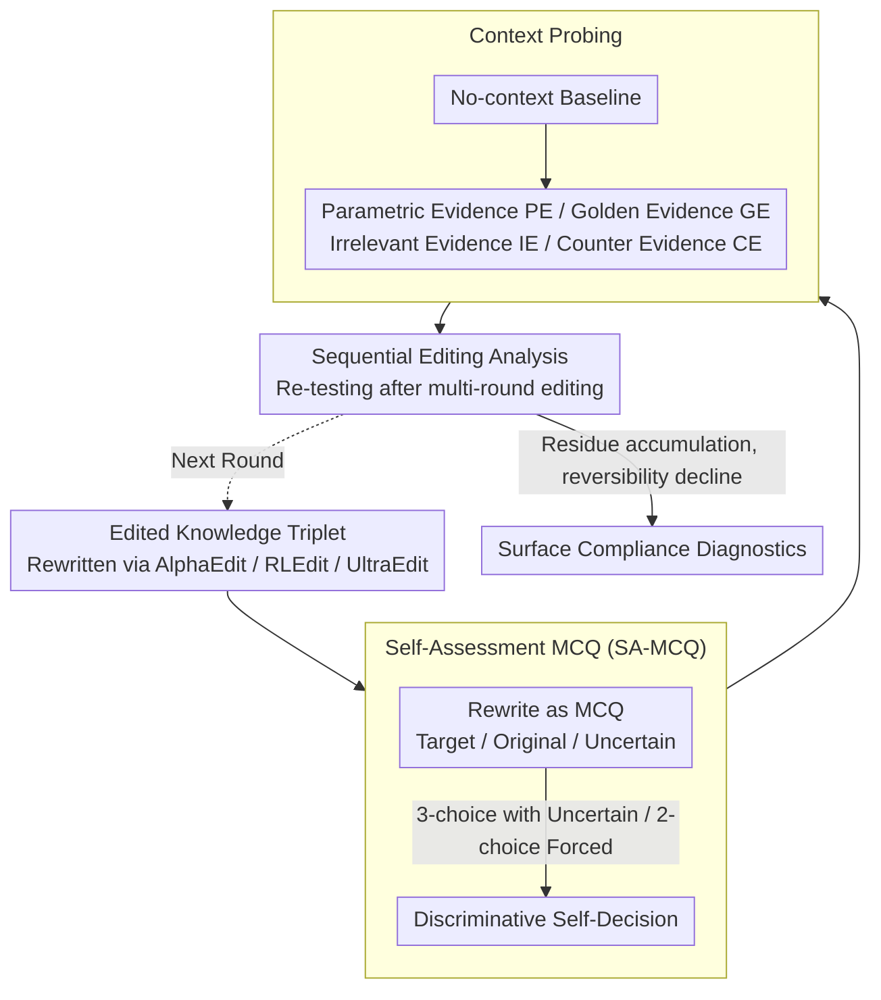

# The Model Agreed, But Didn't Learn: Diagnosing Surface Compliance in Large Language Models

**Conference**: ACL 2026 Findings  
**arXiv**: [2604.05995](https://arxiv.org/abs/2604.05995)  
**Code**: [XiaojieGu/SA-MCQ](https://github.com/XiaojieGu/SA-MCQ)  
**Area**: LLM Trustworthiness / Knowledge Editing  
**Keywords**: Knowledge Editing, Surface Compliance, Self-Assessment, Parametric Memory, In-Context Learning

## TL;DR

The SA-MCQ diagnostic framework is proposed to reveal the "surface compliance" phenomenon in knowledge editing—where editors achieve high scores on standard benchmarks but fail to truly overwrite internal beliefs. Models revert to original parametric memory in discriminative self-assessment, and sequential editing accumulates representational residue, leading to cognitive instability.

## Background & Motivation

**Background**: LLMs encode world knowledge in parameters as parametric memory but inevitably inherit stale or incorrect information from training corpora. Knowledge editing techniques aim to precisely modify specific internal memory states without retraining, and recent editors have demonstrated high success rates on standard benchmarks.

**Limitations of Prior Work**: Existing evaluation frameworks primarily rely on Exact Match to assess editing success, only checking if a model can reproduce target tokens under specific prompts. However, does this surface textual consistency truly reflect a reconfiguration of internal memory? Teacher forcing evaluation further inflates success rates by guiding outputs through correct token prefixes.

**Key Challenge**: High benchmark scores may merely represent "surface compliance"—where editors achieve high scores by mimicking target outputs, but the model's internal beliefs are not structurally overwritten. When the evaluation shifts from generative to discriminative (forcing a choice among options), the modified memory may fail entirely.

**Goal**: To design a diagnostic framework capable of distinguishing "true memory modification" from "surface compliance," revealing the actual effectiveness of knowledge editing.

**Key Insight**: Requiring the edited model to answer Multiple Choice Questions (MCQ) instead of open-ended generation—MCQs force the model to actively adjudicate between competing options, bypassing rote memorization biases found in generative evaluation.

**Core Idea**: Force the model to perform discriminative self-assessment through Self-Assessment Multiple Choice Questions (SA-MCQ) to systematically detect the authenticity and robustness of edited memories under In-Context Learning settings.

## Method

### Overall Architecture

SA-MCQ is a purely diagnostic framework designed to distinguish between "high editor scores on standard benchmarks" and "whether internal beliefs are truly overwritten." The input consists of a knowledge triplet rewritten by an editor (following AlphaEdit, RLEdit, or UltraEdit paradigms). This triplet is converted into a Self-Assessment Multiple Choice Question (SA-MCQ), forcing the model to adjudicate between the edited target answer, the original parametric answer, and "Uncertain." The same question is then tested under various context conditions to probe stability, followed by multi-round sequential editing to test reversibility. The output is a set of discriminative metrics revealing the degree of "surface compliance." The entire process runs on CounterFact and zsRE without any training or parameter updates.

### Key Designs

**1. Self-Assessment MCQ (SA-MCQ): Replacing Open Generation with Discriminative Adjudication**

Generative evaluation has a fundamental flaw—models can "guess" the target token from prompts and context even if internal beliefs remain unchanged; Teacher forcing further inflates success rates with correct prefixes. SA-MCQ rewrites the edited triplet as a multiple-choice question, presenting the target answer, the original answer, and "Uncertain" as candidates. The system prompt explicitly requires the model to answer "based on its own memory" to block context guidance. Two complementary modes are used: a 3-choice mode (including "Uncertain") to observe hesitation between competing answers, and a 2-choice mode (removing "Uncertain") to force a stance and expose dominant preferences. Truly updated models consistently select the target answer, while surface-compliant models revert to original parametric memory when forced to compare—discriminative adjudication is far stricter than rote generative reproduction.

**2. Context Probing: Testing Memory Stability across Scenarios**

In real-world deployment, models almost always work with context (ICL, RAG); thus, memory is only truly effective if it remains stable across contexts. Beyond the no-context parametric baseline, four types of external evidence are constructed: Parametric Evidence (PE, paraphrasing the model's original belief), Golden Evidence (GE, supporting the edit target), Irrelevant Evidence (IE, noisy input), and Counter Evidence (CE, contradicting the edit). All evidence is validated via NLI entailment. Comparing editing performance across these contexts reveals whether the memory is integrated into parameters or reflects a fragile, context-dependent dependency.

**3. Sequential Editing Analysis: Measuring Multi-round Reversibility**

In practice, knowledge needs frequent updates, raising the question of whether each edit leaves non-erasable traces. Sequential editing is performed with SA-MCQ testing after each round to detect if representational residue accumulates. Even if an edit is "undone," prior parametric perturbations may permanently damage the model's ability to return to its original state. A monotonic decline in reversibility indicates that editing is not a clean local rewrite but a persistent erosion of cognitive stability.

## Key Experimental Results

### Main Results

| Editor | Traditional Efficacy (TF) | SA-MCQ Efficacy | Gap |
|--------|------|------|----------|
| AlphaEdit | ~99% | Significant Drop | Severe Surface Compliance |
| RLEdit | ~99% | Significant Drop | Severe Surface Compliance |
| UltraEdit | ~99% | Significant Drop | Severe Surface Compliance |
| Vanilla (Unedited) | - | Original Answer | Baseline |

### Ablation Study

| Context Condition | Phenomenon | Description |
|------|---------|------|
| No Context | Revert to original answer | Parametric memory not overwritten |
| Supportive Evidence | Partial target recovery | Reliance on context hints rather than true memory |
| Counterfactual Conflict | "Cognitive Deadlock" | External counterfactuals easily suppress edit effects |
| Sequential Editing | Permanent reversibility loss | Residue accumulation causes instability |

### Key Findings

- **Surface compliance is pervasive**: It exists across all three mainstream editing paradigms—nearly perfect success rates in traditional evaluations drop significantly under SA-MCQ.
- **Edited memory is hypersensitive to context**: Supportive context can "save" editing effects, while counterfactual context easily "suppresses" them, suggesting editors create fragile context dependencies rather than modifying parametric memory.
- **Sequential editing is irreversible**: Continuous editing accumulates representational residue; even after reverting an edit, the original memory state cannot be fully restored, leading to permanent cognitive instability.
- **Teacher forcing overestimates effectiveness**: It produces artificially high success rates through prefix guidance.

## Highlights & Insights

- **Introduction of the "Surface Compliance" concept**: Precisely naming a long-standing but under-recognized issue in knowledge editing—where editors "answer correctly" without "learning the knowledge." This serves as a warning to the community.
- **Paradigm shift in evaluation**: Moving from generative evaluation (can it say the answer?) to discriminative evaluation (can it judge between options?) is a simple but profound insight—the latter is closer to a test of "true understanding."
- **Irreversibility of sequential editing**: This is a critical negative finding that poses a fundamental challenge to the vision of "sustainable knowledge updates."

## Limitations & Future Work

- The "Uncertain" option in SA-MCQ may introduce selection bias, as models might favor it as a safe choice.
- Only three editors and two datasets were tested; broader coverage of methods and knowledge types is needed.
- No solution for surface compliance was proposed; the study remains at the diagnostic level.
- Future work could explore: Designing training objectives combined with discriminative evaluation to improve editors, and methods for clearing representational residue.

## Related Work & Insights

- **vs. Traditional Evaluation (Exact Match + TF)**: Traditional methods assess generation consistency under specific prompts, while SA-MCQ tests discriminative belief—the discrepancy exposes surface compliance.
- **vs. Memory Augmentation (e.g., SERAC)**: Augmentation methods store edits externally rather than modifying parameters; while out of scope, they might naturally avoid surface compliance issues.

## Rating

- Novelty: ⭐⭐⭐⭐⭐ The "Surface Compliance" concept is novel and significant; the SA-MCQ paradigm shift is worth adopting.
- Experimental Thoroughness: ⭐⭐⭐⭐ Comprehensive across three editors, four context conditions, and sequential analysis.
- Writing Quality: ⭐⭐⭐⭐ Clear problem definition with persuasive experimental findings.
- Value: ⭐⭐⭐⭐⭐ Provides a vital warning for the field and pushes for stricter evaluation standards.

<!-- RELATED:START -->

## Related Papers

- [\[ACL 2026\] Can Factual Opinions Be Edited (Manipulated) in Large Language Models?](can_factual_opinions_be_edited_manipulated_in_large_language_models.md)
- [\[ICLR 2026\] Disentangling Knowledge Representations for Large Language Model Editing](../../ICLR2026/knowledge_editing/disentangling_knowledge_representations_for_large_language_model_editing.md)
- [\[ICML 2026\] Reverse-Engineering Model Editing on Language Models](../../ICML2026/knowledge_editing/reverse-engineering_model_editing_on_language_models.md)
- [\[ACL 2025\] Neuron-Level Sequential Editing for Large Language Models](../../ACL2025/knowledge_editing/neuron-level_sequential_editing_for_large_language_models.md)
- [\[ICML 2026\] The Labyrinth and the Thread: Rethinking Regularizations in Sequential Knowledge Editing for Large Language Models](../../ICML2026/knowledge_editing/the_labyrinth_and_the_thread_rethinking_regularizations_in_sequential_knowledge_.md)

<!-- RELATED:END -->
