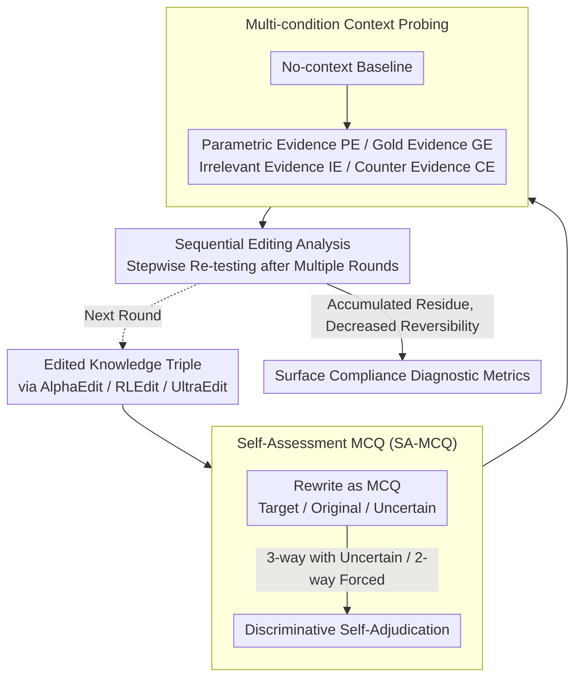

# The Model Agreed, But Didn't Learn: Diagnosing Surface Compliance in Large Language Models

**Conference**: ACL 2026 Findings  
**arXiv**: [2604.05995](https://arxiv.org/abs/2604.05995)  
**Code**: [XiaojieGu/SA-MCQ](https://github.com/XiaojieGu/SA-MCQ)  
**Area**: LLM Trustworthiness / Knowledge Editing  
**Keywords**: Knowledge Editing, Surface Compliance, Self-Assessment, Parametric Memory, In-Context Learning

## TL;DR

The proposed SA-MCQ diagnostic framework reveals the "surface compliance" phenomenon in knowledge editing—editors achieve high scores on standard benchmarks but fail to truly overwrite internal beliefs. Models revert to original parametric memory in discriminative self-assessment, and recursive editing accumulates representation residue, leading to cognitive instability.

## Background & Motivation

**Background**: LLMs encode world knowledge in their weights as parametric memory but inevitably inherit outdated or incorrect information from training corpora. Knowledge editing techniques aim to precisely modify specific internal memory states without retraining; recent editors have shown high success rates on standard benchmarks.

**Limitations of Prior Work**: Existing evaluation frameworks primarily rely on Exact Match to assess editing success, checking only if the model can reproduce the target token under specific prompts. However, does this surface textual consistency truly reflect a reconfiguration of internal memory? Teacher forcing evaluation further inflates success rates by guiding the output with correct token prefixes.

**Key Challenge**: High benchmark scores may merely reflect "surface compliance"—where the editor achieves high scores by mimicking the target output without structurally overwriting the model's internal beliefs. When the evaluation shifts from generative to discriminative (forcing the model to choose between options), the modified memory may fail completely.

**Goal**: Design a diagnostic framework capable of distinguishing between "genuine memory modification" and "surface compliance" to reveal the true effectiveness of knowledge editing.

**Key Insight**: Shift the evaluation of edited models from open-ended generation to Multiple-Choice Questions (MCQ). MCQs force the model to actively adjudicate between competing options, bypassing the rote-memorization bias found in generative assessments.

**Core Idea**: Use a Self-Assessment Multiple-Choice Question (SA-MCQ) framework to force models into discriminative self-evaluation, systematically detecting the authenticity and robustness of edited memories under in-context learning settings.

## Method

### Overall Architecture

SA-MCQ is a purely diagnostic framework aimed at distinguishing between "high scores on standard benchmarks" and "whether internal beliefs are truly overwritten." The input consists of a knowledge triple already modified by an editor (using mainstream paradigms like AlphaEdit, RLEdit, or UltraEdit). The triple is rewritten into a Self-Assessment Multiple-Choice Question (SA-MCQ), forcing the model to adjudicate between the edited target answer, the original parametric answer, and "Uncertain." The same question is then tested under various context conditions to probe stability. Finally, multiple rounds of sequential editing are performed to test reversibility. The output is a set of discriminative metrics revealing the degree of "surface compliance." This entire process is executed on CounterFact and zsRE without any training or parameter updates.

### Key Designs

**1. Self-Assessment MCQ (SA-MCQ): Replacing Open Generation with Discriminative Adjudication**

Open generative evaluation has a fundamental flaw: models can "guess" the target token from prompts and stylistic cues even if internal beliefs remain unchanged. Teacher forcing further inflates success by providing correct prefixes. SA-MCQ rewrites the edited triple as a multiple-choice question, presenting the edited target, the original pre-edit answer, and "Uncertain" simultaneously. System prompts explicitly require the model to answer "based on its own memory" to block contextual guidance. Two complementary modes are used: a 3-way mode (including "Uncertain") to observe hesitation between competing answers, and a 2-way mode (removing "Uncertain") to force a choice, exposing true dominant preferences. Truly updated models consistently select the target, while surface-compliant models revert to original parametric memory when forced to compare—making discriminative adjudication much stricter than rote generation.

**2. Context Probing: Verifying Memory Stability across Contexts**

In real deployments, models almost always work with context (ICL, RAG), so an edited memory is only truly effective if it remains stable under various conditions. Beyond a no-context baseline, the framework constructs four types of external evidence: Parametric Evidence (PE, restating the model's original belief), Golden Evidence (GE, supporting the edit target), Irrelevant Evidence (IE, semantically unrelated noise), and Counter Evidence (CE, information directly contradicting the edit). All evidence is quality-checked via NLI entailment. Comparing the edit's performance across these contexts reveals whether it is truly internalized or merely a fragile, context-dependent temporary reliance.

**3. Sequential Editing Analysis: Testing Reversibility in Multi-round Edits**

In practical applications, knowledge requires frequent updates. A key question is whether each edit leaves an unerasable trace. This analysis performs multiple rounds of sequential editing, re-testing with SA-MCQ after each round. It specifically detects whether representation residues accumulate—even if an edit is "undone" by a subsequent edit, does the prior parameter perturbation permanently impair the model's ability to return to its original state? If reversibility monotonically decreases with the number of edits, it suggests that editing is not a clean local rewrite but a process that erodes the model's cognitive stability.

## Key Experimental Results

### Main Results

| Editor | Traditional Efficacy (TF) | SA-MCQ Efficacy | Gain (Gap) |
|--------|------|------|----------|
| AlphaEdit | ~99% | Significant Drop | Severe Surface Compliance |
| RLEdit | ~99% | Significant Drop | Severe Surface Compliance |
| UltraEdit | ~99% | Significant Drop | Severe Surface Compliance |
| Vanilla (Unedited) | - | Original Answer | Baseline Reference |

### Ablation Study

| Context Condition | Phenomenon | Explanation |
|------|---------|------|
| No Context | Regression to original answer | Parametric memory not truly overwritten |
| Supporting Evidence | Partial recovery of target | Dependency on context cues rather than memory |
| Counterfactual Conflict | "Cognitive Deadlock" | External counter-evidence easily suppresses edit effects |
| Sequential Editing | Permanent decrease in reversibility | Residue accumulation leads to cognitive instability |

### Key Findings

- **Surface compliance is pervasive**: It exists across all three mainstream editing paradigms—near-perfect success rates in traditional evaluations drop sharply under SA-MCQ.
- **Edited memory is hypersensitive to context**: Supporting context can "save" editing effects, while counterfactual context can easily "suppress" them, indicating that editors create fragile dependencies rather than modifying core parametric memory.
- **Sequential editing is irreversible**: Consecutive edits accumulate representation residue; even if an edit is revoked, the original memory state cannot be fully recovered, leading to permanent cognitive instability.
- **Teacher forcing overestimates effectiveness**: It creates a false sense of high success through prefix guidance.

## Highlights & Insights

- **Concept of "Surface Compliance"**: Accurately names a long-standing but under-recognized issue in knowledge editing—where models "answer correctly" without actually "learning the knowledge." This serves as a warning to the research community.
- **Paradigm Shift in Evaluation**: Moving from generative evaluation (can it say the answer?) to discriminative evaluation (can it judge between options?) provides a simple but profound insight—the latter is a much more rigorous test of true understanding.
- **Irreversibility of Sequential Editing**: An important negative finding that poses a fundamental challenge to the vision of "sustainable knowledge updates."

## Limitations & Future Work

- The "Uncertain" option in SA-MCQ might introduce selection bias, as models might lean toward it as a "safe" choice.
- The study only evaluates three editors and two datasets; broader coverage of methods and knowledge types is needed.
- The framework is diagnostic and does not yet propose a solution to mitigate surface compliance.
- Future work: Design training objectives incorporating discriminative evaluation to improve editors, and research methods to clear representation residue.

## Related Work & Insights

- **vs. Traditional Evaluation (Exact Match + TF)**: Traditional methods assess generation consistency under specific prompts, while SA-MCQ tests discriminative belief—the discrepancy highlights surface compliance.
- **vs. Memory Augmentation (e.g., SERAC)**: Augmentation methods store edits externally rather than modifying parameters; while outside the scope of this analysis, they may naturally avoid surface compliance issues.

## Rating

- Novelty: ⭐⭐⭐⭐⭐ The "surface compliance" concept is novel and significant; the SA-MCQ paradigm shift is highly valuable.
- Experimental Thoroughness: ⭐⭐⭐⭐ Comprehensive analysis across three editors, four context conditions, and sequential editing.
- Writing Quality: ⭐⭐⭐⭐ Clear problem definition and persuasive experimental findings.
- Value: ⭐⭐⭐⭐⭐ Provides a critical warning to the field and promotes stricter evaluation standards.

<!-- RELATED:START -->

## Related Papers

- [\[ICML 2026\] Reverse-Engineering Model Editing on Language Models](../../ICML2026/knowledge_editing/reverse-engineering_model_editing_on_language_models.md)
- [\[ACL 2025\] Neuron-Level Sequential Editing for Large Language Models](../../ACL2025/knowledge_editing/neuron-level_sequential_editing_for_large_language_models.md)
- [\[ICML 2026\] The Labyrinth and the Thread: Rethinking Regularizations in Sequential Knowledge Editing for Large Language Models](../../ICML2026/knowledge_editing/the_labyrinth_and_the_thread_rethinking_regularizations_in_sequential_knowledge_.md)
- [\[ICML 2026\] Revisiting Parameter-Based Knowledge Editing in Large Language Models: Theoretical Limits and Empirical Evidence](../../ICML2026/knowledge_editing/revisiting_parameter-based_knowledge_editing_in_large_language_models_theoretica.md)
- [\[ACL 2025\] Structure-aware Domain Knowledge Injection for Large Language Models](../../ACL2025/knowledge_editing/structure-aware_domain_knowledge_injection_for_large_language_models.md)

<!-- RELATED:END -->
