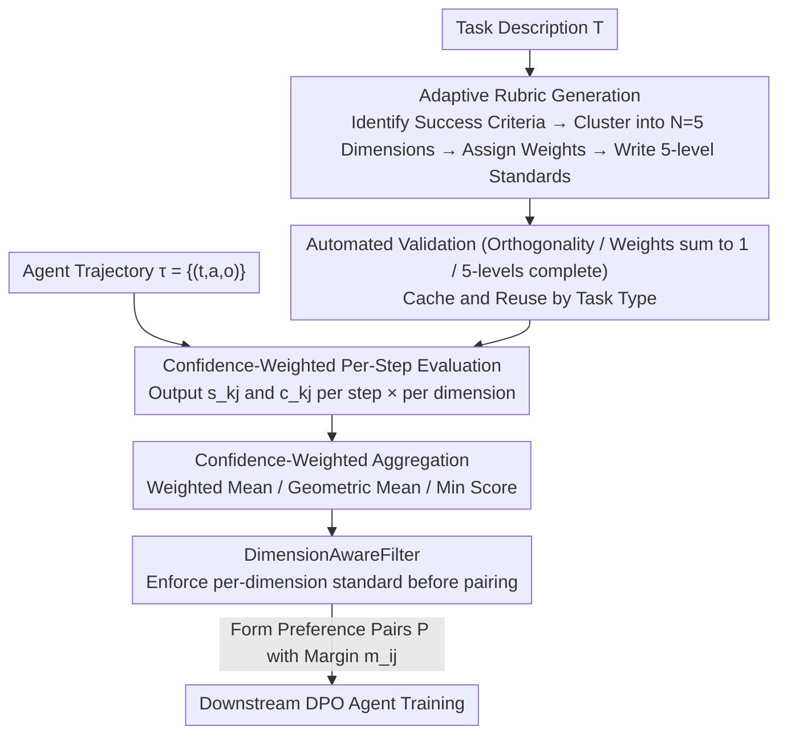

# AdaRubric: Task-Adaptive Rubrics for Reliable LLM Agent Evaluation and Reward Learning

**Conference**: ACL 2026  
**arXiv**: [2603.21362](https://arxiv.org/abs/2603.21362)  
**Code**: https://github.com/alphadl/AdaRubrics  
**Area**: LLM Agent / Evaluation / Reinforcement Learning  
**Keywords**: LLM-as-Judge, Agent Trajectory Evaluation, Adaptive Rubric, DPO Preference Pairs, Process Reward

## TL;DR
This paper identifies that "LLM-as-Judge + Fixed Rubrics" (Helpfulness/Safety/Fluency) are poorly matched for evaluating goal-oriented agent trajectories. It proposes AdaRubric—where an LLM automatically generates task-specific N-dimensional evaluation rubrics based on task descriptions, followed by confidence-weighted step-by-step evaluations to produce dense reward signals. A DimensionAwareFilter is designed for DPO data construction to prevent "dimension masking." Evaluated on WebArena/ToolBench/AgentBench, it achieves a Pearson $r=0.79$ and brings a $+6.8$ to $+8.5\%$ task success rate improvement through DPO training.

## Background & Motivation

**Background**: While LLM agent applications in web automation, API calling, code repair, and multimodal tasks have surged, reliable evaluation of "multi-step agent trajectories" remains a bottleneck. Currently, two paradigms are unreliable: reference-based metrics (ROUGE/BERTScore) focus only on surface lexical overlap and are blind to goal-oriented reasoning, whereas LLM-as-Judge (MT-Bench, G-Eval, Prometheus) uses a set of fixed dimensions (Helpfulness, Fluency, Safety) for all tasks.

**Limitations of Prior Work**: (1) Dimensions like Helpfulness/Fluency/Safety are designed for chat assistants and are largely irrelevant to "API Selection Accuracy" in ToolBench or "Patch Correctness" in SWE-bench. (2) Using incorrect dimensions introduces systematic bias—an agent might correctly call an API but produce compact machine-readable output, resulting in point deductions under the "Fluency" dimension. (3) A single scalar score masks catastrophic failures in specific dimensions (a trajectory could fail a critical dimension but still pass a total score threshold), leading DPO models to learn "stylized but functionally incorrect" strategies.

**Key Challenge**: Evaluation dimensions should be a function of the task rather than a fixed attribute of the evaluator. However, existing paradigms hardcode the rubric into the prompt, decoupling it from the specific task.

**Goal**: (1) Enable LLMs to **adaptively generate** task-specific evaluation rubrics based on task descriptions; (2) Produce **step-wise, dimension-wise, confidence-aware** dense rewards; (3) Transform these structured rewards into high-quality DPO preference pairs for agent training.

**Key Insight**: LLMs possess parametric knowledge regarding what constitutes success for a given task. Rather than asking the LLM to score directly using a generic prompt, it is more effective to prompt the LLM to **externalize** this knowledge into an explicit rubric first. This two-step decomposition is more reliable than one-step intuitive scoring.

**Core Idea**: An LLM call generates a task-specific rubric $\mathcal{R}(T)=\{(d_j, w_j, \Gamma_j)\}_{j=1}^N$ (dimensions + weights + 5-level verbalized standards) from the task description $T$. Trajectories are then evaluated step-wise with confidence weighting to aggregate a trajectory score, and finally, a DimensionAwareFilter is used to construct DPO pairs.

## Method

### Overall Architecture

AdaRubric decomposes "evaluating an agent trajectory" into three stages. The core idea is to have the LLM explicitly write "what success looks like for this task" as a structured rubric, use that rubric for step-wise scoring, and finally distill those scores into DPO preference pairs. Given a task description $T$, the first stage generates a rubric $\mathcal{R}(T)=\{(d_j, w_j, \Gamma_j)\}_{j=1}^N$ containing $N=5$ orthogonal dimensions, each with weights $w_j$ and 5-level scoring standards $\Gamma_j$, which is then cached by task type for reuse. The second stage outputs a score $s_{k,j}$ and confidence $c_{k,j}$ for each step and dimension of the trajectory $\tau=\{(t_k,a_k,o_k)\}_{k=1}^K$, aggregating these via confidence weighting. The third stage uses composable filters to sample high-quality trajectories and pair them into preference sets $\mathcal{P}=\{(\tau_i^+,\tau_j^-, m_{ij})\}$ for agent training. The entire pipeline is training-free during evaluation, running LLM inference to produce dense rewards for downstream DPO.

### Key Designs

**1. Adaptive Rubric Generation: Upgrading "What to Evaluate" from Hardcoded Prompts to Task-Specific Rubrics**

Fixed generic rubrics (Helpfulness/Fluency/Safety) designed for chat assistants cause systematic bias when applied to ToolBench API selection or SWE-bench patch correctness—where a robotically efficient but correct output might be penalized for lack of fluency. AdaRubric avoids direct scoring by first prompting the LLM to complete four steps of knowledge externalization: identifying task-critical success criteria, clustering them into $N=5$ orthogonal dimensions, assigning weights such that $\sum w_j=1$, and writing 5-level verbalized standards ($\gamma_3$="acceptable", $\gamma_1$="broken", $\gamma_5$="exemplary") with specific behavioral examples. The output is structured via JSON schema. Automated validation ensures dimensions have a cosine distance $>0.3$ to prevent overlap, weights sum to 1 (error $<1\%$), and all 5 levels are populated. This "think first, score later" approach converts implicit task understanding into explicit, auditable criteria and decomposes cognitive load. Caching these rubrics by task family reduces generation costs by over $95\%$, ensuring practical engineering feasibility.

**2. Confidence-Weighted Per-Step Evaluation: Step-wise × Dimension-wise Scoring with BLUE Aggregation**

LLM-as-Judge with fixed rubrics typically yields a single scalar, failing to localize failures or provide process-level signals for DPO. AdaRubric requires the evaluator to observe $(t_k, a_k, o_k, d_j, \Gamma_j)$ and output a score $s_{k,j}\in\{1,\ldots,5\}$ alongside a confidence $c_{k,j}\in[0,1]$. Low confidence indicates a step is irrelevant to a specific dimension (e.g., a pure reasoning step having low relevance to "Tool Accuracy"), effectively down-weighting noise. Three aggregation strategies are provided: the default Weighted Mean with recency-decay weights $w_k=e^{\lambda k/(K-1)}$ ($\lambda=0.5$), Geometric Mean to emphasize consistency, and Min Score for safety-critical scenarios. Theoretically, under the assumption $s_{k,j}=s^*_{k,j}+\varepsilon$ where $\varepsilon\sim\mathcal{N}(0,\sigma^2/c_{k,j})$, confidence weighting corresponds to the BLUE (Best Linear Unbiased Estimator) in the Gauss-Markov sense, providing a rigorous justification for this empirical approach.

**3. DimensionAwareFilter (Preference Pair Filtering to Avoid Dimension Masking)**

Scalar rewards naturally suffer from "dimension masking"—where high scores in some dimensions can hide a catastrophic failure in another, leading DPO to learn "stylized but functionally broken" policies. This study formalizes this vulnerability in Proposition 3.1 (masking-prevention): for any scalar threshold $\theta'$, there exists a trajectory $\tau^*$ such that a dimension score $\bar{s}_{j^*}=\epsilon$ (near zero) yet the weighted total score still passes $\geq\theta'$. The DimensionAwareFilter addresses this by requiring $\bar{s}_j\geq\theta_j\ \forall j$ (per-dimension standards). Trajectories passing this filter are paired by margin $m_{ij}=S(\tau_i)-S(\tau_j)\geq\delta_{\min}$ to form the preference set $\mathcal{P}$. By sacrificing a portion of the pass rate (retaining 61.5% vs. 72.3% for Absolute thresholds), it ensures higher quality preference pairs, resulting in superior downstream Success Rates (27.8% vs. 24.0%).

### Loss & Training

The evaluation pipeline is training-free and operates as a pure inference-time pipeline. GPT-4o is used for evaluation (Llama-70B/8B also work in ablation). DPO training utilizes Qwen2.5-7B-Instruct with LoRA (rank 16, $\alpha=32$). Default hyperparameters include $N=5$ dimensions, $\lambda=0.5$ recency decay, $\delta_{\min}=0.5$ margin, and DimAware threshold $\theta_j=2.5$. The evaluation overhead per trajectory is $K\times N$ LLM calls (approx. 40 calls for WebArena), which is roughly 3–5× the wall-clock time of GPT-4 Direct; however, rubric caching amortizes the generation cost.

## Key Experimental Results

### Main Results
Evaluation on 3 benchmarks: WebArena (WA, 812 web automation tasks), ToolBench (TB, 500 API calls), and AgentBench (AB, 365 Code/OS/DB tasks). 300 trajectory pairs were annotated by 3 experts, reaching an inter-annotator agreement $\kappa>0.82$.

| Evaluation Method | WA r | TB r | AB r | Avg r | Δ vs GPT-4 Direct |
|---------|------|------|------|-------|------------------|
| ROUGE-L | 0.31 | 0.26 | 0.29 | 0.29 | -0.35 |
| BERTScore | 0.43 | 0.39 | 0.41 | 0.41 | -0.23 |
| G-Eval | 0.54 | 0.49 | 0.52 | 0.52 | -0.12 |
| Prometheus | 0.61 | 0.57 | 0.59 | 0.59 | -0.05 |
| GPT-4 Direct | 0.64 | 0.60 | 0.62 | 0.62 | – |
| GPT-4 CoT-Decomposed (Eq. Compute) | - | - | - | 0.68* | +0.06 |
| AdaRubric-WM | 0.74 | 0.70 | 0.72 | 0.72 | +0.10 |
| AdaRubric-GM | 0.76 | 0.71 | 0.74 | 0.74 | +0.12 |
| **AdaRubric-DA** | **0.79** | **0.74** | **0.77** | **0.77** | **+0.15** |

DPO Training (Qwen2.5-7B backbone):

| Method | WA SR% | TB TCR% | AB SR% |
|------|--------|---------|--------|
| Base (zero-shot) | 12.3 | 18.4 | 15.2 |
| SFT (success only) | 16.7 | 23.1 | 20.1 |
| DPO + G-Eval | 20.1 | 27.6 | 24.5 |
| DPO + Prometheus | 21.0 | 29.3 | 26.4 |
| DPO + **AdaRubric-DA** | **27.8** | **37.8** | **34.1** |
| Δ vs Prometheus | **+6.8** | **+8.5** | **+7.7** |

### Ablation Study (WebArena)

| Configuration | Pearson r | DPO SR% |
|------|-----------|---------|
| Fixed (generic Help/Safety/Flu) | 0.51 | 19.1 |
| Fixed (domain template) | 0.65 | 22.4 |
| Adaptive, no confidence weighting | 0.72 | 24.0 |
| Adaptive, no DimAware filter | 0.75 | 25.2 |
| **AdaRubric-DA (full)** | **0.79** | **27.8** |

### Key Findings
- **Task-adaptive rubrics are the primary contributor**: Transitioning from fixed generic to domain templates adds $+0.14$, and from domain templates to adaptive adds $+0.07$. Structured generation outweighs raw model capability (GPT-4 to Llama-8B drops only 0.11, while fixed to adaptive gains 0.15), suggesting "knowledge externalization" is more critical than model scale.
- **DimensionAwareFilter is significantly effective**: It outperforms AbsoluteThreshold in both $r$ and SR% ($+0.04 / +3.8$), confirming that dimension masking is a serious issue in practical DPO training.
- **Strong Cross-Domain Transfer**: DPO pairs trained on WA achieved 31.2% on TB (surpassing in-domain Prometheus at 29.3%), indicating adaptive rubrics capture generalizable quality concepts.
- **Reliability Reaches Deployment Standards**: Krippendorff's $\alpha\geq 0.82$ (exceeding the standard deployment threshold of 0.80), whereas G-Eval (0.63) and Prometheus (0.70) fall short.
- **Small Backbones with AdaRubric Outperform Large Backbones with Static Evaluation**: Llama-8B + AdaRubric ($r=0.68$) > GPT-4 Direct ($r=0.64$), proving structured prompting compensates for model scale.

## Highlights & Insights
- **"Externalize standards before evaluation" is a powerful, transferable concept**: Forcing an evaluator to generate explicit criteria instead of intuitive scoring makes the process more accurate and auditable. This "knowledge externalization" can be applied to alignment, auto-evaluation, and reward modeling.
- **The Masking-Prevention theorem provides a hard constraint for reward design**: Prop 3.1 formally proves that scalar thresholds are prone to catastrophic failures, implying multi-dimensional reward systems **must** incorporate per-dimension filters.
- **BLUE interpretation for confidence aggregation is elegant**: Treating confidence as inverse noise variance and using Gauss-Markov to justify weighted aggregation provides a clean theoretical sanity check for an empirical practice.
- **Rubric caching is an engineering cornerstone**: Amortizing the $95\%$ cost by task-type caching makes the multi-step LLM pipeline practical for large-scale application.

## Limitations & Future Work
- The $K\times N$ evaluator calls incur significant latency (approx. 40 calls per trajectory on WebArena), making it unsuitable for real-time evaluation.
- Rubric quality depends on the LLM's parametric knowledge—specialized criteria like "CAPTCHA Handling" may be missed by automatic generation (expert rubrics scored 0.2~0.4 higher on Likert scales).
- Adversarial task descriptions can bias the rubric ($r$ drops by 0.04~0.06 under 30 perturbations), necessitating more robust generation methods.
- Rubrics are task-type level rather than instance-level; combining this with instance-specific evolving rubrics (like DR Tulu) could be a promising direction.

## Related Work & Insights
- **vs. G-Eval / Prometheus**: AdaRubric does not require fine-tuning and generates task-specific rubrics on the fly, offering higher reliability ($\alpha$ 0.83 vs 0.63/0.70) and zero-shot transferability.
- **vs. DR Tulu** (Shao et al. 2025): While DR Tulu evolves instance-specific rubrics online via search-grounding, AdaRubric operates more efficiently at the task level before training. The two approaches are complementary.
- **vs. RewardBench**: While RewardBench evaluates reward models, AdaRubric provides a method to generate the reward signals used to train policies, which can then be validated against RewardBench.

## Rating
- Novelty: ⭐⭐⭐⭐ "Task-adaptive rubric generation" represents a clean paradigm shift, and the Masking-Prevention theorem is a valuable formal contribution.
- Experimental Thoroughness: ⭐⭐⭐⭐ Extensive coverage across 3 benchmarks, 5 baselines, detailed ablations, cross-domain transfer, and PPO integration.
- Writing Quality: ⭐⭐⭐⭐ Clear motivation, concise formalization, and honest discussion of limitations.
- Value: ⭐⭐⭐⭐⭐ Decisively addresses hurdles in agent evaluation for RLHF/DPO; the practical caching design offers immediate utility for industrial agent training.

<!-- RELATED:START -->

## Related Papers

- [\[ACL 2025\] Agentic Reward Modeling: Integrating Human Preferences with Verifiable Correctness Signals for Reliable Reward Systems](../../ACL2025/llm_agent/agentic_reward_modeling_integrating_human_preferences_with_verifiable_correctnes.md)
- [\[ACL 2026\] BAPO: Boundary-Aware Policy Optimization for Reliable Agentic Search](bapo_boundary-aware_policy_optimization_for_reliable_agentic_search.md)
- [\[ACL 2026\] HAG: Hierarchical Demographic Tree-based Agent Generation for Topic-Adaptive Simulation](hag_hierarchical_demographic_tree-based_agent_generation_for_topic-adaptive_simu.md)
- [\[ACL 2026\] HeLa-Mem: Hebbian Learning and Associative Memory for LLM Agents](hela-mem_hebbian_learning_and_associative_memory_for_llm_agents.md)
- [\[ACL 2026\] YIELD: A Large-Scale Dataset and Evaluation Framework for Information Elicitation Agents](yield_a_large-scale_dataset_and_evaluation_framework_for_information_elicitation.md)

<!-- RELATED:END -->
