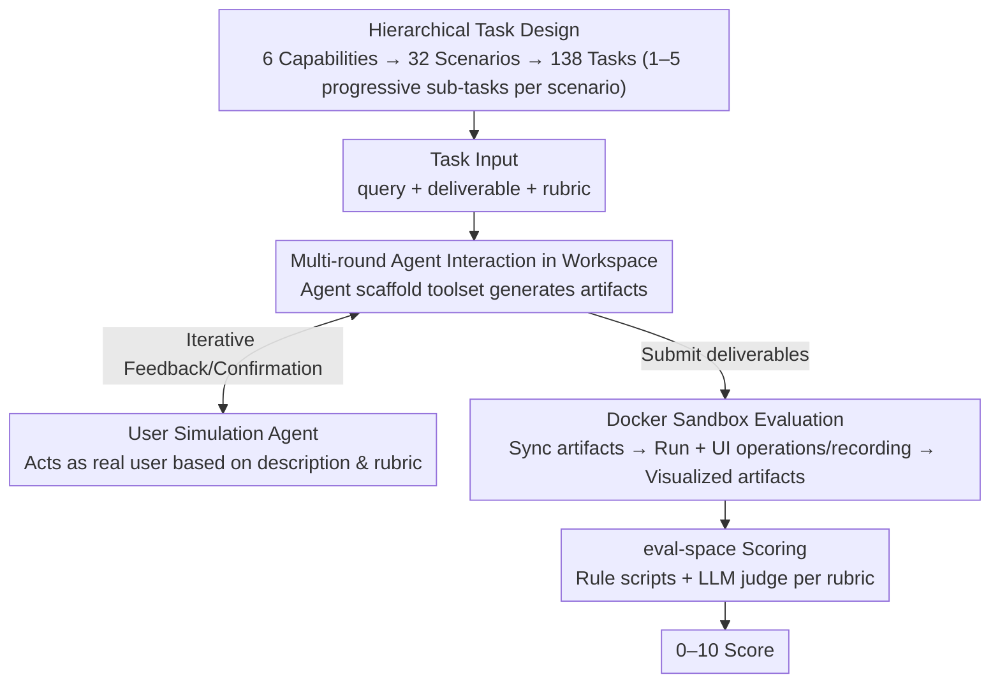

# AgencyBench: Benchmarking the Frontiers of Autonomous Agents in 1M-Token Real-World Contexts

**Conference**: ACL 2026  
**arXiv**: [2601.11044](https://arxiv.org/abs/2601.11044)  
**Code**: [GitHub](https://github.com/GAIR-NLP/AgencyBench)  
**Area**: LLM Agent / Benchmark  
**Keywords**: Autonomous Agents, Long-horizon Tasks, Real-world Benchmark, User Simulation, Docker Sandbox Evaluation

## TL;DR

AgencyBench is proposed as a comprehensive benchmark comprising 138 real-world tasks to evaluate 6 core agent capabilities. Each scenario averages 90 tool calls and 1 million tokens, achieving fully automated evaluation via user simulation agents and Docker sandboxes.

## Background & Motivation

**Background**: LLM-based autonomous agents are penetrating fields such as software development, scientific research, and daily applications, yet evaluation benchmarks significantly lag behind agent capability development.

**Limitations of Prior Work**: (1) Current benchmarks focus on single capabilities (e.g., tool-use or software engineering), failing to capture the multi-dimensional and long-horizon nature of real-world tasks; (2) Evaluation of real tasks relies on human-in-the-loop feedback, creating a bottleneck for automation; (3) Task complexity is insufficient, with most benchmarks requiring only dozens of tool calls.

**Key Challenge**: The capabilities of frontier agents have far exceeded the testing scope of existing benchmarks, necessitating more challenging evaluations.

**Goal**: To construct a real-world agent benchmark featuring high complexity, multi-dimensionality, and fully automated evaluation.

**Key Insight**: A hierarchical capability-scenario-task system is constructed by collecting tasks from real working scenarios via 20 human experts (AI researchers and developers).

**Core Idea**: User simulation agents replace human feedback and Docker sandboxes execute visual evaluations, enabling fully automated rollout collection and scoring for long-horizon complex tasks.

## Method

### Overall Architecture

AgencyBench is an agent benchmark for long-horizon real-world tasks, organized by a hierarchical "capability-scenario-task" system: 6 core capabilities (Game Development, Frontend, Backend, Code Generation, Research, MCP Tools) including 32 real scenarios, further divided into 138 specific tasks. Each scenario consists of 1–5 sequential tasks with increasing difficulty, where preceding results influence subsequent ones. Inputs consist of multi-round interactions in a scenario, utilizing user simulation agents instead of human feedback and maintaining isolation via workspace–sandbox–evalspace separation. Artifacts are moved to a Docker sandbox for execution and screen recording, while outputs are scored 0–10 based on rubrics combining rule-based scripts and LLM judges. The pipeline is illustrated below:

### Key Designs

**1. Hierarchical Task Design: Evoking Long-horizon Planning via Incremental Complexity**

Real-world work is rarely completed in a single step; thus, isolated tasks cannot evaluate sustained operational capability. AgencyBench organizes evaluation into three tiers: 6 core capabilities under which 32 real scenarios and 138 sequential tasks reside. Results from preceding tasks serve as context for subsequent ones—for instance, a "Gomoku" scenario progresses from a basic board to adding AI opponents, undo features, and theme switching. This chain-linked progression forces agents to maintain long-term context and multi-step planning, which is the source of the average 90 tool calls and 1 million tokens.

**2. User Simulation Agent: Removing the Human-in-the-loop Bottleneck via User Role-playing**

Evaluating real tasks often requires human feedback over multiple rounds, but with rollouts lasting hours, human oversight is unscalable. AgencyBench enables agents to interact within an isolated workspace using an agent scaffold (incorporating file operations, shell, web search, etc.). Simultaneously, a simulation agent acts as a real user: when the agent submits intermediate results, the simulation agent provides modification suggestions or confirmations based on the task description and rubric, automatically closing the iterative loop. This allows for fully automated long-horizon interactions, though reliability is bounded by the simulation agent's quality.

**3. Docker Sandbox Evaluation: Executing Artifacts for Visual Scoring**

The quality of artifacts such as games or webpages cannot be judged by text alone; they must be executed. Ours synchronizes agent deliverables into Docker containers to simulate human-computer interaction—UI rendering, mouse clicks, and screen recording—generating visualized artifacts. These artifacts and the original products are transferred to an independent eval-space, where rule-based scripts and LLM judges assign scores of 0–10 according to the rubric. The separation of workspace (generation), sandbox (execution), and eval-space (scoring) ensures isolation and reproducibility while allowing the evaluator to judge functionality and visual effects based on actual program execution.

## Key Experimental Results

### Main Results

| Model Type | Average Score | Highest | Lowest |
|---------|--------|------|------|
| Closed-source | 48.4% | GPT-5.2 (56.5%) | Grok-4.1-Fast (44.3%) |
| Open-source | 32.1% | GLM-4.6 (38.6%) | Qwen-3-235B (27.0%) |

### Key Behavioral Differences

| Model | Characteristics | Description |
|------|------|------|
| GPT-5.2 | Strong feedback self-correction | Best at utilizing user feedback for improvement |
| Grok-4.1-Fast | High token efficiency | Completes tasks using fewer tokens |
| Claude-4.5-Opus | Shell tool preference | Higher usage of command-line operations |
| Gemini-3-Pro | File management preference | Higher usage of file and memory management tools |

### Key Findings
- Closed-source models significantly outperform open-source models (48.4% vs 32.1%), with a wider gap than on short-task benchmarks.
- A "home field advantage" is evident—models perform best within their native frameworks (e.g., Claude with Claude-Agent-SDK).
- The strongest current models only achieve 56.5%, indicating that long-horizon real-world tasks remain a massive challenge.
- Significant differences in tool-use preferences exist across models, suggesting the impact of architecture and training data.

## Highlights & Insights
- Task complexity far exceeds existing benchmarks—an average of 90 tool calls and 1 million tokens represents a qualitative leap.
- The combination of user simulation agents and Docker sandboxes solves the core challenge of automated evaluation for long-horizon tasks.
- The "home field advantage" finding provides critical insights for agent framework design—universal frameworks may be less effective than specialized ones.

## Limitations & Future Work
- 138 tasks may still be insufficient to cover the full spectrum of real-world scenarios.
- The quality of the user simulation agent serves as the upper bound for evaluation reliability.
- Complex environment configurations in the Docker sandbox may limit community adoption.
- Future work can expand into more domains (e.g., data analysis, design, writing).

## Related Work & Insights
- **vs SWE-bench**: SWE-bench focuses on the single capability of software engineering, whereas AgencyBench covers 6 capabilities.
- **vs GAIA**: GAIA averages only 10K tokens, while AgencyBench is 100x more complex.
- **vs ToolLLM**: ToolLLM focuses on the correctness of tool calls, while AgencyBench focuses on end-to-end task completion.

## Rating
- Novelty: ⭐⭐⭐⭐⭐ Significantly surpasses existing benchmarks in scale and realism.
- Experimental Thoroughness: ⭐⭐⭐⭐ Includes multi-model comparisons, behavioral analysis, and framework comparisons.
- Writing Quality: ⭐⭐⭐⭐ Clear structure with rich examples.
- Value: ⭐⭐⭐⭐⭐ Sets a new standard for next-generation agent evaluation.

<!-- RELATED:START -->

## Related Papers

- [\[ACL 2026\] MCP-Flow: Facilitating LLM Agents to Master Real-World, Diverse and Scaling MCP Tools](mcp-flow_facilitating_llm_agents_to_master_real-world_diverse_and_scaling_mcp_to.md)
- [\[AAAI 2026\] D-GARA: A Dynamic Benchmarking Framework for GUI Agent Robustness in Real-World Anomalies](../../AAAI2026/llm_agent/d-gara_a_dynamic_benchmarking_framework_for_gui_agent_robust.md)
- [\[ACL 2026\] Shopping Companion: A Memory-Augmented LLM Agent for Real-World E-Commerce Tasks](shopping_companion_a_memory-augmented_llm_agent_for_real-world_e-commerce_tasks.md)
- [\[ICLR 2026\] OpenAgentSafety: A Comprehensive Framework for Evaluating Real-World AI Agent Safety](../../ICLR2026/llm_agent/openagentsafety_a_comprehensive_framework_for_evaluating_real-world_ai_agent_saf.md)
- [\[CVPR 2026\] WebChain: A Large-Scale Human-Annotated Dataset of Real-World Web Interaction Traces](../../CVPR2026/llm_agent/webchain_a_large-scale_human-annotated_dataset_of_real-world_web_interaction_tra.md)

<!-- RELATED:END -->
