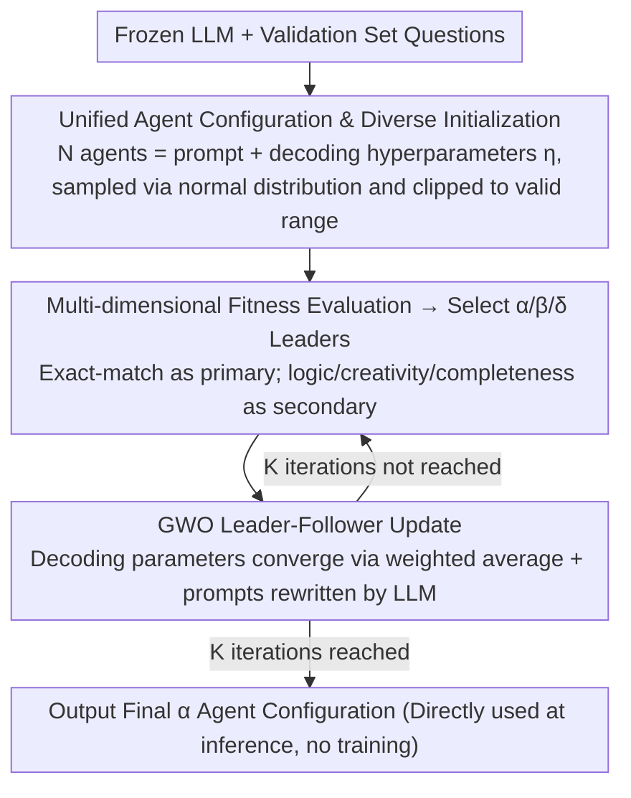

# Agent-GWO: Collaborative Agents for Dynamic Prompt Optimization in Large Language Models

**Conference**: ACL 2026  
**arXiv**: [2604.18612](https://arxiv.org/abs/2604.18612)  
**Code**: Coming soon  
**Area**: LLM Agent  
**Keywords**: Prompt Optimization, Grey Wolf Optimizer, Multi-Agent, Reasoning Enhancement, Decoding Hyperparameters

## TL;DR

This paper proposes Agent-GWO, which introduces the leader-follower mechanism of the Grey Wolf Optimizer into a multi-agent framework to jointly optimize prompt templates and decoding hyperparameters (temperature, top-p, etc.). It consistently out-performs existing prompt optimization methods across 11 mathematical and hybrid reasoning benchmarks.

## Background & Motivation

**Background**: Prompting strategies such as Chain-of-Thought (CoT) have significantly improved LLM performance in complex reasoning tasks. However, high-quality reasoning still heavily relies on manually designed static prompts. Methods like ToV, GoT, and AoT improve reasoning trajectories under fixed prompts, but the issue of prompt fragility remains unresolved.

**Limitations of Prior Work**: (1) Reasoning performance is highly sensitive to prompt wording, example order, and context perturbations; slight modifications can lead to large performance fluctuations. (2) Existing automatic prompt optimization methods typically employ single-agent local search and cannot simultaneously optimize prompts and decoding hyperparameters. (3) The joint space of prompts and decoding configurations (temperature, top-p, repetition penalty, etc.) is vast, making manual trial-and-error extremely inefficient.

**Key Challenge**: Reasoning quality is simultaneously controlled by both prompt templates and decoding configurations. However, current methods either only optimize prompts (ignoring decoding configurations) or rely on fixed prompts (only tuning decoding parameters), lacking a unified optimization framework.

**Goal**: Automatically discover more stable and task-specific prompt-decoding configuration pairs at inference-time without additional training.

**Key Insight**: Define each agent as a combination of a prompt template and decoding hyperparameters, transforming the prompt optimization problem into a swarm intelligence optimization problem. The Grey Wolf Optimizer (GWO) naturally possesses a leader-follower hierarchy, making it suitable for guiding collaborative swarm searches.

**Core Idea**: Use the $\alpha / \beta / \delta$ leader mechanism of GWO to iteratively optimize within a population composed of multiple agents (each agent = prompt + decoding parameters). The three best-performing agents guide the updates of the others, eventually converging to a robust optimal reasoning configuration.

## Method

### Overall Architecture

Agent-GWO reformulates "finding a good prompt" as a "swarm intelligence search in the joint space of prompts and decoding parameters." It maintains a population of $N$ agents that share the same frozen LLM but carry individual prompt templates and sets of decoding hyperparameters (temperature, top-p, frequency penalty, presence penalty, maximum length). In each iteration, all agents solve validation set problems in parallel and are scored. The top three performers are selected as $\alpha / \beta / \delta$ leaders. The remaining agents then adjust their decoding parameters toward these leaders and have their prompts lightly rewritten by the LLM referencing the leaders' prompts. After $K$ iterations, the configuration of the final $\alpha$ agent is taken as the optimal solution for inference, requiring no model weight training.

### Key Designs

**1. Unified Agent Configuration & Diverse Initialization: Evolution of Prompt and Decoding Parameters**

Existing methods tune either prompts or decoding parameters because they reside in heterogeneous spaces. Agent-GWO addresses this by defining each agent as $Agent_j = (\eta_j, prompt_j)$, where the decoding part $\eta_j = \{T_j, p_j, F_j, E_j, M_j\}$ includes temperature, top-p, frequency penalty, presence penalty, and max length. This encapsulates discrete prompts and continuous decoding configurations into a single inheritable and evaluable individual.

To ensure sufficient exploration, the initial population is sampled from a normal distribution and clipped to legal ranges (e.g., $T_j \sim \mathcal{N}(\mu_t, \sigma_t^2)$ clipped to $[a_t, b_t]$). This constrained random initialization ensures population diversity while avoiding illegal or extreme configurations.

**2. Multi-dimensional Fitness Evaluation: Refining Reasoning Quality Beyond Accuracy**

In each iteration, the population is evaluated to select $\alpha / \beta / \delta$ leaders. The stability of leader selection dictates the convergence direction. Agent-GWO uses exact-match accuracy on the validation set as the primary metric. To resolve ties on small batches, it introduces a secondary LLM-judge ranking based on logical consistency $s_{logic}$, creativity $s_{creativity}$, and completeness $s_{complete}$, with weights $(0.5, 0.2, 0.3)$. This auxiliary scoring promotes agents that are "correct and more robust," stabilizing the selection of $\alpha / \beta / \delta$.

**3. GWO Leader-Follower Update: Balancing Exploration and Exploitation via Hierarchy**

Prompt optimization often suffers from local optima. Agent-GWO utilizes the hierarchical structure of GWO to mitigate this: non-elite agents update their decoding parameters via a weighted average toward the $\alpha / \beta / \delta$ leaders: $\eta_j^{(k)} = w_\alpha X_\alpha + w_\beta X_\beta + w_\delta X_\delta$, where $w_\alpha > w_\beta > w_\delta$. This ensures the best individual has the most influence while retaining guidance from sub-optimal solutions.

For discrete prompts, a `PromptAdaptation` function is used: the LLM follows fixed system instructions to perform lightweight editing (step reordering, semantic rewriting, format fine-tuning) on the current prompt by referencing the three leaders' prompts. These dual update paths work in parallel, maintaining both search direction and diversity.

## Key Experimental Results

### Main Results

| Backbone | Method | GSM8K | MATH | SVAMP | MultiArith | 11-Task Avg |
|----------|------|-------|------|-------|------------|-----------|
| GPT-4o-mini | CoT | 85.4% | 74.8% | 84.7% | 89.5% | 74.6% |
| GPT-4o-mini | AoT | 95.0% | 83.6% | 91.5% | 92.6% | 83.3% |
| GPT-4o-mini | **Ours** | **95.9%** | **80.2%** | **92.3%** | **95.3%** | **84.0%** |
| Qwen-7B | CoT | 77.5% | 65.8% | 82.7% | 84.6% | 62.2% |
| Qwen-7B | **Ours** | **89.1%** | **74.1%** | **90.1%** | **93.3%** | **69.9%** |
| Gemma-12B | CoT | 83.5% | 72.8% | 79.3% | 82.7% | 74.0% |
| Gemma-12B | **Ours** | **92.8%** | **82.1%** | **90.9%** | **95.9%** | **82.4%** |

### Ablation Study

| Configuration | Avg Accuracy | Description |
|------|-----------|------|
| Agent-GWO (n=5, K=10) | 84.0% | Full Model |
| Optimize prompt only | Decrease | Decoding parameters contribute |
| Optimize decoding only | Decrease | Prompt optimization contributes |
| Random search instead of GWO | Decrease | GWO guidance superior to random |
| n=3 agents | Slight Decrease | Population size affects search thoroughness |

### Key Findings

- Agent-GWO achieves the highest average accuracy across all three backbones and is optimal or sub-optimal in most individual tasks.
- Compared to CoT, the improvement is more significant on smaller models (Qwen-7B, +7.7pp), suggesting optimization helps weaker models more.
- Jointly optimizing prompts and decoding parameters outperforms optimizing either individually, validating the necessity of the unified framework.
- The default configuration of $n=5, K=10$ provides a good balance between computational budget and performance.

## Highlights & Insights

- **Prompt Optimization as Swarm Intelligence**: Treating prompt templates and decoding hyperparameters as a unified agent configuration allows for systematic search in a joint space, proven more efficient than manual trial-and-error.
- **Natural Mapping of GWO Hierarchy**: The $\alpha / \beta / \delta$ leaders naturally map to the "Top 3" configurations; followers converge toward leaders via weighted updates while maintaining diversity.
- **Inference-time Adaptation**: The process is completed on frozen models; optimized configurations can be directly applied to inference, making it highly practical.

## Limitations & Future Work

- The optimization process requires multiple evaluations of all agents on the validation set, with computational costs proportional to $n \times K$.
- LLM-driven prompt editing quality depends on the design of system instructions, and the editing space is limited to "lightweight edits."
- Validation is limited to reasoning tasks (math/logic); defining fitness for open-ended generation tasks is more difficult.
- The default configuration may not be optimal for all scenarios; adaptive adjustment strategies for $n$ and $K$ remain to be explored.

## Related Work & Insights

- **vs AFlow**: AFlow performs automatic workflow optimization, but its search space is limited to workflow structures. Agent-GWO searches both prompts and decoding parameters.
- **vs CoT-SC**: Self-consistency improves robustness via multiple sampling and voting but does not optimize the prompt itself. Agent-GWO optimizes the generative configuration directly.
- **vs AoT (Atom-of-Thought)**: AoT is a strong competitor that improves performance through atomic reasoning. Agent-GWO slightly outperforms it on most tasks, and the two methods are orthogonal and can be combined.

## Rating

- Novelty: ⭐⭐⭐⭐ Introducing GWO to prompt optimization is a novel cross-domain application, though meta-heuristic combinations with LLMs exist.
- Experimental Thoroughness: ⭐⭐⭐⭐⭐ 11 benchmarks, 3 backbones, and 7 baselines make the experiments very comprehensive.
- Writing Quality: ⭐⭐⭐⭐ The framework description is clear, though theoretical analysis could be deeper.
- Value: ⭐⭐⭐⭐ Provides a practical inference-time optimization solution, especially valuable in resource-constrained scenarios.

<!-- RELATED:START -->

## Related Papers

- [\[ACL 2026\] ImplicitMemBench: Measuring Unconscious Behavioral Adaptation in Large Language Models](implicitmembench_measuring_unconscious_behavioral_adaptation_in_large_language_m.md)
- [\[ICLR 2026\] ToolWeaver: Weaving Collaborative Semantics for Scalable Tool Use in Large Language Models](../../ICLR2026/llm_agent/toolweaver_weaving_collaborative_semantics_for_scalable_tool_use_in_large_langua.md)
- [\[CVPR 2026\] ModularAgent: A Task-Aware Modular Framework for Joint Optimization of Multimodal Large Language Models and World Models](../../CVPR2026/llm_agent/modularagent_a_task-aware_modular_framework_for_joint_optimization_of_multimodal.md)
- [\[ACL 2026\] Feedback-Driven Tool-Use Improvements in Large Language Models via Automated Build Environments](feedback-driven_tool-use_improvements_in_large_language_models_via_automated_bui.md)
- [\[ACL 2026\] Dynamic Generation of Multi-LLM Agents Communication Topologies with Graph Diffusion Models](dynamic_generation_of_multi-llm_agents_communication_topologies_with_graph_diffu.md)

<!-- RELATED:END -->
