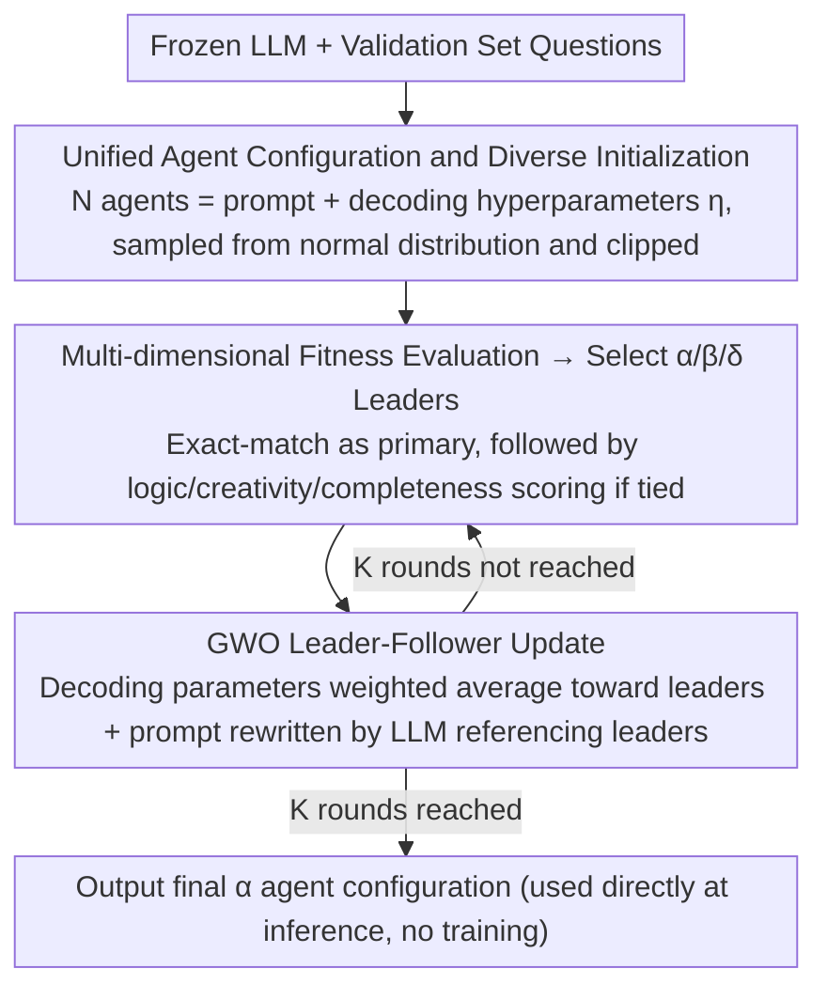

# Agent-GWO: Collaborative Agents for Dynamic Prompt Optimization in Large Language Models

**Conference**: ACL 2026  
**arXiv**: [2604.18612](https://arxiv.org/abs/2604.18612)  
**Code**: Upcoming  
**Area**: LLM Agent  
**Keywords**: prompt optimization, Grey Wolf Optimizer, multi-agent, reasoning enhancement, decoding hyperparameters

## TL;DR

This paper proposes Agent-GWO, which introduces the leader-follower mechanism of the Grey Wolf Optimizer into a multi-agent framework to jointly optimize prompt templates and decoding hyperparameters (temperature, top-p, etc.), consistently outperforming existing prompt optimization methods on 11 mathematical and mixed reasoning benchmarks.

## Background & Motivation

**Background**: Prompting strategies such as Chain-of-Thought (CoT) have significantly improved LLM performance on complex reasoning tasks, but high-quality reasoning still relies heavily on manually designed static prompts. Methods like ToT, GoT, and AoT improve reasoning trajectories under fixed prompts, but the fragility of the prompts themselves remains unresolved.

**Limitations of Prior Work**: (1) Reasoning performance is highly sensitive to prompt wording, example order, and context perturbations, where minor changes can lead to large performance fluctuations; (2) Existing automated prompt optimization methods typically employ single-agent local search and cannot simultaneously optimize prompts and decoding hyperparameters; (3) The joint space of prompts and decoding configurations (temperature, top-p, repetition penalty, etc.) is vast, making manual trial-and-error extremely inefficient.

**Key Challenge**: Reasoning quality is simultaneously controlled by prompt templates and decoding configurations. However, existing methods either only optimize prompts (ignoring decoding configurations) or rely on fixed prompts (only tuning decoding parameters), lacking a unified optimization framework.

**Goal**: To automatically discover more stable and task-adapted prompt-decoding configuration pairs at inference-time without additional training.

**Key Insight**: Define each agent as a combination of a prompt template and decoding hyperparameters, transforming the prompt optimization problem into a swarm intelligence optimization problem. The Grey Wolf Optimizer (GWO) naturally possesses a leader-follower hierarchical structure, making it suitable for guiding collaborative population searches.

**Core Idea**: Utilize the α/β/δ leader mechanism of GWO to iteratively optimize within a population of multiple agents (each agent = prompt + decoding parameters). The three best-performing agents guide the updates of the remaining agents, eventually converging to a robust optimal reasoning configuration.

## Method

### Overall Architecture

Agent-GWO reformulates "finding a good prompt" as "performing swarm intelligence search in the joint space of prompts and decoding parameters." It maintains a population of N agents, each sharing the same frozen LLM but carrying an independent prompt template and a set of decoding hyperparameters (temperature, top-p, frequency penalty, presence penalty, max length). In each iteration, all agents solve validation set problems in parallel and are scored. The three best performers are selected as α/β/δ leaders. Subsequent agents move their decoding parameters toward these three leaders and submit their prompts to the LLM for light rewriting based on the leaders. After K iterations, the final α agent configuration is taken as the optimal solution for inference. This entire process requires no model weight training.

### Key Designs

**1. Unified Agent Configuration and Diverse Initialization: Merging prompt and decoding parameters into an evolvable individual**

Existing methods either tune prompts or decoding parameters separately because they belong to heterogeneous spaces. Agent-GWO addresses this by defining each agent as $Agent_j = (\eta_j, prompt_j)$, where the decoding part $\eta_j = \{T_j, p_j, F_j, E_j, M_j\}$ corresponds to temperature, top-p, frequency penalty, presence penalty, and maximum length. Thus, prompts (discrete) and decoding configurations (continuous) are encapsulated into the same inheritable and evaluable individual, allowing swarm optimization to act on both simultaneously.

To ensure sufficient exploration, the initial population is sampled from a normal distribution and clipped to a legal range; e.g., temperature $T_j \sim \mathcal{N}(\mu_t, \sigma_t^2)$ then clipped to $[a_t, b_t]$. This constrained random initialization ensures population diversity while avoiding illegal or extreme configurations.

**2. Multi-dimensional Fitness Evaluation: Assessing reasoning quality during accuracy ties**

In each iteration, the entire population must be evaluated to select α/β/δ leaders. The stability of leader selection dictates the direction of the population. Agent-GWO uses validation set exact-match accuracy as the primary evaluation. However, accuracy often ties on small batches. To mitigate this, a secondary LLM-judge ranking is introduced for ties, scoring across logic consistency $s_{logic}$, creativity $s_{creativity}$, and completeness $s_{complete}$, with weights $(0.5, 0.2, 0.3)$ calibrated on 200 human-annotated samples. This auxiliary scoring promotes agents with "correct but more robust reasoning," stabilizing α/β/δ selection.

**3. GWO Leader-Follower Update: Balancing exploration and exploitation with hierarchical guidance**

After selecting leaders, the remaining agents update accordingly. To prevent prompt optimization from getting stuck in local optima, Agent-GWO utilizes the hierarchical structure of GWO. Decoding parameters of non-elite agents converge toward α/β/δ via weighted averaging: $\eta_j^{(k)} = w_\alpha X_\alpha + w_\beta X_\beta + w_\delta X_\delta$, with weights $w_\alpha > w_\beta > w_\delta$. This ensures the best individual has the most influence while retaining guidance from sub-optimal solutions.

For discrete prompts, a PromptAdaptation function is used: the LLM is instructed to reference the prompts of the three leaders to perform light edits on the current prompt, such as step reordering, semantic rewriting, or format adjustment. Continuous parameters follow weighted averaging while discrete prompts follow LLM editing; both paths proceed in parallel under the same hierarchical framework, balancing search directionality and diversity.

## Key Experimental Results

### Main Results

| Backbone | Method | GSM8K | MATH | SVAMP | MultiArith | 11-Task Avg |
|----------|------|-------|------|-------|------------|-----------|
| GPT-4o-mini | CoT | 85.4% | 74.8% | 84.7% | 89.5% | 74.6% |
| GPT-4o-mini | AoT | 95.0% | 83.6% | 91.5% | 92.6% | 83.3% |
| GPT-4o-mini | **Ours** | **95.9%** | **80.2%** | **92.3%** | **95.3%** | **84.0%** |
| Qwen-7B | CoT | 77.5% | 65.8% | 82.7% | 84.6% | 62.2% |
| Qwen-7B | **Ours** | **89.1%** | **74.1%** | **90.1%** | **93.3%** | **69.9%** |
| Gemma-12B | CoT | 83.5% | 72.8% | 79.3% | 82.7% | 74.0% |
| Gemma-12B | **Ours** | **92.8%** | **82.1%** | **90.9%** | **95.9%** | **82.4%** |

### Ablation Study

| Configuration | Avg Accuracy | Description |
|------|-----------|------|
| Agent-GWO (n=5, K=10) | 84.0% | Full Model |
| Only optimize prompt (fixed decoding) | Decrease | Decoding optimization contributes |
| Only optimize decoding (fixed prompt) | Decrease | Prompt optimization contributes |
| Random search instead of GWO | Decrease | GWO guidance is superior to random |
| n=3 agents | Slight drop | Population size affects search thoroughness |

### Key Findings

- Agent-GWO achieved the highest average accuracy across all three backbones and was optimal or sub-optimal in most individual tasks.
- Compared to CoT, the Gain was more significant on the small model (Qwen-7B, +7.7pp), indicating optimization helps weaker models more.
- Jointly optimizing prompt + decoding parameters outperformed optimizing either individually, validating the necessity of the unified framework.
- The default configuration of n=5, K=10 balances computational budget and performance well.

## Highlights & Insights

- **Viewing prompt optimization as swarm intelligence search**: Systematically searching the joint space of prompt templates and decoding hyperparameters via population optimization is more efficient than manual trial-and-error or single-agent search.
- **Natural mapping of GWO hierarchy**: The α/β/δ leaders naturally correspond to the "optimal/sub-optimal/third-best" configurations. Followers converge toward leaders via weighted updates while maintaining diversity, resulting in an elegant design.
- **Inference-time adaptation without training**: The entire process is completed on a frozen model, and the optimized configuration can be used directly for inference, making it highly practical.

## Limitations & Future Work

- The optimization process requires multiple evaluations of all agents on the validation set, with computational costs proportional to $n \times K$.
- The quality of LLM-driven prompt editing depends on the design of the system instructions, and the search space is limited by "lightweight editing."
- Validation was only conducted on reasoning tasks (math/logic); defining fitness for open-ended generation tasks is more difficult.
- The default configuration of 5 agents and 10 iterations may not be optimal for all scenarios; adaptive adjustment strategies remain to be explored.

## Related Work & Insights

- **vs AFlow**: AFlow also performs automated workflow optimization, but its search space is limited to workflow structures. Agent-GWO searches both prompts and decoding parameters, covering a broader space.
- **vs CoT-SC**: Self-consistency improves robustness through multiple sampling and voting but does not optimize the prompt itself. Agent-GWO directly optimizes the generation configuration to fundamentally improve reasoning quality.
- **vs AoT (Atom-of-Thought)**: AoT is the strongest competitor, improving performance through atomized reasoning. Agent-GWO slightly outperforms it on most tasks, and the two are orthogonal and can be combined.

## Rating

- Novelty: ⭐⭐⭐⭐ Introducing GWO to prompt optimization is a novel cross-domain combination, though meta-heuristic optimization with LLMs has precedents.
- Experimental Thoroughness: ⭐⭐⭐⭐⭐ Extremely comprehensive experiments with 11 benchmarks, 3 backbones, and 7 baselines.
- Writing Quality: ⭐⭐⭐⭐ The framework description is clear, though theoretical analysis could be deeper.
- Value: ⭐⭐⭐⭐ Provides a practical inference-time optimization solution, especially valuable in resource-constrained scenarios.

<!-- RELATED:START -->

## Related Papers

- [\[ICLR 2026\] ToolWeaver: Weaving Collaborative Semantics for Scalable Tool Use in Large Language Models](../../ICLR2026/llm_agent/toolweaver_weaving_collaborative_semantics_for_scalable_tool_use_in_large_langua.md)
- [\[ACL 2026\] ImplicitMemBench: Measuring Unconscious Behavioral Adaptation in Large Language Models](implicitmembench_measuring_unconscious_behavioral_adaptation_in_large_language_m.md)
- [\[ACL 2026\] Feedback-Driven Tool-Use Improvements in Large Language Models via Automated Build Environments](feedback-driven_tool-use_improvements_in_large_language_models_via_automated_bui.md)
- [\[CVPR 2026\] ModularAgent: A Task-Aware Modular Framework for Joint Optimization of Multimodal Large Language Models and World Models](../../CVPR2026/llm_agent/modularagent_a_task-aware_modular_framework_for_joint_optimization_of_multimodal.md)
- [\[ACL 2026\] Lightweight LLM Agent Memory with Small Language Models](lightweight_llm_agent_memory_with_small_language_models.md)

<!-- RELATED:END -->
