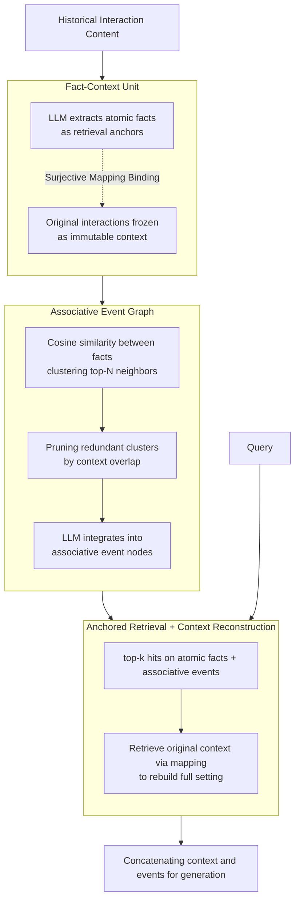

# AnchorMem: Anchored Facts with Associative Contexts for Building Memory in Large Language Models

**Conference**: ACL 2026 Findings  
**arXiv**: [2604.17377](https://arxiv.org/abs/2604.17377)  
**Code**: [https://github.com/RayNeo-AI-2025/AnchorMem](https://github.com/RayNeo-AI-2025/AnchorMem)  
**Area**: LLM Evaluation  
**Keywords**: LLM Memory, Atomic Facts, Associative Event Graph, Retrieval-Augmented Generation, Long-term Conversation  

## TL;DR

The AnchorMem memory framework is proposed, inspired by the Proust phenomenon. It decouples the retrieval unit (atomic facts) from the generation context (original interactions) and connects fragmented memories via an associative event graph. It significantly outperforms existing systems like A-Mem and Mem0 on the LoCoMo benchmark.

## Background & Motivation

**Background**: LLMs require memory systems to utilize historical experience during long-term multi-turn interactions. Existing methods are primarily categorized into two types: generative memory systems (A-Mem, Mem0) that integrate new information through frequent rewriting, and graph indexing methods (GraphRAG, HippoRAG 2) that structure knowledge through entity relationship graphs.

**Limitations of Prior Work**: Generative memory systems suffer from "contextual blurring"—frequent rewriting causes subtle nuances of original interactions to be diluted or lost. Graph indexing methods face "spurious connections"—high-frequency but semantically generalized entities (e.g., "oil") create misleading bridges, causing retrieval paths to erroneously confuse unrelated events.

**Key Challenge**: A fundamental tension exists between fine-grained retrieval (requiring precise retrieval units) and context integrity (requiring the preservation of original interaction context). Existing methods either sacrifice contextual precision for retrieval efficiency or introduce noisy connections due to over-structuring.

**Goal**: To design a memory framework capable of achieving both precise atomic-level retrieval and maintaining the integrity of the original context.

**Key Insight**: Inspired by the "Proust phenomenon" in cognitive science (where a specific sensory cue triggers full episodic memory), the framework explicitly decouples retrieval anchors from the generation context.

**Core Idea**: Extract atomic facts to serve as retrieval anchors while preserving original interactions as immutable contexts, establishing logical cross-memory connections through an associative event graph.

## Method

### Overall Architecture

The core of AnchorMem is the complete decoupling of "what is used for retrieval" and "what is used for generation." Retrieval units consist of refined atomic facts, while generation contexts retain untouched original interactions. The memory is organized as a heterogeneous graph $\mathcal{G}=(\mathcal{V}, \mathcal{E})$, where the three types of nodes are interaction contexts $\mathcal{V}_C$, atomic facts $\mathcal{V}_F$, and associative events $\mathcal{V}_E$. Edges are categorized into surjective mapping edges from "fact $\rightarrow$ context" and semantic association edges between "fact $\leftrightarrow$ fact." A complete memory process involves three steps: first, decomposing each interaction into atomic facts and anchoring them back to the original context; second, clustering semantically related facts into associative events to weave the graph; and finally, using facts/events for precise localization during querying while reconstructing the generation using the original context.

### Key Designs

**1. Fact-Context Unit: Retrieval via Atomic Facts, Context via Immutable Raw Text**

A common failure in generative memory systems is iterative rewriting, which dilutes subtle context. AnchorMem addresses this by using an LLM to extract a set of atomic facts $\mathcal{F}_i = \{f_{i,1}, ..., f_{i,n}\}$ for each interaction $C_i$. Each fact is a concise, self-contained independent statement dedicated to the "retrieval" role; meanwhile, the original interaction content is frozen and never rewritten or compressed.

The two are bound via a surjective mapping $\mathcal{M}(f) = C_i$, allowing any hit fact to immediately trace back to its full original text. Thus, retrieval utilizes high-precision atomic anchors, while generation receives zero-loss original context, structurally avoiding the fundamental pain point of "contextual blurring caused by rewriting."

**2. Associative Event Graph: Events as Cross-Memory Bridges Instead of Entities**

Traditional graph indices rely on entity connections, but high-frequency, semantically vague entities like "oil" or "water" create misleading bridges that mix unrelated events. AnchorMem instead aggregates semantically related atomic facts into "associative event" nodes. High-order event links bind clusters of facts into shared representations rather than attaching them to generic entities.

This preserves the ability of graph indices to integrate fragmented information while elevating the connection granularity from "entity-level" to "event-level," making cross-memory logical bridges more precise and avoiding spurious connections from high-frequency entities.

**3. Anchored Retrieval + Context Reconstruction: Precision for Retrieval, Completeness for Generation**

Retrieval and generation have opposing memory requirements: retrieval seeks "accuracy," while generation seeks "completeness." AnchorMem allows both to satisfy their needs. In the query phase, the problem is anchored to specific atomic facts and associative events to locate relevant memories. In the generation phase, associated original interaction segments and events are retrieved via the mapping to reconstruct a full context. The two phases are seamlessly linked via surjective mapping, avoiding the compromise between precision and integrity found in end-to-end compression.

### Loss & Training

AnchorMem is a training-free framework. Fact extraction and event construction are entirely performed through LLM prompt engineering, requiring no additional training.

## Key Experimental Results

### Main Results

Evaluated on the LoCoMo benchmark using GPT-4o-mini:

| Method | Avg F1 | Avg BLEU | Avg ACC |
|------|--------|----------|--------|
| NaiveRAG | 33.06 | 25.90 | 47.92 |
| HippoRAG 2 | 43.11 | 30.52 | 61.82 |
| Mem0 | 29.07 | 23.34 | 39.31 |
| A-Mem | 32.39 | 26.57 | 51.35 |
| LightMem | 41.71 | 32.14 | 61.95 |
| **AnchorMem** | **49.87** | **38.85** | **70.52** |
| **AnchorMem†** | **51.91** | **40.25** | **73.83** |

### Ablation Study

| Configuration | Key Advantages | Description |
|------|---------|------|
| vs Mem0 | +22.80 F1 | Avoids context loss from frequent rewriting |
| vs HippoRAG 2 | +6.76 F1 | Avoids entity-level spurious connections |
| vs LightMem | +8.16 F1 | Atomic facts + event graph superior to topic summaries |
| AnchorMem† (Enhanced) | +2.04 F1 | Further optimization of retrieval strategy |

### Key Findings

- AnchorMem outperforms baselines across all four question types (single-hop, multi-hop, open-domain, temporal), particularly in single-hop questions where F1 reaches 55.84, leading LightMem by over 11 percentage points.
- Consistent advantages are demonstrated on open-source models like Qwen2.5-32B, proving the model-agnostic nature of the method.
- By avoiding frequent rewriting, AnchorMem achieves the fastest memory construction speed among all compared methods.

## Highlights & Insights

- The analogy to the Proust phenomenon is insightful: much like the taste of a Madeleine cake evokes full childhood memories, atomic facts serve as "anchors" to trigger the recall of complete interaction scenes. This cognitive science inspiration directly translates into effective technical design.
- The decoupling of retrieval units and generation context is the core innovation: it lets retrieval do its job (precise matching) and generation do its job (full context). Connecting them through mapping is more flexible than end-to-end compression.
- The Associative Event Graph uses "events" rather than "entities" as bridges, effectively avoiding spurious associations caused by common entities (e.g., names, common nouns). This design is transferable to other RAG scenarios.

## Limitations & Future Work

- The quality of atomic fact extraction depends on LLM prompt engineering; different LLMs may produce facts of varying quality.
- As interaction history grows, the number of atomic facts and event nodes increases linearly, necessitating long-term maintenance strategies.
- Currently evaluated only on the LoCoMo benchmark; validation in real-world application scenarios (e.g., personal assistants, customer service) is needed.
- Strategies for building associative events (how to determine which facts belong to the same event) warrant further exploration.

## Related Work & Insights

- **vs A-Mem**: A-Mem uses retrieval to drive note linking and evolution but loses context through frequent rewriting; AnchorMem keeps the original context immutable.
- **vs Mem0**: Mem0 performs fine-grained extraction and state updates, but suffers significant information loss during updates; AnchorMem achieves 22.8 points higher F1.
- **vs HippoRAG 2**: Uses an entity graph for retrieval signal reranking, but entity-level connections are less reliable; AnchorMem's event-level connections are more precise.

## Rating
- Novelty: ⭐⭐⭐⭐ Innovative design decoupling retrieval-generation with cognitive science inspiration.
- Experimental Thoroughness: ⭐⭐⭐⭐ Comprehensive comparisons across multiple models and question types.
- Writing Quality: ⭐⭐⭐⭐⭐ Clear cognitive science motivation and standardized formal definitions.
- Value: ⭐⭐⭐⭐ Provides a practical and effective new paradigm for LLM long-term memory systems.

<!-- RELATED:START -->

## Related Papers

- [\[ACL 2026\] Lightweight LLM Agent Memory with Small Language Models](lightweight_llm_agent_memory_with_small_language_models.md)
- [\[ACL 2026\] HeLa-Mem: Hebbian Learning and Associative Memory for LLM Agents](hela-mem_hebbian_learning_and_associative_memory_for_llm_agents.md)
- [\[ACL 2026\] ImplicitMemBench: Measuring Unconscious Behavioral Adaptation in Large Language Models](implicitmembench_measuring_unconscious_behavioral_adaptation_in_large_language_m.md)
- [\[ICLR 2026\] Agentic Context Engineering: Evolving Contexts for Self-Improving Language Models](../../ICLR2026/llm_agent/agentic_context_engineering_evolving_contexts_for_self-improving_language_models.md)
- [\[ACL 2026\] Agent-GWO: Collaborative Agents for Dynamic Prompt Optimization in Large Language Models](agent-gwo_collaborative_agents_for_dynamic_prompt_optimization_in_large_language.md)

<!-- RELATED:END -->
