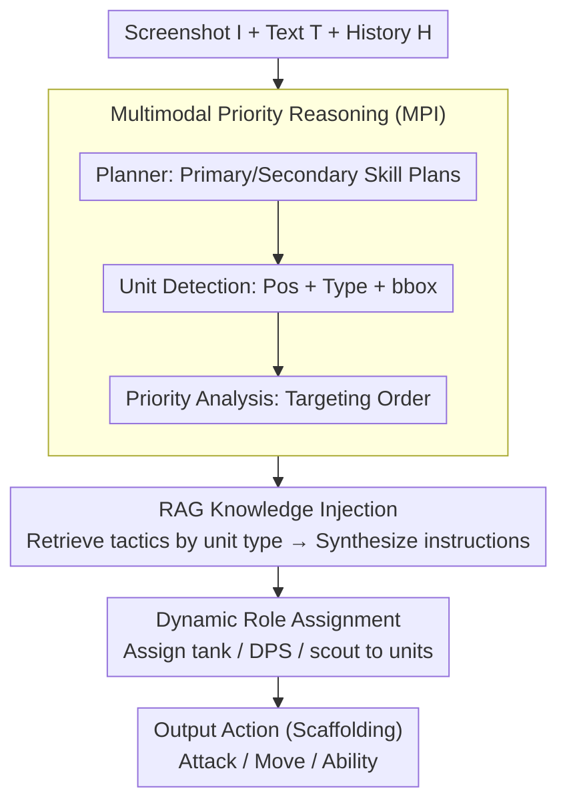

# AVA: Attentive VLM Agent for Mastering StarCraft II

**Conference**: ACL 2026  
**arXiv**: [2503.05383](https://arxiv.org/abs/2503.05383)  
**Code**: https://github.com/camel-ai/VLM-Play-StarCraft2  
**Area**: LLM Agent / Multimodal Game / VLM Decision Making  
**Keywords**: StarCraft II, Multimodal RL, Zero-shot VLM, Cross-paradigm benchmark, Priority Reasoning

## TL;DR
This paper proposes AVACraft—the first StarCraft II multimodal benchmark supporting both MARL and VLM decision-making paradigms (21 scenarios / RGB + Text + Structured State). It introduces the VLM baseline AVA (Multimodal Priority Reasoning + RAG + Dynamic Role Assignment). Experiments demonstrate that while MARL achieves only a 19–27% win rate after 5M training steps in base 3m scenarios, zero-shot VLM reaches 75–90%.

## Background & Motivation
**Background**: StarCraft II is the gold standard benchmark for multi-agent decision-making. SMAC/SMACv2 have driven the development of MARL algorithms (QMIX, MAPPO, etc.) for years. Concurrently, VLMs (GPT-4V, Qwen-VL) have emerged with zero-shot visual reasoning capabilities and are being explored for complex game decision-making (LLM-PySC2, VS-Bench, etc.).

**Limitations of Prior Work**: (1) The SMAC series only supports **abstract feature vectors**, discarding RGB visual information, which prevents VLM integration and precludes fair comparisons between VLM and MARL. (2) SMAC simplifies unit abilities, losing tactical depth. (3) Existing LLM game benchmarks either test only macro-strategy (LLM-PySC2) or use abstract multi-agent settings (VS-Bench), lacking cross-paradigm comparisons for **fine-grained tactical micromanagement**.

**Key Challenge**: MARL training is expensive but precisely controllable, while zero-shot VLM is fast, yet its ability to handle high-frequency micro-actions remains unknown. No prior work has enabled a fair comparison within the **same observation space**. Without a unified evaluation framework, the question of "whether VLMs can play SC2" remains unresolved.

**Goal**: (i) Build an SC2 environment natively supporting both MARL (RGB/scalar/hybrid) and VLM (RGB + Natural Language + Structured Metadata). (ii) Run comprehensive baselines for both paradigms across 21 micromanagement/coordination/strategy scenarios. (iii) Provide a capable VLM agent baseline, AVA, to verify that zero-shot VLMs can not only play but also explain actions in a human-like manner.

**Key Insight**: The SC2 POMDP is wrapped to allow four co-existing observation modes. MARL receives RGB/scalar/hybrid inputs, while VLM receives RGB + natural language text + structured unit information $\mathcal{U}_t = \{u_i = (\text{id}_i, \text{type}_i, \text{pos}_i, \text{hp}_i, \text{status}_i)\}$. All modes share the same action space and rewards for fair comparison.

**Core Idea**: By designing an environment with multimodal unified observations, full unit abilities, and adaptive enemy AI, MARL and VLM are brought to the same evaluation stage. A lightweight VLM baseline, AVA, proves that zero-shot VLMs can outperform long-trained MARL in tactical micromanagement.

## Method

### Overall Architecture
AVACraft formalizes SC2 as a POMDP $\langle \mathcal{S}, \mathcal{A}, \mathcal{O}, P, R, \gamma \rangle$, strictly adhering to the Fog of War (agents only see information within sight range). Its goal is to allow MARL and VLM paradigms to compete fairly under the same observation, action, and reward space. The observation space $\mathcal{O}$ provides four modes: RGB (screen 160×120 + minimap 32×32), SMAC-compatible scalar, Hybrid, and VLM-Optimized (RGB + natural language description + structured unit list). Action space $\mathcal{A} = \mathcal{A}_{\text{atk}} \cup \mathcal{A}_{\text{mov}} \cup \mathcal{A}_{\text{abl}}$ and sparse rewards $R \in \{-1, 0, 1\}$ are shared. 21 scenarios cover four difficulty levels, each equipped with one built-in AI (VeryHard) and three LLM-synthesized scripted strategies selected randomly to prevent exploitation. For MARL, six algorithms (IQL, QMIX, QTRAN, VDN, MAPPO, IPPO) are trained using a Swin-Tiny 27.5M visual backbone for up to 5M steps. For VLM, zero-shot AVA agents (GPT-4o, etc.) perform decisions via three sequential components.

### Key Designs

**1. Multimodal Priority Reasoning (MPI)**

In SC2 micromanagement, focusing fire on the right target is critical. Requesting a VLM to output actions directly often leads to misidentifying units or forgetting targets. MPI decomposes decision-making into three chained VLM calls: a Planner generates primary and secondary skill plans $S = \text{VLM}_{\text{plan}}(I, T, H) = \{s_{\text{primary}}, s_{\text{secondary}}\}$, Unit Detection determines positions and types $A = \text{VLM}_{\text{detect}}(I) = \{a_i = (p_i, c_i, b_i)\}$, and a skill-aware prompt ranks targeting priorities $U_{\text{priority}} = \text{VLM}_{\text{analyze}}(I, T, H, A, Q, S)$. This forces the model to focus on the most critical sub-tasks at each step.

**2. RAG Knowledge Injection**

Zero-shot game understanding relies on world knowledge, but SC2 tactics depend on specific counters (e.g., Stalkers fearing Marauders). The RAG component retrieves a knowledge tuple $K(u) = \{s_u, m_u, t_u\}$ (unit specs, matchups, tactical advice) for each priority unit $u$ identified by MPI. These are synthesized into final instructions $D = \text{VLM}_{\text{synthesize}}(I, T, H, U_{\text{priority}}, \{K(u)\})$. This external knowledge base ensures the agent avoids common tactical errors that might occur if relying solely on pre-trained memory.

**3. Dynamic Role Assignment**

Effective coordination in SC2 requires role differentiation (e.g., some units kiting while others focus fire). AVA explicitly models role assignment: given a role set $\mathcal{Z}$, it defines a mapping $\phi: \mathcal{N} \to \mathcal{Z}$. This is implemented as an independent VLM call $z_i = \text{VLM}_{\text{role}}(I, T, C)$, assigning roles like tank, DPS, or scout based on the visual and textual context. This provides a skill prior that effectively reduces the practical dimensionality of the action space.

### Loss & Training
The VLM side uses zero-shot inference without training. The MARL side follows SMAC standards with 5M training steps at a 2Hz decision frequency on dual A100 40GB GPUs. Episodes terminate upon total elimination, death, or a 300s timeout. Rewards are sparse to avoid bias.

## Key Experimental Results

### Main Results (Basic 3m Scenario)

| Paradigm | Method | Input Mode | Training Steps | Win Rate (%) |
|---|---|---|---|---|
| MARL | MAPPO | Vision+Text | 5M | 19.3 ± 3.2 |
| MARL | IPPO | Vision Only | 5M | 18.2 ± 2.8 |
| MARL | QMIX | Vision Only | 5M | **27.1 ± 4.1** |
| MARL | QTRAN | Vision Only | 5M | 2.0 ± 1.4 |
| MARL | IQL / VDN| Vision Only | 5M | 0.0 |
| VLM (Closed) | GPT-4o | VLM-Optimized | 0 | **81 ± 3.9** |
| VLM (Closed) | GPT-4-Turbo | VLM-Optimized | 0 | 79 ± 4.1 |
| VLM (Closed) | Qwen-VL-Plus | VLM-Optimized | 0 | 75 ± 4.3 |
| VLM (Open) | Qwen3-VL-30B | VLM-Optimized | 0 | 50 ± 5.0 |
| VLM (Open) | Qwen3-VL-8B | VLM-Optimized | 0 | 40 ± 4.9 |

VLM paradigms significantly outperform MARL after 5M steps. Notably, adding text to IPPO slightly decreased performance (16.6 vs 18.2), suggesting that from-scratch MARL struggles to fuse pre-trained text embeddings, whereas VLMs benefit naturally from text channels due to alignment.

### Ablation Study (AVA on mixed_units, GPT-4-Turbo)

| Role | MPI | RAG | Win Rate (%) | Description |
|---|---|---|---|---|
| ✓ | ✓ | ✓ | **87 ± 3.4** | Full AVA |
| ✓ | ✓ | – | 71 ± 4.5 | w/o RAG (-16%) |
| ✓ | – | ✓ | 65 ± 4.8 | w/o MPI (-22%) |
| – | ✓ | ✓ | 70 ± 4.6 | w/o Role (-17%) |
| ✓ | – | – | 24 ± 4.3 | Role only |
| – | ✓ | – | 50 ± 5.0 | MPI only |
| – | – | – | 20 ± 4.0 | Vanilla VLM |

### Key Findings
- **MPI is the most critical component**: Removing MPI caused the largest performance drop (87% to 65%), indicating that identifying "who to hit" is more vital than "assigning roles."
- **VLM limitations in high-complexity scenarios**: In 2c_vs_64zg and 6r_vs_8z, **all VLMs achieved a 0% win rate**, showing a clear ceiling in continuous kiting and high-frequency precision micromanagement.
- **Significant cross-modal alignment differences**: Text addition hindered MARL but significantly boosted VLM, validating the cross-modal grounding advantages of VLM pre-training.
- **Training efficiency contrast**: MARL at 5M steps ≈ 19% vs. VLM at 0 steps ≈ 81%; however, once trained, MARL is more controllable and cheaper for long-term deployment.

## Highlights & Insights
- **Unified observation space is key for fair benchmarking**: By unifying to POMDP with multiple observation modes, results between MARL and VLM are directly comparable.
- **Quantifiable "Human Alignment"**: Professional SC2 players' blind reviews showed VLM decision interpretability is significantly higher than MARL, which is crucial for AI transparency.
- **Failure cases define VLM boundaries**: The 0% win rates in extreme scenarios pinpoint the ceiling for VLMs in dense spatial reasoning and high-frequency temporal consistency.
- **Transferable Agent Design**: The combination of MPI (prioritizing), Role (coordination), and RAG (knowledge injection) provides a reusable recipe for any real-time multi-agent VLM scenario.

## Limitations & Future Work
- Comparisons focused on basic 3m scenarios over 5M steps; longer training or newer MARL algorithms might close the gap.
- VLM cost and latency were not detailed; 2Hz is likely the upper limit for VLM, precluding professional-level high-frequency kiting.
- AVA is a proof-of-concept; the primary contribution is the benchmark rather than the agent architecture.
- Evaluations are mainly PvE; larger-scale PvP or ladder-level testing against humans is needed.

## Related Work & Insights
- **vs SMAC / SMACv2**: Addresses the limitations of abstract features and simplified abilities by providing RGB, full abilities, and VLM interfaces.
- **vs LLM-PySC2**: While LLM-PySC2 focuses on macro-strategy, this work targets micro-management.
- **vs VS-Bench**: Provides a more fine-grained evaluation on the gold standard SC2 rather than abstract settings.
- **vs Voyager**: Extends VLM/LLM game-playing research into the real-time, high-frequency adversarial environment of SC2.

## Rating
- Novelty: ⭐⭐⭐⭐ Strong benchmark originality; agent is an effective engineering combination.
- Experimental Thoroughness: ⭐⭐⭐⭐ Extensive cross-paradigm testing and ablations.
- Writing Quality: ⭐⭐⭐⭐ Clear formalization of environments and intuitive ablation analysis.
- Value: ⭐⭐⭐⭐⭐ Provides the first standardized arena for the MARL ↔ VLM dialogue.

<!-- RELATED:START -->

## Related Papers

- [\[AAAI 2026\] PerTouch: VLM-Driven Agent for Personalized and Semantic Image Retouching](../../AAAI2026/llm_agent/pertouch_vlm-driven_agent_for_personalized_and_semantic_image_retouching.md)
- [\[ICCV 2025\] GTR: Guided Thought Reinforcement Prevents Thought Collapse in RL-based VLM Agent Training](../../ICCV2025/llm_agent/gtr_guided_thought_reinforcement_prevents_thought_collapse_i.md)
- [\[ACL 2026\] Grounding Agent Memory in Contextual Intent](grounding_agent_memory_in_contextual_intent.md)
- [\[ACL 2026\] Lightweight LLM Agent Memory with Small Language Models](lightweight_llm_agent_memory_with_small_language_models.md)
- [\[ACL 2026\] CoEvolve: Training LLM Agents via Agent-Data Mutual Evolution](coevolve_training_llm_agents_via_agent-data_mutual_evolution.md)

<!-- RELATED:END -->
