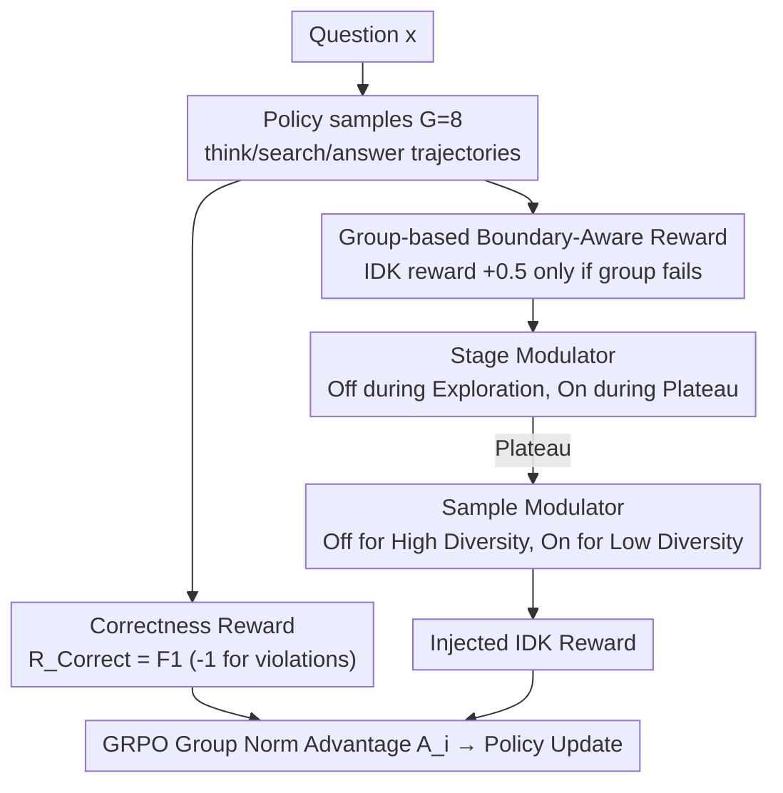

# BAPO: Boundary-Aware Policy Optimization for Reliable Agentic Search

**Conference**: ACL 2026  
**arXiv**: [2601.11037](https://arxiv.org/abs/2601.11037)  
**Code**: https://github.com/Liushiyu-0709/BAPO-Reliable-Search (Available)  
**Area**: LLM Agent / Reinforcement Learning  
**Keywords**: agentic search, boundary-aware, GRPO, IDK rejection, reliability

## TL;DR
Addressing the reliability issue where RL-trained agentic search models rarely say "I DON'T KNOW," leading to hallucinations, BAPO introduces "group-based boundary-aware rewards + adaptive reward modulators" on top of GRPO. This allows the model to reject answering only when truly exceeding its boundaries. Compared to GRPO, BAPO improves reliability across four multi-hop QA datasets by approximately 9.7% on average and outperforms Search-R1 (trained on 90k samples) using only 5k training samples.

## Background & Motivation
**Background**: Agentic search models trained via RL (e.g., Search-R1, ReSearch, R1-Searcher, Tool-Star) have significantly improved multi-hop QA accuracy through ReAct-style `<think>/<search>/<answer>` interactions, becoming a mainstream route for knowledge-intensive LLM applications.

**Limitations of Prior Work**: These RL models almost never admit "I don't know." While Qwen2.5-7B-Instruct has an 18.75% IDK rate before RL with 50.76% precision, the rate drops to 3.65% after GRPO training in ReSearch-7B, with precision falling to 53.24%. Models are "forced" by rewards to provide answers, leading to plausible but incorrect hallucinations that users cannot easily verify in long search chains, which degrades reliability.

**Key Challenge**: Standard correctness rewards simultaneously encourage "exhaustive exploration for accuracy" and "punishment of all uncertain expressions," which are mutually exclusive on hard problems. Simple fixes, such as a +0.5 fixed reward for IDK, are quickly exploited as shortcuts (reward hacking), causing the IDK rate to soar to 53.1% while accuracy drops.

**Goal**: (i) Construct a reliable learning signal for the "reasoning boundary" of agentic search, which is dynamic and tightly coupled with retrieval; (ii) Integrate this signal into RL without triggering new reward hacking.

**Key Insight**: Define the "boundary" as a property verifiable via group sampling—if none of the $G$ rollouts in a group is correct, the problem exceeds the current policy's boundary. Additionally, observe that training follows an "exploration-plateau" two-stage pattern, suggesting that rewards should be enabled adaptively at both the stage and sample levels.

**Core Idea**: Use "boundary-aware rewards" triggered only when the entire group fails, combined with an adaptive modulator (off during exploration/on during plateau + off for high diversity/on for low diversity samples). This trains the ability for honest rejection into agentic search models while maintaining deep exploration.

## Method

### Overall Architecture
BAPO trains the "courage to reject" into agentic search models by modifying only the reward layer of GRPO, without changing the strategy architecture or requiring cold-start SFT. For each question $x$, the policy samples $G=8$ trajectories $\{\tau_i\}_{i=1}^{G}$ with interleaved `<think>/<search>/<result>/<answer>` steps. Each trajectory is assigned two rewards: a correctness reward and a boundary-aware reward (given only when the entire group is incorrect). These are summed and used for GRPO group-normalized advantages $A_i$. An adaptive modulator determines the injection of IDK rewards based on training stages and sample diversity to balance solving capability and honesty.

### Key Designs

**1. Group-based Boundary-Aware Reward: Using group "total failure" as evidence of boundary crossing**

Static rewards for IDK responses are easily exploited as shortcuts (reward hacking), pushing IDK rates to 53%. BAPO's key insight is to redefine the "boundary" as an event verifiable via group sampling. For a group $\{\tau_i\}$, the correctness reward is $\mathcal{R}^{\textit{Correct}}=\text{F1}$ (with $-1$ for illegal formats). A problem is judged to exceed the boundary only if $\forall i,\ \mathcal{R}^{\textit{Correct}}(\tau_i)\le 0$. In this case, IDK samples receive $\mathcal{R}^{\textit{IDK}}=0.5\cdot\mathbb{I}(y_i=\text{IDK})$. If any correct answer exists in the group, this term becomes zero. This decouples the IDK reward from solvability, forcing the model to explore solvable problems while rewarding honest rejection only for truly out-of-boundary cases.

**2. Stage-level Modulator: Off during exploration, on during plateau**

Preliminary experiments revealed that providing IDK rewards too early causes models to learn laziness before learning to solve problems. BAPO ties the reward schedule to the learning curve. During the early "exploration stage," $\mathcal{R}^{\textit{IDK}}$ is disabled unless the group IDK ratio $\rho_{\text{IDK}}<\alpha=5\%$. When validation scores stagnate for 5 steps, the "plateau stage" is triggered, enabling full $\mathcal{R}^{\textit{IDK}}$. During the plateau, hard problems with zero group accuracy are resampled up to $k=2$ times (equivalent to pass@24) to ensure the boundary judgment is accurate.

**3. Sample-level Modulator: Rollout diversity as implicit confidence**

In the plateau stage, BAPO decides whether to enable the IDK reward at the sample level based on rollout diversity. If $|\{y_{1..G}\}|\ge G/2$ (high diversity), the model is considered to be actively exploring the solution space, and $\mathcal{R}^{\textit{IDK}}$ is disabled. Low diversity implies the model has converged on a fixed output, making further calculation of $\mathcal{R}^{\textit{IDK}}$ appropriate to reinforce boundary awareness. This treats consistency as a proxy for confidence, avoiding explicit uncertainty estimation.

### Loss & Training
The policy objective is standard clipped GRPO ($\epsilon=0.1$) with a KL coefficient of 0.001, rollout size $G=8$, temperature 1.0, and 8192 max tokens with up to 3 tool calls. Advantages $A_i$ are z-score normalized within the group. The environment uses FlashRAG + E5-base-v2 + 2018 Wikipedia with top-5 documents. The training set consists of 5k samples (from HotpotQA / 2WikiMultiHopQA) trained for 2 epochs with batch size 64.

## Key Experimental Results

### Main Results
Performance of Qwen2.5-7B-Instruct across four multi-hop QA datasets (Acc / Precision / Reliability, where Rel.=$(1-\rho_{\text{IDK}})\cdot\text{prec}+\rho_{\text{IDK}}\cdot\text{acc}$):

| Method | HotpotQA Rel. | MuSiQue Rel. | 2Wiki. Rel. | Bamboogle Rel. | Average |
|------|---------------|--------------|-------------|----------------|------|
| Search-R1 (90k samples) | 49.0 | 22.5 | 39.0 | 52.0 | 40.6 |
| ReSearch (19k samples) | 61.5 | 31.0 | 54.2 | 54.4 | 50.3 |
| GRPO (5k samples) | 60.0 | 29.5 | 59.5 | 57.6 | 51.7 |
| Reliable RFT | 40.2 | 18.5 | 23.9 | 49.4 | 33.0 |
| Reliable TIR Prompt | 60.6 | 27.2 | 43.3 | 50.5 | 45.4 |
| **BAPO (5k samples)** | **65.5** | **36.6** | **63.3** | **61.2** | **56.7** |

BAPO achieves 5.0 higher average reliability (+9.7% relative) than GRPO and outperforms Search-R1/ReSearch despite using significantly less data (18x/4x less). BAPO trades a slight drop in accuracy (-2.2) for a large gain in precision (+11.8).

### Ablation Study
Average across four datasets using Qwen2.5-3B-Instruct:

| Config | Acc | Prec | $\rho_{\text{IDK}}$ | Reliability |
|------|-----|------|---------------------|-------------|
| **BAPO Full** | **44.8** | 52.8 | 16.8% | **51.3** |
| w/o Boundary-Aware Reward (Fixed +0.5) | 30.6 | 62.4 | 53.1% | 44.8 |
| w/o Sample Modulator | 43.3 | 52.0 | 20.4% | 50.1 |
| w/o Sample + Stage Modulator | 37.8 | 56.0 | 35.2% | 49.0 |

### Key Findings
- Replacing "group-level trigger" with "fixed IDK reward" caused $\rho_{\text{IDK}}$ to spike to 53.1% and Acc to drop by 14 points, validating the existence of reward hacking.
- The stage-level modulator is critical: removing both modulators doubled $\rho_{\text{IDK}}$ from 16.8% to 35.2% and dropped Acc by 7 points, proving IDK rewards must be shielded during exploration.
- Sensitivity of $\alpha$: $\alpha=0$ results in $\rho_{\text{IDK}}=0$ (no chance to learn rejection), while $\alpha=0.05$ is optimal.
- Rationality: Rejections by BAPO primarily occur on samples where GRPO models also fail (error rates of 76.7% for 7B/14B), proving rejection is "rational."
- 14B Dynamics: During exploration, $R^{\textit{Correct}}$ rose (0.3 $\rightarrow$ 0.5) while $\rho_{\text{IDK}}$ fell (20% $\rightarrow$ 5%). After switching to the plateau stage, $R^{\textit{IDK}}$ rose and $\rho_{\text{IDK}}$ recovered to 25%+.

## Highlights & Insights
- **Operationalizing "Boundary" as a Group Event**: BAPO uses $G$ failed rollouts as evidence of crossing a boundary without needing external knowledge bases or complex confidence modeling, integrating seamlessly into the GRPO pipeline.
- **Training-Stage-Aware Reward Schedule**: It reveals that the timing of a reward is as important as its value. A reward can be "poison" during exploration but "medicine" during the plateau stage, a concept transferable to multi-objective RLHF.
- **Rollout Diversity as Implicit Confidence**: Using $|\{y_{1..G}\}|\ge G/2$ allows the model to detect whether it is still exploring without explicit uncertainty estimation, providing a cheap signal for sample-level RL scheduling.
- **Efficiency (5k vs. 90k samples)**: The bottleneck for agentic search might not be data scale but reward shaping. A reliability-first training paradigm is more economical than simply scaling data.

## Limitations & Future Work
- Evaluation is limited to Wikipedia-based local RAG and does not account for the noise and latency of real-world web search.
- Coverage is limited to knowledge-intensive QA; it is unclear if "group failure" is a reliable boundary proxy for "non-retrieval" tasks like math or code.
- Maximum scale tested is 14B; marginal gains might decrease for 70B+ models with higher base reliability.
- Hyperparameters like $\rho_{\text{IDK}}, \alpha, k$ are sensitive and may require re-tuning for different tasks.
- Future work could include automating the stage modulator via validation sets or extending group-level triggers to tool invocation failures.

## Related Work & Insights
- **vs. Search-R1 / ReSearch / R1-Searcher**: These focus on correctness rewards for accuracy. BAPO maintains their RL architecture while adding boundary-aware signals, achieving higher reliability with significantly less data.
- **vs. BARREL**: BARREL uses static IDK rewards + distilled trajectories. BAPO's ablation proves static rewards lead to laziness, which BAPO solves via dynamic group triggers.
- **vs. Reliable RFT**: RFT leads to over-conservatism (Acc drops by 27 points) due to static SFT labels, whereas BAPO models the boundary online via RL.
- **vs. Knowledge / Capability Boundary**: Prior work defines boundaries on static knowledge; BAPO handles "emergent boundaries" synthesized from planning, retrieval, and reasoning.

## Rating
- Novelty: ⭐⭐⭐⭐ The group-level boundary trigger + stage/sample dual modulators are novel and elegant.
- Experimental Thoroughness: ⭐⭐⭐⭐ 4 datasets × 3 model scales × ablations + sensitivity analysis + multiple metrics.
- Writing Quality: ⭐⭐⭐⭐ Clear motivation via preliminary studies and intuitive dynamics diagrams.
- Value: ⭐⭐⭐⭐ Moves agentic search from "appearing accurate" to "daring to admit incapacity," offering high practical value.

<!-- RELATED:START -->

## Related Papers

- [\[ICML 2026\] Towards Pareto-Optimal Tool-Integrated Agents with Pareto Ranking Policy Optimization](../../ICML2026/llm_agent/towards_pareto-optimal_tool-integrated_agents_with_pareto_ranking_policy_optimiz.md)
- [\[ACL 2026\] SEARL: Joint Optimization of Policy and Tool Graph Memory for Self-Evolving Agents](searl_joint_optimization_of_policy_and_tool_graph_memory_for_self-evolving_agent.md)
- [\[NeurIPS 2025\] Group-in-Group Policy Optimization for LLM Agent Training](../../NeurIPS2025/llm_agent/groupingroup_policy_optimization_for_llm_agent_training.md)
- [\[ICLR 2026\] Exploratory Memory-Augmented LLM Agent via Hybrid On- and Off-Policy Optimization](../../ICLR2026/llm_agent/exploratory_memory-augmented_llm_agent_via_hybrid_on-_and_off-policy_optimizatio.md)
- [\[ACL 2026\] Rethinking Reasoning-Intensive Retrieval: Evaluating and Advancing Retrievers in Agentic Search Systems](rethinking_reasoning-intensive_retrieval_evaluating_and_advancing_retrievers_in_.md)

<!-- RELATED:END -->
