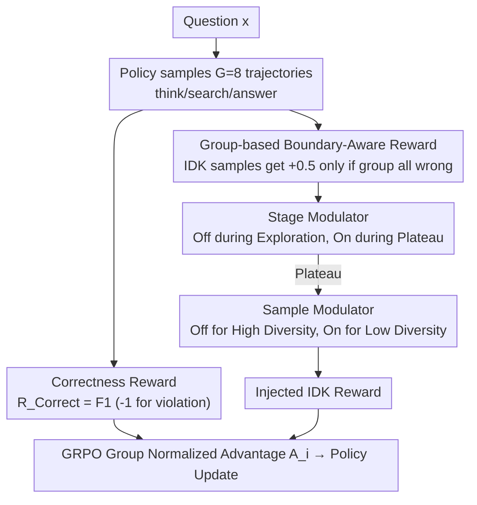

# BAPO: Boundary-Aware Policy Optimization for Reliable Agentic Search

**Conference**: ACL 2026  
**arXiv**: [2601.11037](https://arxiv.org/abs/2601.11037)  
**Code**: https://github.com/Liushiyu-0709/BAPO-Reliable-Search (Available)  
**Area**: LLM Agent / Reinforcement Learning  
**Keywords**: agentic search, boundary-aware, GRPO, IDK response, reliability

## TL;DR
Addressing the reliability issue where RL-trained agentic search models rarely say "I DON'T KNOW," leading to hallucinations, BAPO introduces "Group-based Boundary-Aware Rewards + Adaptive Reward Modulators" on top of GRPO. This ensures the model only refuses an answer when truly exceeding its boundaries, improving reliability by approximately 9.7% across four multi-hop QA datasets compared to GRPO. Furthermore, BAPO outperforms Search-R1 (trained on 90k samples) using only 5k training samples.

## Background & Motivation
**Background**: Agentic search models trained via RL (GRPO)—such as Search-R1, ReSearch, R1-Searcher, and Tool-Star—significantly improve multi-hop QA accuracy through ReAct-style `<think>/<search>/<answer>` interactions. This has become a mainstream approach for knowledge-intensive LLM applications.

**Limitations of Prior Work**: These RL models almost never admit when they "don't know." Before RL, Qwen2.5-7B-Instruct has an IDK rate of 18.75% and a precision of 50.76 (much higher than its 41.25 accuracy). However, once trained into ReSearch-7B via GRPO, the IDK rate plummets to 3.65% with a precision of only 53.24. The models are "forced" by rewards to provide answers for all questions, leading to plausible-sounding but fabricated answers that users cannot easily verify within long search chains, causing severe degradation in reliability.

**Key Challenge**: Standard correctness rewards simultaneously encourage "exaustive exploration to answer correctly" and "penalize all uncertain expressions," which are mutually exclusive on hard problems. A naive fix—giving a fixed +0.5 reward for IDK—is immediately exploited by the model as a shortcut (IDK rate jumps to 53.1%), leading to reward hacking and a drop in accuracy.

**Goal**: (i) Construct a reliable learning signal for the dynamic "reasoning boundaries" in agentic search, which are tightly coupled with retrieval; (ii) integrate this signal into RL without triggering new forms of reward hacking.

**Key Insight**: A "boundary" can be defined as an attribute verifiable through group sampling—if none of the $G$ rollouts in a group yield a correct answer, the question exceeds the current policy's boundary. Additionally, training exhibits distinct "exploration-plateau" phases; thus, rewards should be enabled adaptively at both the stage and sample levels.

**Core Idea**: Use group-based boundary-aware rewards that only grant IDK rewards when the entire group fails, combined with an adaptive modulator (off during exploration, on during plateau; off for high-diversity samples, on for low-diversity samples). This embeds honest refusal capabilities into the agentic search model while maintaining deep exploration.

## Method

### Overall Architecture
BAPO trains "the courage to refuse" into the agentic search model. The pipeline modifies only the reward layer of GRPO, keeping the policy architecture and avoiding cold-start SFT. For each question $x$, the policy samples $G=8$ trajectories $\{\tau_i\}_{i=1}^{G}$ interleaving `<think>/<search>/<result>/<answer>`. Two rewards are calculated for each trajectory: a correctness reward and a boundary-aware reward (only active when the whole group is wrong). These are summed and fed into the GRPO group-normalized advantage $A_i$. An adaptive modulator determines whether to inject the IDK reward based on the training stage and sample diversity, balancing "learning to solve" and "learning to admit failure."

### Key Designs

**1. Group-based Boundary-Aware Reward: Using Group "Total Failure" as Evidence of Boundary**

Naive approaches give a fixed reward for any IDK response, but models treat this as a shortcut—refusing even simple questions—causing reward hacking that pushes the IDK rate to 53%. BAPO's key insight is to redefine the "boundary" from static parametric knowledge to a verifiable event via group sampling. For a group $\{\tau_i\}$, the correctness reward is $\mathcal{R}^{\textit{Correct}}=\text{F1}$ (or $-1$ for illegal formats). Only if $\forall i,\ \mathcal{R}^{\textit{Correct}}(\tau_i)\le 0$ (no correct answer in the group) is the question judged as exceeding the current policy's boundary. In this case, IDK samples receive $\mathcal{R}^{\textit{IDK}}=0.5\cdot\mathbb{I}(y_i=\text{IDK})$. If any correct answer exists in the group, this term becomes zero. This decouples the IDK reward from question solvability—solvable questions get no refusal reward, forcing the model to explore, while truly out-of-boundary questions gain points through honest refusal. Since the signal is naturally group-based, it is seamlessly absorbed by GRPO's advantage normalization without external confidence models.

**2. Stage-level Modulator: Off during Exploration, On during Plateau, with Hard Sample Resampling**

Preliminary experiments revealed a trap: if the IDK reward is enabled from the start, the model learns to be "lazy" before learning to solve. BAPO synchronizes the reward schedule with the learning curve. In the early "Exploration Phase," $\mathcal{R}^{\textit{IDK}}$ is disabled by default, only briefly allowed if the group IDK ratio $\rho_{\text{IDK}}<\alpha=5\%$ to prevent refusal from crowding out exploration. Once validation scores plateau for 5 steps, it switches to the "Plateau Phase" and fully enables $\mathcal{R}^{\textit{IDK}}$. During the plateau, hard problems (group total failure) are resampled up to $k=2$ times (equivalent to pass@24) until an IDK or correct answer appears, ensuring a more accurate boundary judgment. This stage-aware design highlights that the same reward can be a poison during exploration but a remedy during the plateau.

**3. Sample-level Modulator: Rollout Diversity as Implicit Confidence**

Even in the plateau phase, BAPO decides whether to enable the IDK reward at a per-sample granularity based on rollout diversity. If $|\{y_{1..G}\}|\ge G/2$ (high diversity), the model is considered to be actively exploring the solution space, and $\mathcal{R}^{\textit{IDK}}$ is disabled to avoid premature convergence to refusal. Conversely, low diversity implies the model has stabilized on a specific output and further exploration is unlikely to succeed, so $\mathcal{R}^{\textit{IDK}}$ is enabled to reinforce boundary awareness. This treats rollout consistency as a "cheap proxy" for confidence, avoiding explicit uncertainty estimation and ensuring rewards target the right samples.

### Loss & Training
The policy objective is clipped GRPO ($\epsilon=0.1$), KL coefficient 0.001, rollout $G=8$, temperature 1.0, max tokens 8192, and a maximum of 3 tool calls. Advantages $A_i$ are z-score normalized within the group. The retrieval environment uses FlashRAG + E5-base-v2 + 2018 Wikipedia (top-5 documents). The training set consists of only 5k samples (from HotpotQA / 2WikiMultiHopQA), trained for 2 epochs with a batch size of 64.

## Key Experimental Results

### Main Results
Acc / Precision / Reliability (Rel.=$(1-\rho_{\text{IDK}})\cdot\text{prec}+\rho_{\text{IDK}}\cdot\text{acc}$) on four multi-hop QA datasets using Qwen2.5-7B-Instruct:

| Method | HotpotQA Rel. | MuSiQue Rel. | 2Wiki. Rel. | Bamboogle Rel. | Average |
|------|---------------|--------------|-------------|----------------|------|
| Search-R1 (90k samples) | 49.0 | 22.5 | 39.0 | 52.0 | 40.6 |
| ReSearch (19k samples) | 61.5 | 31.0 | 54.2 | 54.4 | 50.3 |
| GRPO (5k samples) | 60.0 | 29.5 | 59.5 | 57.6 | 51.7 |
| Reliable RFT | 40.2 | 18.5 | 23.9 | 49.4 | 33.0 |
| Reliable TIR Prompt | 60.6 | 27.2 | 43.3 | 50.5 | 45.4 |
| **BAPO (Ours, 5k samples)** | **65.5** | **36.6** | **63.3** | **61.2** | **56.7** |

With only 5k samples, BAPO's reliability is 5.0 points higher than GRPO (+9.7% relative) and exceeds Search-R1/ReSearch trained on 18×/4× more data. Its strategy is to trade a slight decrease in accuracy (-2.2) for a significant increase in precision (+11.8).

### Ablation Study
Average across four datasets using Qwen2.5-3B-Instruct:

| Configuration | Acc | Prec | $\rho_{\text{IDK}}$ | Reliability |
|------|-----|------|---------------------|-------------|
| **BAPO Full Version** | **44.8** | 52.8 | 16.8% | **51.3** |
| w/o Boundary-Aware Reward (Fixed +0.5) | 30.6 | 62.4 | 53.1% | 44.8 |
| w/o Sample Modulator | 43.3 | 52.0 | 20.4% | 50.1 |
| w/o Sample + Stage Modulators | 37.8 | 56.0 | 35.2% | 49.0 |

### Key Findings
- Replacing "group-level triggers" with a "fixed IDK reward" causes $\rho_{\text{IDK}}$ to surge to 53.1% and Acc to drop by 14 points, validating the existence of reward hacking and the necessity of group-level triggers.
- The Stage Modulator is crucial: removing both modulators doubles $\rho_{\text{IDK}}$ from 16.8% to 35.2% and drops Acc by 7 points, proving that IDK rewards must be shielded during the exploration phase.
- Sensitivity of hyperparameter $\alpha$: when $\alpha=0$, $\rho_{\text{IDK}}=0$ (the model never learns to refuse); $\alpha=0.05$ is optimal; $\alpha\ge 0.2$ excessively encourages refusal. Resampling $k$ shows significant improvement from 1 to 2, saturating at 3.
- In 7B / 14B models, when BAPO refuses, the GRPO baseline's error rates are 76.7% / 76.7%, respectively. Refusals primarily occur on questions that GRPO cannot solve, proving that refusals are "rational" rather than random.
- 14B Training Curve: In the first 60 steps of exploration, $R^{\textit{Correct}}$ rises from 0.3 to 0.5 while $\rho_{\text{IDK}}$ falls from 20% to 5%. Upon switching to the plateau phase, $R^{\textit{IDK}}$ rises to 0.25–0.30, and $\rho_{\text{IDK}}$ recovers to over 25%.

## Highlights & Insights
- **Operationalizing "Boundary" as a Group Event**: By using the failure of $G$ rollouts in GRPO as evidence of exceeding the boundary, BAPO avoids external knowledge bases or complex confidence modeling. This is an elegant engineering trade-off with zero additional cost.
- **Training Stage-Aware Reward Scheduling**: This addresses the fact that the timing of a reward is as important as the reward itself. A reward that is "poison" during exploration becomes "medicine" during the plateau. This idea is transferable to any multi-objective RLHF scenario (e.g., safety vs. helpfulness).
- **Rollout Diversity as Implicit Confidence**: Using $|\{y_{1..G}\}|\ge G/2$ to judge if the model is still exploring provides a cheap sample-level RL scheduling signal without explicit uncertainty estimation.
- **5k Samples outperforming 90k Samples**: This suggests that the bottleneck for agentic search is no longer data scale, but reward shaping. A reliability-first training paradigm may be more economical than data scaling.

## Limitations & Future Work
- Evaluation was limited to Wikipedia local RAG, which does not cover the noise, dynamics, and latency of real web search. IDK trigger logic may need re-calibration in production.
- Covered only knowledge-intensive QA. For "non-retrieval" problems like math, code, or agentic web tasks, whether "group failure" remains a reliable proxy for boundaries is unverified.
- Experiments reached 14B; marginal gains of BAPO might diminish on 70B+ models with higher base reliability.
- Sensitivity to hyperparameters $\rho_{\text{IDK}}$, $\alpha$, and $k$ suggests non-negligible tuning costs across different tasks or models.
- Future work: Turning the stage-level modulator into an automatic curriculum driven by the validation set; extending group-level triggers to other "boundary" signals like tool failure or safety violations.

## Related Work & Insights
- **vs Search-R1 / ReSearch / R1-Searcher**: These focus on correctness rewards for accuracy. BAPO maintains their RL architecture while adding boundary-aware signals, achieving higher reliability with only 5k samples.
- **vs BARREL (Yang et al., 2025a)**: BARREL uses a static medium reward for IDK + distilled reasoning. BAPO's ablation shows static IDK rewards lead to laziness ($\rho_{\text{IDK}}=53.1\%$), which BAPO solves via dynamic group-level triggers.
- **vs Reliable RFT (Rejection Sampling SFT)**: RFT causes over-conservatism (Acc drops 27 points) by injecting IDK samples. BAPO uses online RL to model boundaries without destroying exploration.
- **vs Knowledge / Capability Boundary (Zheng 2025, Zhang 2025c)**: While others define boundaries on static knowledge or math, BAPO handles "emergent boundaries" synthesized from planning, retrieval, and reasoning.
- **vs Uncertainty Estimation**: Methods like semantic entropy or verbalized confidence are post-hoc detections; BAPO trains the policy itself to know when to refuse. The two are orthogonal and can be combined.

## Rating
- Novelty: ⭐⭐⭐⭐ Group-level boundary triggers + stage/sample dual modulators represent a novel and concise reward design.
- Experimental Thoroughness: ⭐⭐⭐⭐ 4 datasets × 3 model scales × ablations + hyperparameter sensitivity + dual metrics + case studies.
- Writing Quality: ⭐⭐⭐⭐ The preliminary study clearly explains the motivation, and the framework/dynamic charts are intuitive.
- Value: ⭐⭐⭐⭐ Moves agentic search from "appearing accurate" to "daring to admit failure," offering real value for production environments.

<!-- RELATED:START -->

## Related Papers

- [\[ACL 2026\] SEARL: Joint Optimization of Policy and Tool Graph Memory for Self-Evolving Agents](searl_joint_optimization_of_policy_and_tool_graph_memory_for_self-evolving_agent.md)
- [\[NeurIPS 2025\] Group-in-Group Policy Optimization for LLM Agent Training](../../NeurIPS2025/llm_agent/groupingroup_policy_optimization_for_llm_agent_training.md)
- [\[ICLR 2026\] Exploratory Memory-Augmented LLM Agent via Hybrid On- and Off-Policy Optimization](../../ICLR2026/llm_agent/exploratory_memory-augmented_llm_agent_via_hybrid_on-_and_off-policy_optimizatio.md)
- [\[ACL 2026\] Rethinking Reasoning-Intensive Retrieval: Evaluating and Advancing Retrievers in Agentic Search Systems](rethinking_reasoning-intensive_retrieval_evaluating_and_advancing_retrievers_in_.md)
- [\[ICLR 2026\] MC-Search: Evaluating and Enhancing Multimodal Agentic Search with Structured Long Reasoning Chains](../../ICLR2026/llm_agent/mc-search_evaluating_and_enhancing_multimodal_agentic_search_with_structured_lon.md)

<!-- RELATED:END -->
