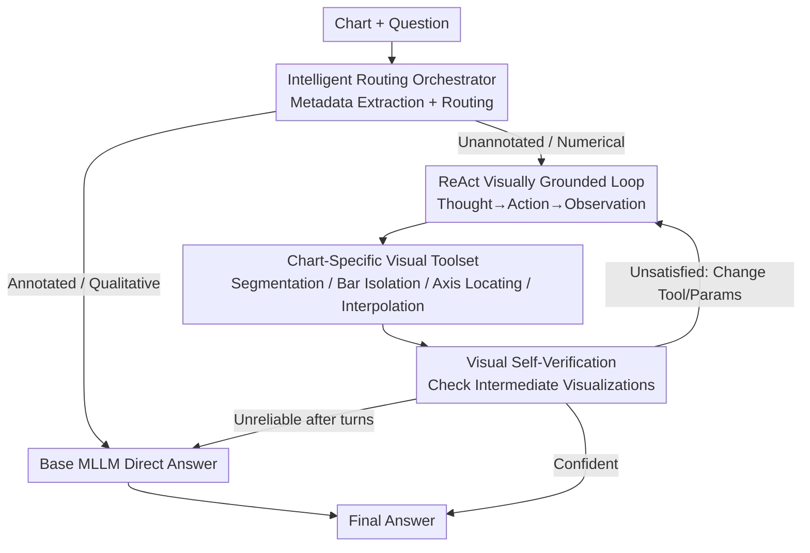

# ChartAgent: A Multimodal Agent for Visually Grounded Reasoning in Complex Chart Question Answering

**Conference**: ACL2026  
**arXiv**: [2510.04514](https://arxiv.org/abs/2510.04514)  
**Code**: TBD  
**Area**: Agent / Multimodal VLM  
**Keywords**: Chart Question Answering, Visually Grounded Reasoning, Tool-Augmented Agent, ReAct, Visual Self-Verification

## TL;DR
ChartAgent transforms chart question answering from "textual chain-of-thought" to "acting on the image itself." By using a suite of chart-specific visual tools (segmenting pie slices, isolating bars, locating axes) within a ReAct loop and performing self-verification on intermediate visualizations, it achieves gains of up to 16.07% on ChartBench / ChartX for unannotated and numerical-heavy challenges, with a 17.31% improvement on the unannotated subset.

## Background & Motivation
**Background**: Current mainstream Chart VQA approaches feed charts to Multimodal Large Language Models (MLLMs), relying on prompts or fine-tuning for direct answers or textual chain-of-thought (CoT) reasoning.

**Limitations of Prior Work**: These methods perform reasonably well on **annotated charts** (where values/labels are printed on the chart) because the models use OCR to take shortcuts. However, performance drops significantly on **unannotated charts**—which require estimating values from bar heights or slice areas. Even SoTA models like GPT-4o fail (as shown in Table 1, GPT-4o scores only 36.15% on the ChartBench unannotated subset).

**Key Challenge**: Textual CoT reasoning occurs entirely in language space, whereas critical chart information is **geometric and spatial** (e.g., the height of a bar or the proportion of a slice). In pure text reasoning detached from image pixels, these quantities cannot be obtained precisely, leading models to guess.

**Goal**: To enable agents to "mark the chart" like humans do—decomposing problems into visual sub-tasks (locating legends, aligning axes, measuring bar heights), manipulating the image to get intermediate results, and reasoning based on those results.

**Key Insight**: Human chart reading is **sequential, visual, and verifiable**. We look at axes and legends, draw auxiliary lines to compare values, circle slices to judge proportions, and redraw if we make a mistake. This cognitive strategy maps perfectly to an agent loop involving "tool invocation + intermediate visualization + self-check."

**Core Idea**: Use a tool-augmented multimodal agent to perform visually grounded reasoning within the **spatial domain of the chart**. Instead of just describing the chart, it draws, crops, and measures on the chart, performing visual self-verification on its own annotations.

## Method

### Overall Architecture
Given a chart and a natural language question, ChartAgent aims to output an answer that faithfully reflects the chart's information. The pipeline starts with an **LLM orchestrator**, which extracts chart metadata (type, title, legend, axis scales, annotation status, brief visual description) and performs **intelligent routing**. Simple annotated charts or qualitative questions are routed directly to the base MLLM (to save compute), while unannotated charts and numerical problems trigger a **ReAct-style multi-turn visual reasoning loop**. In this loop, the agent generates Thought → Action → Observation: thinking of the next visual sub-goal, selecting a tool from the **chart-specific visual toolset** to manipulate the image, and performing **visual self-verification** on the returned intermediate visualization. If results remain unreliable after several turns, it gracefully falls back to the base MLLM. The maximum iteration steps are set to 15.

### Key Designs

**1. Intelligent Routing Orchestrator: Avoid wasting compute on simple tasks while ensuring hard ones are handled correctly**

A "one-size-fits-all" approach is inefficient: forcing all charts through a tool loop is slow and redundant for simple tasks, while relying solely on MLLMs leads to failure on unannotated charts. ChartAgent uses an LLM orchestrator (e.g., GPT-4o) to extract metadata, focusing on the **annotation status**. Annotated charts contain text shortcuts, and qualitative questions do not require precise readings; both are routed to the base MLLM. Unannotated charts trigger the deep visual reasoning loop. Metadata is also used to retrieve **few-shot ICL examples specific to the chart type** (e.g., if a pie chart is detected, only pie chart ReAct trajectories are provided) and to configure tool parameters. This step transforms the decision to use visual tools into an explicit choice, balancing accuracy and computation.

**2. Chart-Specific Visual Toolset: Treating chart elements as detectable and segmentable "visual objects"**

MLLM visual encoders struggle to accurately read bar heights or slice areas because they lack specialized perception for chart geometry. The authors analogize natural image tasks (detection, segmentation, relational reasoning) to the chart domain, treating bars, slices, lines, legends, scales, and axis labels as basic "visual objects." They designed a structured toolset in two categories: **General Chart Tools** (segmentation, legend detection, axis localization, numerical interpolation) and **Specific Chart Tools** (tasks for pie/bar/line/box plots, such as slice segmentation or bar isolation). Tools are implemented as Python functions using CV/OCR methods like SAM, Semantic SAM, Tesseract, and EasyOCR, handling edge cases like rotated text and blurred labels for over 40 chart types. Tools are intentionally kept simple and distinct to ensure robustness. Crucially, tools **return interpretable intermediate visualizations** (labeled segmentation masks, colored slices, marked bar heights), which serve as the basis for self-verification.

**3. Visual Self-Verification and Adaptive Tool Use: Letting the agent check its own drawings and correct its mistakes**

This design integrates the human behavior of "redrawing when wrong" into the agent. During the Observation phase, the agent does not blindly trust tool outputs but **visually checks if the generated visualization** is reasonable: Is the segmentation complete? Is the legend association misaligned? Are slices too small? Are colors correct? Are bar heights negative? Does the reading align with the axis? The state is updated as $s_{t+1}=(s_t, g_t, a_t^{\text{chart-tool}}, o_{t+1})$, where $g_t$ is the current sub-goal, $a_t^{\text{chart-tool}}$ is the invoked tool, and $o_{t+1}$ is the new visual output. If verification identifies issues, the agent adaptively adjusts in the next turn—switching tools or tuning thresholds—creating a human-like debug loop. This also yields an "honesty" byproduct: if outputs remain insufficient, the agent **recognizes its own perceptual boundaries** and falls back to the base MLLM, avoiding hallucinations.

**4. Plug-and-Play Multimodal Agent Framework: Independent upgrades for reasoning backends and tools**

ChartAgent uses GPT-4o as the base MLLM, serving both as the reasoning backbone and the orchestrator, with tool orchestration implemented via AutoGen. The framework is **plug-and-play**: improvements in either perception tools or MLLM reasoning capabilities yield cumulative gains. It can be easily adapted to different base MLLMs (as verified in Section 5.2). After each ReAct cycle, the agent evaluates the updated multimodal state $s_{t+1}$ to decide whether to continue or terminate with an answer. This decoupling ensures ChartAgent is not a static end-to-end model but an evolving reasoning shell that improves alongside its underlying models.

### A Complete Example
Consider an unannotated pie chart asking: "Which category has the largest proportion?" The orchestrator extracts metadata and identifies it as an unannotated pie chart, triggering the ReAct loop and retrieving pie chart ICL samples. Turn 1 Thought: "Need to segment slices and estimate area" → Action: Invoke slice segmentation tool → Observation: Receives colored masks, self-verification detects two slices are merged → Turn 2: Adjust threshold and re-segment, verification passes → Action: Estimate area proportions → Action: Legend detection maps colors to category names → Self-verification confirms the color-category mapping → Terminate and output the largest category. Every step has a visualization available for inspection, allowing for corrections in subsequent turns rather than relying on a single attempt.

## Key Experimental Results

### Main Results
On **ChartBench** (9 categories, 42 subcategories, 3,800 chart-QA pairs, 76.2% unannotated, 96.7% numerical), ChartAgent was compared against over 30 baselines. It achieved an overall score of 71.39%, an **absolute improvement of 16.07%** over the previous strongest baseline (Phi3-vision at 55.32%). On the unannotated subset, it scored 60.81%, an **improvement of 17.31%** over the best baseline (Qwen2-VL at 43.50%).

| Model | Annotated | Unannotated | Numerical QA | Overall ↑ |
|------|--------|--------|--------|-------|
| GPT-4o | 94.33 | 36.15 | 52.50 | 54.53 |
| Qwen2-VL | 78.42 | 43.50 | 52.94 | 54.53 |
| Phi3-vision | 86.92 | 40.77 | 55.89 | 55.32 |
| **ChartAgent** | **94.33** | **60.81** | **70.91** | **71.39** |

### Gain Analysis
Comparing ChartAgent to its base MLLM (GPT-4o) by subset reveals that **all gains come from unannotated/numerical problems**. Annotated questions are routed directly to the MLLM, preserving the original scores, while difficult problems enter the tool loop. This confirms the motivation behind "intelligent routing + visual grounding."

| Subset | Base MLLM (GPT-4o) | ChartAgent | Gain |
|------|-------------------|-----------|------|
| Annotated Chart | 94.33 | 94.33 | 0 (Direct routing) |
| Unannotated Chart | 36.15 | 60.81 | +24.66 |
| Numerical QA | 52.50 | 70.91 | +18.41 |

### Key Findings
- **Gains concentrated in "numerical reading" challenges**: Scores for annotated charts remained unchanged (tools bypassed via routing), while unannotated charts improved by 24.66 points and numerical questions by 18.41 points. This indicates that tools + self-verification specifically address the bottleneck of "estimating values from geometric elements."
- **Robust across chart types and complexity**: ChartAgent achieved top scores across 40+ chart types and various complexity levels, proving the generalizability of treating chart elements as "visual objects."
- **Plug-and-play portability**: As a framework, it enhanced different base MLLMs (Section 5.2), proving gains stem from the framework rather than a specific model. Failure mode analysis also highlighted common remaining errors.

## Highlights & Insights
- **"Acting on the chart" instead of "describing the chart"**: The core insight is that the bottleneck in chart reasoning is spatial/geometric information that textual CoT cannot capture. Forcing the agent to segment, crop, and measure shifts visual grounding from "image-to-text" to "image manipulation." This is applicable to any multimodal task requiring precise spatial readings (e.g., dashboards, medical imaging).
- **Self-verification using self-generated visualizations**: Tools output interpretable intermediate images (labeled masks, colored slices), allowing the agent to "see" if it worked correctly. This engineering of the human debug loop is more impactful than simply adding more tools.
- **Honest fallback mechanism**: When tools remain unreliable after multiple turns, the agent admits its perceptual limits and falls back to the base MLLM, reducing forced errors and improving reliability.

## Limitations & Future Work
- **Dependency on strong base MLLM + heavy CV tools**: Orchestration, reasoning, and verification rely on GPT-4 class models, while tools use SAM/OCR. Inference cost and latency (up to 15 turns) are significantly higher than direct MLLM queries, and the paper lacks a systematic cost/latency analysis.
- **Human-designed toolset via enumeration**: Supporting 40+ types relies on specific tools. The agent may struggle with entirely new or rare chart formats that lack corresponding tools.
- **Verification performed by the same MLLM**: Verification capability is limited by the base MLLM's visual judgment. If the model misinterprets its own intermediate visualization, the error-correction loop may fail or stall, as noted in the failure mode analysis.

## Related Work & Insights
- **vs. Chart-Specific Fine-tuned Models (ChartGemma / ChartInstruct / TinyChart)**: These improve reading via instruction tuning and alignment but remain end-to-end "image-to-answer" models that struggle with unannotated charts (scoring between 30%–47%). ChartAgent uses tools + self-verification to augment perception at inference time without retraining, significantly outperforming them on unannotated data.
- **vs. General Visual Tool/Visual Prompt Agents (ViperGPT / VisProg / Visual Sketchpad / Set-of-Marks)**: While these use structured tools or iterative labeling for natural images, ChartAgent adapts the "iterative reasoning + visual prompt + modular tool" paradigm specifically for the chart domain by treating chart elements as visual objects.
- **vs. Agent Frameworks (ReAct / AutoGen)**: ChartAgent adopts the Thought-Action-Observation structure. Its innovation lies in Actions directly manipulating **image pixels** and Observations involving **visual self-verification**, applying general agent paradigms to the specific challenge of multimodal visual grounding.

## Rating
- Novelty: ⭐⭐⭐⭐⭐ First work to use tool-augmented multimodal agents for visually grounded reasoning in chart spatial domains; the "image manipulation + self-verification" approach is innovative.
- Experimental Thoroughness: ⭐⭐⭐⭐ Comprehensive analysis across two benchmarks and 30+ baselines, though lacking systematic cost/latency comparison.
- Writing Quality: ⭐⭐⭐⭐ Clear logic across motivation, method, and experiments; tool details and trajectories are well-documented.
- Value: ⭐⭐⭐⭐⭐ Improves unannotated chart reading by 16 points and is plug-and-play, offering high practical utility as base models evolve.

<!-- RELATED:START -->

## Related Papers

- [\[CVPR 2026\] ORCA: Orchestrated Reasoning with Collaborative Agents for Document Visual Question Answering](../../CVPR2026/llm_agent/orca_orchestrated_reasoning_with_collaborative_agents_for_document_visual_questi.md)
- [\[ACL 2026\] OctoTools: An Agentic Framework with Extensible Tools for Complex Reasoning](octotools_an_agentic_framework_with_extensible_tools_for_complex_reasoning.md)
- [\[ACL 2026\] SafeMCP: Proactive Power Regulation for LLM Agent Defense via Environment-Grounded Look-Ahead Reasoning](safemcp_proactive_power_regulation_for_llm_agent_defense_via_environment-grounde.md)
- [\[ICLR 2026\] VideoMind: A Chain-of-LoRA Agent for Temporal-Grounded Video Reasoning](../../ICLR2026/llm_agent/videomind_a_chain-of-lora_agent_for_temporal-grounded_video_reasoning.md)
- [\[ACL 2025\] A Multi-Agent Framework for Mitigating Dialect Biases in Privacy Policy Question-Answering Systems](../../ACL2025/llm_agent/multi_agent_dialect_bias_privacy_qa.md)

<!-- RELATED:END -->
