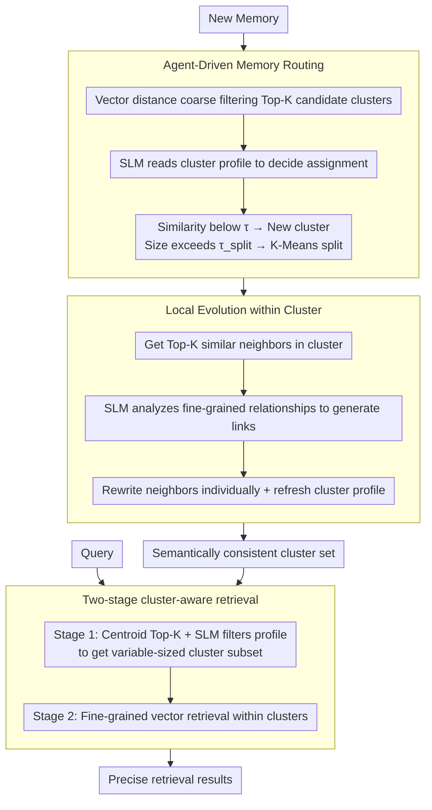

# CLAG: Adaptive Memory Organization via Agent-Driven Clustering for Small Language Model Agents

**Conference**: ACL 2026 Findings  
**arXiv**: [2603.15421](https://arxiv.org/abs/2603.15421)  
**Code**: [https://github.com/dmis-lab/CLAG](https://github.com/dmis-lab/CLAG)  
**Area**: Model Compression  
**Keywords**: Small Language Models, Clustered Memory, Agent Memory Management, Local Evolution, Two-stage Retrieval

## TL;DR
This paper proposes CLAG, a clustering-based Agent memory framework. It organizes memories into semantically consistent clusters via SLM-driven routing, performs local evolutionary updates within clusters, and filters noise through two-stage retrieval, significantly outperforming global memory pool baselines on multiple QA datasets.

## Background & Motivation

**Background**: LLM Agents increasingly rely on external memory systems to support knowledge reuse and complex reasoning. Existing Agent memory systems have evolved from static RAG (append-only, global retrieval) to frameworks supporting active evolution (e.g., A-mem, MemoryOS, GAM), which allow for reflection, compression, and rewriting.

**Limitations of Prior Work**: These evolutionary memory systems still operate within a single global memory pool. As memory grows, global retrieval faces two coupled issues: (1) the expansion of the search space increases the probability of retrieving semantically similar but task-irrelevant memories; (2) memory evolution mechanisms are exposed to neighborhoods with mixed topics, which can mislead updates and gradually degrade memory quality.

**Key Challenge**: These issues are particularly severe for Small Language Models (SLMs), as SLMs are extremely sensitive to irrelevant contexts. Cross-topic interference in a global memory pool significantly impacts the quality of SLM responses.

**Goal**: Design a lightweight structured memory system for SLM Agents that maintains self-evolution capabilities while reducing cross-topic interference.

**Key Insight**: Drawing on principles from cognitive science—where "new information should refine relevant schemas without disturbing irrelevant memory structures"—clustering is treated as an active operation controlled by the Agent rather than a static preprocessing step.

**Core Idea**: Use SLM Agent-driven online clustering to organize memories into semantically consistent neighborhoods, restricting evolution and retrieval to local clusters to fundamentally reduce cross-topic interference.

## Method

### Overall Architecture
CLAG is an inference-time, training-free structured memory framework designed to liberate SLM Agents from cross-topic interference while maintaining self-evolution. Its inputs are a continuous stream of new memories and queries; internally, it organizes memories into a set of semantically consistent clusters, and the output is precise retrieval results filtered by clustering. The entire pipeline consists of three stages: Agent routing sends each new memory to the most relevant cluster, local evolution updates and integrates relevant memories only within that cluster, and two-stage retrieval filters clusters before performing fine-grained matching inside them. Notably, the three types of decisions—routing, evolution, and selection—are all handled by the same SLM backbone, simply using different role-specific prompts.

### Key Designs

**1. Agent-Driven Memory Routing: Letting the SLM rather than pure vectors decide memory assignment**

Deciding which cluster a memory belongs to often fails with vector distance alone due to subtle semantic differences. CLAG thus designs a two-stage routing: the system first undergoes a cold-start phase, buffering memories until the number of processed memories reaches $n$, after which InitializeClusters establishes initial clusters. Subsequently, for each new memory, vector distance is used to coarse-filter Top-K candidate clusters, which are then handed to the SLM Agent to make a final ruling by reading the semantic profiles of the candidates. If the cosine similarity with all clusters is below a threshold $\tau$, a new cluster is created; when a cluster size exceeds $\tau_{split}$, it is automatically split using K-Means to prevent semantic drift. Coarse filtering ensures efficiency, SLM review ensures accuracy, and adaptive splitting ensures clear cluster boundaries over time.

**2. Local Evolution within Clusters: Confining memory updates to semantically consistent neighborhoods**

Memory evolution is most prone to issues when updates occur in topic-mixed global pools, where similar but irrelevant memories mislead rewriting and degrade quality. CLAG draws on the cognitive principle that "new experience primarily reshapes related concepts rather than disturbing irrelevant knowledge," strictly limiting evolution within clusters. After a new memory $m_{new}$ is routed to a cluster, it only searches for the Top-K most similar neighbors $\mathcal{M}_{local}$ within that cluster. The SLM Agent first analyzes fine-grained relationships (causal, temporal, etc.) to generate links $L_{new}$, then judges if each neighbor needs rewriting to reflect new information: $m_j^* \leftarrow \text{SLM}(m_{new} \| \mathcal{M}_{local} \setminus \{m_j\} \| m_j)$. The evolved memories replace the originals, and the cluster profile is refreshed. Consequently, each cluster becomes a self-contained, self-optimizing module where local updates do not pollute other topics.

**3. Two-stage Cluster-Aware Retrieval: High-level semantic filtering before fine-grained matching**

Major noise in global retrieval comes from memories that are semantically similar but belong to different topics, which is particularly fatal for fragile SLMs. CLAG splits retrieval into two stages: Stage 1 embeds the query and calculates its distance to cluster centroids to get Top-K candidate clusters, then uses the SLM Agent to evaluate the match between each candidate cluster's profile and the query, returning a variable-sized subset of clusters. Stage 2 performs fine-grained vector retrieval only among members of the selected clusters. Using cluster profiles for high-level semantic filtering significantly reduces the search space and ensures the SLM only processes narrowed-down candidates, avoiding its sensitivity to irrelevant context.

### Loss & Training
Training-free; the framework runs at inference time. Routing, evolution, and retrieval decisions are all completed via SLM prompt calls.

## Key Experimental Results

### Main Results (Three SLM backbones × Three datasets)

| Model | Method | LoCoMo F1 | HotpotQA F1 | BioASQ F1 |
|------|------|-----------|-------------|-----------|
| Qwen3-0.6B | RAG | 12.90 | 11.75 | 2.40 |
| Qwen3-0.6B | A-mem | 14.29 | 12.04 | 3.61 |
| Qwen3-0.6B | GAM | 16.05 | 7.81 | 3.40 |
| Qwen3-0.6B | **CLAG** | **20.99** | **15.50** | **22.01** |
| Llama3.2-1B | GAM | 22.63 | 13.85 | 6.52 |
| Llama3.2-1B | **CLAG** | **21.05** | **14.20** | **10.16** |

### Latency Comparison (Qwen3-0.6B)

| Method | Retrieval Latency (ms) | End-to-End Latency (ms) |
|------|-------------|---------------|
| RAG | 17.80 | 289.60 |
| GAM | 8303.41 | 17934.32 |
| CLAG | 142.43 | 514.14 |

### Key Findings
- CLAG shows the most significant improvement on BioASQ (Qwen3-0.6B: 2.40→22.01) because biomedical QA has high topic diversity, making cluster filtering most effective.
- In terms of latency, CLAG is far superior to GAM (514ms vs 17934ms) because it avoids global evolution operations.
- On adversarial question subsets of LoCoMo, CLAG's advantage is particularly prominent (50.34 vs GAM 41.25), indicating that clustering effectively suppresses interference.
- MemoryOS performs exceptionally poorly on small models (significantly lower than the RAG baseline), suggesting its design is unsuitable for SLMs.

## Highlights & Insights
- **Clustering as Agent Operations**: Clustering is elevated from a static preprocessing step to an online operation actively controlled by the Agent, with cluster quality improving continuously alongside interactions. This "structure as intelligence" approach is generalizable to other long-term memory scenarios.
- **Local Evolution Avoids Global Pollution**: Restricting evolution to clusters makes each cluster a self-contained optimization unit. This is similar to the design philosophy of modular neural networks—local updates do not affect the global state.
- **SLM-Friendly Design**: Two-stage retrieval significantly reduces the search space before SLM processing, effectively bypassing the fragility of small models toward irrelevant contexts.

## Limitations & Future Work
- Cluster initialization requires accumulating a certain amount of memory (cold-start problem), preventing clustering benefits in the initial stage.
- The quality upper bound of the SLM acting as a router is limited by the model's capability; routing may be inaccurate for topics with blurred semantic boundaries.
- Lack of experiments on Large Language Models makes it impossible to confirm if clustering is equally effective for larger models.
- Automatic management of the number of clusters (split thresholds) requires hyperparameter tuning per domain.

## Related Work & Insights
- **vs A-mem**: A-mem evolves in a global pool, leading to severe cross-topic interference. CLAG restricts evolution within clusters, improving F1 from 14.29 to 20.99 on Qwen3-0.6B.
- **vs GAM**: GAM's global evolution results in extremely high latency (17934ms). CLAG's local evolution within clusters takes only 514ms, approximately 35 times faster.
- **vs MemoryOS**: MemoryOS performance collapses on SLMs (lower than RAG baseline), indicating its design assumes stronger model capabilities. CLAG is specifically optimized for SLMs.

## Rating
- Novelty: ⭐⭐⭐⭐ Agent-driven online clustering and local evolution form a meaningful new combination.
- Experimental Thoroughness: ⭐⭐⭐⭐ Three datasets and three models with thorough latency analysis.
- Writing Quality: ⭐⭐⭐⭐ Concepts are clear, and analogies to cognitive science are appropriate.
- Value: ⭐⭐⭐⭐ Provides a practical solution for SLM Agent memory issues.

<!-- RELATED:START -->

## Related Papers

- [\[ACL 2026\] Lightweight LLM Agent Memory with Small Language Models](lightweight_llm_agent_memory_with_small_language_models.md)
- [\[ACL 2026\] Meta-Tool: Efficient Few-Shot Tool Adaptation for Small Language Models](meta-tool_efficient_few-shot_tool_adaptation_for_small_language_models.md)
- [\[ACL 2026\] Context-Value-Action Architecture for Value-Driven Large Language Model Agents](context-value-action_architecture_for_value-driven_large_language_model_agents.md)
- [\[CVPR 2026\] Universal Guideline-Driven Image Clustering via a Hybrid LLM Agent](../../CVPR2026/llm_agent/universal_guideline-driven_image_clustering_via_a_hybrid_llm_agent.md)
- [\[ACL 2026\] Polaris: A Gödel Agent Framework for Small Language Models through Experience-Abstracted Policy Repair](polaris_a_gödel_agent_framework_for_small_language_models_through_experience-abs.md)

<!-- RELATED:END -->
