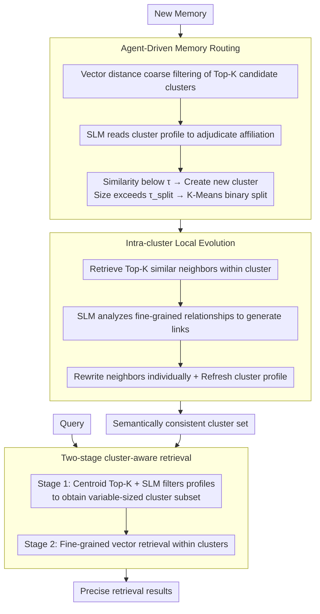

# CLAG: Adaptive Memory Organization via Agent-Driven Clustering for Small Language Model Agents

**Conference**: ACL 2026 Findings  
**arXiv**: [2603.15421](https://arxiv.org/abs/2603.15421)  
**Code**: [https://github.com/dmis-lab/CLAG](https://github.com/dmis-lab/CLAG)  
**Area**: Model Compression  
**Keywords**: Small Language Models, Clustering Memory, Agent Memory Management, Local Evolution, Two-stage Retrieval

## TL;DR
This paper proposes CLAG, a cluster-based Agent memory framework. It organizes memories into semantically consistent clusters via SLM-driven routing, performs local evolutionary updates within clusters, and filters noise through two-stage retrieval. It significantly outperforms global memory pool baselines across multiple QA datasets.

## Background & Motivation

**Background**: LLM Agents increasingly rely on external memory systems to support knowledge reuse and complex reasoning. Existing Agent memory systems have evolved from static RAG (append-only, global retrieval) to frameworks supporting active evolution (e.g., A-mem, MemoryOS, GAM) that can perform reflection, compression, and rewriting.

**Limitations of Prior Work**: These evolutionary memory systems still operate within a single global memory pool. As memory grows, global retrieval faces two coupled issues: (1) the expansion of search space increases the probability of retrieving semantically similar but task-irrelevant memories; (2) memory evolution mechanisms are exposed to neighborhoods with mixed topics, which may mislead updates and gradually degrade memory quality.

**Key Challenge**: These issues are particularly severe for Small Language Models (SLMs), as SLMs are extremely sensitive to irrelevant context. Cross-topic interference in global memory pools significantly impacts the response quality of SLMs.

**Goal**: To design a lightweight structured memory system for SLM Agents that maintains self-evolution capabilities while reducing cross-topic interference.

**Key Insight**: Borrowing from the cognitive science principle that "new information should refine relevant schemas without disturbing unrelated memory structures," clustering is treated as an operation actively controlled by the Agent rather than a static preprocessing step.

**Core Idea**: Use SLM Agent-driven online clustering to organize memory into semantically consistent neighborhoods, restricting evolution and retrieval to local clusters to fundamentally reduce cross-topic interference.

## Method

### Overall Architecture
CLAG is a training-free structured memory framework that runs at inference time, aiming to free SLM Agents from cross-topic interference in global memory pools while maintaining self-evolution capabilities. Its input consists of a continuous stream of new memories and queries; it organizes memories into a set of semantically consistent clusters, and the output is precise retrieval results filtered by those clusters. The pipeline is connected by three stages: Agent routing sends each new memory to the most relevant cluster, local evolution updates and integrates relevant memories only within that cluster, and two-stage retrieval first filters clusters and then performs fine-grained matching within those clusters. Notably, the three types of decisions—routing, evolution, and selection—are all handled by the same SLM backbone, using different role-specific prompts.

### Key Designs

**1. Agent-driven Memory Routing: Letting SLM rather than pure vectors determine memory affiliation**

Determining which cluster a memory belongs to often fails with pure vector distance due to subtle semantic differences. CLAG thus designs a two-stage routing: the system first undergoes a cold-start phase, buffering memories until the number of processed memories reaches $n$, after which `InitializeClusters` establishes initial clusters. Subsequently, for each new memory, vector distance is used to coarse-filter Top-K candidate clusters, which are then handed to the SLM Agent to make a final adjudication by reading the semantic profiles of the candidates. If the cosine similarity with all clusters is below a threshold $\tau$, a new cluster is created. When a cluster size exceeds $\tau_{split}$, it is automatically split using K-Means to prevent semantic drift caused by cluster expansion. Coarse filtering ensures efficiency, SLM review ensures precision, and adaptive splitting ensures clear cluster boundaries over time.

**2. Intra-cluster Local Evolution: Confining memory updates to semantically consistent neighborhoods**

The most error-prone aspect of memory evolution is updating within a topic-mixed global pool, where similar but irrelevant memories mislead rewriting and gradually degrade quality. CLAG draws on the cognitive principle that "new experiences primarily reshape relevant concepts rather than disturbing irrelevant knowledge," strictly limiting evolution to within clusters. After a new memory $m_{new}$ is routed to a cluster, it only seeks the Top-K most similar neighbors $\mathcal{M}_{local}$ within that cluster. The SLM Agent first analyzes fine-grained relationships (causality, temporal, etc.) to generate links $L_{new}$, then judges each neighbor individually to decide if it needs rewriting to reflect new information: $m_j^* \leftarrow \text{SLM}(m_{new} \| \mathcal{M}_{local} \setminus \{m_j\} \| m_j)$. Evolved memories replace the original ones, and the cluster profile is refreshed. Consequently, each cluster becomes a self-contained, self-optimizing module where local updates do not contaminate other topics.

**3. Two-stage Cluster-aware Retrieval: High-level semantic filtering followed by fine-grained matching**

Mainstream noise in global retrieval comes from memories that are semantically similar but belong to different topics, which is particularly fatal for fragile SLMs. CLAG splits retrieval into two stages: Stage 1 embeds the query and calculates its distance to each cluster centroid to select Top-K candidate clusters, after which the SLM Agent evaluates the match between each candidate cluster's profile and the query, returning a variable-sized subset of clusters. Stage 2 then performs fine-grained vector retrieval within the members of the selected clusters. Using cluster profiles for high-level semantic filtering significantly narrows the search space before letting the SLM process the restricted candidates, effectively avoiding the SLM's sensitivity to irrelevant context.

### Loss & Training
No training is required; the framework operates at inference time. Routing, evolution, and retrieval decisions are all completed via prompt calls to the SLM.

## Key Experimental Results

### Main Results (Three SLM backbones × Three datasets)

| Model | Method | LoCoMo F1 | HotpotQA F1 | BioASQ F1 |
|------|------|-----------|-------------|-----------|
| Qwen3-0.6B | RAG | 12.90 | 11.75 | 2.40 |
| Qwen3-0.6B | A-mem | 14.29 | 12.04 | 3.61 |
| Qwen3-0.6B | GAM | 16.05 | 7.81 | 3.40 |
| Qwen3-0.6B | **CLAG** | **20.99** | **15.50** | **22.01** |
| Llama3.2-1B | GAM | 22.63 | 13.85 | 6.52 |
| Llama3.2-1B | **CLAG** | **21.05** | **14.20** | **10.16** |

### Latency Comparison (Qwen3-0.6B)

| Method | Retrieval Latency (ms) | End-to-End Latency (ms) |
|------|-------------|---------------|
| RAG | 17.80 | 289.60 |
| GAM | 8303.41 | 17934.32 |
| CLAG | 142.43 | 514.14 |

### Key Findings
- CLAG shows the most significant improvement on BioASQ (Qwen3-0.6B: 2.40→22.01) because biomedical QA has high topic diversity, making cluster filtering most effective.
- Regarding latency, CLAG is far superior to GAM (514ms vs 17934ms) as it avoids global evolution operations.
- On the adversarial question subset of LoCoMo, CLAG's advantage is particularly prominent (50.34 vs GAM 41.25), indicating that clustering effectively suppresses interfering memories.
- MemoryOS performs exceptionally poorly on small models (significantly below the RAG baseline), suggesting its design is unsuitable for SLMs.

## Highlights & Insights
- **Clustering as an Agent Operation**: Clustering is elevated from static preprocessing to an online operation actively controlled by the Agent, with cluster quality improving continuously as interactions accumulate. This "structure as intelligence" approach is generalizable to other long-term memory scenarios.
- **Local Evolution Avoids Global Contamination**: Limiting evolution to within clusters makes each cluster a self-contained unit of optimization. This is analogous to the design philosophy of modular neural networks—local updates do not affect the global state.
- **SLM-Friendly Design**: Two-stage retrieval significantly reduces the search space before SLM processing, effectively bypassing the vulnerability of small models to irrelevant context.

## Limitations & Future Work
- Cluster initialization requires accumulating a certain amount of memory (cold-start problem), and benefits of clustering are unavailable in the initial stage.
- The upper bound of routing quality is limited by the SLM's capability as a router; it may miss-route topics with ambiguous semantic boundaries.
- Lack of experiments on Large Language Models (LLMs) makes it impossible to confirm if clustering is equally effective for larger models.
- Automatic management of the number of clusters (split thresholds) may require domain-specific tuning.

## Related Work & Insights
- **vs A-mem**: A-mem evolves in a global pool, suffering from severe cross-topic interference. CLAG restricts evolution to clusters, improving F1 on Qwen3-0.6B from 14.29 to 20.99.
- **vs GAM**: Global evolution in GAM leads to extremely high latency (17934ms). CLAG's local evolution within clusters takes only 514ms, 35x faster.
- **vs MemoryOS**: MemoryOS performance collapses on SLMs (below RAG baseline), indicating its design assumes stronger model capabilities. CLAG is specifically optimized for SLMs.

## Rating
- Novelty: ⭐⭐⭐⭐ Agent-driven online clustering and local evolution form a meaningful new combination.
- Experimental Thoroughness: ⭐⭐⭐⭐ Three datasets and three models, with comprehensive latency analysis.
- Writing Quality: ⭐⭐⭐⭐ Concepts are clear, and analogies to cognitive science are appropriate.
- Value: ⭐⭐⭐⭐ Provides a practical solution for SLM Agent memory issues.

<!-- RELATED:START -->

## Related Papers

- [\[ACL 2026\] Lightweight LLM Agent Memory with Small Language Models](lightweight_llm_agent_memory_with_small_language_models.md)
- [\[ACL 2026\] Meta-Tool: Efficient Few-Shot Tool Adaptation for Small Language Models](meta-tool_efficient_few-shot_tool_adaptation_for_small_language_models.md)
- [\[ACL 2026\] Context-Value-Action Architecture for Value-Driven Large Language Model Agents](context-value-action_architecture_for_value-driven_large_language_model_agents.md)
- [\[CVPR 2026\] Universal Guideline-Driven Image Clustering via a Hybrid LLM Agent](../../CVPR2026/llm_agent/universal_guideline-driven_image_clustering_via_a_hybrid_llm_agent.md)
- [\[ICML 2026\] AdaMEM: Test-Time Adaptive Memory for Language Agents](../../ICML2026/llm_agent/adamem_test-time_adaptive_memory_for_language_agents.md)

<!-- RELATED:END -->
