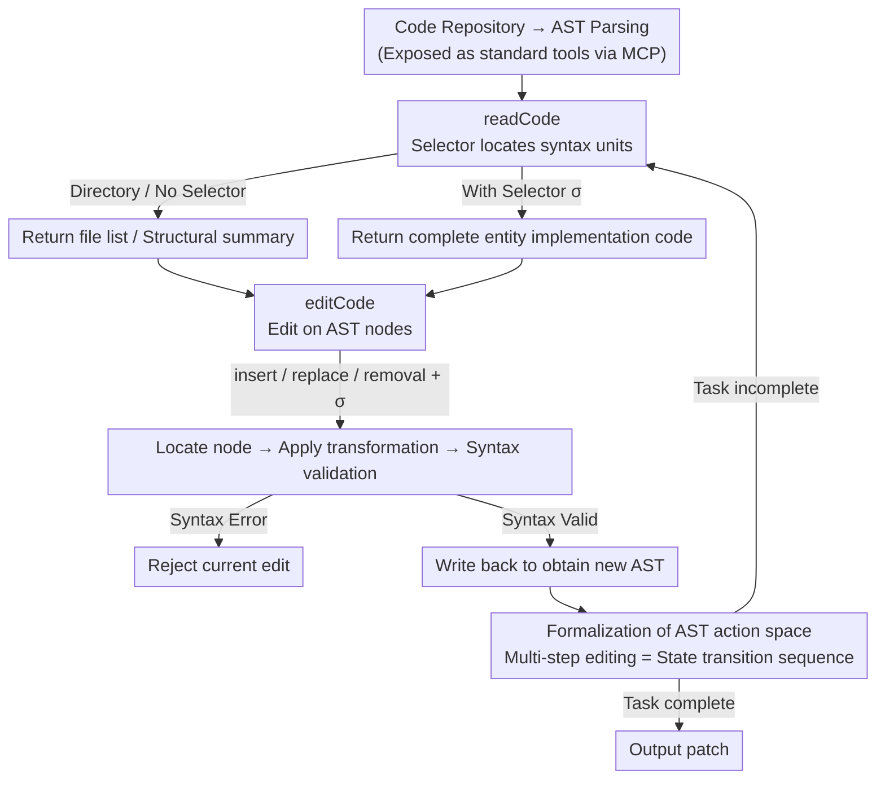

# CodeStruct: Code Agents over Structured Action Spaces

**Conference**: ACL 2026  
**arXiv**: [2604.05407](https://arxiv.org/abs/2604.05407)  
**Code**: [https://github.com/amazon-science/CodeStruct](https://github.com/amazon-science/CodeStruct)  
**Area**: LLM Agent / Code Intelligence  
**Keywords**: Code Agent, AST structured operations, Code editing, SWE-Bench, Action space

## TL;DR
This paper proposes the CodeStruct framework, which redefines code repositories as AST-based structured action spaces. It enables LLM code agents to perform read and edit operations through named program entities (rather than text snippets), achieving a $1.2-5.0\%$ accuracy improvement on SWE-Bench Verified while reducing token consumption by $12-38\%$.

## Background & Motivation

**Background**: LLM code agents (such as SWE-Agent) are already capable of handling complex repository-level software engineering tasks. Current mainstream methods interact with code via file reading and text editing tools, with some systems supplemented by repository maps or symbol indices to improve navigation.

**Limitations of Prior Work**: Existing agents treat code as flat text rather than a structured product, leading to a fundamental abstraction mismatch: when reading code, they either load entire files (introducing irrelevant context) or truncate by line numbers (leading to function cutoff); when editing code, they rely on string matching and replacement, where formatting drifts cause "no match" errors and repetitive patterns lead to "multiple match" errors.

**Key Challenge**: Source code naturally possesses a precise grammatical structure—functions, classes, and methods are named program entities—yet LLM agents are forced to operate on these structured objects indirectly through line numbers and string patterns. Enhancement schemes only improve "where to look" without changing the fundamental "how to interact."

**Goal**: To design an AST-based structured action space that allows agents to directly read and modify code via named semantic entities.

**Key Insight**: Human developers refer to and modify code using function names and class names rather than line numbers. CodeStruct exposes this natural working style directly to LLM agents.

**Core Idea**: Parse the code repository into an AST and provide two structure-aware primitive operations, `readCode` and `editCode`. Agents locate and manipulate program entities through selectors like `file.py::ClassName::method`.

## Method

### Overall Architecture
CodeStruct re-represents the code repository from flat text as an AST-driven structured environment, allowing agents to read and write directly in units of named program entities instead of indirectly via line numbers and string patterns. The agent's action space consists of two primitives: structure-aware code retrieval (`readCode`) and structure-aware code modification (`editCode`). Both use selectors in the form of `file.py::ClassName::method` to locate target AST nodes and support fuzzy matching. The entire interface is exposed as standard tools via the MCP protocol, enabling plug-and-play integration with any agent framework without modifying the agent's planning or execution logic.

### Key Designs

**1. readCode: Reading complete syntax units with selectors instead of line number truncation**

Traditional file reading faces a dilemma in "how much to read"—loading the entire file introduces excessive irrelevant context, while truncating by line numbers often cuts functions in half. `readCode` implements three-tier navigation from coarse to fine: when the input is a directory, it returns a file list; when the input is a file without a selector, it returns the full text for small files and a structural summary (top-level entity signatures and scope names) for large files; once a selector $\sigma$ is provided, it locates the matching entity node in the AST and returns its complete implementation code. Selectors support both scopeless (e.g., `load`) and scoped (e.g., `User.load`) forms, resolved via deterministic name-based fuzzy matching. Since the returned content is always a complete syntax unit, the agent is neither submerged in irrelevant code nor reliant on fragile line numbers.

**2. editCode: Editing on AST nodes, separating semantic intent from textual implementation**

The root problem of text-level editing is fragile string matching—formatting shifts lead to "no match," repetitive patterns lead to "multiple matches," and agents often must re-generate unchanged code. Given an operation type $\omega \in \{\text{insert}, \text{replace}, \text{removal}\}$ and a selector $\sigma$, `editCode` first locates the target AST node, then calculates its local indentation context, applies the transformation, and validates if the modified code is syntactically valid via AST parsing before writing back—rejecting the edit if a syntax error is present. In replacement operations, the agent only provides the signature and new content, without redundantly restating unchanged parts. Consequently, the agent is responsible for specifying "what to change" while the tool handles "how to change," eliminating string matching fragility and saving tokens on redundant generation.

**3. Formalization of AST Action Space: Modeling multi-step editing as analyzable state transition sequences**

CodeStruct further abstracts the entire editing process into structured action trajectories over AST states: each `editCode` transforms the current AST into a new, syntactically valid AST. Multi-step editing thus forms an explicit, traceable sequence of state transitions. Compared to text diffs, which are difficult to parse as modification records, this structured representation makes agent behavior traceable and debuggable, providing a more solid foundation for post-hoc analysis and improvement of code agents.

### Loss & Training
CodeStruct does not involve model training—it is an inference-time tool interface. Exposed as standard tools through the MCP protocol, it can be directly integrated with any LLM.

## Key Experimental Results

### Main Results (SWE-Bench Verified, 500 tasks)

| Model | Text Pass@1 | CodeStruct Pass@1 | Gain | Token Reduction |
|------|------------|-------------------|------|----------|
| GPT-5-nano | 17.2% | 38.0% | +20.8pp | Increase |
| Claude-3.5-Sonnet | 49.0% | 50.2% | +1.2% | 12% |
| GPT-4o | 33.2% | 38.2% | +5.0% | 38% |
| Claude-3.7-Sonnet | 57.4% | 59.4% | +2.0% | 24% |

CodeAssistBench (135 multi-turn programming tasks): All models showed a $0.8-4.4\%$ Improvement, with costs reduced by up to $33\%$.

### Ablation Study

| Analysis Dimension | Finding |
|---------|------|
| Empty Patch Rate (GPT-5-nano) | Text: 46.6% → CodeStruct: 7.2% (84.5% reduction) |
| Edit Failure Types | "No match" and "multiple match" errors significantly reduced |
| Token Consumption per Step | Retrieval operations saw more significant reduction (retrieving only target entities) |

### Key Findings
- CodeStruct yields the highest gains when text interface fragility (rather than insufficient reasoning capability) is the primary bottleneck for code agents.
- The reduction of GPT-5-nano's empty patch rate from $46.6\%$ to $7.2\%$ is the strongest evidence.
- For stronger models (e.g., Claude-3.7-Sonnet), it still provides stable but smaller gains while significantly reducing token consumption.
- Token consumption for GPT-5-nano increased with CodeStruct because structured operations enabled it to continue exploration that previously terminated due to failure.

## Highlights & Insights
- **Abstraction Alignment Principle**: The abstraction level of the tool interface should align with the abstraction level of the manipulated object. Code is structured, thus tools for manipulating code should also be structured. This principle can be generalized to agent design in other domains.
- **Tool Design over Model Capability**: The $20.8\text{pp}$ gain for GPT-5-nano demonstrates that in certain scenarios, improving tool design is more effective than switching to a larger model.
- **Plug-and-play Integration via MCP**: Exposure through a standard tool protocol allows integration without modifying the agent's planning or execution logic, significantly lowering the barrier to adoption.

## Limitations & Future Work
- Currently only supports AST parsing for Python, not yet extended to other programming languages.
- Fuzzy matching may produce ambiguities in large repositories.
- Syntax validation only checks AST-level correctness and does not guarantee semantic correctness.
- Integration with agent training remains unexplored—training with structured tools from the start may yield better results.

## Related Work & Insights
- **vs SWE-Agent**: SWE-Agent provides file maps and text editing tools; CodeStruct upgrades low-level operations from the text level to the AST level.
- **vs GumTree**: GumTree computes AST edit scripts for offline comparison; CodeStruct exposes AST operations as real-time decision primitives for agents.
- **vs Code2Vec**: Code2Vec uses ASTs for code representation learning (single prediction); CodeStruct uses ASTs for the action space in multi-turn interactions.

## Rating
- Novelty: ⭐⭐⭐⭐ Utilizing ASTs as an agent action space is a simple yet far-reaching design.
- Experimental Thoroughness: ⭐⭐⭐⭐⭐ 6 LLMs, 2 benchmarks, and detailed failure analysis.
- Writing Quality: ⭐⭐⭐⭐⭐ Clear problem definition, precise methodology description, and in-depth experimental analysis.
- Value: ⭐⭐⭐⭐⭐ Extremely high utility—zero training cost, plug-and-play, and significant improvements.

<!-- RELATED:START -->

## Related Papers

- [\[ACL 2026\] PersonaAgent: Bridging Memory and Action for Personalized LLM Agents](personaagent_bridging_memory_and_action_for_personalized_llm_agents.md)
- [\[ACL 2026\] StructMem: Structured Memory for Long-Horizon Behavior in LLMs](structmem_structured_memory_for_long-horizon_behavior_in_llms.md)
- [\[AAAI 2026\] Reflection-Driven Control for Trustworthy Code Agents](../../AAAI2026/llm_agent/reflection-driven_control_for_trustworthy_code_agents.md)
- [\[ACL 2026\] Context-Value-Action Architecture for Value-Driven Large Language Model Agents](context-value-action_architecture_for_value-driven_large_language_model_agents.md)
- [\[ICLR 2026\] Go-Browse: Training Web Agents with Structured Exploration](../../ICLR2026/llm_agent/go-browse_training_web_agents_with_structured_exploration.md)

<!-- RELATED:END -->
