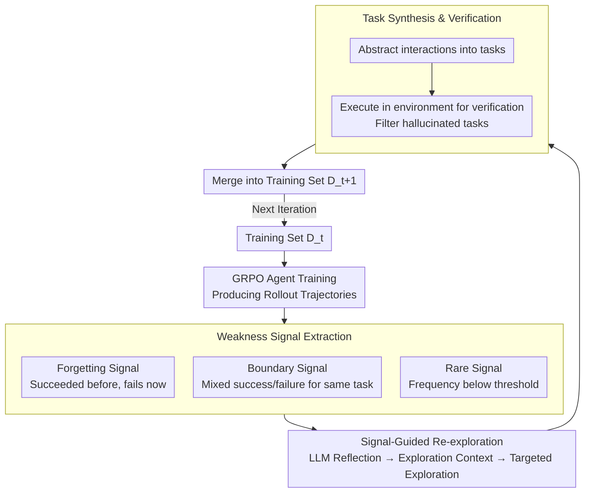

# CoEvolve: Training LLM Agents via Agent-Data Mutual Evolution

**Conference**: ACL 2026  
**arXiv**: [2604.15840](https://arxiv.org/abs/2604.15840)  
**Code**: [https://github.com/AMAP-ML/CoEvolve](https://github.com/AMAP-ML/CoEvolve)  
**Area**: LLM Agent  
**Keywords**: Agent training, data synthesis, co-evolution, forgetting signals, reinforcement learning

## TL;DR
CoEvolve proposes an **agent-data mutual evolution framework** that extracts three types of weakness signals—forgetting, boundary, and rare patterns—from training trajectories to guide targeted environment re-exploration and task synthesis. This enables the training data distribution to dynamically adapt to agent capabilities, yielding absolute gains of 19-23% on AppWorld and BFCL.

## Background & Motivation

**Background**: LLM Agents are typically trained via Reinforcement Learning (RL) in interactive environments. However, the source of training data remains a core bottleneck—either relying on human expert trajectories (expensive and limited in coverage) or utilizing static LLM-synthesized data (lacking feedback and failing to adapt to agent evolution).

**Limitations of Prior Work**: (1) Human trajectories act as "static snapshots" that fail to cover real-world long-tail variations (e.g., failing if a button label changes from "Book Now" to "Reserve Now"); (2) while LLM-synthesized data reduces human reliance, it is often based on random exploration, resulting in shallow and incomplete environment coverage; (3) crucially, synthesized data is static and does not adjust as the agent evolves—resulting in over-training on mastered skills while neglecting weaknesses.

**Key Challenge**: There is a mismatch where agent capabilities change continuously, but the training data distribution remains fixed. This lack of closed-loop feedback leads to low training efficiency and hampers sustained improvement.

**Goal**: Design a framework without human supervision that allows the training data distribution to evolve dynamically with the agent's weaknesses, achieving a closed loop of "Agent Improvement → Identify New Weaknesses → Targeted Data Synthesis → Further Agent Improvement."

**Key Insight**: Use trajectory replay signals from the training process (forgetting, boundary, and rare patterns) to identify specific agent weaknesses and use these as conditions to guide directional environment exploration.

**Core Idea**: Extract weakness signals from RL rollout trajectories, conditionally guide the LLM to re-explore the environment, synthesize new tasks targeting these weaknesses, and update the training distribution to form an agent-data mutual evolution loop.

## Method

### Overall Architecture
CoEvolve addresses the mismatch between "static training data and dynamic agent capabilities" by coupling data synthesis to the agent's current weaknesses. In each iteration, the agent is first trained in the environment using GRPO to produce rollout trajectories. The system extracts forgetting, boundary, and rare patterns from these trajectories. These signals, along with failed trajectories, are fed to an LLM to reflect and generate structured exploration contexts, guiding it back to targeted areas in the environment. New interaction patterns are abstracted into tasks, verified by the environment, and merged into the next training set. This "train → identify weaknesses → synthesize targeted data → retrain" cycle ensures the data distribution evolves alongside the agent.

### Key Designs

**1. Three Types of Weakness Signal Extraction: Locating Specific Shortcomings**

The issue with random data synthesis is its ignorance of specific agent weaknesses, wasting computation on mastered skills. CoEvolve extracts three complementary signals from rollouts: Forgetting signals detect capacity degradation using a sliding window—if there was a success ($\exists s_i \geq 0.5$) in the last $W$ attempts but a current failure ($s_{\text{now}} < 0.5$), the agent has "forgotten" a previously learned skill. Boundary signals capture unstable behavior where a single task yields both successes and failures within $K$ sampled trajectories, indicating the agent is at a decision boundary. Rare signals identify under-explored patterns where the frequency of an action pattern is above zero but below a threshold ($c_p/N < \theta/100$). Together, these map out capacity degradation, instability, and exploration blind spots.

**2. Signal-Guided Environment Re-exploration: Learning with Failure Contexts**

Knowing the weaknesses is insufficient; they must be converted into explorable directions. CoEvolve provides LLMs with failed trajectories (task descriptions, action sequences, environment feedback) marked by signals. The LLM reflects on the failure and generates a structured exploration context, specifying exactly where and how the agent failed or showed instability. The LLM then uses this context as a target to re-interact with the environment, discovering new interaction patterns and task variants relevant to the weakness.

**3. Task Synthesis and Environment Verification: Solidifying Interactions into Training Tasks**

Interactions discovered during re-exploration can contain LLM hallucinations. CoEvolve abstracts these interactions into reusable task descriptions and re-executes them in the environment for verification. Only tasks that are executable and produce valid feedback are merged into the next training set $\mathcal{D}_{t+1}$. The entire pipeline—exploration, synthesis, and verification—requires no human intervention, as the environment acts as an objective judge.

### Loss & Training
The agent is trained using GRPO: for each task, $K$ trajectories are sampled, policy gradients are calculated based on relative advantages within the group, and KL divergence regulates the policy to prevent it from drifting too far from the reference model. Signals are extracted and data is updated after each training iteration.

## Key Experimental Results

### Main Results

| Model | AppWorld-TestN TGC | AppWorld-TestC TGC | BFCL Multi-turn | Average Gain |
|--------|------|------|------|------|
| Qwen2.5-7B + CoEvolve | 27.98 (+26.79) | 8.39 (+7.67) | 61.50 (+48.00) | **+19.43%** |
| Qwen3-4B + CoEvolve | 35.71 (+19.04) | 17.03 (+9.12) | 63.00 (+36.50) | **+15.58%** |
| Qwen3-30B-A3B + CoEvolve | 54.76 (+23.21) | 31.65 (+11.75) | 63.00 (+19.50) | **+18.14%** |

### Ablation Study

| Configuration | Key Metrics | Description |
|------|---------|------|
| Forgetting Signal Only | Effective but incomplete | Only captures capability degradation |
| Boundary Signal Only | Effective but incomplete | Only captures unstable behavior |
| Rare Signal Only | Effective but incomplete | Only captures under-exploration |
| Joint Three Signals | **Best** | Comprehensive coverage of complementary weaknesses |
| W/O Environment Verification | Significant drop | Hallucinated tasks introduce noise |

### Key Findings
- CoEvolve improves Qwen2.5-7B from nearly unusable (1.19%) to a competitive level (27.98%).
- On BFCL, Qwen2.5-7B+CoEvolve reaches 61.50%, surpassing GPT-4 (54.00%), demonstrating that data quality can compensate for model scale.
- Qwen3-30B-A3B+CoEvolve reaches 54.76% on AppWorld-TestN, approaching Claude-Sonnet-4.5 (73.81%).
- The three signals are complementary; using any single signal is inferior to the combined approach.

## Highlights & Insights
- **"Forgetting signals" as a data selection criterion** is a clever design: borrowing the concept of forgetting events from curriculum learning to guide data synthesis rather than just selection.
- The **closed-loop design** (train → find weaknesses → synthesize data → retrain) is more fundamental than simple data augmentation—it allows the training distribution and model capability to co-evolve, serving as a form of adaptive curriculum learning.
- The 7B model outperforming GPT-4 on BFCL proves that "targeted data" is more valuable than "massive random data."

## Limitations & Future Work
- The method requires interaction with real environments for verification, limiting it to scenarios with executable environments (e.g., API calls, web navigation).
- Hyperparameters for signal extraction (sliding window $W$, rare threshold $\theta$) may require tuning for different environments.
- The re-exploration phase depends on a strong LLM for reflection, introducing additional computational costs.
- Direct comparison with other adaptive curriculum learning methods is currently missing.

## Related Work & Insights
- **vs. Static Synthetic Data (Ye et al., 2024; Ding et al., 2024)**: While others generate data offline once, CoEvolve continuously evolves the distribution via closed-loop feedback.
- **vs. Self-Play/Self-Improvement**: These typically optimize trajectories on a fixed query set, whereas CoEvolve discovers entirely new tasks and environment states.

## Rating
- Novelty: ⭐⭐⭐⭐ The closed-loop framework for agent-data mutual evolution is a novel paradigm.
- Experimental Thoroughness: ⭐⭐⭐⭐ Evaluation across multiple models (7B/4B/30B) and benchmarks (AppWorld/BFCL) with detailed ablations.
- Writing Quality: ⭐⭐⭐⭐ Clearly articulated motivation and intuitive workflow diagrams.

<!-- RELATED:START -->

## Related Papers

- [\[ACL 2026\] From Storage to Experience: A Survey on the Evolution of LLM Agent Memory Mechanisms](from_storage_to_experience_a_survey_on_the_evolution_of_llm_agent_memory_mechani.md)
- [\[ACL 2026\] ZARA: Training-Free Motion Time-Series Reasoning via Evidence-Grounded LLM Agents](zara_training-free_motion_time-series_reasoning_via_evidence-grounded_llm_agents.md)
- [\[ACL 2026\] WebClipper: Efficient Evolution of Web Agents with Graph-based Trajectory Pruning](webclipper_efficient_evolution_of_web_agents_with_graph-based_trajectory_pruning.md)
- [\[ACL 2026\] GOAT: A Training Framework for Goal-Oriented Agent with Tools](goat_a_training_framework_for_goal-oriented_agent_with_tools.md)
- [\[ICLR 2026\] Efficient Agent Training for Computer Use](../../ICLR2026/llm_agent/efficient_agent_training_for_computer_use.md)

<!-- RELATED:END -->
