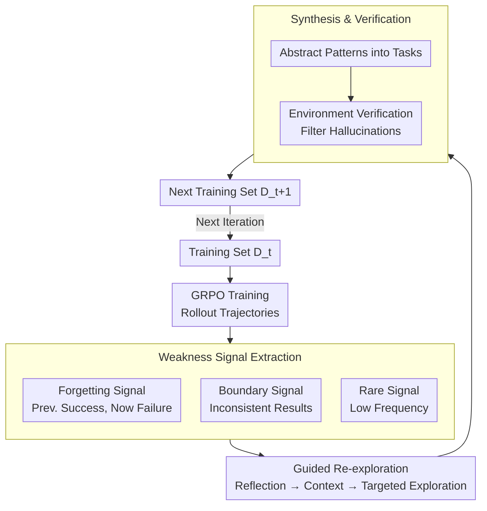

# CoEvolve: Training LLM Agents via Agent-Data Mutual Evolution

**Conference**: ACL 2026  
**arXiv**: [2604.15840](https://arxiv.org/abs/2604.15840)  
**Code**: [https://github.com/AMAP-ML/CoEvolve](https://github.com/AMAP-ML/CoEvolve)  
**Area**: LLM Agent  
**Keywords**: Agent training, data synthesis, coevolution, forgetting signals, reinforcement learning

## TL;DR
CoEvolve proposes an **agent-data coevolution framework** that extracts three types of weakness signals—forgetting, boundary, and rare patterns—from training trajectories to guide targeted environmental re-exploration and task synthesis. By dynamically adapting the training data distribution to the agent's evolving capabilities, it achieves absolute improvements of 19-23% on AppWorld and BFCL.

## Background & Motivation

**Background**: LLM agents are typically trained via Reinforcement Learning (RL) in interactive environments. However, the source of training data remains a critical bottleneck, as it relies either on expensive and limited expert trajectories or static LLM-synthesized data that lacks feedback and fails to adapt to agent evolution.

**Limitations of Prior Work**: (1) Expert trajectories are "static snapshots" that fail to cover real-world long-tail variants (e.g., failure when a button label changes from "Book Now" to "Reserve Now"). (2) Existing synthetic data methods rely on random exploration, resulting in shallow and incomplete environment coverage. (3) Most importantly, synthetic data is static and cannot adjust to the agent's evolving capabilities, leading to over-training on mastered skills while neglecting persistent weaknesses.

**Key Challenge**: While agent capabilities change continuously during training, the training data distribution remains fixed. This lack of closed-loop feedback leads to low training efficiency and stalls continuous improvement.

**Goal**: To design a framework without human supervision where the training data distribution evolves dynamically according to the agent's weaknesses, creating a loop: "agent improvement $\rightarrow$ discovery of new weaknesses $\rightarrow$ targeted data synthesis $\rightarrow$ further agent improvement."

**Key Insight**: Utilize trajectory replay signals (forgetting, boundary, and rare patterns) during training to identify specific agent weaknesses and use these as conditions to guide directional environmental exploration.

**Core Idea**: Extract weakness signals from RL training rollout trajectories to conditionally guide LLMs in re-exploring environments, synthesizing new tasks targeting these weaknesses, and updating the training distribution to form an agent-data coevolution loop.

## Method

### Overall Architecture
CoEvolve addresses the mismatch between "static training data" and "dynamic agent capabilities" by coupling data synthesis with current agent weaknesses. In each iteration, the agent is trained using GRPO to produce rollout trajectories, from which the system extracts forgetting, boundary, and rare signals. These signals, along with failed trajectories, are fed to an LLM to reflect and generate structured exploration contexts, guiding it back into the environment for targeted re-exploration. Newly discovered interaction patterns are abstracted into tasks, verified by the environment, and merged into the next training set.

### Key Designs

**1. Weakness Signal Extraction: Locating specific shortboards from trajectories**

The issue with random synthesis is the lack of knowledge regarding agent weaknesses, leading to wasted computation on mastered skills. CoEvolve extracts three complementary signals: **Forgetting signals** detect regression using a sliding window; if a success exists in the last $W$ attempts ($\exists s_i \geq 0.5$) but the current attempt fails ($s_{\text{now}} < 0.5$), the agent has "forgotten" a learned skill. **Boundary signals** capture instability where a task shows both success and failure across $K$ sampled trajectories, indicating the agent is at a decision boundary. **Rare signals** identify exploration gaps where action patterns appear with frequency $c_p/N < \theta/100$. Together, these provide a comprehensive weakness map.

**2. Signal-Guided Re-exploration: Learning from failed frames**

Identifying weaknesses is insufficient; they must be converted into exploration directions. CoEvolve provides failed trajectories (task descriptions, action sequences, environment feedback) to an LLM to first reflect on failure causes and then generate structured exploration contexts. Using this context, the LLM explores the real environment with a specific "target," discovering new interaction patterns and task variants related to the weakness. Compared to aimless random exploration, this signal-guided approach focuses the exploration budget on the most critical areas.

**3. Task Synthesis & Environment Verification: Solidifying interactions into executable tasks**

Interactions discovered during re-exploration can include LLM hallucinations if used directly. CoEvolve abstracts these patterns into reusable task descriptions and executes them in the environment for verification. Only tasks that are executable and produce valid feedback are merged into the next training set $\mathcal{D}_{t+1}$. This entire pipeline—exploration, synthesis, verification—requires no human intervention, with the environment serving as an objective judge.

### Loss & Training
The agent is trained using Group Relative Policy Optimization (GRPO). For each task, $K$ trajectories are sampled, and policy gradients are calculated based on relative advantage within the group, constrained by KL regularization against a reference model. Signal extraction and data updates are performed at the end of each training iteration to update the data distribution for the subsequent round.

## Key Experimental Results

### Main Results

| Model | AppWorld-TestN TGC | AppWorld-TestC TGC | BFCL Multi-turn | Avg. Gain |
|--------|------|------|------|------|
| Qwen2.5-7B + CoEvolve | 27.98 (+26.79) | 8.39 (+7.67) | 61.50 (+48.00) | **+19.43%** |
| Qwen3-4B + CoEvolve | 35.71 (+19.04) | 17.03 (+9.12) | 63.00 (+36.50) | **+15.58%** |
| Qwen3-30B-A3B + CoEvolve | 54.76 (+23.21) | 31.65 (+11.75) | 63.00 (+19.50) | **+18.14%** |

### Ablation Study

| Configuration | Key Metric | Description |
|------|---------|------|
| Forgetting Signal Only | Effective but incomplete | Captures only performance regression |
| Boundary Signal Only | Effective but incomplete | Captures only unstable behavior |
| Rare Signal Only | Effective but incomplete | Captures only under-explored areas |
| Combined Signals | **Optimal** | Comprehensive coverage of complementary weaknesses |
| No Env Verification | Significant Drop | Noise introduced by hallucinated tasks |

### Key Findings
- CoEvolve transforms Qwen2.5-7B from nearly unusable (1.19%) to a competitive level (27.98%).
- On BFCL, Qwen2.5-7B+CoEvolve reaches 61.50%, surpassing GPT-4 (54.00%), demonstrating that data quality can bridge the gap in model scale.
- Qwen3-30B-A3B+CoEvolve reaches 54.76% on AppWorld-TestN, approaching Claude-Sonnet-4.5 (73.81%).
- The three signals are complementary; using any single signal is less effective than the combined approach.

## Highlights & Insights
- **"Forgetting signals" as a data selection metric** is an ingenious design, borrowing from curriculum learning to guide data synthesis rather than just data pruning. This concept is transferable to any scenario requiring dynamic data distribution adjustment.
- The **closed-loop design** (train $\rightarrow$ discover weakness $\rightarrow$ synthesize $\rightarrow$ retrain) is more fundamental than simple data augmentation; it allows the training distribution and model capability to evolve together as adaptive curriculum learning.
- The 7B model surpassing GPT-4 on BFCL provides strong evidence that "targeted data" is significantly more valuable than "large-scale random data."

## Limitations & Future Work
- Requires a real environment for verification, limiting its application to scenarios with executable environments (e.g., API calls, Web navigation) rather than open-domain tasks.
- Hyper-parameters for signal extraction (sliding window $W$, rare threshold $\theta$) may require environment-specific tuning.
- The re-exploration phase depends on a strong LLM for reflection, introducing additional computational costs.
- Lack of direct comparison with other existing adaptive curriculum learning methods.

## Related Work & Insights
- **vs. Static Synthetic Data (Ye et al., 2024; Ding et al., 2024)**: The latter generates offline data once, while CoEvolve evolves the distribution continuously via closed-loop feedback.
- **vs. Self-Play/Self-Improve**: These typically optimize trajectories on fixed query sets; CoEvolve discovers entirely new tasks and environment states beyond rewriting existing data.

## Rating
- Novelty: ⭐⭐⭐⭐ The coevolution framework is a novel paradigm for agent training.
- Experimental Thoroughness: ⭐⭐⭐⭐ tested across multiple models (4B/7B/30B) and benchmarks with detailed ablations.
- Writing Quality: ⭐⭐⭐⭐ Clear motivation and intuitive diagrams.

<!-- RELATED:START -->

## Related Papers

- [\[ACL 2026\] From Storage to Experience: A Survey on the Evolution of LLM Agent Memory Mechanisms](from_storage_to_experience_a_survey_on_the_evolution_of_llm_agent_memory_mechani.md)
- [\[ACL 2026\] ZARA: Training-Free Motion Time-Series Reasoning via Evidence-Grounded LLM Agents](zara_training-free_motion_time-series_reasoning_via_evidence-grounded_llm_agents.md)
- [\[ACL 2026\] WebClipper: Efficient Evolution of Web Agents with Graph-based Trajectory Pruning](webclipper_efficient_evolution_of_web_agents_with_graph-based_trajectory_pruning.md)
- [\[ACL 2026\] GOAT: A Training Framework for Goal-Oriented Agent with Tools](goat_a_training_framework_for_goal-oriented_agent_with_tools.md)
- [\[AAAI 2026\] Structured Personalization: Modeling Constraints as Matroids for Data-Minimal LLM Agents](../../AAAI2026/llm_agent/structured_personalization_modeling_constraints_as_matroids_for_data-minimal_llm.md)

<!-- RELATED:END -->
