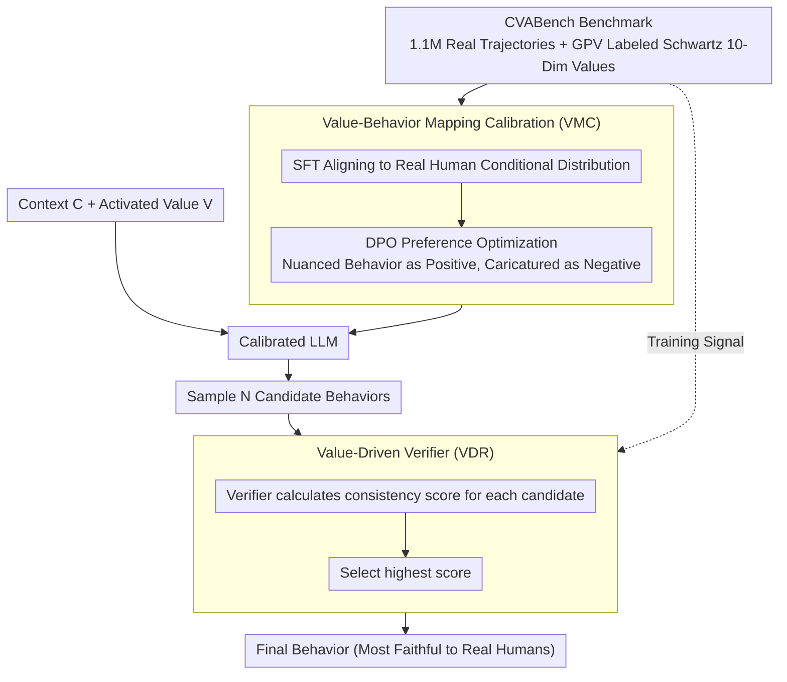

# Context-Value-Action Architecture for Value-Driven Large Language Model Agents

**Conference**: ACL 2026 (Findings)  
**arXiv**: [2604.05939](https://arxiv.org/abs/2604.05939)  
**Code**: None  
**Area**: LLM Agent / Interpretability  
**Keywords**: Value-driven agents, Behavior simulation, Schwartz Value Theory, Behavior polarization, Verifier

## TL;DR
The CVA (Context-Value-Action) architecture is proposed based on the S-O-R psychological model and Schwartz Value Theory. By utilizing a Value Verifier trained on real human data to decouple behavior generation from cognitive reasoning, it effectively alleviates the behavior polarization issue in LLM agents, significantly outperforming baselines on CVABench which contains over 1.1 million real interaction trajectories.

## Background & Motivation

**Background**: LLM-based human-like agents (e.g., game NPCs, social simulators, task assistants) need to faithfully capture the complexity, diversity, and stochasticity of human behavior. Existing methods primarily rely on psychological prompts (such as role-playing and CoT reasoning) to simulate human cognitive processes.

**Limitations of Prior Work**: Existing LLM agents frequently exhibit behavioral rigidity and stereotypes. More critically, this issue is masked by current evaluation methodologies—the "LLM-as-a-judge" evaluation suffers from self-reference bias: the evaluator model shares pre-training biases with the agents, tending to approve of polarized behaviors rather than penalizing a lack of realism.

**Key Challenge**: Increasing the intensity of prompt-driven reasoning does not improve behavioral faithfulness; instead, it exacerbates value polarization. LLMs simplify subtle value dimensions into "caricatured" prototypes (e.g., extreme aggression as a constant response for an "irritable" persona), leading to the collapse of population diversity.

**Goal**: To construct agents capable of faithfully reproducing human behavioral diversity, using real human data as the evaluation standard instead of LLM self-evaluation.

**Key Insight**: Drawing on the S-O-R (Stimulus-Organism-Response) model from psychology and Schwartz's Theory of Basic Human Values—human behavior is not a static output of personality, but a dynamic process where a context activates specific value dimensions.

**Core Idea**: Replace the LLM's internal value judgment with an external Value Verifier (trained on real human data) to decouple behavior generation from cognitive reasoning, thereby avoiding polarization caused by self-reference bias.

## Method

### Overall Architecture
CVA decomposes "how humans act" into three S-O-R segments: Context acting as the stimulus, activated Value dimensions as the internal state of the organism, and Action as the response. The goal is to enable the agent to produce behavior faithful to real humans given a context and activated values, rather than compressing values into caricatured prototypes. The entire pipeline follows a two-step "generate-verify" process: first, the base LLM’s value-behavior mapping is calibrated using SFT+DPO on real trajectories from CVABench (VMC phase) to align its output distribution with the real conditional distribution. During inference, the calibrated model samples multiple candidate behaviors for the current context, which are then scored and selected by an independently trained Value Verifier to find the one most consistent with the activated values (VDR phase). The key lies in removing the judgment of "which behavior is more realistic" from the LLM itself and entrusting it to an external verifier trained on real human data, thereby severing the value polarization caused by self-reference bias.

### Key Designs

**1. Value-Behavior Mapping Calibration (VMC): Rectifying LLM's Internal Value Distortion**

LLMs tend to simplify nuanced value dimensions $V$ into caricatured prototypes $V'$ (e.g., simulating "irritability" as always being aggressive) because their output distribution deviates from the real human conditional distribution. VMC corrects this through two steps: first, performing SFT on real CVABench trajectories to align the model's probability space with the real conditional distribution $P(A \mid C, V)$; second, using DPO to introduce preference pairs—where nuanced, consistent behaviors are positive examples and caricatured exaggerations are negative ones—to further strengthen authentic value-behavior associations and suppress distorted reasoning paths leading to polarization. Learning mappings directly from real data, rather than relying on prompts to "remind" the model not to polarize, makes this step more robust than psychological prompting.

**2. Value-Driven Verifier (Value Verifier): Breaking the Self-Reference Loop with an Independent Discriminator**

Allowing an LLM to judge whether its own generated behavior is realistic creates a self-reference loop that amplifies bias—the evaluator and the evaluated model share the same set of pre-training biases, resulting in rewards for polarization. CVA instead uses a verifier trained separately on real $(C, V, A)$ triplets. During inference, a "generate-select" protocol is adopted: the calibrated model samples $N$ candidate behaviors $a_i$, and the verifier calculates a consistency score $s_i = f_{ver}(a_i, C, V)$ for each, selecting the one with the highest score as the final output. The independence of the verifier from the generator ensures that the judgment of "faithfulness" is anchored in real human data rather than being driven by the generative model's biases.

**3. CVABench: A Training and Evaluation Foundation Anchored in Real Human Behavior**

To escape the self-evaluation bias of "LLM-as-a-judge," a benchmark of real human behavior is required. CVABench aggregates over 1.1 million real interaction trajectories across three domains—Yelp reviews (54K), Reddit conversations (155K), and Foursquare mobility (871K)—covering 15,571 users. It uses GPV (General Psychometric Verification) to map each user's behavior to Schwartz's 10-dimensional value space, thereby labeling each trajectory with its corresponding activated values. This provides training signals for both VMC and the verifier, while serving as an objective benchmark for behavioral faithfulness, replacing LLM self-evaluation that would otherwise share biases with the evaluated model.

### Loss & Training
SFT employs standard autoregressive loss for fine-tuning on real trajectories; DPO performs preference optimization to favor nuanced, consistent behaviors while inhibiting polarized ones; the verifier is trained as a discriminative model on real $(C, V, A)$ triplets.

## Key Experimental Results

### Main Results

| Method | Behavioral Faithfulness | Diversity Maintenance | Degree of Value Polarization |
|------|----------|----------|------------|
| Raw LLM | Low | Low | High |
| Role Play Agent | Low | Low | High |
| Prompt-Reasoning Agent | Lower | Lower | **Higher** |
| CVA (VMC) | Medium | Medium | Medium |
| CVA (VMC + VDR) | **Highest** | **Highest** | **Lowest** |

### Key Findings

| Finding | Description |
|------|------|
| Reasoning Intensity vs. Polarization | Counter-intuitively, enhancing prompt reasoning exacerbates polarization. |
| Verifier Peak Phenomenon | Behavioral faithfulness does not increase monotonically with candidate number N; an optimal peak exists. |
| Interpretability | Verifier attention transparently demonstrates which value dimensions determined the selection. |

### Key Findings
- Increasing reasoning intensity (more CoT steps) not only fails to improve faithfulness but also intensifies value polarization and collapses population diversity.
- An optimal peak for the number of candidates exists for behavioral faithfulness, simulating the phenomenon of limited evaluation scope in human cognitive constraints.
- CVA significantly outperforms baselines across all three domains (Reviews/Dialogues/Mobility).

## Highlights & Insights
- **The discovery that "more reasoning leads to more polarization"** is crucial—it directly challenges the intuition that "more thinking = better performance" and reveals a core defect of LLMs in human simulation tasks.
- **The Verifier Peak Effect** elegantly maps to the concept of "bounded rationality" in cognitive science.
- **Correction of the Evaluation Paradigm**: Shifting from "LLM-as-a-judge" to "real data benchmark" sets a new standard for agent evaluation.

## Limitations & Future Work
- The three data sources for CVABench (Yelp/Reddit/Foursquare) may not represent all human behavior patterns.
- While classic, the Schwartz 10-dimensional value model may not be fine-grained enough—certain behaviors might be influenced by unmodeled factors.
- Verifier training relies on a large amount of real data; its effectiveness in data-scarce scenarios remains unknown.

## Related Work & Insights
- **vs. Park et al. (Generative Agents)**: Relies on persona prompt simulation, which can lead to behavioral rigidity; CVA replaces this with a verifier trained on real data.
- **vs. VLA Systems**: VLA focuses on embodied task execution, whereas CVA focuses on socio-psychological behavioral faithfulness.

## Rating
- Novelty: ⭐⭐⭐⭐⭐ Deeply integrates psychological value theory with LLM agents; the decoupling verification approach is novel.
- Experimental Thoroughness: ⭐⭐⭐⭐⭐ 1.1 million real data points with in-depth comparisons across multiple paradigms.
- Writing Quality: ⭐⭐⭐⭐ Solid theoretical foundation with profound findings.
- Value: ⭐⭐⭐⭐⭐ Makes a fundamental contribution to LLM human simulation and agent evaluation.

<!-- RELATED:START -->

## Related Papers

- [\[AAAI 2026\] AgentSwift: Efficient LLM Agent Design via Value-guided Hierarchical Search](../../AAAI2026/llm_agent/agentswift_efficient_llm_agent_design_via_value-guided_hierarchical_search.md)
- [\[ACL 2026\] CLAG: Adaptive Memory Organization via Agent-Driven Clustering for Small Language Model Agents](clag_adaptive_memory_organization_via_agent-driven_clustering_for_small_language.md)
- [\[AAAI 2026\] AutoTool: Efficient Tool Selection for Large Language Model Agents](../../AAAI2026/llm_agent/autotool_efficient_tool_selection_for_large_language_model_agents.md)
- [\[ACL 2026\] Feedback-Driven Tool-Use Improvements in Large Language Models via Automated Build Environments](feedback-driven_tool-use_improvements_in_large_language_models_via_automated_bui.md)
- [\[ICLR 2026\] GTool: Graph Enhanced Tool Planning with Large Language Model](../../ICLR2026/llm_agent/gtool_graph_enhanced_tool_planning_with_large_language_model.md)

<!-- RELATED:END -->
