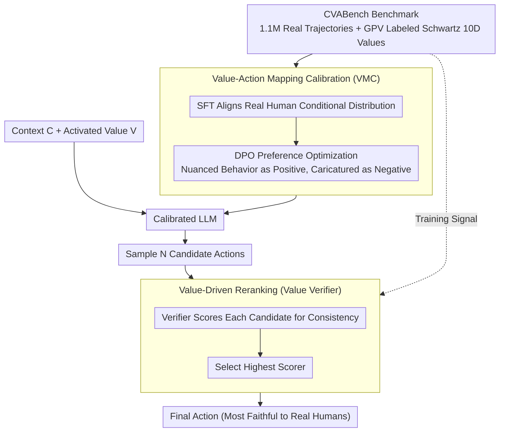

# Context-Value-Action Architecture for Value-Driven Large Language Model Agents

**Conference**: ACL 2026 (Findings)  
**arXiv**: [2604.05939](https://arxiv.org/abs/2604.05939)  
**Code**: None  
**Area**: LLM Agent / Interpretability  
**Keywords**: Value-driven Agents, Behavior Simulation, Schwartz Value Theory, Behavior Polarization, Verifier

## TL;DR
The CVA (Context-Value-Action) architecture is proposed based on the S-O-R psychological model and Schwartz value theory. By training a Value Verifier on real human data to decouple behavior generation from cognitive reasoning, it effectively mitigates the behavior polarization problem in LLM agents, significantly outperforming baselines on CVABench with over 1.1 million real interaction trajectories.

## Background & Motivation

**Background**: LLM-based human-like agents (e.g., game NPCs, social simulators, task assistants) are required to faithfully capture the complexity, diversity, and randomness of human behavior. Existing methods primarily rely on psychological prompting (e.g., role-playing, CoT reasoning) to simulate human cognitive processes.

**Limitations of Prior Work**: Existing LLM agents frequently exhibit behavioral rigidity and stereotypes. More critically, this issue is masked by current evaluation methods—"LLM-as-a-judge" assessments suffer from self-reference bias, where the judge model shares pre-training biases with the evaluated agent, tending to approve of polarized behaviors rather than penalizing a lack of realism.

**Key Challenge**: Increasing the intensity of prompt-driven reasoning does not improve behavioral fidelity; instead, it exacerbates value polarization. LLMs simplify nuanced value dimensions into "caricatured" archetypes (e.g., extremizing an "irritable" personality into consistently aggressive responses), leading to a collapse in population diversity.

**Goal**: To construct agents capable of faithfully reproducing human behavioral diversity, using real human data as the evaluation standard instead of LLM self-evaluation.

**Key Insight**: Drawing from the S-O-R (Stimulus-Organism-Response) model in psychology and Schwartz's theory of basic human values—human behavior is not a static output of personality, but a dynamic process where context activates specific value dimensions.

**Core Idea**: Replace the LLM's intrinsic value judgment with an external Value Verifier (trained on real human data) to decouple behavior generation from cognitive reasoning, thereby avoiding polarization caused by self-reference bias.

## Method

### Overall Architecture
CVA decomposes "how humans act" into the three stages of S-O-R: Context as the Stimulus, the activated Value dimension as the internal state of the Organism, and Action as the Response. The goal is to enable the agent to produce behavior faithful to real humans given a context and activated values, rather than compressing values into caricatured archetypes. The entire pipeline follows a two-step "generate-verify" process: first, the value-action mapping of the base LLM is calibrated using SFT+DPO on real CVABench trajectories (VMC stage) to align its output distribution with the real conditional distribution. During inference, the calibrated model samples multiple candidate behaviors for the current context, which are then scored and selected by an independently trained Value Verifier to find the one most consistent with the activated values (VDR stage). The key lies in removing the task of "judging which behavior is more realistic" from the LLM itself and assigning it to an external verifier trained on real human data, thus severing the value polarization driven by self-reference bias.

### Key Designs

**1. Value-Action Mapping Calibration (VMC): Rectifying Intrinsic LLM Value Distortion**

LLMs tend to simplify nuanced value dimensions $V$ into caricatured prototypes $V'$ (e.g., performing "irritability" as always responding aggressively), rooted in the deviation of their output distribution from the real human conditional distribution. VMC corrects this through two steps: first, performing SFT on real CVABench trajectories to align the model's probability space with the real conditional distribution $P(A \mid C, V)$; second, using DPO to introduce preference pairs—where nuanced and consistent behaviors are positive examples and caricatured, exaggerated behaviors are negative—further strengthening real value-action associations and suppressing distorted reasoning paths toward polarization. Learning the mapping directly from real data, rather than relying on prompts to "remind" the model not to polarize, makes this step more robust than psychological prompting.

**2. Value-Driven Verifier (Value Verifier): Breaking the Self-Reference Cycle with an Independent Discriminator**

Allowing an LLM to judge whether its own generated behaviors are realistic creates a self-reference cycle that amplifies bias—the judging model and the evaluated model share the same pre-training biases, often rewarding polarization. CVA instead uses a Verifier trained separately on real $(C, V, A)$ triplets acting as the judge. During inference, a "generate-select" protocol is adopted: the calibrated model samples $N$ candidate behaviors $a_i$, and the verifier computes a consistency score $s_i = f_{ver}(a_i, C, V)$ for each, selecting the highest scorer as the final output. The independence of the verifier from the generator ensures that the judgment of "behavioral fidelity" is anchored in real human data rather than being led by the generator model's biases.

**3. CVABench Benchmark: A Training and Evaluation Foundation Anchored in Real Human Behavior**

To escape the self-evaluation bias of "LLM-as-a-judge," a metric for real human behavior is required. CVABench aggregates over 1.1 million real interaction trajectories across three domains—Yelp reviews (54K), Reddit conversations (155K), and Foursquare mobility (871K)—covering 15,571 users. It uses GPV (General Psychometric Verification) to map each user's behavior to Schwartz's 10-dimensional value space, labeling each trajectory with its corresponding activated values. This provides training signals for both VMC and the verifier and serves as an objective benchmark for behavioral fidelity, replacing LLM self-evaluations that share biases with the models being tested.

### Loss & Training
SFT is performed using standard autoregressive loss on real trajectories; DPO handles preference optimization to prioritize nuanced, consistent behaviors while inhibiting polarized, exaggerated ones; the verifier is trained as a discriminative model on real $(C, V, A)$ triplets.

## Key Experimental Results

### Main Results

| Method | Behavioral Fidelity | Diversity Maintenance | Degree of Value Polarization |
|------|----------|----------|------------|
| Raw LLM | Low | Low | High |
| Role Play Agent | Low | Low | High |
| Prompt-Reasoning Agent | Lower | Lower | **Higher** |
| CVA (VMC) | Medium | Medium | Medium |
| CVA (VMC + VDR) | **Highest** | **Highest** | **Lowest** |

### Key Findings

| Finding | Description |
|------|------|
| Reasoning Intensity vs. Polarization | Counter-intuitively, enhancing prompt reasoning exacerbates polarization. |
| Verifier Peak Phenomenon | Behavioral fidelity does not increase monotonically with candidate count N; an optimal peak exists. |
| Interpretability | Verifier attention transparently demonstrates which value dimensions determined the selection. |

### Key Findings
- Increasing reasoning intensity (more CoT steps) fails to improve fidelity and instead intensifies value polarization and collapses population diversity.
- An optimal number of candidates exists for behavioral fidelity, simulating the phenomenon of limited evaluation scope in human cognitive constraints.
- CVA significantly outperforms baselines across all three domains (reviews, dialogue, and mobility).

## Highlights & Insights
- **The discovery that "more reasoning leads to more polarization"** is highly significant—it directly challenges the intuition that "more thinking = better performance" and reveals a core flaw of LLMs in human simulation tasks.
- **The Verifier Peak Effect** elegantly maps to the concept of "bounded rationality" in cognitive science.
- **Correction of the Evaluation Paradigm**: Moving from "LLM-as-a-judge" to "grounding in real data" sets a new standard for agent evaluation.

## Limitations & Future Work
- The three data sources in CVABench (Yelp, Reddit, Foursquare) may not represent all human behavior patterns.
- While classic, the Schwartz 10-dimensional value model may not be granular enough—certain behaviors might be influenced by unmodeled factors.
- Verifier training relies on large amounts of real data, and its effectiveness in data-scarce scenarios remains unknown.

## Related Work & Insights
- **vs. Park et al. (Generative Agents)**: While the former relies on role-prompting simulation which leads to behavioral rigidity, CVA replaces this with a verifier trained on real data.
- **vs. VLA Systems**: VLA focuses on embodied task execution, whereas CVA focuses on socio-psychological behavioral fidelity.

## Rating
- Novelty: ⭐⭐⭐⭐⭐ Deeply integrates psychological value theory with LLM agents; the decoupling verification approach is novel.
- Experimental Thoroughness: ⭐⭐⭐⭐⭐ Utilizes 1.1 million real data points with a deep comparison of multiple paradigms.
- Writing Quality: ⭐⭐⭐⭐ Solid theoretical foundation with insightful findings.
- Value: ⭐⭐⭐⭐⭐ Makes fundamental contributions to LLM human simulation and agent evaluation.

<!-- RELATED:START -->

## Related Papers

- [\[AAAI 2026\] AgentSwift: Efficient LLM Agent Design via Value-guided Hierarchical Search](../../AAAI2026/llm_agent/agentswift_efficient_llm_agent_design_via_value-guided_hierarchical_search.md)
- [\[ACL 2026\] CLAG: Adaptive Memory Organization via Agent-Driven Clustering for Small Language Model Agents](clag_adaptive_memory_organization_via_agent-driven_clustering_for_small_language.md)
- [\[AAAI 2026\] AutoTool: Efficient Tool Selection for Large Language Model Agents](../../AAAI2026/llm_agent/autotool_efficient_tool_selection_for_large_language_model_agents.md)
- [\[ACL 2026\] Feedback-Driven Tool-Use Improvements in Large Language Models via Automated Build Environments](feedback-driven_tool-use_improvements_in_large_language_models_via_automated_bui.md)
- [\[AAAI 2026\] Time, Identity and Consciousness in Language Model Agents](../../AAAI2026/llm_agent/time_identity_and_consciousness_in_language_model_agents.md)

<!-- RELATED:END -->
