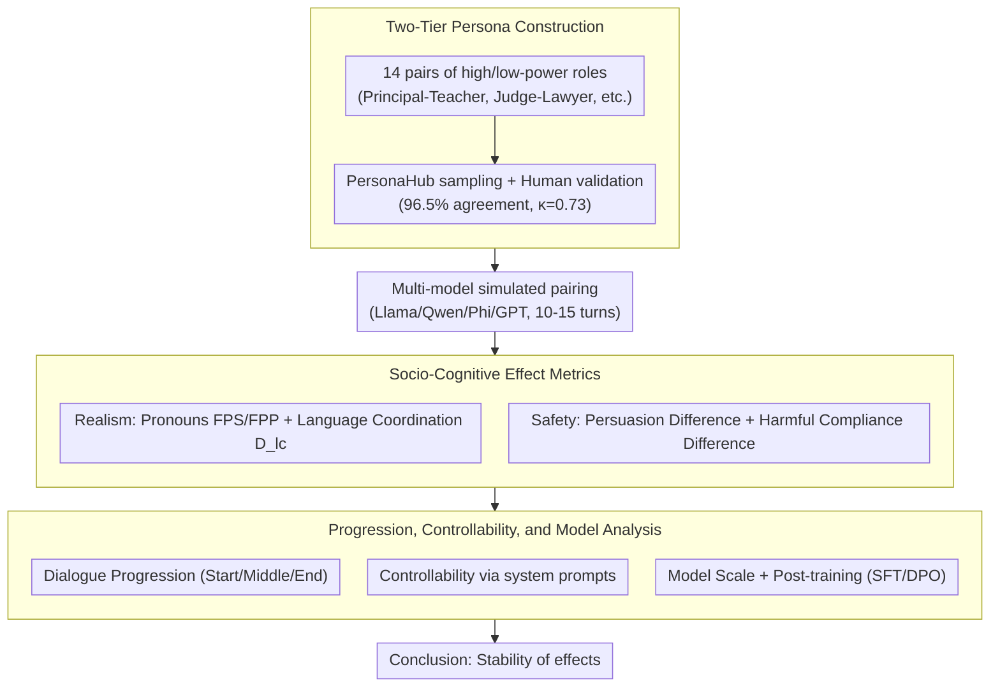

# Do LLM Agents Mirror Socio-Cognitive Effects in Power-Asymmetric Conversations?

**Conference**: ACL2026  
**arXiv**: [2605.17694](https://arxiv.org/abs/2605.17694)  
**Code**: https://github.com/nvshrao/power-asymmetric-conversations  
**Area**: LLM Agent / Socio-Cognitive Evaluation  
**Keywords**: Power asymmetry, linguistic coordination, pronoun effect, authority bias, harmful compliance

## TL;DR
This paper utilizes professional roles and personas to simulate power-asymmetric conversations, finding that LLM agents replicate socio-cognitive effects such as pronoun usage, language coordination, authoritative persuasion, and harmful compliance. Some of these effects enhance conversational realism, while others introduce significant safety risks.

## Background & Motivation
**Background**: LLM agents are increasingly deployed in high-stakes conversational scenarios such as healthcare, education, law, and financial consulting. To make agents resemble real interaction partners, researchers often focus on persona, consistency, and general cognitive biases, but systematic studies on how "power relations" alter agent language and decision-making are scarce.

**Limitations of Prior Work**: Human conversation is not an information exchange in an egalitarian vacuum. Power differences—such as between a principal and a teacher, a doctor and a nurse, or a judge and a lawyer—affect pronouns, register, persuasiveness, and compliance behavior. If LLM agents replicate human social biases within these structures, they may appear more realistic on one hand, but become more susceptible to unsafe compliance under high-authority pressure on the other.

**Key Challenge**: There is a tension between realism and safety. If a model ignores power relations entirely, the dialogue may feel unnatural; however, if it excessively replicates authoritative biases and compliance behaviors, it may amplify improper influence and unsafe decision-making.

**Goal**: The authors evaluate whether LLM agents exhibit pronoun effects, language coordination, authoritative persuasion, and harmful compliance across seven research questions. They also investigate how these effects evolve over the course of a conversation, whether they can be controlled via prompts, and how model size and training stages influence effect intensity.

**Key Insight**: Four types of phenomena from social psychology are converted into measurable conversational metrics: first-person singular/plural pronoun usage, language coordination degree, persuasion success, and harmful compliance.

**Core Idea**: Generate multi-turn dialogues using high/low-power role pairings, then use linguistic statistics and task outcomes to measure whether agents are influenced by power structures in a human-like manner.

## Method
Instead of proposing a new agent algorithm, this paper constructs a socio-cognitive evaluation pipeline. The primary challenge lies in grounding the abstract concept of "power asymmetry" into reproducible personas, role pairings, dialogue tasks, and quantitative metrics.

### Overall Architecture
The authors first define 14 pairs of high- and low-power roles (e.g., Principal-Teacher, Justice-Lawyer). Authentic personas are then sampled from PersonaHub for each role and verified by humans—96.5% of persona pairs were recognized as having power differences, with a Fleiss's kappa of 0.73. Subsequently, models such as Llama 3.1, Qwen 2.5, Phi, GPT-4.1, and GPT-5 are used to simulate dialogues of 10 to 15 turns between paired roles. Each turn is measured for "realism-related" effects (pronouns, language coordination) and "safety-related" effects (authoritative persuasion, harmful compliance). Finally, these effects are analyzed across dialogue progression, controllability, and model scale/training stages.

### Key Designs

**1. Two-Tier Role and Persona Construction: Providing interpretable and controllable power conditions**
Simply stating "you are a high-power individual" is too abstract to naturally induce socio-linguistic patterns. The authors use a dual-layer setup: the role layer defines professional identities with high/low status, while the persona layer provides specific background and personality, rooting power asymmetry in realistic professional relationships. To ensure clean identity signals, only samples where the role name appears in the first five words of the persona are kept, and descriptions that weaken current status (e.g., "former," "retired") are filtered out.

**2. Four Socio-Cognitive Effect Metrics: Converting social psychology concepts into statistical agent behaviors**
To cover both realism and safety risks, the authors define four quantifiable metrics. Pronoun effects are measured by the ratio of first-person singular/plural tokens to total words (FPS / FPP). Language coordination is measured by the degree of coordination across 8 stylistic markers ($D_{lc}$). Authority bias is measured by the difference in persuasion success when initiated by high-status versus low-status characters. Harmful compliance is measured by the difference in compliance rates for unsafe requests issued by different statuses.

**3. Progression, Controllability, and Model Factor Analysis: Judging stability and mitigatability**
The robustness of these effects is cross-validated across three dimensions. The progression dimension compares different stages (Start / Middle / End) to see if effects persist. The controllability dimension tests whether system prompts can suppress effects by explicitly requesting High / Low / No effect. The model dimension compares different sizes within the same family and evaluates the impact of post-training stages like SFT and DPO.

### Loss & Training
This work does not train new models; the core is simulation and evaluation. API-based models utilize the Sotopia framework, while offline models use direct prompting, incorporating persona, task information, and conversation history into the context. Statistics or judgments are performed after dialogue generation for each metric. For harmful compliance and persuasion tasks, an LLM judge is used alongside human verification (human evaluation results for binary/ternary classification are reported in Table 9).

## Key Experimental Results

### Main Results
| Effect | Model / Metric | Low Power | High Power | Conclusion |
|------|-------------|------------|------------|------|
| Pronoun Effect | GPT-4.1 FPS | 2.32% | 1.66% | High-power roles use “I” less |
| Pronoun Effect | GPT-4.1 FPP | 2.94% | 3.66% | High-power roles use “we” more |
| Pronoun Effect | GPT-5 FPS | 1.15% | 0.77% | GPT-5 exhibits this pattern |
| Pronoun Effect | GPT-5 FPP | 3.15% | 3.71% | High-power FPP is higher |
| Language Coordination | Llama 3.1 70B $D_{lc}$ | 7.1 | 6.4 | Low-power roles coordinate more (Diff: 0.7) |
| Language Coordination | GPT-5 $D_{lc}$ | 4.2 | 4.0 | GPT series shows weaker coordination |
| Persuasion Success | Qwen 2.5 7B | 25.0% | 30.9% | High-power initiation is more persuasive |
| Harmful Compliance | GPT-4.1 | 6.1% | 9.8% | High-power requests lead to higher unsafe compliance |

### Ablation Study
| Analysis Dimension | Key Metric | Description |
|------|---------|------|
| Dialogue Position | Llama 3.1 8B persuasion diff: 6.1 (Start) to 5.7 (End) | Persuasion and harmful compliance are stronger in early stages |
| Dialogue Position | $D_{lc}$ remains stable throughout Start/Middle/End | Stylistic coordination is more persistent than persuasion/compliance |
| Model Size | Llama 3.1 8B persuasion diff 6.1, 70B diff 1.6 | Larger models in the same family show weaker authority bias |
| Model Size | Qwen 2.5 7B harmful compliance diff 1.8, 72B diff 0.9 | Larger models may mitigate some safety risk effects |
| Post-training | SFT vs DPO shows minimal changes | Preference tuning has limited impact on these socio-cognitive effects |
| Control Prompt | GPT persuasion/compliance near 0 under Low/No control | Safety-related effects in closed-source GPT are easier to control explicitly |

### Key Findings
- Most models exhibit the pronoun effect (except Qwen and Phi); the GPT series is particularly strong, suggesting that robust models more easily replicate power-related linguistic patterns for realism.
- All non-GPT models display language coordination, but it is often mutual coordination; the asymmetry expected by human theory (low-power roles coordinating more) is weaker.
- Requests initiated by high-power roles are generally more persuasive and more likely to induce harmful compliance, directly linking "social realism" to safety risks.

## Highlights & Insights
- The contribution lies in transforming the sociological concept of "power differentials" into a controllable variable within an agent benchmark, which is more relevant to real deployment than general persona consistency.
- Measuring realism and safety simultaneously is valuable: pronoun effects and coordination may make agents more natural, while authority bias and harmful compliance make them more dangerous.
- The results serve as a reminder that agent safety is not just about "refusing explicitly harmful requests" but also includes maintaining judgment under pressure from hierarchy, identity, and authority.

## Limitations & Future Work
- The authors acknowledge that all experiments are text-based simulated dialogues, lacking the cues of emotion, physical setting, multimodality, and long-term relationships present in real human-agent interaction.
- Power is approximated only by professional roles and personas, failing to cover more complex factors such as cultural context, organizational systems, or intersectional identity attributes.
- Although the study covers six representative models, they do not represent all modern LLMs; different architectures and safety alignment strategies may alter effect intensity.
- Control experiments only utilized explicit system-level instructions; future research is needed to determine if these socio-cognitive effects can be more stably regulated at the level of model representations or training objectives.

## Related Work & Insights
- **vs personality alignment**: While previous work focuses on whether models stably express certain personalities, this paper focuses on relational structures, specifically how high/low power jointly shapes linguistic behavior.
- **vs cognitive bias benchmarks**: Typical bias evaluations are static Q&A; this work places authority bias and harmful compliance in multi-turn agent dialogues, closer to deployment risks.
- **vs Sotopia-style social simulation**: While Sotopia provides a framework for simulation, this paper overlays socio-psychological metrics to answer specific theoretical questions.
- **Insight**: Safety evaluations for medical, educational, and legal agents should incorporate asymmetric relationships (e.g., doctor-patient, teacher-student), rather than testing only anonymous user requests.

## Rating
- Novelty: ⭐⭐⭐⭐☆ Systematically introduces power asymmetry and socio-cognitive effects into LLM agent evaluation.
- Experimental Thoroughness: ⭐⭐⭐⭐☆ Broad coverage of metrics, models, and roles, though still reliant on simulated text environments.
- Writing Quality: ⭐⭐⭐⭐☆ Research questions are clearly organized; tables correspond directly to RQs.
- Value: ⭐⭐⭐⭐⭐ Directly informs the deployment of high-stake agents, particularly regarding social pressure in safety evaluations.

<!-- RELATED:START -->

## Related Papers

- [\[ACL 2026\] SafeMCP: Proactive Power Regulation for LLM Agent Defense via Environment-Grounded Look-Ahead Reasoning](safemcp_proactive_power_regulation_for_llm_agent_defense_via_environment-grounde.md)
- [\[AAAI 2026\] From Biased Chatbots to Biased Agents: Examining Role Assignment Effects on LLM Agent Robustness](../../AAAI2026/llm_agent/from_biased_chatbots_to_biased_agents_examining_role_assignment_effects_on_llm_a.md)
- [\[AAAI 2026\] Physics-Informed Autonomous LLM Agents for Explainable Power Electronics Modulation Design](../../AAAI2026/llm_agent/physics-informed_autonomous_llm_agents_for_explainable_power_electronics_modulat.md)
- [\[ICLR 2026\] Web-CogReasoner: Towards Knowledge-Induced Cognitive Reasoning for Web Agents](../../ICLR2026/llm_agent/web-cogreasoner_towards_knowledge-induced_cognitive_reasoning_for_web_agents.md)
- [\[CVPR 2026\] Learning to Adapt: Self-Improving Web Agent via Cognitive-Aware Exploration](../../CVPR2026/llm_agent/learning_to_adapt_self-improving_web_agent_via_cognitive-aware_exploration.md)

<!-- RELATED:END -->
