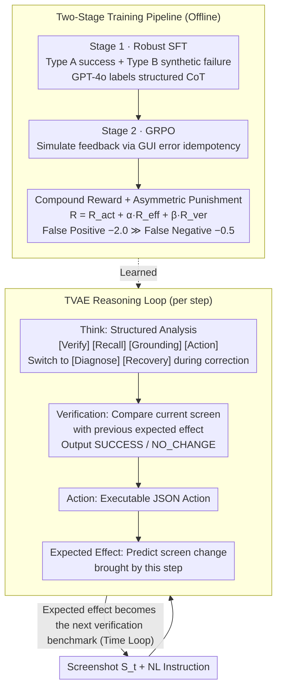

# Don't Act Blindly: Robust GUI Automation via Action-Effect Verification and Self-Correction

**Conference**: ACL 2026  
**arXiv**: [2604.05477](https://arxiv.org/abs/2604.05477)  
**Code**: None  
**Area**: Multimodal VLM / LLM Agent  
**Keywords**: GUI Automation, Action Verification, Self-Correction, GRPO Reinforcement Learning, Robustness

## TL;DR
This paper proposes the VeriGUI framework, which utilizes a Thinking-Verification-Action-Expectation (TVAE) closed-loop reasoning mechanism and a two-stage training pipeline (Robust SFT + GRPO). It enables GUI Agents to verify the success of each operation and perform self-correction upon failure, significantly outperforming baselines at both 3B and 7B scales.

## Background & Motivation

**Background**: VLM-based GUI Agents can interpret screenshots, understand natural language instructions, and execute multi-step tasks. Models like CogAgent, SeeClick, and UI-TARS have achieved rapid progress across multiple benchmarks. However, these agents implicitly assume that every action is executed as expected.

**Limitations of Prior Work**: In real-world deployment, network latency, rendering delays, and system interruptions cause operation failures. When failure occurs, current agents continue to assume success and generate the next action based on an unchanged screen. Worse, since training rarely includes failure scenarios, agents tend to repeat the exact same invalid operation, creating an infinite execution loop. Empirical data shows that execution timeouts due to repeated invalid actions account for 72.3% of all failures.

**Key Challenge**: Human users naturally verify whether expected changes occur after each interaction (e.g., whether a button highlights or a page navigates), but this verification-diagnosis-correction loop is completely missing in current GUI Agents. Online RL training faces high interaction latency and infrastructure costs (requiring many parallel simulators), while offline datasets lack failure signals.

**Goal**: (1) Design a reasoning framework that explicitly models action outcome verification and recovery mechanisms; (2) Develop a training method to learn self-correcting behavior without online interaction.

**Key Insight**: Leverage the idempotency of GUI errors—invalid operations typically do not change the screen state. This property allows simulating online feedback from offline data: if the screen remains unchanged, the operation failed.

**Core Idea**: Integrate verification and expected effect prediction into the reasoning framework, and learn "honest" self-monitoring during training by synthesizing failure trajectories and using idempotency to simulate online feedback.

## Method

### Overall Architecture
VeriGUI addresses the "blind execution" issue where GUI Agents are unaware of operation failures and continue on unchanged screens, eventually falling into infinite loops. It explicitly incorporates "verification" into every reasoning step. Given a screenshot and instruction, the agent outputs a set of structured results for each interaction step: first thinking (Think), then verifying the current screen against the previous step's prediction (Verification), then providing an action (Action), and finally predicting the expected screen change (Expected Effect). This prediction serves as the benchmark for the next step, forming a temporally interlocked closed loop. This TVAE reasoning cycle is learned through a two-stage training pipeline: Stage 1 uses Robust SFT on mixed success/failure trajectories to establish basic verification behavior, and Stage 2 uses GRPO with asymmetric rewards to refine "honest self-monitoring"—all without online interaction.

### Key Designs

**1. TVAE Reasoning Loop: Integrating the human habit of "checking after acting"**

This addresses the pain point where current agents assume success and blindly generate the next step on an unchanged screen. VeriGUI requires four bound outputs at each step $t$: Think $T_t$ is a structured analysis with tags like [Verify], [Recall], [Grounding], and [Action] (switching to [Diagnose] and [Recovery] in correction mode); Verification $V_t$ is a binary judgment of SUCCESS / NO_CHANGE, derived by comparing the current screen $S_t$ with the previous expected effect $E_{t-1}$; Action $A_t$ is the executable JSON; and Expected Effect $E_t$ predicts the change after the action. This creates a temporal cycle—$E_t$ from step $t$ becomes the verification hypothesis for step $t+1$. This forces the agent to consider consequences before acting, improving action quality while providing a clear benchmark to detect failures immediately.

**2. Two-Stage Training Pipeline: Teaching "what failure looks like" then reinforcing "honesty"**

Standard SFT suffers from over-optimism, as offline data rarely contains failure signals. Stage 1 (Robust SFT) constructs a hybrid dataset: Type A are normal success trajectories; Type B are synthetic failure trajectories where an unchanged screen $S_{t-1}$ is paired with a history claiming to have executed $A_{t-1}$, creating a "no-effect" scenario. Stage 2 (GRPO) uses GUI error idempotency to simulate online feedback: since error operations usually don't change the screen, $V_{\text{target}}=\text{SUCCESS}$ is set for Type A and $V_{\text{target}}=\text{NO\_CHANGE}$ for Type B. Rewards are only given when the model's judgment aligns with this objective reality.

**3. Compound Reward & Asymmetric Verification Penalty: Making "hallucinating success" costly**

To optimize action accuracy, effect prediction, and verification honesty, the total reward is $R_t = R_{\text{act}} + \alpha \cdot R_{\text{eff}} + \beta \cdot R_{\text{ver}}$. The action reward $R_{\text{act}}$ is based on IoU matching, and the effect reward $R_{\text{eff}}$ uses BERTScore when the action is correct. The verification reward $R_{\text{ver}}$ is the core: it is asymmetric—correct judgment +1.0, False Negative (misclassifying success as failure) -0.5, and False Positive (hallucinating success when failed) **-2.0**. The penalty for hallucination is four times that of an oversight because False Positives lead to error accumulation that collapses the trajectory, while False Negatives merely make the agent more cautious.

### Loss & Training
Stage 1 uses standard cross-entropy loss for 2 epochs with a learning rate of $1 \times 10^{-5}$. Stage 2 utilizes the GRPO objective for 15 epochs with a learning rate of $5 \times 10^{-6}$, group size $G=6$, and KL divergence regularization. Rewards use weights $\alpha=0.5$ and $\beta=0.5$.

## Key Experimental Results

### Main Results (AndroidControl-High)

| Model | TM | GR | SR | Sim-TSR | ASO↓ |
|------|-----|-----|-----|---------|------|
| Qwen2.5-VL-3B | 68.7 | 28.3 | 20.2 | 0 | — |
| UI-R1-3B | 69.0 | 27.3 | 19.1 | 0 | — |
| VeriGUI-3B | **72.2** | 32.4 | 24.8 | **16.7** | 1.25 |
| UI-TARS-7B | 72.3 | 35.2 | 30.8 | 14.1 | — |
| VeriGUI-7B | **74.2** | **36.8** | **33.1** | **23.5** | **1.09** |
| GPT-5.1 | 70.1 | 30.0 | 23.1 | — | — |

### Ablation Study (Robustness Benchmark)

| Model | Loop Rate↓ | Recovery Success Rate↑ |
|------|-----------|----------------------|
| Qwen2.5-VL-3B | High | Low |
| VeriGUI-3B | Significantly Reduced | **51.1%** |
| VeriGUI-7B | Lowest | **52.5%** |

### Key Findings
- While 3B baselines achieve zero Sim-TSR under pseudo-online conditions (unable to complete tasks after errors), VeriGUI-3B reaches 16.7%.
- VeriGUI-3B outperforms several 7B baselines in Type Match, indicating that TVAE structured reasoning improves action type selection.
- The gap between TSR and Sim-TSR quantifies the proportion of tasks completed through error recovery.
- VeriGUI-7B's ASO of 1.09 means it only requires 9% more steps than the optimal path on average.
- The verification-recovery mechanism shows good transferability in cross-distribution tests like GUI Odyssey.

## Highlights & Insights
- **Leveraging Idempotency for Feedback**: Using the "unchanged screen = failure" property is a clever observation that allows training self-correction without complex online environments.
- **Asymmetric Verification Penalty**: Penalizing hallucinations 4x more than oversights ensures "honest" self-monitoring through incentives.
- **Dual Role of Effect Prediction**: It acts as both a verification benchmark and a pressure for the agent to anticipate consequences before acting, indirectly improving action quality.

## Limitations & Future Work
- The TVAE framework increases generation per step, potentially increasing inference latency.
- Idempotency does not apply to all failure modes (e.g., irreversible changes from mis-operation).
- Synthetic failure trajectories may not cover all real-world types like partial loading or interrupted animations.
- Detailed results for online MiniWoB++ and AndroidWorld are not fully reported.

## Related Work & Insights
- **vs UI-TARS**: UI-TARS uses large-scale pre-training for accuracy but lacks verification/recovery. Ours reaches comparable performance at smaller scales with closed-loop verification.
- **vs DigiRL / DistRL**: These optimize success via online RL requiring heavy simulation. VeriGUI achieves similar effects using idempotency and offline data.
- **vs LLM Self-Correction**: Work by Madaan et al. assumes external feedback; VeriGUI's verification is entirely based on internal reasoning from visual evidence.

## Rating
- Novelty: ⭐⭐⭐⭐⭐ The combination of TVAE closed-loop, idempotency utilization, and asymmetric penalties is highly ingenious.
- Experimental Thoroughness: ⭐⭐⭐⭐ Multiple benchmarks and robustness tests, though online results could be more detailed.
- Writing Quality: ⭐⭐⭐⭐ Clear motivation and detailed descriptions.
- Value: ⭐⭐⭐⭐⭐ Directly addresses the core pain points of GUI agents—blind execution and infinite loops—with high practical value.

<!-- RELATED:START -->

## Related Papers

- [\[ICLR 2026\] LongHorizonUI: A Unified Framework for Robust Long-Horizon Task Automation of GUI Agent](../../ICLR2026/llm_agent/longhorizonui_a_unified_framework_for_robust_long-horizon_task_automation_of_gui.md)
- [\[ICML 2026\] Think Twice Before You Act: Enhancing Agent Behavioral Safety with Thought Correction](../../ICML2026/llm_agent/think_twice_before_you_act_enhancing_agent_behavioral_safety_with_thought_correc.md)
- [\[ICLR 2026\] ReVeal: Self-Evolving Code Agents via Reliable Self-Verification](../../ICLR2026/llm_agent/reveal_self-evolving_code_agents_via_reliable_self-verification.md)
- [\[ICML 2026\] AutoRPA: Efficient GUI Automation through LLM-Driven Code Synthesis from Interactions](../../ICML2026/llm_agent/autorpa_efficient_gui_automation_through_llm-driven_code_synthesis_from_interact.md)
- [\[ACL 2026\] Don't Click That: Teaching Web Agents to Resist Deceptive Interfaces](dont_click_that_teaching_web_agents_to_resist_deceptive_interfaces.md)

<!-- RELATED:END -->
