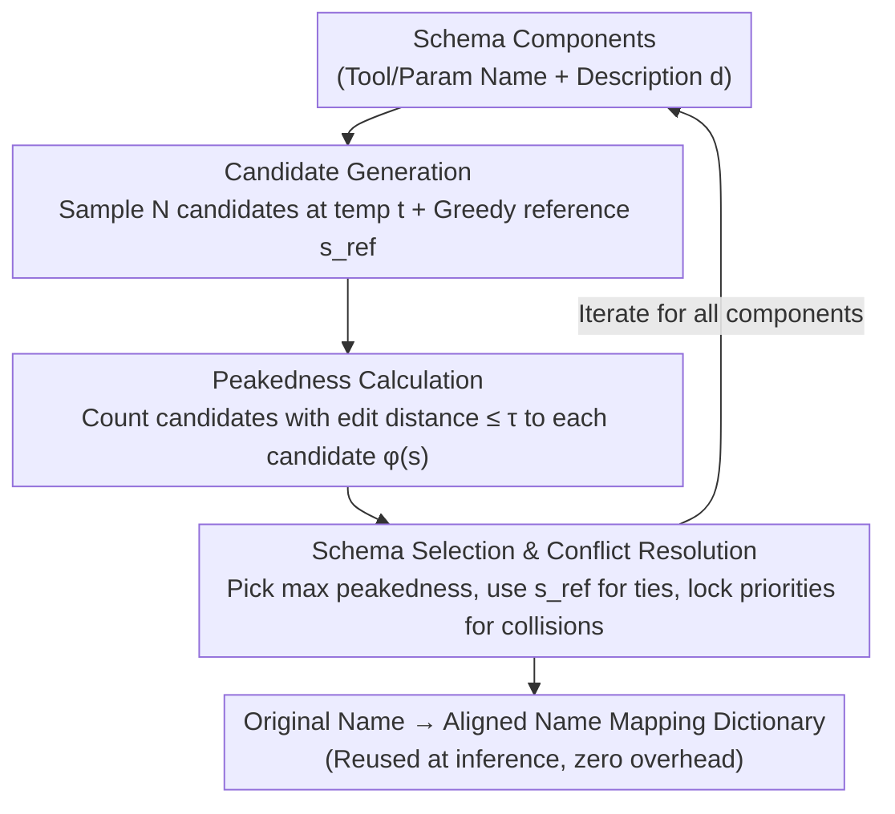

# Don't Adapt Small Language Models for Tools; Adapt Tool Schemas to the Models

**Conference**: ACL 2026  
**arXiv**: [2510.07248](https://arxiv.org/abs/2510.07248)  
**Code**: [GitHub](https://github.com/holi-lab/PA-Tool)  
**Area**: LLM/NLP  
**Keywords**: Small Language Models, Tool Use, Schema Alignment, Pre-trained Knowledge, Training-free Optimization  

## TL;DR

This paper proposes PA-Tool, a training-free tool schema optimization method. By utilizing the "peakedness" signal borrowed from data contamination detection, it identifies naming patterns familiar to the model from pre-training. By renaming tool components to align with the internalized knowledge of Small Language Models (SLMs), PA-Tool achieves up to a 17% improvement on MetaTool and RoTBench, and reduces schema misalignment errors by 80%.

## Background & Motivation

**Background**: Tool-augmented language models have become core components of modern AI systems. With the development of multi-agent architectures, there is an increasing demand to deploy Small Language Models (SLMs, typically $\leq$ 8B) to handle sub-tasks, including tool selection (identifying the correct API) and parameter identification (providing correct parameters).

**Limitations of Prior Work**: SLMs perform significantly worse than large models on tool-use tasks. A common failure mode is "schema misalignment": even when the correct tool is provided in context, the model hallucinates plausible-looking but non-existent tool names. This suggests that models revert to internalized naming conventions from pre-training when faced with unfamiliar schemas.

**Key Challenge**: Existing methods either adapt the model to arbitrary schemas through training (requiring large amounts of data and potentially causing catastrophic forgetting) or improve it indirectly through tool documentation or interaction history (without resolving the fundamental mismatch at the schema level). Training methods are costly and unscalable, while training-free methods fail to address the root cause of naming misalignment.

**Goal**: Propose a training-free method to adjust tool schemas to match the pre-trained knowledge of the model, rather than training the model to adapt to the schemas.

**Key Insight**: Borrow the concept of "peakedness" from the field of data contamination detection—patterns seen frequently during pre-training lead the model to generate highly concentrated output distributions. This signal is used to identify naming patterns "familiar" to the model.

**Core Idea**: Instead of training small models to adapt to unfamiliar tool schemas, adapt the schemas to align with the model's pre-trained knowledge—by generating multiple candidate names, calculating peakedness, and selecting the candidate with the highest peakedness to find the naming most familiar to the model.

## Method

### Overall Architecture

PA-Tool addresses "schema misalignment" in SLMs—where models hallucinate names they are more familiar with when facing unfamiliar tool/parameter names. The Mechanism is to invert the problem: instead of training the model, the schema is renamed to patterns the model "habitually saw" during pre-training. Specifically, it performs a three-step renaming for each component (tool name, parameter name) in the tool schema. First, the SLM samples multiple candidate names based on the component description. Second, the "peakedness" signal measures which candidate most resembles patterns the model has memorized. Finally, the candidate with the highest peakedness replaces the original name. Iterating this process across all components generates an "original name $\rightarrow$ pre-training aligned name" mapping dictionary, without changing a single model parameter.

### Key Designs

**1. Candidate Generation: Using temperature sampling to extract diverse naming conventions**

If only greedy decoding is used, each component yields only one candidate, leaving the schema space unexplored (Greedy sometimes performs worse than the unaligned Base in experiments). PA-Tool therefore uses a temperature $t \in (0,1]$ to sample $N$ candidate names $\mathcal{C} = \{s_1, s_2, \ldots, s_N\}$ given the component description $d$, allowing sampling to break out of single paths and expose multiple naming patterns learned by the model. Simultaneously, greedy decoding ($t=0$) generates a reference name $s_{\text{ref}}$ as a tie-breaker.

**2. Peakedness Calculation: Quantifying "familiarity" using signals from data contamination detection**

To identify patterns strongly memorized during pre-training, PA-Tool utilizes observations from CDD (contamination detection)—patterns appearing frequently in training produce highly concentrated ("peaked") output distributions during multiple samplings. For each candidate $s_i$, the peakedness is calculated as $\phi(s_i) = \sum_{j \neq i} \mathbb{I}(d_{\text{edit}}(s_i, s_j) \leq \tau)$, which counts how many other candidates are sufficiently similar to it. Here $d_{\text{edit}}$ is the character-level edit distance, and the threshold $\tau = \alpha \cdot \ell_{\max}$ is set as $\alpha$ times the maximum candidate length $\ell_{\max}$. Higher peakedness indicates a more concentrated distribution around that naming, implying higher model familiarity. Making the threshold length-adaptive ensures a consistent scale of similarity across names of different lengths, turning "detecting memorized content" from contamination detection into "utilizing memorized naming conventions."

**3. Schema Selection & Conflict Resolution: Selecting internalized names and resolving cross-tool collisions**

The candidate with the highest peakedness $s^* = \arg\max_{s_i \in \mathcal{C}} \phi(s_i)$ is selected as the new name, representing the model's most deeply internalized naming convention. If multiple candidates tie, the reference name $s_{\text{ref}}$ is used to break the tie by choosing the candidate with the minimum edit distance: $s^* = \arg\min_{s_i \in \mathcal{C}^*} d_{\text{edit}}(s_i, s_{\text{ref}})$. When different tools are renamed to the same name due to similar descriptions, a priority-locking mechanism resolves conflicts. Once the mapping is calculated, it can be reused, incurring near-zero overhead during inference.

### Loss & Training

PA-Tool is entirely training-free and requires only a one-time schema mapping. Alignment is completed using 32 candidates, a temperature of 0.4, and $\alpha = 0.2$, while temperature 0 is used during inference to ensure reproducibility. The mapping dictionary can be reused as long as the toolset remains unchanged, avoiding model modification and catastrophic forgetting.

## Key Experimental Results

### Main Results

**MetaTool Tool Selection (Accuracy %)**

| Model | Method | Similar | Scenario | Reliability | Multi-tool |
|------|------|------|------|------|------|
| Qwen2.5-7B | Base | 59.6 | 74.4 | 78.3 | 78.3 |
| Qwen2.5-7B | PA-Tool | 64.1 | 78.4 | **88.2** | 84.9 |
| Llama3.1-8B | Base | 61.5 | 73.9 | 53.5 | 78.7 |
| Llama3.1-8B | PA-Tool | **70.4** | **79.9** | 66.0 | **88.3** |
| Llama3.2-3B | Base | 55.0 | 58.6 | 43.6 | 79.1 |
| Llama3.2-3B | PA-Tool | 65.7 | 67.7 | 60.6 | 80.5 |

**RoTBench Tool Selection and Parameter Identification**

| Model | Method | Single-turn Selection | Single-turn Param | Multi-turn Selection | Multi-turn Param |
|------|------|------|------|------|------|
| Llama3.1-8B | Base | 58.1 | 17.1 | 42.8 | 34.3 |
| Llama3.1-8B | PA-Tool | **68.6** | 18.1 | **48.6** | **35.7** |

### Ablation Study

| Configuration | Single-turn Selection | Single-turn Param | Description |
|------|------|------|------|
| Base | 58.1 | 17.1 | No alignment |
| Tool-only | 62.9 | 14.3 | Tool name alignment only |
| Param-only | 56.2 | 17.1 | Parameter name alignment only |
| Both (PA-Tool) | **68.6** | **18.1** | Best with joint alignment |

**Error Type Analysis (Llama3.1-8B, MetaTool)**

| Error Type | Base | PA-Tool | Gain |
|------|------|------|------|
| Schema Misalignment Error | — | — | **-80.0%** |
| Functional Confusion Error | — | — | -24.0% |
| Context Understanding Error | — | — | -18.8% |

### Key Findings

- PA-Tool shows the largest improvement in the Reliability sub-task (up to 17%), which requires the model to recognize cases where no suitable tool exists.
- The Multi-tool sub-task saw a 9.6% Gain (Llama3.1-8B: 78.7 $\rightarrow$ 88.3%), as schema misalignment accumulates during multi-tool selection.
- PA-Tool used alone can outperform supervised fine-tuned models on several sub-tasks and provides further Gains when combined with them.
- Peakedness validation experiments confirm: as training epochs increase, the model's peakedness consistently rises (up to +25.8%), supporting the hypothesis of it being a familiarity signal.
- Consistent improvements were also demonstrated on end-to-end benchmarks like API-Bank and $\tau$-Bench.

## Highlights & Insights

- The reverse thinking is highly inspiring: "Don't adapt the model to the tools; adapt the tools to the model"—this approach can be generalized to other model-interface interaction scenarios.
- Cross-domain transfer from data contamination detection to tool schema optimization: transforming "peakedness" from "detecting contamination" to "utilizing pre-trained knowledge."
- The one-time mapping design ensures extremely low deployment costs; it is orthogonal to and combinable with methods like fine-tuning, retrieval, or constrained decoding.
- PA-Tool allows Llama3.1-8B to outperform Claude-Sonnet-4.5 on the Multi-tool sub-task (88.3% vs 85.1%), proving that schema alignment can bridge the gap between small and large models.

## Limitations & Future Work

- Reliance on the model's understanding of component descriptions to generate candidates; poor description quality may affect performance.
- Currently only renames tool and parameter names, without considering the alignment of schema structures (e.g., parameter types, nested structures).
- Performance Gains are smaller on closed-source models (as large models already suffer less from schema misalignment).
- The peakedness signal may be less stable when tool names are extremely short or long.

## Related Work & Insights

- **vs Supervised Fine-Tuning (SFT)**: SFT requires training data and faces generalization issues (RoTBench performance sometimes dropped after adding data); PA-Tool is training-free and complementary to SFT.
- **vs EasyTool (Description Enhancement)**: EasyTool improves tool descriptions without modifying names; PA-Tool modifies names without changing descriptions. Both are orthogonal.
- **vs Constrained Decoding**: Constrained decoding eliminates formatting errors but does not resolve naming preference mismatches; PA-Tool addresses naming at the source.

## Rating

- Novelty: ⭐⭐⭐⭐⭐ Unique reverse thinking and clever cross-domain migration of the peakedness signal.
- Experimental Thoroughness: ⭐⭐⭐⭐⭐ Comprehensive coverage across MetaTool, RoTBench, API-Bank, and $\tau$-Bench, including error analysis, peakedness validation, and combinations with SFT.
- Writing Quality: ⭐⭐⭐⭐ Clear motivation, intuitive method, and in-depth analysis.
- Value: ⭐⭐⭐⭐⭐ Provides a practical, zero-cost solution to enhance SLM tool-use capabilities, highly valuable for multi-agent system deployment.

<!-- RELATED:START -->

## Related Papers

- [\[ACL 2026\] Lightweight LLM Agent Memory with Small Language Models](lightweight_llm_agent_memory_with_small_language_models.md)
- [\[ACL 2026\] Meta-Tool: Efficient Few-Shot Tool Adaptation for Small Language Models](meta-tool_efficient_few-shot_tool_adaptation_for_small_language_models.md)
- [\[ACL 2026\] Feedback-Driven Tool-Use Improvements in Large Language Models via Automated Build Environments](feedback-driven_tool-use_improvements_in_large_language_models_via_automated_bui.md)
- [\[ACL 2026\] Polaris: A Gödel Agent Framework for Small Language Models through Experience-Abstracted Policy Repair](polaris_a_gödel_agent_framework_for_small_language_models_through_experience-abs.md)
- [\[ACL 2026\] ImplicitMemBench: Measuring Unconscious Behavioral Adaptation in Large Language Models](implicitmembench_measuring_unconscious_behavioral_adaptation_in_large_language_m.md)

<!-- RELATED:END -->
