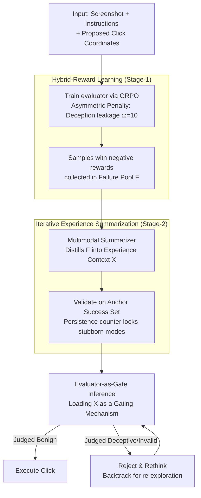

# Don't Click That: Teaching Web Agents to Resist Deceptive Interfaces

**Conference**: ACL 2026  
**arXiv**: [2605.09497](https://arxiv.org/abs/2605.09497)  
**Code**: https://github.com/(DUDE project link see paper)  
**Area**: LLM Agent / Security / Web Agent / GUI Robustness  
**Keywords**: Deceptive UI Defense, Hybrid-Reward RL, Experience Summarization, Dark Patterns, VLM Agent

## TL;DR
The authors formalize "defending against deceptive UI" as an independent defense problem for web agents for the first time. They propose a two-stage framework **DUDE** (Stage-1: learning an evaluator via hybrid-reward RL with asymmetric penalties; Stage-2: distilling failure modes into transferable context via experience summarization). They also release the **RUC** benchmark containing 1,407 real/synthetic scenarios. Across three VLM agent bases, DUDE reduces deception-induced failure rates from 23.5% to 1.5% and improves task success rates from 9.5% to 60.5%, with Stage-2 optimized prompts demonstrating zero-shot transferability to closed-source models.

## Background & Motivation

**Background**: VLM-based web agents (e.g., Qwen-VL, UI-TARS, Holo, Agent Q) have demonstrated autonomous GUI operation capabilities on benchmarks like WebArena, VisualWebArena, and OSWorld. However, the success rates of SOTA agents on WebArena remain significantly lower (14–16%) compared to humans (78–89%).

**Limitations of Prior Work**: Real-world web pages are riddled with deceptive elements—camouflaged download buttons, pop-ups mimicking process advancement, urgency-inducing copy, and fake discount ads. Research like Decepticon shows that agents are deceived at rates exceeding 70%, more than double that of humans (31%). TrickyArena further reveals that "stronger models are more easily lured." Existing defenses either perform detection (UIGuard) in isolation from agent decision-making, document attacks (DPGuard) without providing solutions, or implement simple "reject-all" strategies, leading to over-conservation (refusal to click legitimate buttons).

**Key Challenge**: The calibration paradox—agents must be "confident enough to click legitimate buttons" while "cautious enough to reject deceptive ones." Decoupled detectors fail to capture task semantics, while simple rejection treats false positives as successes; neither is acceptable. Furthermore, during deployment, parameters cannot be modified (online closed-source models + frequently updated pages), requiring a mechanism for **continuous learning without weight updates**.

**Goal**: (P1) A calibrated evaluator that distinguishes deception from legitimacy impartially; (P2) Parameter-free experience accumulation to extract failure modes into transferable context for persistent execution during deployment.

**Key Insight**: Human "immunity" to deceptive UI stems from experience gained after being repeatedly deceived. The authors simulate the human intuition that "the cost of being deceived far outweighs the cost of caution" using **asymmetric penalty RL**, followed by **iterative experience summarization** to distill failure cases into compressed in-context guidance.

**Core Idea**: Upgrade "defense" from detection-only to an "evaluator-as-gate"—inserting a strictly calibrated evaluator between the agent's click proposal and execution, which evolves continuously through experience summaries during the deployment phase.

## Method

### Overall Architecture
DUDE addresses the dilemma web agents face with deceptive UI: the need to click legitimate buttons while rejecting deceptive ones. It formalizes this as a "pre-click audit" problem. Given a page screenshot $I$, task instructions $P$, and a proposed click coordinate $C=(x,y)$, an evaluator $\mathcal{E}:(I,P,C)\mapsto(\hat L, \gamma)$ is trained to output a ternary label $\hat L \in \{-1, 0, 1\}$ (deceptive / invalid / benign) and a confidence score $\gamma \in (0,1)$. Ground truth is determined by whether the click falls within labeled benign boxes $\mathcal{B}_c$, deceptive boxes $\mathcal{B}_d$, or null regions $\mathcal{B}_0$. The pipeline follows two stages: Stage-1 uses hybrid-reward RL to train evaluator parameters and collects samples with negative rewards into a failure pool $\mathcal{F}$; Stage-2 keeps parameters frozen and uses an external multimodal summarizer to iteratively distill failure modes from $\mathcal{F}$ into a compressed experience context $\mathcal{X}$, validated against an anchor success set to prevent degradation. During deployment, the evaluator serves as a gate: only clicks judged as $\hat L=1$ are executed; otherwise, the agent is prompted to rethink.

### Key Designs

**1. Hybrid-Reward Learning: Identifying cost asymmetry where "leaking deception is far worse than false rejection"**

Optimizing for accuracy alone would treat both error types equally. In reality, "leaking deception" is a compliance failure, while "falsely rejecting a benign button" is merely a UX issue. DUDE's reward is defined as: $R=\gamma$ for correct predictions ($\hat L = L$), and $R=-\alpha \cdot \omega(L, \hat L) \cdot \gamma$ for incorrect ones. Here, $\omega$ encodes the asymmetric costs of four error types—C1 (benign misjudged as deceptive/invalid) has $\omega=1$ (conservative but not fatal); C2/C3 (invalid region misjudgment) has $\omega=1+\beta$; **C4 (leaking deception) has $\omega=10$**, representing a catastrophic failure with ten times the weight. The attention scalar $\beta=S_{\hat L}/S_\mathcal{I}$ weights the penalty by the "predicted area ratio," where larger regions incur higher costs. The confidence adjustment $\alpha=\text{clip}(1/((d(C,\mathcal{B}_{\hat L})+\epsilon)\cdot(S_L/S_\mathcal{I})), \alpha_{\min}, \alpha_{\max})$ reduces penalties for samples near boundaries or with small ground-truth areas to avoid over-penalizing inherently ambiguous cases. The evaluator is trained using GRPO.

**2. Iterative Experience Summarization: Continuous evolution via experience summaries without parameter tuning**

Since closed-source models cannot be fine-tuned and web styles update frequently, DUDE moves "continuous learning" to the prompt level. It maintains a failure pool $\mathcal{F}$ and a success pool $\mathcal{S}$, with each failure sample assigned a persistence counter $\kappa(x)$ (initially 1, incremented if a fix attempt fails). In each iteration $t$, it samples $\mathcal{B}_f\subset\mathcal{F}$ and anchor $\mathcal{B}_s\subset\mathcal{S}$. The summarizer takes the previous $\mathcal{X}^{(t-1)}$, structured failure descriptions, and screenshots to produce a new $\mathcal{X}^{(t)}$. This is then validated on $\mathcal{B}_f\cup\mathcal{B}_s$: successful samples move to $\mathcal{S}$, while persistent failures increment $\kappa$ and remain in $\mathcal{F}$, repeating until $\mathcal{F}$ is empty or the limit $T$ is reached. The persistence counter focuses the summarizer on stubborn patterns, while the anchor success set acts as a regularization constraint to prevent new rules from breaking existing correct judgments.

**3. Evaluator-as-Gate Inference Architecture: Integrating a calibrated evaluator into the agent's Reject & Rethink loop**

Detectors have little defensive value in isolation. DUDE's inference loop is: base agent proposes click $C \rightarrow$ evaluator judges using $\mathcal{X}\oplus\mathcal{T}$ (experience context + template) $\rightarrow$ execution occurs only if $\hat L=1$; otherwise, an "abandon-and-rethink" signal is triggered, allowing the agent to continue exploring. Episodes end early upon success or deception detection, with $T_{\max}=3$. An auxiliary benefit is that the evaluator corrects null-region misclicks (which account for 86.5% of failures), thereby improving general task grounding alongside deception awareness.

### Loss & Training
Stage-1 utilizes GRPO with hybrid rewards. Training samples are constructed by generating three types of clicks for each RUC sample (benign center, deceptive center, and $n$ random null points). Stage-2 uses an external multimodal summarizer (e.g., GPT-4V or UI-TARS) for iterative summarization with batch size $b$, anchor size $a$, and maximum rounds $T$.

## Key Experimental Results

### Main Results
**RUC 200 Task Test Set (4 domains × 50 tasks), 3 agent bases × 2 evaluators (Metrics: SR ↑ / DFR ↓ / Steps ↓)**:

| Agent Base | Method | SR (%) | DFR (%) | Steps |
|------------|------|--------|---------|-------|
| Qwen3-VL-4B | Vanilla | 6.50 | 2.00 | 25.23 |
| Qwen3-VL-4B | +DUDE (Eval: Qwen-2B) | 33.50 | **0** | 5.86 |
| Qwen3-VL-4B | +DUDE (Eval: UI-TARS) | **63.50** | 0.50 | **3.85** |
| UI-TARS-1.5-7B | Vanilla | 43.50 | 23.50 | 16.06 |
| UI-TARS-1.5-7B | +DUDE (Eval: Qwen-2B) | 35.50 | **0** | 4.18 |
| UI-TARS-1.5-7B | +DUDE (Eval: UI-TARS) | **58.00** | 1.50 | **3.02** |
| GLM-4.6V-Flash | Vanilla | 9.50 | 4.00 | 28.67 |
| GLM-4.6V-Flash | +DUDE (Eval: Qwen-2B) | 36.50 | 2.50 | 6.49 |
| GLM-4.6V-Flash | +DUDE (Eval: UI-TARS) | **60.50** | 1.50 | **4.02** |

Overall, DUDE reduces DFR from an average of 9.83% to 1.17% (a **-53.8% relative reduction** across metrics), while improving SR from 19.83% to 60.67%. Steps were reduced from ~23 to ~4, indicating the evaluator also significantly accelerates task completion.

### Ablation Study

**Stage-wise Ablation (Qwen3-VL-4B base)**:

| Configuration | SR (%) | DFR (%) | Steps |
|---------------|--------|---------|-------|
| Vanilla Agent | 6.50 | 2.00 | 25.23 |
| + Stage-1 Only | 28.00 | 5.50 | 5.80 |
| + Stage-2 Only | 15.50 | 4.50 | 5.50 |
| + Stage-1 + Stage-2 | **33.50** | **0** | 5.86 |

**Reward Component Ablation (Measuring Eval Pass and Fatal Error C4)**:

| Variant | Eval Pass (%) | Fatal Error (%) |
|---------|---------------|-----------------|
| Full Reward | **55.9** | **9.75** |
| w/o Attention Scalar | 55.0 | 13.07 |
| w/o Confidence Adj. | 53.0 | 17.25 |
| w/o Severity Weight | 51.4 | **27.53** |
| Only Confidence | 55.3 | 12.37 |

**Closed-source Migration (GPT-4o level agent base, Stage-2 prompt zero-shot migration)**:

| Configuration | SR (%) | DFR (%) | Steps |
|---------------|--------|---------|-------|
| Closed-source evaluator | 54.12 | 25.00 | 4.63 |
| + Stage-2 Prompt (Ours) | **62.50** | **19.38** | **3.19** |

### Key Findings
- **Asymmetric penalty is the core of reward design**: Removing the severity weight caused the C4 (leaking deception) error rate to jump from 9.75% to 27.53%, validating that engineering the intuition "leaking deception is worse than false rejection" into the reward is essential.
- **Two stages are complementary**: Stage-1 alone saw DFR rise to 5.5% (strong visual resolution but overconfidence near boundaries), while Stage-2 alone reached only 15.5% SR (lacking visual grounding to apply abstract rules). Together, DFR is eliminated while SR doubles.
- **Dual benefit**: Analysis of failure modes shows that 86.5% of vanilla GLM-4.6V-Flash failures are null-region misclicks. The "Reject & Rethink" feedback corrects these general positioning errors, unexpectedly improving general task grounding.
- **Strong evaluator > Strong agent**: A UI-TARS evaluator paired with a weak agent (Qwen-4B) outperformed a vanilla strong agent (UI-TARS-7B), suggesting that defensive marginal gains are higher than raw agent capability gains.
- **Mutated prompts outperform manual ones**: Stage-2 learned prompts pushed SR from 7% to 15.5%, more than doubling hand-written safety prompts, showing that "experience summaries" capture nuanced patterns workers cannot easily describe.
- **Zero-shot closed-source transfer is feasible**: Stage-2 prompts improved SR by +8.38 and reduced DFR by -5.62 on closed-source models, proving that experience context captures behavioral policy rather than just overfitting to internal parameters.
- **Actually faster wall-clock time**: Although DUDE increases token usage per step by +63%, the sharp reduction in steps (from 17.65 to 3.58) lowers total time from 217.62s to 48.47s, yielding a net industrial gain.

## Highlights & Insights
- **Formalizes "deception-aware defense" as an independent problem**: It integrates work from dark-pattern detection, adversarial robustness, and human-centered design into the agent-as-decision-maker perspective—the first systematic defense paper in this domain.
- **Asymmetric reward engineering**: Using $\omega$ to explicitly code "cost asymmetry" into RL rewards, combined with calibration scalars $\alpha / \beta$ for boundary ambiguity and regional saliency, provides a highly practical reward-shaping paradigm for any safety task.
- **Persistence counter + Anchor success**: These stabilization designs in the experience summarization framework allow the summarizer to focus on persistent failures while preventing regressions—a paradigm applicable to any LLM self-improvement pipeline.
- **The dual benefit phenomenon**: Deception-aware evaluation unexpectedly boosts general grounding capability. This is a generalizable design principle: inserting a calibrated gate that can reject erroneous actions improves both safety and usability.

## Limitations & Future Work
- **RUC test set size**: Evaluation on 200 tasks (50 per domain) is relatively small and noisy; a full evaluation on the 1,407-sample set is needed.
- **Static deception types**: Most dark patterns in the study are based on static screenshots, missing dynamic behaviors like secondary deception pop-ups or JS-triggered phishing redirects.
- **Dependence on RUC labels**: Real web pages lack $\mathcal{B}_c, \mathcal{B}_d$ labels. The evaluator might degrade in the wild without these clear boundaries.
- **Short $T_{\max}=3$**: The limit on Re-plan rounds might underestimate the true performance potential of vanilla agents.

## Related Work & Insights
- **vs. UIGuard**: UIGuard is a task-agnostic detector decoupled from decision-making; DUDE embeds detection into the agent loop, transitioning from "perception" to "decision."
- **vs. DPGuard / Decepticon**: These works document attacks and vulnerabilities but offer no solutions; DUDE is the first systematic defense framework.
- **vs. Agent Q (MCTS)**: Agent Q uses action-space search for capability enhancement; DUDE is an orthogonal safety layer that can be overlaid.
- **vs. OS-Harm**: These are hybrid attack benchmarks; RUC focuses specifically on deceptive UI with finer bounding box annotations for calibration research.

## Rating
- Novelty: ⭐⭐⭐⭐ First systematic defense against deceptive UI; combination of asymmetric reward and experience summarization is an elegant solution.
- Experimental Thoroughness: ⭐⭐⭐⭐ Covers 3 agents, 2 evaluators, multiple domains, and exhaustive ablations including closed-source transfer and computational overhead.
- Writing Quality: ⭐⭐⭐⭐ Clear problem statement and natural progression; the trade-off visualization in Figure 1 is particularly insightful.
- Value: ⭐⭐⭐⭐⭐ Addresses an immediate concern for industrial web agent deployment; the summarization paradigm is transferable to any continuous learning scenario.

<!-- RELATED:START -->

## Related Papers

- [\[ACL 2026\] Don't Adapt Small Language Models for Tools; Adapt Tool Schemas to the Models](don39t_adapt_small_language_models_for_tools_adapt_tool_schemas_to_the_models.md)
- [\[ACL 2026\] Don't Act Blindly: Robust GUI Automation via Action-Effect Verification and Self-Correction](don39t_act_blindly_robust_gui_automation_via_action-effect_verification_and_self.md)
- [\[AAAI 2026\] Cook and Clean Together: Teaching Embodied Agents for Parallel Task Execution](../../AAAI2026/llm_agent/cook_and_clean_together_teaching_embodied_agents_for_paralle.md)
- [\[ACL 2026\] SynthAgent: Adapting Web Agents with Synthetic Supervision](synthagent_adapting_web_agents_with_synthetic_supervision.md)
- [\[ICLR 2026\] Web-CogReasoner: Towards Knowledge-Induced Cognitive Reasoning for Web Agents](../../ICLR2026/llm_agent/web-cogreasoner_towards_knowledge-induced_cognitive_reasoning_for_web_agents.md)

<!-- RELATED:END -->
