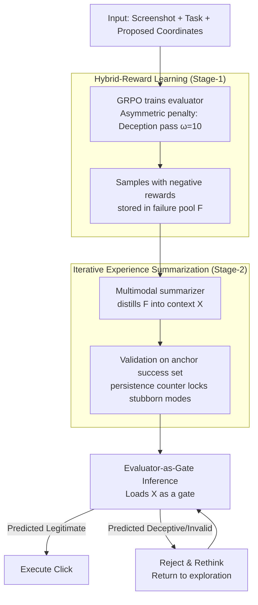

# Don't Click That: Teaching Web Agents to Resist Deceptive Interfaces

**Conference**: ACL 2026  
**arXiv**: [2605.09497](https://arxiv.org/abs/2605.09497)  
**Code**: https://github.com/(DUDE project link in paper)  
**Area**: LLM Agent / Security / Web Agent / GUI Robustness  
**Keywords**: Deceptive UI Defense, Hybrid-Reward RL, Experience Summarization, Dark Patterns, VLM Agent

## TL;DR
This work formalizes "adversarial deceptive UI" as an independent defense problem for web agents. It proposes the two-stage framework **DUDE** (hybrid-reward RL with asymmetric penalties to train an evaluator + iterative experience summarization to distill failure modes into transferable context) and releases the **RUC** benchmark containing 1407 real/synthetic scenarios. Across three VLM agent bases, it reduces deception-induced failure rates from 23.5% to 1.5%, pushes task success rates from 9.5% to 60.5%, and demonstrates zero-shot transferability of Stage-2 prompts to closed-source models.

## Background & Motivation

**Background**: VLM-based web agents (Qwen-VL / UI-TARS / Holo / Agent Q, etc.) have demonstrated autonomous GUI operation capabilities on benchmarks like WebArena / VisualWebArena / OSWorld. However, SOTA agent success rates on WebArena range between 14–16%, significantly lower than the human range of 78–89%.

**Limitations of Prior Work**: Real-world webpages are saturated with deceptive elements—camouflaged download buttons, pop-ups impersonating task progress, urgent copywriting, and fake discount ads. Studies like Decepticon indicate agent deception rates exceed 70%, more than double that of humans (31%). TrickyArena further finds that "stronger models are more easily lured." Existing defenses either perform decoupled detection (UIGuard) without integration into decision-making or focus on documentation (DPGuard) without providing solutions; others employ simple "total rejection," leading to over-conservation (refusal to click legitimate buttons).

**Key Challenge**: The calibration trade-off—agents must be "brave enough for legitimate buttons" while "cautious against deceptive ones." Decoupled detectors fail to capture task semantics, and simple rejection treats false positives as successes, both of which are unacceptable. Furthermore, many deployment scenarios involve fixed weights (closed-source models + rapidly updating webpages), requiring a mechanism for **continuous learning without weight updates**.

**Goal**: (P1) A calibrated evaluator that distinguishes between deception and legitimacy impartially; (P2) Parameter-free experience accumulation that distills failure modes into transferable context for deployment.

**Key Insight**: Human "immunity" to deceptive UI stems from experience gained through repeated encounters. The authors simulate the human intuition that "the cost of being deceived is much higher than the cost of caution" using **asymmetric penalty RL**, followed by **iterative experience summarization** to distill failure cases into compressed in-context guidance.

**Core Idea**: Upgrade defense from "detection-only" to an "evaluator-as-gate"—inserting a strictly calibrated evaluator between the agent's click proposal and actual execution, which continues to evolve via experience summaries during deployment.

## Method

### Overall Architecture
DUDE addresses the dilemma of web agents facing deceptive UI: clicking legitimate buttons vs. rejecting deceptive ones. It formalizes this as a "pre-click audit" problem. Given a screenshot $I$, task prompt $P$, and agent-proposed coordinates $C=(x,y)$, an evaluator $\mathcal{E}:(I,P,C)\mapsto(\hat L, \gamma)$ is trained to output a tri-state label $\hat L \in \{-1, 0, 1\}$ (deceptive / invalid / legitimate) and confidence $\gamma \in (0,1)$. Ground truth is determined by whether the click falls into labeled legitimate boxes $\mathcal{B}_c$, deceptive boxes $\mathcal{B}_d$, or null regions $\mathcal{B}_0$. The pipeline involves two stages: Stage-1 uses hybrid-reward RL to train the evaluator's parameters and collects samples with negative rewards into a failure pool $\mathcal{F}$. Stage-2 keeps parameters frozen and uses an external multimodal summarizer to iteratively distill failure modes from $\mathcal{F}$ into a compressed experience context $\mathcal{X}$, validated against an anchor success set to prevent degradation. At inference, the evaluator uses $\mathcal{X}$ as a gate: only clicks predicted as $\hat L=1$ are executed; otherwise, the agent is halted to rethink.

### Key Designs

**1. Hybrid-Reward Learning: Encoding Cost Asymmetry into Rewards**

Optimizing for accuracy alone leads to uniform treatment of errors. However, "passing deception" is a compliance failure, while "falsely rejecting legitimate buttons" is merely a nested experience issue. DUDE's reward $R$ is $\gamma$ for correct predictions ($\hat L = L$) and $R=-\alpha \cdot \omega(L, \hat L) \cdot \gamma$ for errors. Here $\omega$ encodes four types of asymmetric costs: C1 (misidentifying legitimate as deceptive/invalid) is $\omega=1$ (conservative but not fatal); C2/C3 (invalid region errors) is $\omega=1+\beta$; **C4 (letting deception pass) is $\omega=10$** (catastrophic). An attention scalar $\beta=S_{\hat L}/S_\mathcal{I}$ weights the penalty by the ratio of the predicted region to the total image; confidence adjustment $\alpha=\text{clip}(1/((d(C,\mathcal{B}_{\hat L})+\epsilon)\cdot(S_L/S_\mathcal{I})), \alpha_{\min}, \alpha_{\max})$ reduces penalties for samples near boundaries or involving small grounding truth regions. The evaluator is trained using GRPO.

**2. Iterative Experience Summarization: Continuous Evolution via Experience Context**

To handle closed-source models and updating UI styles without fine-tuning, DUDE shifts "learning" to the prompt level. It maintains a failure pool $\mathcal{F}$ and success pool $\mathcal{S}$, where each failure sample has a persistence counter $\kappa(x)$ (increments if the error persists). In each iteration $t$, a batch $\mathcal{B}_f\subset\mathcal{F}$ and anchor $\mathcal{B}_s\subset\mathcal{S}$ are sampled. The summarizer takes the current $\mathcal{X}^{(t-1)}$, structured failure descriptions, and screenshots to produce $\mathcal{X}^{(t)}$. This is validated against $\mathcal{B}_f\cup\mathcal{B}_s$: corrected failures move to $\mathcal{S}$, and failures that persist increment $\kappa$ and stay in $\mathcal{F}$ until the pool is empty or the iteration limit $T$ is reached. The anchor success set acts as a regularization constraint to prevent new rules from breaking previously correct behaviors.

**3. Evaluator-as-Gate Inference: Reject & Rethink Architecture**

The defense is integrated directly into the action loop. The inference cycle works as follows: the base agent proposes click $C$, the evaluator judges it using $\mathcal{X}\oplus\mathcal{T}$ (experience context + template). Only $\hat L=1$ triggers execution; otherwise, an "abandon-and-rethink" signal is sent back for re-exploration. An episode terminates upon task completion, detected deception, or reaching $T_{\max}=3$. A dual benefit identified is that the evaluator's feedback corrects not just deception but also null-region misclicks (86.5% of failures), improving overall grounding.

### Loss & Training
Stage-1 follows the GRPO framework with the hybrid reward. Training samples are constructed by sampling center points of legitimate boxes, deceptive boxes, and $n$ random null points for each RUC sample. Stage-2 utilizes an external multimodal summarizer (e.g., GPT-4V or UI-TARS) for iterative distillation with batch size $b$, anchor size $a$, and maximum rounds $T$.

## Key Experimental Results

### Main Results
**Testing on RUC (200 tasks: 4 domains × 50 tasks), 3 agent bases × 2 evaluators (Metrics: SR ↑ / DFR ↓ / Steps ↓)**:

| Agent Base | Method | SR (%) | DFR (%) | Steps |
|------------|------|--------|---------|-------|
| Qwen3-VL-4B | Vanilla | 6.50 | 2.00 | 25.23 |
| Qwen3-VL-4B | +DUDE (Eval: Qwen-2B) | 33.50 | **0** | 5.86 |
| Qwen3-VL-4B | +DUDE (Eval: UI-TARS) | **63.50** | 0.50 | **3.85** |
| UI-TARS-1.5-7B | Vanilla | 43.50 | 23.50 | 16.06 |
| UI-TARS-1.5-7B | +DUDE (Eval: Qwen-2B) | 35.50 | **0** | 4.18 |
| UI-TARS-1.5-7B | +DUDE (Eval: UI-TARS) | **58.00** | 1.50 | **3.02** |
| GLM-4.6V-Flash | Vanilla | 9.50 | 4.00 | 28.67 |
| GLM-4.6V-Flash | +DUDE (Eval: Qwen-2B) | 36.50 | 2.50 | 6.49 |
| GLM-4.6V-Flash | +DUDE (Eval: UI-TARS) | **60.50** | 1.50 | **4.02** |

DUDE reduces the Deception Failure Rate (DFR) to an average of 1.17% and increases Success Rate (SR) from 19.83% to 60.67%. Steps are dramatically reduced from ~23 to ~4, showing the evaluator accelerates tasks by preventing irrelevant exploration.

### Ablation Study

**Stage-wise Ablation (Qwen3-VL-4B base)**:

| Configuration | SR (%) | DFR (%) | Steps |
|---------------|--------|---------|-------|
| Vanilla Agent | 6.50 | 2.00 | 25.23 |
| + Stage-1 Only | 28.00 | 5.50 | 5.80 |
| + Stage-2 Only | 15.50 | 4.50 | 5.50 |
| + Stage-1 + Stage-2 | **33.50** | **0** | 5.86 |

**Reward Component Ablation (Eval Pass and Fatal Error C4)**:

| Variant | Eval Pass (%) | Fatal Error (%) |
|---------|---------------|-----------------|
| Full Reward | **55.9** | **9.75** |
| w/o Severity Weight | 51.4 | **27.53** |
| Only Confidence | 55.3 | 12.37 |

### Key Findings
- **Asymmetric penalty is the core of reward design**: Removing severity weights causes C4 (passing deception) errors to triple (9.75% to 27.53%), validating the necessity of encoding cost asymmetry.
- **Dual Benefit**: 86.5% of vanilla failures were null-region misclicks. The "Reject & Rethink" feedback from a deception-aware evaluator effectively corrects general grounding errors.
- **Strong Evaluator > Strong Agent**: A strong evaluator (UI-TARS) paired with a weak agent (Qwen-4B) outperforms a strong vanilla agent (UI-TARS-7B).
- **Zero-Shot Closed-Source Transfer**: Stage-2 prompts improve SR by +8.38 and reduce DFR by -5.62 on closed-source models, proving that experience contexts learn behavior-level policies.
- **Wall-clock Efficiency**: Although per-step token usage increases by 63%, total task time drops from 217.62s to 48.47s due to the drastic reduction in steps.

## Highlights & Insights
- **First Systematic Defense**: Formalizes deceptive UI defense as an independent agent problem, moving from simple detection to action-loop decision-making.
- **Practical Reward Engineering**: The use of $\omega$ for cost asymmetry and calibration scalars $\alpha/\beta$ offers a robust paradigm for security tasks where false negatives are catastrophic.
- **Persistence & Anchor Mechanisms**: The iterative summarization framework prevents regression and focus on stubborn modes, providing a template for LLM self-improvement without fine-tuning.
- **Reject & Rethink Paradigm**: Demonstrates that safety layers can act as a "dual-purpose" gate that improves both robustness and general utility.

## Limitations & Future Work
- **Benchmark Scale**: Testing on 200 tasks is relatively small; a full evaluation on the 1407 samples in RUC is needed.
- **Deception Fidelity**: Dark patterns are mostly static; dynamic behaviors (e.g., secondary pop-ups after clicks) and real-world long-tail scenarios are not fully covered.
- **Boundary Label Reliance**: Relies on labeled boxes $\mathcal{B}_c, \mathcal{B}_d$, which are absent in real-world "in the wild" deployment.
- **High Summarization Cost**: Iterative summarization relies on expensive teacher models like GPT-4V.

## Related Work & Insights
- **vs UIGuard**: Moves from task-agnostic detection to task-aware gated execution.
- **vs DPGuard / Decepticon**: Moves from documentation and measurement to a systematic defense framework.
- **vs Agent Q**: While Agent Q uses MCTS for capability enhancement, DUDE provides an orthogonal safety layer.

## Rating
- **Novelty**: ⭐⭐⭐⭐ Systematic defense approach to deceptive UI.
- **Experimental Thoroughness**: ⭐⭐⭐⭐ Multi-base evaluation, extensive ablation, and closed-source transfer.
- **Writing Quality**: ⭐⭐⭐⭐ Clear problem formulation and logical flow.
- **Value**: ⭐⭐⭐⭐⭐ Immediate industrial applicability and a valuable community resource in the RUC benchmark.

<!-- RELATED:START -->

## Related Papers

- [\[ACL 2026\] Benchmarking Web Agent Safety under E-commerce Deceptive Interfaces](benchmarking_web_agent_safety_under_e-commerce_deceptive_interfaces.md)
- [\[ACL 2026\] Don't Adapt Small Language Models for Tools; Adapt Tool Schemas to the Models](don39t_adapt_small_language_models_for_tools_adapt_tool_schemas_to_the_models.md)
- [\[ICML 2026\] Web Agents Should Use Typed Actions Instead of Click-Based Browsing](../../ICML2026/llm_agent/web_agents_should_use_typed_actions_instead_of_click-based_browsing.md)
- [\[ACL 2026\] Don't Act Blindly: Robust GUI Automation via Action-Effect Verification and Self-Correction](don39t_act_blindly_robust_gui_automation_via_action-effect_verification_and_self.md)
- [\[ACL 2026\] SynthAgent: Adapting Web Agents with Synthetic Supervision](synthagent_adapting_web_agents_with_synthetic_supervision.md)

<!-- RELATED:END -->
