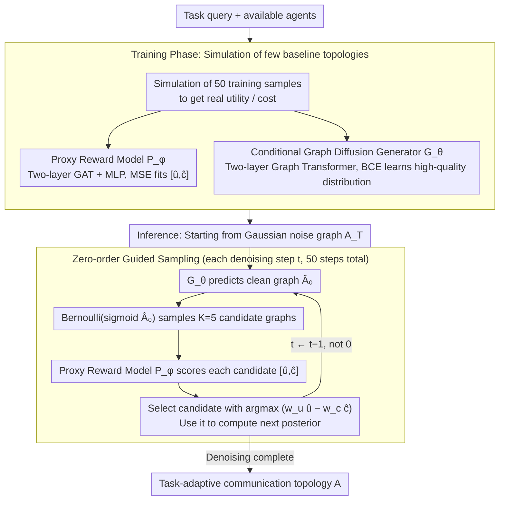

# Dynamic Generation of Multi-LLM Agents Communication Topologies with Graph Diffusion Models

**Conference**: ACL 2026  
**arXiv**: [2510.07799](https://arxiv.org/abs/2510.07799)  
**Code**: Specific URL not provided (text states code is available)  
**Area**: LLM Agent / Multi-Agent Collaboration  
**Keywords**: Multi-agent systems, communication topology, graph diffusion, zero-order optimization, proxy reward model

## TL;DR
This paper proposes Guided Topology Diffusion (GTD), which models the generation of multi-LLM agent communication topologies as a conditional graph diffusion process. It uses a proxy reward model to perform zero-order guidance at each denoising step, generating task-adaptive collaborative networks that are sparser, more token-efficient, and more robust.

## Background & Motivation
**Background**: LLM multi-agent systems often solve complex tasks such as mathematical reasoning, code generation, and knowledge Q&A through structured communication. Existing systems typically use chains, stars, complete graphs, layered workflows, or manual role templates. Some methods have begun using search, GNNs, or autoregressive models to learn task-relevant topologies.

**Limitations of Prior Work**: Fixed topologies struggle to adapt to task differences. Simple Q&A may only require minimal linear interaction, while software development or complex reasoning requires richer collaborative structures. Overly dense graphs waste tokens, while overly sparse graphs create bottlenecks; optimizing only for accuracy often neglects communication costs, sparsity, and failure robustness.

**Key Challenge**: Topology quality requires a trade-off between utility, cost, robustness, and sparsity. However, obtaining real rewards requires executing full multi-agent simulations, which is both expensive and non-differentiable. If a generative model only learns the training distribution, it cannot gradually adjust toward high-reward regions during sampling.

**Goal**: The authors aim to build an end-to-end topology generation framework that dynamically generates agent communication graphs for each new task, optimizing task performance and communication costs in real-time without frequently running expensive simulations.

**Key Insight**: The paper treats topology synthesis as a conditional discrete graph generation problem. A diffusion model is responsible for progressively constructing the graph, a lightweight proxy model predicts the utility and cost of candidate graphs, and zero-order optimization selects the optimal direction from multiple candidates at each sampling step.

**Core Idea**: First, a proxy reward model is trained using simulations from a small number of benchmark topologies. Then, during the reverse denoising of graph diffusion, candidate topologies are repeatedly sampled, and the current optimal candidate is selected using $w_u\hat{u}-w_c\hat{c}$, directly injecting multi-objective preferences into the generation trajectory.

## Method

### Overall Architecture
The problem GTD solves is: given a task query and a set of available agents, how to generate a communication graph $A\in\{0,1\}^{N\times N}$ that achieves task success without wasting tokens and remains robust to single-point failures. This is decomposed into two complementary models—the proxy reward model $\mathcal{P}_\phi$ responsible for cheaply predicting the utility and cost of a topology under the current task, and the conditional graph diffusion generator $\mathcal{G}_\theta$ responsible for learning the distribution of high-quality topologies into the network. During the training phase, both models are fed with real simulation results from a small number of baseline topologies. During the inference phase, the diffusion starts from a Gaussian noise graph and takes shape over 50 denoising steps. Instead of blind generation, each step produces multiple candidate graphs, from which the proxy model selects the one with the highest current reward to determine the next step, thus gradually injecting multi-objective preferences into the entire sampling trajectory.

### Key Designs

**1. GAT Proxy Reward Model: Replacing expensive simulations with a single forward pass**

Real rewards can only be obtained after completing a full round of multi-agent simulation, which is expensive, non-differentiable, and cannot be repeatedly called within each diffusion step. GTD addresses this by training a lightweight substitute: $\mathcal{P}_\phi$ takes the graph $A$ and task condition $C$ as input, uses a two-layer Graph Attention Network to calculate node representations, performs mean pooling for a graph-level representation, and concatenates this with the task vector before passing it through an MLP to directly output $[\hat{u},\hat{c}]$. The training objective is to bring these predicted values close to the performance vector of real simulations using MSE supervision. Crucially, this proxy model does not need to perfectly reconstruct absolute reward values—it only needs sufficient ranking fidelity among candidate graphs to support selection, allowing it to be trained with minimal simulation data while providing high-speed calls at every step.

**2. Conditional Graph Diffusion Generator: Safeguarding critical edges through iterative refinement**

Communication graphs are discrete structures where the presence or absence of a single edge can determine whether information flows or is redundantly broadcast. Single-step VAEs or Gumbel-Softmax models easily miss critical edges in such spaces. GTD uses diffusion: it scales the binary adjacency matrix to $\{-1,1\}$, adds noise through a variance-preserving forward process, and tasks a two-layer Graph Transformer with predicting the clean graph in the reverse process. The global attention of the Graph Transformer ensures that each edge prediction depends on other nodes and edges, enabling the model to learn structural dependencies like cycles and hierarchies. The inherent iterative refinement of diffusion provides the interface for the proxy model to intervene at each step and steer the graph toward high-reward regions.

**3. Zero-order proxy-guided sampling: Reward guidance on non-differentiable graphs**

Standard classifier guidance relies on backpropagation, but the sampling action from continuous predictions to discrete graphs breaks differentiability. Objectives like token cost and robustness are also black boxes. GTD therefore adopts a zero-order approach: at each timestep, it first obtains the unguided clean graph prediction $\hat{A}_0^{(t)}$, samples $K$ candidate graphs from $Bernoulli(\mathrm{sigmoid}(\hat{A}_0^{(t)}))$, has the proxy model provide $[\hat{u}_k,\hat{c}_k]$ for each, and selects the candidate $A_{0,best}^{(t)}$ that maximizes $w_u\hat{u}_k-w_c\hat{c}_k$ to compute the next posterior. This selection process requires no gradients yet effectively applies the trade-off between utility and cost directly to the generation trajectory.

### Loss & Training
The proxy model is trained using MSE to predict numerical utility and cost obtained from simulations. The diffusion generator is trained on a subset of high-performance graphs, using BCE to predict the original clean adjacency matrix. In the main experiments, all agents use a GPT-4o-mini backbone. Mathematical tasks use 4 MathSolvers, HumanEval uses 4 CodeSolvers, and MMLU uses 3 KnowledgeableAcademic agents. The proxy model is a two-layer GAT with a hidden dimension of 32, Adam optimizer with a learning rate of $1e^{-3}$, batch size of 16, and 10 training epochs. The diffusion model is a two-layer Graph Transformer with 2 attention heads, a learning rate of $1e^{-4}$, and 50 diffusion timesteps. Training data uses only 50 samples from the training set to evaluate and construct baseline topologies; during inference, $K=5$ candidate graphs are evaluated at each step.

## Key Experimental Results

### Main Results
| Benchmark | GTD | Strongest/Typical Comparison | Gain or Note |
|--------|------|----------|------|
| GSM8K | 94.14 | MaAS: 92.30, G-Designer: 92.09, Vanilla: 87.45 | Highest math reasoning |
| MATH | 54.07 | MaAS: 51.82, AFlow: 51.28 | 2+ points higher than strongest baseline |
| MultiArith | 98.88 | MaAS: 98.80, G-Designer: 97.78 | Near saturation but still best |
| HumanEval | 91.46 | G-Designer: 91.11, AFlow: 90.93 | Effective for code tasks |
| MMLU | 84.58 | G-Designer: 84.50, GPTSwarm: 83.98 | Slight lead in knowledge tasks |
| SVAMP | 91.33 | G-Designer: 90.00, LLM-Debate: 89.00 | Stable lead |
| Avg. | 85.74 | MaAS: 84.49, G-Designer: 84.41, Vanilla: 81.75 | Average gain of 3.99 over Vanilla |

### Ablation Study
| Configuration | GSM8K | HumanEval | Note |
|------|---------|------|------|
| GTD | 94.14 | 91.43 | Full proxy-guided diffusion |
| w/o Guidance | 88.42 | 87.19 | GSM8K drops nearly 6 points without guidance |
| w/ Random | 89.65 | 88.32 | Random candidate selection yields minimal benefit |
| Direct GNN pred. | 91.23 | N/A | Single-step generation is weaker than diffusion |
| MCMC 100 steps | 92.87 | N/A | Search-based methods remain lower than GTD |
| GTD, $K=5$ | 94.14 / 7.9s | N/A | Best accuracy-time trade-off |
| GTD, $K=10$ | 94.31 / 18.1s | N/A | Accuracy increases slightly while latency more than doubles |

### Key Findings
- GTD also excels in token cost. On GSM8K, GTD achieves 94%+ accuracy using approximately $4.8\times10^6$ tokens, while G-Designer requires 15% more tokens for lower accuracy, and LLM-Debate uses over 5 times more tokens.
- On MultiArith, GTD nears 99% accuracy with $8.4\times10^4$ tokens; on SVAMP, it uses $1.4\times10^5$ tokens, becoming the only method to exceed 91% accuracy while maintaining the lowest token usage.
- Robustness experiments show that under a single agent failure on GSM8K, GTD performance drops by only 0.3 percentage points. It drops 2.1% under two-agent failure and 1.4% with a noisy agent (50% error), both outperforming MaAS and G-Designer.
- Proxy model ranking fidelity is sufficient for guidance: held-out Top-1 of 5 ranking accuracy is 78.4% for utility and 85.2% for cost. On OOD GTD topologies, Top-1 is 72.8% and Top-2 of 5 is 89.3%.

## Highlights & Insights
- The paper identifies a core bottleneck in multi-agent systems: topology is not an engineering detail but a joint control variable for performance, cost, and robustness.
- Using diffusion instead of one-shot generation is logical. In communication graphs, a single wrong edge can cause information blockage or redundancy; iterative refinement is better suited for this discrete structural optimization.
- The proxy model does not need perfect reward prediction; it only needs to rank candidate graphs roughly correctly, lowering the barrier to entry for using expensive simulation data for training.
- Experiments on token cost and failure robustness ensure the paper does more than provide marginal accuracy gains; it addresses the needs of real-world multi-agent deployment.

## Limitations & Future Work
- GTD requires pre-computing baseline topologies to train the proxy model. Although the authors claim 50 samples are sufficient, there is still a setup cost for new tasks or agent combinations.
- The current topology is generated before the task starts and does not change dynamically as the conversation progresses. If task requirements change mid-way, a static graph may no longer be optimal.
- In current benchmarks, performance gains saturate with around 4 agents. While larger swarms are architecturally scalable, standard reasoning tasks may not reflect their value.
- Proxy reward design mainly covers utility and cost; more complex objectives like safety, role reliability, tool call failures, and long-term memory consistency require additional modeling.

## Related Work & Insights
- **vs. static topology**: Chains, stars, and complete graphs are simple and controllable but cannot adjust communication density according to task difficulty; GTD generates task-adaptive sparse graphs directly.
- **vs. GPTSwarm / G-Designer / MaAS**: These methods already focus on topology or collaboration optimization; GTD differs by using a diffusion process for step-by-step generation and injecting multi-objective proxy guidance at each step.
- **vs. AFlow**: AFlow focuses more on workflow search and optimization, while GTD focuses on communication graph structure generation, suitable for modeling message passing between agents as a graph.
- **Insights for Agent Systems**: Future multi-agent frameworks could treat "who communicates with whom" as a learnable control variable rather than being hard-coded in prompt graphs or role templates.

## Rating
- Novelty: ⭐⭐⭐⭐☆ Graph diffusion + proxy-guided ZO for LLM agent topology generation is quite novel; core generative modeling is clear.
- Experimental Thoroughness: ⭐⭐⭐⭐☆ Covers main tasks, tokens, robustness, ablation, open-source models, and harder benchmarks, though real-world complex agent workflows are still limited.
- Writing Quality: ⭐⭐⭐⭐☆ Explanations of methods and formulas are complete; some tables in the cached text were slightly fragmented, but the overall narrative is clear.
- Value: ⭐⭐⭐⭐☆ Provides direct insights for reducing multi-agent communication costs and improving robustness; suitable for future integration with online topology adaptation.

<!-- RELATED:START -->

## Related Papers

- [\[ACL 2026\] MAGMA: A Multi-Graph based Agentic Memory Architecture for AI Agents](magma_a_multi-graph_based_agentic_memory_architecture_for_ai_agents.md)
- [\[ACL 2026\] Agent-GWO: Collaborative Agents for Dynamic Prompt Optimization in Large Language Models](agent-gwo_collaborative_agents_for_dynamic_prompt_optimization_in_large_language.md)
- [\[CVPR 2026\] Towards GUI Agents: Vision-Language Diffusion Models for GUI Grounding](../../CVPR2026/llm_agent/towards_gui_agents_vision-language_diffusion_models_for_gui_grounding.md)
- [\[ACL 2026\] The Bitter Lesson of Diffusion Language Models for Agentic Workflows: A Comprehensive Reality Check](the_bitter_lesson_of_diffusion_language_models_for_agentic_workflows_a_comprehen.md)
- [\[ACL 2026\] Lightweight LLM Agent Memory with Small Language Models](lightweight_llm_agent_memory_with_small_language_models.md)

<!-- RELATED:END -->
