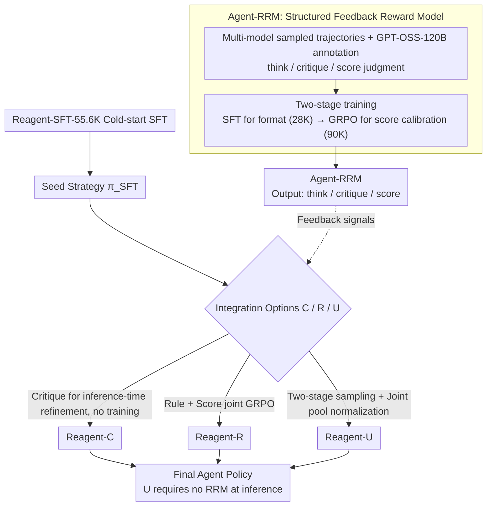

# Exploring Reasoning Reward Model for Agents

**Conference**: ACL 2026 Findings  
**arXiv**: [2601.22154](https://arxiv.org/abs/2601.22154)  
**Code**: https://github.com/kxfan2002/Reagent  
**Area**: LLM Alignment / Reward Model / Agentic RL  
**Keywords**: agentic RL, reasoning reward model, GRPO, critique-guided refinement, multimodal feedback

## TL;DR
The authors identify that current agentic RL typically employs sparse outcome rewards (evaluating only final correctness), which discards high-quality signals from intermediate reasoning steps. They propose **Agent-RRM**, a reasoning reward model generating structured feedback in three segments: `<think>/<critique>/<score>`. By systematically comparing three integration methods (C: pure critique refinement, R: scalar reward enhancement, U: combined critique + score GRPO), **Reagent-U** achieves 43.7% on GAIA and 46.2% on WebWalkerQA using Qwen3-8B. The results demonstrate that joint supervision using "language-level critique + numerical reward" is significantly more effective than single-signal approaches.

## Background & Motivation
**Background**: RLVR (RL with Verifiable Rewards) has been proven to significantly enhance LLM reasoning capabilities in works like DeepSeek-R1. Recently, frameworks such as Search-R1, WebSailor, and Agent0 have extended this paradigm to agentic tasks (multi-turn tool calls + information retrieval), achieving notable gains.

**Limitations of Prior Work**: (1) **Outcome-based rewards are too sparse**—the majority of agentic RL only evaluates the final answer; trajectories that fail at the last step are penalized the same as those that are entirely incorrect, wasting high-quality intermediate steps. (2) **Step-level reward annotation is costly** and prone to reward hacking. (3) **Existing reasoning reward models utilize pair-wise preferences**, which fail to provide actionable guidance on specific errors or improvements. (4) Almost all works rely exclusively on **scalar rewards** for training, completely ignoring natural language critiques as a potential source of dense supervision.

**Key Challenge**: Long-horizon agent tasks (e.g., GAIA Lv.3 requiring 10+ tool steps) necessitate dense signals to learn nuanced reasoning skills, yet existing reward frameworks (outcome/step/preference) are either sparse, expensive, or coarse.

**Goal**: (1) Design a versatile reward model capable of simultaneously producing reasoning traces, textual critiques, and scalar scores. (2) Systematically compare three integration strategies for feeding critiques and scores into agentic RL. (3) Provide a training recipe that consistently outperforms SOTA across 12 benchmarks.

**Key Insight**: The authors adapt the generative reasoning RM approach from DeepSeek-R1 (RM-R1, R1-Reward), extending it from single-turn QA to multi-turn agentic trajectories, and for the first time, utilize the critique text itself as a training signal (rather than only for inference-time refinement).

**Core Idea**: Enable the reward model to "reason before judging"—first generating a `<think>` block to analyze trajectory consistency, followed by a `<critique>` to identify specific flaws, and finally a `<score>` for the overall assessment. The downstream agent can use the critique for in-context refinement and the score for GRPO advantage normalization. In Reagent-U, these signals are pooled to achieve a "1+1>2" effect.

## Method

### Overall Architecture
The framework consists of two stages and two models: (a) **Agent-RRM Training**: Based on Reagent-RRM-SFT-28K (structured triple-segment judgments) annotated by GPT-OSS-120B to learn the "<think>/<critique>/<score>" output format, followed by GRPO on Reagent-RRM-RL-90K to calibrate scalar scores. (b) **Reagent Agent Training**: Initial SFT on Reagent-SFT-55.6K (correct trajectories generated by DeepSeek-V3.1) to obtain $\pi_{\theta_{SFT}}$, followed by three RL variants: Reagent-C (inference-time critique refinement, no training), Reagent-R (rule reward + model score joint GRPO), and Reagent-U (critique-augmented two-stage sampling + joint pool GRPO). The agent is equipped with 6 tools: Search (Bing), Web Browse, Python Interpreter, File Reader, Image Descriptor, and Audio Converter.

### Key Designs

**1. Agent-RRM's Three-Stage Structured Output: Upgrading RM from Scorers to "Analyze → Criticize → Score"**

A single scalar cannot distinguish between "correct result via a suboptimal path" and "incorrect result with partially correct logic." Long-horizon agent tasks require this fine-grained distinction. Agent-RRM forces the reward model to reason before judging: the `<think>` segment analyzes step-wise rationality and logical gaps; the `<critique>` segment specifies what to fix; and the `<score>` segment provides the global score $s \in [0,1]$. Training data is sampled from multiple agent models (Qwen3-8B/14B, Qwen3-ARPO-DeepSearch, etc.) to maximize error coverage, annotated by GPT-OSS-120B, and trained in two stages. Explicit reasoning also suppresses reward hacking—the model must provide a self-consistent "justification" to assign high scores.

**2. Three Integration Variants (C / R / U): Decoupling Critique and Score Values**

To clarify the individual and joint value of "linguistic critiques" and "numerical scores," three variants are tested. Reagent-C is training-free: the first round samples $o^{(1)}_i \sim \pi_\theta(o|q)$, the RRM generates critique $c_i$, and the second round performs in-context refinement $o^{(2)}_i \sim \pi_\theta(o|q, o^{(1)}_i, c_i)$, evaluating only the refined output to isolate critique value. Reagent-R uses a weighted combination of rule rewards and model scores $R_i = R_{\text{rule}}(q, o_i) + \lambda \cdot R_{\text{model}}(q, o_i)$ as the GRPO signal to isolate dense reward value. Reagent-U samples in both stages, merging $\mathcal{G}_{pool} = \{o^{(k)}_i\}$ ($k \in \{1, 2\}$) into a single pool to calculate advantages $A^{(k)}_i = (R^{(k)}_i - \text{mean}(\mathbf{R}_{pool})) / \text{std}(\mathbf{R}_{pool})$. The loss is $\mathcal{J}_U(\theta) = \mathbb{E}[\frac{1}{2G}\sum_{k=1}^2 \sum_{i=1}^G (\min(r^{(k)}_i A^{(k)}_i, \text{clip}_\epsilon) - \beta \mathbb{D}_{KL}^{(i,k)})]$. Reagent-U allows the model to learn both how to refine based on critiques and how to rank trajectories of different qualities, **internalizing** the critique capability into the policy so that the RRM is unnecessary during inference.

**3. Unified Pool Joint Advantage Normalization: Benefiting Initial Generations through Critique**

Traditional GRPO normalizes within a batch of $G$ samples. If initial and refined stages were normalized separately, the policy would de-couple, learning refinement tricks without improving initial generations. Reagent-U expands the pool to $2G$ samples sharing the same mean/std for advantage calculation. Once refined samples are generally better than initial ones, initial samples naturally receive negative advantages, pushing the policy toward the quality of refined outputs. This ties both stages to the same gradient signal, allowing implicit critique guidance to flow back into initial generations.

### Loss & Training
Based on the GRPO (Shao 2024) framework. Rule reward $R_{\text{rule}}$ uses string matching for final answers; model reward $R_{\text{model}}$ uses the `<score>` from Agent-RRM; $\lambda$ serves as a balance factor. Agent-RRM training follows the two-stage SFT + GRPO paradigm. The agent base model is Qwen3-8B, first SFTed on Reagent-SFT-55.6K, then RL-tuned.

## Key Experimental Results

### Main Results
Performance on four core benchmarks (GAIA divided into Lv.1/2/3):

| Model | Backbone | GAIA Avg | WebWalker Avg | HLE | xbench |
|------|----------|----------|---------------|-----|--------|
| WebThinker | Qwen3-8B | 22.3 | 13.0 | 6.6 | 13.0 |
| WebDancer | Qwen2.5-7B | 31.0 | 36.0 | – | – |
| VerlTool | Qwen3-8B | 34.0 | – | 8.4 | – |
| ARPO (≤8B) | Qwen3-8B | 38.8 | 30.5 | 8.8 | 25.0 |
| ARPO (≤32B) | Qwen3-14B | **43.7** | 36.0 | 10.0 | 32.0 |
| Search-o1 | QwQ-32B-Preview | 39.8 | 34.1 | 10.8 | 40.0 |
| DeepSeek-R1-671B | – | 25.2 | 10.0 | 8.6 | 32.0 |
| QwQ-32B | – | 18.9 | 3.8 | 6.4 | 10.0 |
| Proprietary OpenAI-o3 | – | 70.5 | 71.7 | 20.2 | 66.0 |
| Claude-4-Sonnet | – | 68.3 | 61.7 | 20.2 | 64.0 |
| OpenAI DeepResearch | – | 67.4 | – | **26.6** | – |
| **Reagent-U** (Ours) | Qwen3-8B | **43.7** | **46.2** | – | – |

$\rightarrow$ Using an 8B model, Reagent-U matches ARPO 14B on GAIA and outperforms it on WebWalker by +10.2 pp. Compared to the 8B baseline ARPO, it shows gains of +4.9 / +15.7 absolute points, demonstrating significant RL benefits.

### Ablation Study
Comparison of the three variants:

| Configuration | GAIA Avg | WebWalker Avg | Description |
|------|----------|---------------|------|
| Reagent-SFT only | < 38.8 | < 30.5 | Cold-start only, weaker than ARPO 8B baseline |
| Reagent-C | Medium | Medium | Zero-shot inference-time critique refinement |
| Reagent-R | High | High | Training with RM scalar as dense reward |
| Reagent-U | **43.7** | **46.2** | Joint training; internalizes critique; zero inference cost |

### Key Findings
- **Reagent-U 8B matches or beats ARPO 14B**: Given the same backbone size, GRPO + Agent-RRM outperforms rule-only GRPO by substantial margins, suggesting reward signal density is more critical than model size.
- **Greater gains on WebWalker (+15.7 pp) than GAIA (+4.9 pp)**: WebWalker involves multi-turn web navigation, which is highly dependent on intermediate step quality, whereas some GAIA tasks are solved via single search. This validates that longer horizons increase the need for dense critiques.
- **Internalization of Critiques**: By treating critiques as training signals, Reagent-U maintains high performance without RRM calls during inference, significantly reducing costs compared to Reagent-C.
- **Unified pooling is the key for U > R + C**: Simple addition of signals does not match the effect of Reagent-U; joint advantage normalization is required for the initial generation to converge toward refined quality.

## Highlights & Insights
- **Structured feedback transforms RM into "Judge + Teacher"**: Combining `<think>`, `<critique>`, and `<score>` provides every reward dimension needed for downstream training.
- **Critique-as-training-signal**: Shows that critique signals can be internalized by the policy via GRPO, moving the "critic model" from an inference-time plugin to a training-time teacher.
- **Unified Pool Advantage Normalization**: A simple yet effective trick that allows GRPO to support multi-stage trajectories, extensible to iterative refinement or tree searches.
- **Inference-cost-neutral**: Reagent-U achieves high performance without extra forward passes or refined sampling at deployment time.
- **Open-source Datasets**: The release of four high-quality datasets (SFT, RL, RRM-SFT, RRM-RL) covering math, multimodal, web, and tools serves as robust infrastructure for the community.

## Limitations & Future Work
- **Reliability Bottleneck of Agent-RRM**: Signal quality is capped by GPT-OSS-120B; bugs in RRM reasoning can lead the policy astray.
- **Persistent Gap with Proprietary Models**: Reagent-U 8B remains significantly behind OpenAI-o3, indicating that RM-based signals are still constrained by the base model's capacity.
- **Insufficient Fine-grained Ablation**: While it is stated that U > R > C, comprehensive per-benchmark tables for each variant are missing.
- **Hyperparameter Sensitivity**: The influence of the balance factor $\lambda$ on training stability is not detailed.
- **Scalability to Extremely Long Horizons**: Verification on 50+ step tasks (e.g., deep research) is still needed.

## Related Work & Insights
- **vs ARPO (Dong 2025)**: Reagent-U demonstrates that reasoning RM density is superior to rule-only rewards on long-horizon tasks.
- **vs Atom-Searcher / PPR**: These works use step-level scalars; Reagent is the first to simultaneously generate critiques and scores for agents.
- **vs RM-R1 / R1-Reward**: Reagent adapts the reasoning RM paradigm specifically for multi-turn agentic trajectories.
- **vs Self-Refine / Reflexion**: Unlike inference-heavy reflection methods, Reagent-U internalizes the capability to maintain efficiency.

## Rating
- Novelty: ⭐⭐⭐⭐ Systematically applies reasoning RM to multi-turn agentic RL; innovates in critique internalization.
- Experimental Thoroughness: ⭐⭐⭐⭐ Broad benchmarking and variant comparison; however, some ablation details and hyperparameter sensitivity are missing.
- Writing Quality: ⭐⭐⭐⭐ Clear diagrams and rigorous advantage normalization formulas.
- Value: ⭐⭐⭐⭐⭐ High-quality dataset release and inference-neutral architecture offer strong utility for both research and production.

<!-- RELATED:START -->

## Related Papers

- [\[ICLR 2026\] WebArbiter: A Principle-Guided Reasoning Process Reward Model for Web Agents](../../ICLR2026/llm_agent/webarbiter_a_principle-guided_reasoning_process_reward_model_for_web_agents.md)
- [\[ACL 2026\] Mem^p: Exploring Agent Procedural Memory](memp_exploring_agent_procedural_memory.md)
- [\[ICLR 2026\] Nemotron-Research-Tool-N1: Exploring Tool-Using Language Models with Reinforced Reasoning](../../ICLR2026/llm_agent/nemotron-research-tool-n1_exploring_tool-using_language_models_with_reinforced_r.md)
- [\[ICML 2026\] Process Reward Agents for Steering Knowledge-Intensive Reasoning](../../ICML2026/llm_agent/process_reward_agents_for_steering_knowledge-intensive_reasoning.md)
- [\[ICLR 2026\] Empowering LLM Tool Invocation with Tool-call Reward Model](../../ICLR2026/llm_agent/empowering_llm_tool_invocation_with_tool-call_reward_model.md)

<!-- RELATED:END -->
