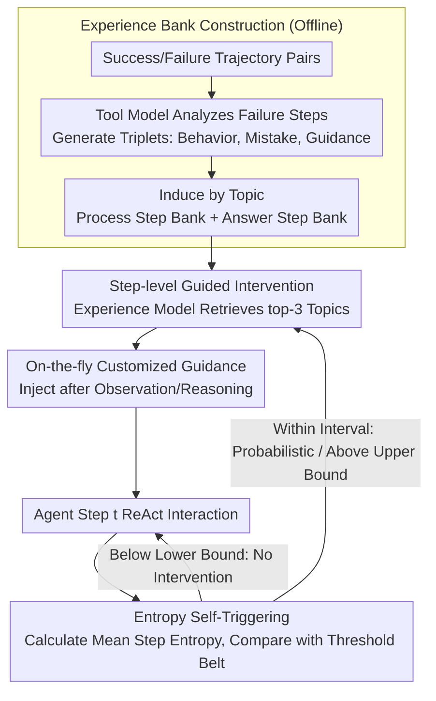

# ExpSeek: Self-Triggered Experience Seeking for Web Agents

**Conference**: ACL 2026 Findings  
**arXiv**: [2601.08605](https://arxiv.org/abs/2601.08605)  
**Code**: [https://github.com/WYRipple/ExpSeek](https://github.com/WYRipple/ExpSeek)  
**Area**: LLM Agent  
**Keywords**: Web Agent, Experience Intervention, Entropy Trigger, Proactive Guidance Seeking, Multi-turn Interaction

## TL;DR

ExpSeek proposes a proactive experience-seeking framework based on step-level entropy self-triggering, allowing Web Agents to determine when and what guidance is needed based on internal signals during interaction. It achieves absolute improvements of 9.3% and 7.5% on Qwen3-8B/32B respectively.

## Background & Motivation

**Background**: Web Agents need to perform multi-turn interactions in open networks to retrieve information and answer complex queries. Experience intervention has proven to be an effective paradigm for enhancing agent capabilities, with existing methods mainly following two paths: offline experience distillation and online self-evolution.

**Limitations of Prior Work**: Existing experience injection methods are passive—experience is injected into the system prompt as a global context once at the start of a task. However, in multi-turn interactions between an agent and its environment, context observations change continuously. Static experiences injected initially struggle to adapt to dynamic scenarios, potentially leading to decision bias.

**Key Challenge**: The effectiveness of experience depends on the precise matching of timing and content: overly frequent intervention increases reasoning overhead, while sparse intervention misses critical guidance windows. Global experience cannot provide customized guidance for specific states at the step level.

**Goal**: Construct a proactive experience-seeking framework to solve two core problems: (1) When to seek experience (when): using the model's own signals to judge intervention timing; (2) What experience to seek (what): designing step-level customized experience content.

**Key Insight**: The authors observed a statistical correlation between the step-level entropy (mean token entropy) of LLMs and reasoning quality—entropy in incorrect steps is significantly higher than in correct steps. This intrinsic signal can serve as an indicator of an agent's "confusion" without requiring extra reward models.

**Core Idea**: Use the model's own step-level entropy as a self-triggering signal to judge intervention timing, combined with an experience bank and an experience model to dynamically generate step-level customized guidance, achieving a paradigm shift from passive global injection to active step-level seeking.

## Method

### Overall Architecture

ExpSeek consists of three stages: (1) Experience bank construction—extracting structured experience triplets from success/failure trajectory pairs and organizing them by topic; (2) Entropy self-triggering mechanism—estimating entropy threshold intervals for process steps and answer steps using logistic regression and bootstrap resampling; (3) Step-level guided intervention—when step-level entropy exceeds the threshold, the experience model retrieves relevant experiences from the bank and generates customized guidance. The bank is built once offline, while the entropy trigger and intervention are executed progressively alongside ReAct interactions during inference.

### Key Designs

**1. Experience Bank Construction: Distilling Failure Trajectories into Reusable Triplets**

For experience to be reusable, it cannot be raw logs but must be distilled into structured, searchable guidance. ExpSeek samples $k$ trajectories per query from the training set to form success/failure pairs $(\tau^+, \tau^-)$. A tool model then analyzes failure trajectories step-by-step to generate an experience triplet for each erroneous step: Behavior description (what was done), Mistake analysis (what went wrong), and Guidance direction (providing direction without direct answers). These triplets mimic human learning from mistakes, showing the agent "where to turn" rather than feeding it ground-truth answers. Finally, topic tags are induced via iterative batch processing to organize triplets into the Process Step Bank $\mathcal{E}_p$ and the Answer Step Bank $\mathcal{E}_a$—separation is necessary as the entropy distributions of these two step types differ inherently.

**2. Entropy Self-Triggering Mechanism: Using the Model's "Confusion" to Decide When to Intervene**

Intervention timing is a core challenge: excessive frequency adds overhead, while scarcity misses windows, and external reward models are costly and heavy. ExpSeek's insight is that the LLM's step-level entropy is a built-in "confusion" indicator. It first calculates the mean token entropy per step $\bar{H}_t = \frac{1}{|R_t|} \sum_{x \in R_t} H(x)$, fits logistic regressions $P(y_t=0|\bar{H}_t) = 1/(1+e^{-(w \cdot \bar{H}_t + b)})$ for process/answer steps separately, and uses 1000 bootstrap resamples to estimate the 95% confidence interval $[\theta_{lower}, \theta_{upper}]$ as a threshold belt. During inference, it skips intervention below the lower bound, forces it above the upper bound, and uses linear probability within the interval. This probabilistic approach avoids the fragility of hard thresholds. KS tests confirm the signal's separability: the entropy distributions of correct/incorrect steps result in KS=0.1998 for process steps and KS=0.3809 for answer steps (both $p < 0.001$).

**3. Step-level Guided Intervention: On-the-fly Customized Guidance Based on Current Context**

After triggering, the key is providing guidance fitting the current state rather than a generic template. When entropy triggers intervention and the previous step was not intervened upon, the experience model $\mathcal{M}_e$ reads the current history context $h_t$, selects 3 most relevant topics from the bank, and generates dynamic guidance $e_t$ for the immediate scenario based on triplets under those topics. Guidance for process steps is appended after environment observations to guide exploration, while guidance for answer steps prompts the agent to continue reasoning or correct an answer. Generative guidance significantly outperforms retrieval-only methods (which lost significant performance in experiments) because generation adapts general experience to specific contexts. A "one-step cooling period" prevents continuous over-intervention.

### Loss & Training

ExpSeek is an inference-time framework and does not involve training. The experience bank was constructed using Qwen3-235B-A22B-Instruct as a tool model. The internal agents used were Qwen3-8B/32B with temperature 1.0, top-p 0.95, and a maximum of 30 ReAct interaction steps.

## Key Experimental Results

### Main Results

**Accuracy (%) across four Web Agent benchmarks**

| Method | WebWalkerQA | GAIA | Seal | xbench | Avg. |
|------|-------------|------|------|--------|------|
| **Qwen3-8B** | | | | | |
| No Experience | 38.47 | 29.13 | 23.23 | 25.60 | 32.23 |
| Training-Free GRPO | 40.62 | 29.32 | 25.59 | 26.00 | 33.79 |
| ReasoningBank+ | 40.78 | 32.04 | 26.38 | 28.00 | 34.80 |
| **ExpSeek** | **48.25** | **36.89** | **30.16** | **37.20** | **41.50** |
| **Qwen3-32B** | | | | | |
| No Experience | 45.01 | 36.50 | 27.80 | 27.40 | 37.79 |
| ReasoningBank+ | 45.60 | 33.01 | 29.84 | 36.33 | 39.33 |
| **ExpSeek** | **51.09** | **43.88** | **32.76** | **42.00** | **45.32** |

### Ablation Study

| Variant (8B) | GAIA | xbench |
|-----------|------|--------|
| Process Step Guidance Only | 33.01 (+3.9) | 28.40 (+2.8) |
| Answer Step Guidance Only | 30.29 (+1.2) | 34.80 (+9.2) |
| Full ExpSeek | **36.89** (+7.8) | **37.20** (+11.6) |

**Comparison of Triggering and Guidance Methods (8B, GAIA)**

| Trigger Method | Guidance Method | Acc. | Avg. Steps | Avg. Time |
|----------|----------|------|----------|----------|
| Rule-based | Exp Model | 38.81 | 9.52 | 329.71s |
| Claude-4 | Exp Model | 39.47 | 8.55 | 370.82s |
| **Entropy Trigger** | **Exp Model** | **36.89** | **5.75** | **127.57s** |
| Entropy Trigger | Retrieval-based | 30.92 | 5.54 | 110.61s |

### Key Findings

- The efficiency advantage of entropy triggering is significant: the number of steps is only 60% of rule-based triggering, and the time is only 39%, while maintaining comparable accuracy.
- A 4B experience model can effectively guide a 32B Agent (GAIA +5.2%, xbench +9.7%), validating the feasibility of weak models guiding strong models.
- Experience guidance increases process step entropy (promoting exploration) and decreases answer step entropy (enhancing convergence), forming a "divergence-convergence" behavioral pattern.
- Performance remains robust even when keeping only 1 experience per topic, suggesting the experience model generalizes well from few seed experiences.

## Highlights & Insights

- It is a paradigm-level innovation to transform experience intervention from passive global injection into proactive step-level seeking.
- Utilizing the model's own entropy signal as a trigger without an extra reward model is both elegant and practical.
- The "divergence-convergence" entropy pattern provides an intuitive explanation of the ExpSeek mechanism.
- Strong cross-task generalization: building a bank with only 25% of WebWalkerQA data remains significantly effective on three OOD benchmarks.

## Limitations & Future Work

- Threshold estimation depends on the training set and the tool model's assessment of step quality; more precise strategies remain to be explored.
- Effectiveness across non-Web domains and broader toolsets has not yet been verified.
- Potential to explore ExpSeek as a rollout enhancement technique for Agentic RL to improve convergence speed and sampling quality.

## Related Work & Insights

- Complementary to offline/online experience accumulation methods like ReasoningBank, ExpSeek focuses on the utilization of experience (timing and content).
- The successful application of entropy as a reasoning quality indicator inspires the use of model uncertainty signals in other agent scenarios.
- The case of weak models guiding stronger ones provides new ideas for reducing guidance costs in practical deployments.

## Rating

- Novelty: ⭐⭐⭐⭐⭐ Paradigm shift from passive to proactive; sophisticated entropy trigger design.
- Experimental Thoroughness: ⭐⭐⭐⭐⭐ Covered four benchmarks, two model scales, and rich ablation/analysis (efficiency, scaling laws, transferability, internal mechanisms).
- Writing Quality: ⭐⭐⭐⭐ Clear structure, well-justified motivation, and deep experimental analysis.

<!-- RELATED:START -->

## Related Papers

- [\[ACL 2026\] Mem²Evolve: Towards Self-Evolving Agents via Co-Evolutionary Capability Expansion and Experience Distillation](mem2evolve_towards_self-evolving_agents_via_co-evolutionary_capability_expansion.md)
- [\[ICML 2026\] EvolveR: Self-Evolving LLM Agents through an Experience-Driven Lifecycle](../../ICML2026/llm_agent/evolver_self-evolving_llm_agents_through_an_experience-driven_lifecycle.md)
- [\[ICLR 2026\] FlowSearcher: Synthesizing Memory-Guided Agentic Workflows for Web Information Seeking](../../ICLR2026/llm_agent/flowsearcher_synthesizing_memory-guided_agentic_workflows_for_web_information_se.md)
- [\[CVPR 2026\] Learning to Adapt: Self-Improving Web Agent via Cognitive-Aware Exploration](../../CVPR2026/llm_agent/learning_to_adapt_self-improving_web_agent_via_cognitive-aware_exploration.md)
- [\[ACL 2026\] SynthAgent: Adapting Web Agents with Synthetic Supervision](synthagent_adapting_web_agents_with_synthetic_supervision.md)

<!-- RELATED:END -->
