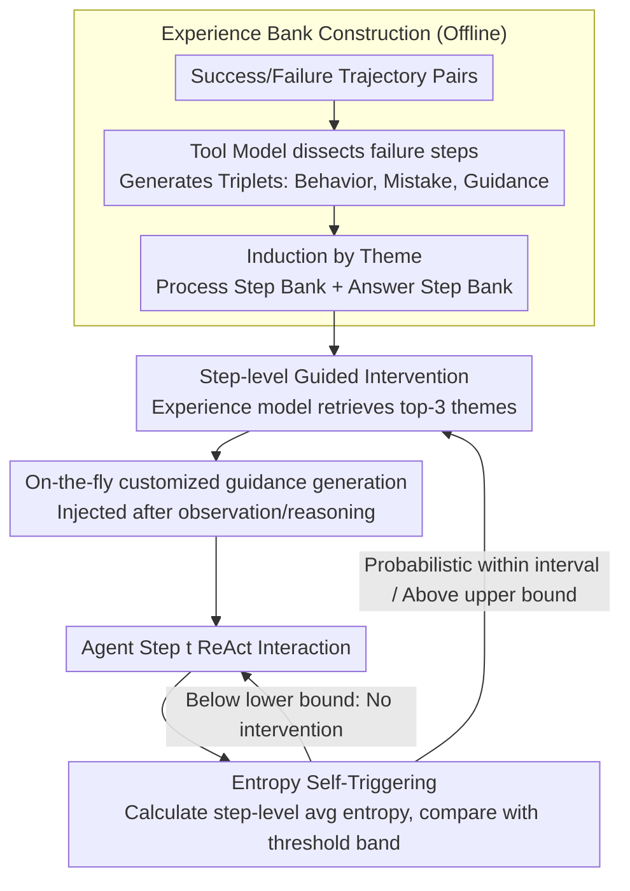

# ExpSeek: Self-Triggered Experience Seeking for Web Agents

**Conference**: ACL 2026 Findings  
**arXiv**: [2601.08605](https://arxiv.org/abs/2601.08605)  
**Code**: [https://github.com/WYRipple/ExpSeek](https://github.com/WYRipple/ExpSeek)  
**Area**: LLM Agent  
**Keywords**: Web Agent, experience intervention, entropy triggering, proactive guidance seeking, multi-turn interaction

## TL;DR

ExpSeek proposes a proactive experience seeking framework based on step-level entropy self-triggering, allowing Web Agents to determine when they need guidance and what guidance to acquire based on their internal signals. It achieves absolute improvements of 9.3% and 7.5% on Qwen3-8B/32B, respectively.

## Background & Motivation

**Background**: Web Agents need to perform multi-turn interactions in open networks to retrieve information and answer complex queries. Experience intervention has proven to be an effective paradigm for enhancing agent capabilities, with existing methods mainly following two paths: offline experience distillation and online self-evolution.

**Limitations of Prior Work**: Existing experience injection methods are passive—experience is injected into the system prompt as global context once before the task starts. However, in multi-turn interactions between an agent and the environment, the contextual observation changes continuously. Initially injected static experience struggles to adapt to dynamic scenarios, potentially leading to decision bias.

**Key Challenge**: The effectiveness of experience depends on the precise matching of timing and content: overly frequent interventions increase the reasoning burden, while overly sparse ones miss critical guidance windows; global experience cannot provide customized guidance for specific states at the current step.

**Goal**: Construct a proactive experience seeking framework to solve two core problems—(1) When to seek experience (when): utilize the model's own signals to determine intervention timing; (2) What experience to seek (what): design step-level customized experience content.

**Key Insight**: The authors observed a statistical correlation between the step-level entropy (mean token entropy) of LLMs and reasoning quality—entropy in erroneous steps is significantly higher than in correct steps. This internal signal can serve as an indicator of the agent's degree of "confusion," without requiring an additional reward model.

**Core Idea**: Utilize the model's own step-level entropy as a self-triggering signal to judge intervention timing, combined with an experience bank and an experience model to dynamically generate step-level customized guidance, achieving a paradigm shift from passive global injection to proactive step-level seeking.

## Method

### Overall Architecture

ExpSeek consists of three stages: (1) Experience bank construction—extracting structured experience triplets from success/failure trajectory pairs and organizing them by theme; (2) Entropy self-triggering mechanism—estimating entropy threshold intervals for process steps and answer steps through logistic regression and bootstrap resampling; (3) Step-level guided intervention—when the step-level entropy exceeds the threshold, the experience model retrieves relevant experience based on the current context and generates customized guidance. The experience bank is constructed once offline, while entropy self-triggering and step-level guided intervention are executed iteratively during inference alongside ReAct interactions.

### Key Designs

**1. Experience Bank Construction: Distilling failure trajectories into reusable triplets**

To be reusable, experience cannot be a collection of raw logs; it must be distilled into structured, searchable guidance. ExpSeek samples $k$ trajectories for each query in the training set to form success/failure pairs $(\tau^+, \tau^-)$. A tool model then dissects the failure trajectories step-by-step to generate an experience triplet for each erroneous step: Behavior description (what was done), Mistake analysis (what went wrong), and Guidance direction (providing direction rather than direct answers). These triplets deliberately mimic how humans learn from mistakes, letting the agent know "where to turn" when encountering similar situations rather than being spoon-fed standard answers. Finally, thematic labels are induced for the triplets through iterative batch processing, organizing them into a process step experience bank $\mathcal{E}_p$ and an answer step experience bank $\mathcal{E}_a$. Separation is necessary because the entropy distribution characteristics of these two types of steps differ, and thematic organization makes subsequent retrieval more efficient.

**2. Entropy Self-Triggering Mechanism: Using the model's own "confusion" to decide when to intervene**

Intervention timing is the core difficulty: too frequent increases the reasoning burden, while too sparse misses critical windows, and external reward models are both expensive and heavy. ExpSeek's insight is that the step-level entropy of the LLM itself is a ready-made "confusion" indicator. It first calculates the average token entropy for each step $\bar{H}_t = \frac{1}{|R_t|} \sum_{x \in R_t} H(x)$. For process steps and answer steps, it fits logistic regressions $P(y_t=0|\bar{H}_t) = 1/(1+e^{-(w \cdot \bar{H}_t + b)})$ and uses 1,000 bootstrap resamplings to estimate the 95% confidence interval $[\theta_{lower}, \theta_{upper}]$ as the threshold band. During inference, no intervention occurs below the lower bound, intervention always occurs above the upper bound, and within the interval, it is decided by linear probability. This probabilistic approach avoids the fragility of hard thresholds. KS tests confirm that this signal is indeed separable: the entropy distributions of correct/incorrect steps result in KS=0.1998 for process steps and KS=0.3809 for answer steps, both with $p<0.001$.

**3. Step-level Guided Intervention: On-the-fly customized guidance based on current context**

Once triggered, the key is providing guidance tailored to the current state rather than using general templates. When entropy triggers an intervention and the previous step was not intervened upon, the experience model $\mathcal{M}_e$ reads the current step's historical context $h_t$, selects the 3 most relevant themes from the corresponding bank, and generates dynamic guidance $e_t$ for the current scene based on the triplets under these themes. Guidance for process steps is appended after environment observations to guide the next exploration, while guidance for answer steps prompts the agent to continue reasoning or correct the answer. Generative guidance is significantly superior to retrieval-based guidance (retrieval embedding dropped significantly in experiments) because generation can adapt general experience to specific contexts. A one-step cooling period where "intervention is allowed only if the previous step was not intervened upon" mechanically prevents continuous over-intervention.

### Loss & Training

ExpSeek is an inference-time framework and does not involve training. Experience bank construction uses Qwen3-235B-A22B-Instruct as the tool model. The Agent uses Qwen3-8B/32B, with a sampling temperature of 1.0, top-p of 0.95, and a maximum of 30 ReAct interaction steps.

## Key Experimental Results

### Main Results

**Accuracy (%) on four Web Agent benchmarks**

| Method | WebWalkerQA | GAIA | Seal | xbench | Avg. |
|------|-------------|------|------|--------|------|
| **Qwen3-8B** | | | | | |
| No Experience | 38.47 | 29.13 | 23.23 | 25.60 | 32.23 |
| Training-Free GRPO | 40.62 | 29.32 | 25.59 | 26.00 | 33.79 |
| ReasoningBank+ | 40.78 | 32.04 | 26.38 | 28.00 | 34.80 |
| **Ours (ExpSeek)** | **48.25** | **36.89** | **30.16** | **37.20** | **41.50** |
| **Qwen3-32B** | | | | | |
| No Experience | 45.01 | 36.50 | 27.80 | 27.40 | 37.79 |
| ReasoningBank+ | 45.60 | 33.01 | 29.84 | 36.33 | 39.33 |
| **Ours (ExpSeek)** | **51.09** | **43.88** | **32.76** | **42.00** | **45.32** |

### Ablation Study

| Variant (8B) | GAIA | xbench |
|-----------|------|--------|
| Process Step Guidance Only | 33.01 (+3.9) | 28.40 (+2.8) |
| Answer Step Guidance Only | 30.29 (+1.2) | 34.80 (+9.2) |
| Full ExpSeek | **36.89** (+7.8) | **37.20** (+11.6) |

**Comparison of Triggering and Guidance Methods (8B, GAIA)**

| Triggering | Guidance | Acc. | Avg. Steps | Avg. Time |
|----------|----------|------|------------|-----------|
| Rule-based | Exp Model | 38.81 | 9.52 | 329.71s |
| Claude-4 | Exp Model | 39.47 | 8.55 | 370.82s |
| **Entropy Trigger** | **Exp Model** | **36.89** | **5.75** | **127.57s** |
| Entropy Trigger | Retrieval-based | 30.92 | 5.54 | 110.61s |

### Key Findings

- Entropy triggering offers significant efficiency advantages: step counts are only 60% of rule-based triggering, and time is only 39%, while maintaining comparable accuracy.
- A 4B experience model can effectively guide a 32B Agent (GAIA +5.2%, xbench +9.7%), verifying the feasibility of weak models guiding strong ones.
- Experience guidance leads to increased entropy in process steps (promoting exploration) and decreased entropy in answer steps (enhancing convergence), forming a "divergence-convergence" behavioral pattern.
- Performance remains robust even if only 1 experience is kept per theme, indicating that the experience model can generalize from a few seed experiences.

## Highlights & Insights

- Transforming experience intervention from passive global injection to proactive step-level seeking is a paradigm-level innovation.
- Using the model's own entropy signal as a trigger eliminates the need for an additional reward model, making it both elegant and practical.
- The "divergence-convergence" entropy behavioral pattern provides an intuitive explanation for ExpSeek's mechanism.
- Strong cross-task generalization: using only 25% of the WebWalkerQA data to build the experience bank, it remains significantly effective on three OOD benchmarks.

## Limitations & Future Work

- Threshold estimation depends on the training set and the tool model's assessment of step quality; more precise strategies remain to be explored.
- Effectiveness in non-Web domains and with more toolsets has not yet been verified.
- ExpSeek could be explored as a rollout enhancement technique for Agentic RL to improve convergence speed and sampling quality.

## Related Work & Insights

- Complementary to offline/online experience accumulation methods like ReasoningBank, ExpSeek focuses on how experience is utilized (timing and content).
- The successful application of entropy as a reasoning quality indicator inspires the possibility of using model uncertainty signals in other agent scenarios.
- The success case of a weak model guiding a strong one provides new ideas for reducing guidance costs in practical deployments.

## Rating

- Novelty: ⭐⭐⭐⭐⭐ Paradigm shift from passive to proactive; ingenious entropy self-triggering design.
- Experimental Thoroughness: ⭐⭐⭐⭐⭐ Four benchmarks, two model scales, rich ablation and analysis (efficiency, scaling laws, transferability, internal mechanism).
- Writing Quality: ⭐⭐⭐⭐ Clear structure, well-justified motivation, in-depth experimental analysis.

<!-- RELATED:START -->

## Related Papers

- [\[ACL 2026\] Mem²Evolve: Towards Self-Evolving Agents via Co-Evolutionary Capability Expansion and Experience Distillation](mem2evolve_towards_self-evolving_agents_via_co-evolutionary_capability_expansion.md)
- [\[ICML 2026\] EvolveR: Self-Evolving LLM Agents through an Experience-Driven Lifecycle](../../ICML2026/llm_agent/evolver_self-evolving_llm_agents_through_an_experience-driven_lifecycle.md)
- [\[ACL 2026\] SynthAgent: Adapting Web Agents with Synthetic Supervision](synthagent_adapting_web_agents_with_synthetic_supervision.md)
- [\[ICLR 2026\] Web-CogReasoner: Towards Knowledge-Induced Cognitive Reasoning for Web Agents](../../ICLR2026/llm_agent/web-cogreasoner_towards_knowledge-induced_cognitive_reasoning_for_web_agents.md)
- [\[ACL 2026\] From Storage to Experience: A Survey on the Evolution of LLM Agent Memory Mechanisms](from_storage_to_experience_a_survey_on_the_evolution_of_llm_agent_memory_mechani.md)

<!-- RELATED:END -->
