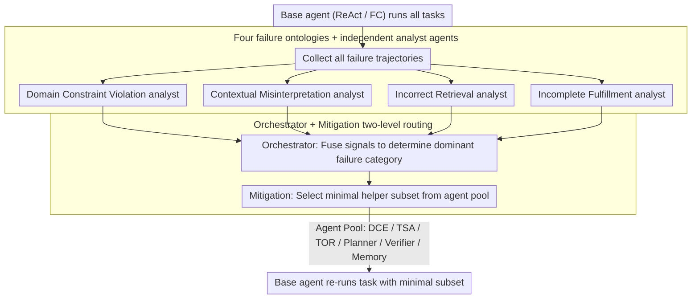

# FAMA: Failure-Aware Meta-Agentic Framework for Open-Source LLMs in Interactive Tool Use Environments

**Conference**: ACL 2026 Findings  
**arXiv**: [2604.25135](https://arxiv.org/abs/2604.25135)  
**Code**: None (not explicitly disclosed in the paper)  
**Area**: LLM Agent / Tool-use / Multi-agent Orchestration  
**Keywords**: Failure-aware, Meta-Agent, Tool-use, τ-bench, Open-source LLM

## TL;DR
FAMA employs an independent "failure analysis agent + orchestration agent" set to automatically diagnose dominant failure modes of a baseline tool-use agent on multi-turn benchmarks like τ-bench. It then directs a mitigation agent to select a minimal subset of helper agents for context injection, achieving up to a 27% increase in task success rate on Qwen series open-source models.

## Background & Motivation
**Background**: Multi-turn tool-use benchmarks, represented by τ-bench, τ-trait, and ACEBench, treat LLMs as service agents that interact with simulated users, call APIs, and follow domain rules. Mainstream improvement strategies involve either SFT/RL training or constructing static multi-agent frameworks (e.g., IRMA) that chain modules like Planner, Memory, and Tool Reformulator to assist the base agent.

**Limitations of Prior Work**: 1) Training routes are prohibitively expensive for data collection and reward propagation in multi-turn long trajectories; 2) Static multi-agent frameworks stuff all helper agents into the context, which is disastrous for smaller open-source models—the context window is overwhelmed by helper outputs (IRMA averages 50-58% overhead), sometimes performing worse than vanilla ReAct. Furthermore, dominant failure modes vary across different models, making a uniform agent set a mismatch.

**Key Challenge**: Smaller models with tighter context windows require a "calculated" decision on which helper agent to deploy. Existing static frameworks lack the awareness of why a base agent fails or whether the current helper is the correct remedy.

**Goal**: Build a training-free framework capable of (a) automatically locating the dominant failure modes of the base agent, (b) dynamically selecting a minimal helper subset based on failure modes, and (c) achieving stable gains on open-source models.

**Key Insight**: Prior knowledge suggests tool-use failures fall into four categories (domain rule violations, complex tool output misreading, context misunderstanding/hallucination, and premature stopping). Observations show that dominant failure categories vary significantly across different open-source models and benchmarks—implying that helper agent selection must be model-aware and benchmark-aware.

**Core Idea**: A "meta-agent" approach where "agents diagnose agents": a set of failure analysis agents + an orchestrator + a mitigation agent review the actual failure trajectories of the base agent, then determine which helpers to activate for the next iteration.

## Method

### Overall Architecture
FAMA reformulates the "tool-use agent improvement" as a two-stage inference-time orchestration problem. First, the base agent (ReAct/FC) runs all tasks to collect failure trajectories $\mathcal{F}$. Then, each failure trajectory undergoes a "diagnosis-orchestration-mitigation" cycle. Finally, the task is re-run using the diagnosed minimal helper subset. The process involves no weight updates, only modifying context construction at inference time—inputting a failure trajectory and outputting a model-aware and benchmark-aware helper configuration.

### Key Designs

**1. Four failure ontologies + independent analyst agents: Decoupled diagnosis to avoid category interference**

Using a single large prompt to judge four failure categories simultaneously leads to interference and dominance by the majority class. Therefore, FAMA explicitly categorizes tool-use failures into Domain Constraint Violation (DCV), Incorrect Retrieval, Contextual Misinterpretation (CM), and Incomplete Fulfillment (IFU) ($|\mathcal{E}|=4$). Each category is assigned an independent LLM analyst that focuses solely on that specific causal chain, providing a binary decision of "triggered or not" plus a natural language rationale.

The outputs of all analysts are concatenated as $O_\tau = \text{Concat}(\{o_{\tau,e}\}_{e\in\mathcal{E}})$ and passed to the orchestrator for final attribution. This decoupled diagnosis is necessary because dominant failure categories differ vastly across models—CM and DCV are most severe on τ-bench, IFU is prominent on τ-trait, and CM dominates ACEBench. Single-prompt multi-classification cannot handle such distributional shifts.

**2. Orchestrator + Mitigation two-level routing: Decoupling diagnosis from prescription**

Diagnosis and determining "which helpers to use" are tasks of different difficulties. FAMA splits these into two agents: the orchestrator reviews analyst signals and the original trajectory to fuse a dominant error category $\hat{\mathcal{E}}_\tau$; the mitigation agent then uses $\hat{\mathcal{E}}_\tau$ and the natural language descriptions of the agent pool $\mathcal{A}$ (DCE, TSA, TOR, Planner, Verifier, Memory) to output a minimal subset $\mathcal{A}^*_\tau \subseteq \mathcal{A}$ that satisfies $\bigcup_{e\in\hat{\mathcal{E}}_\tau}\text{cover}(e)$.

Consequently, the orchestrator only needs to understand the failure ontology, and the mitigation agent only needs to understand helper functional boundaries. Since both tasks are narrow, even smaller judgment models like GPT-4.1-mini can provide stable outputs. Aggregating these $\mathcal{A}^*_\tau$ across tasks yields a stable recommended configuration for a specific model on a specific benchmark.

Helper agents in the pool perform distinct roles: e.g., the Memory module retains the last $k$ user queries, while the DCE extracts relevant domain constraints from the system prompt to reinject into the context before each decision. The mitigation agent assembles $\mathcal{A}^*_\tau$ from this pool to compensate for dominant failures without stuffing all six helpers into the limited context like IRMA.

### Mechanism Example
Take a failed task by Qwen3-4B on τ-bench Airline: the base agent violated the domain rule "verify identity before changing tickets." This trajectory enters $\mathcal{F}$. The DCV analyst flags a violation, and the CM analyst reports a context forgetting signal. The orchestrator fuses these into $\hat{\mathcal{E}}_\tau=\{\text{DCV, CM}\}$. The mitigation agent selects $\mathcal{A}^*_\tau=\{\text{DCE, Memory}\}$, where DCE reinjects the identity verification constraint and Memory ensures early user queries are not evicted. Re-running with this configuration passes the task, whereas IRMA might still fail as the full helper set exhausts the context window.

### Loss & Training
FAMA is a pure inference-time framework and does not update parameters. Judgment agents (analyst/orchestrator/mitigation) utilize GPT-4o (with GPT-4.1-mini for robustness testing). Base tool-use agents include Qwen3-4B/14B/32B and Qwen2.5-72B-Instruct; the latter also serves as the user simulator.

## Key Experimental Results

### Main Results
Average $pass^k$ values over five independent runs (k=1..5) on τ-bench, comparing ReAct, FC, IRMA, and FAMA:

| Model | Domain | Metric | ReAct | FC | IRMA | Ours (FAMA) |
|------|--------|------|-------|-----|------|------|
| Qwen3-4B | Airline | $pass^1$ / $pass^5$ | 32.0 / 26.0 | 27.6 / 14.0 | 30.0 / 12.0 | **37.6 / 26.0** |
| Qwen3-4B | Retail | $pass^1$ / $pass^5$ | 17.2 / 8.7 | 24.9 / 9.0 | 28.9 / 9.6 | **34.6 / 13.9** |
| Qwen2.5-72B | Airline | $pass^1$ / $pass^5$ | 24.4 / 10.0 | 15.2 / 2.0 | 26.4 / 10.0 | **29.2 / 18.0** |
| Qwen2.5-72B | Retail | $pass^1$ / $pass^5$ | 43.5 / 20.9 | 19.7 / 4.3 | 38.8 / 19.1 | **44.2 / 27.0** |

Aggregate: FAMA outperforms ReAct/FC/IRMA by an average of 4.63 / 11.57 / 5.27 points in Airline and 5.30 / 8.96 / 6.15 in Retail. On ACEBench, it pushes Qwen2.5-72B end-to-end accuracy from 23.3% to 50.0% (+26.7%).

### Ablation Study

| Config (Qwen3-14B, τ-bench Airline $pass^1$) | Accuracy | Note |
|------|--------|------|
| Full FAMA (Mitigation rec. = DCE+Memory) | **36.8%** | Full solution |
| Memory+DCE+TOR (Exp 1, not recommended) | Lower | Adding TOR drops performance |
| Memory+TOR (Exp 2) | Lower | Missing DCE loses domain constraints |
| Memory+TOR+TSA (Exp 3) | Lower | Worse as config deviates from rec. |
| IRMA (All agents) | 26.4% | Lowest due to context stuffing |

Regarding efficiency (Qwen3-32B): IRMA overhead is 50-58% with 111-150s average latency; FAMA overhead is ~30% with 57-91s latency. ReAct-thinking often fails due to token overflow from reasoning explosions.

### Key Findings
- Combinations recommended by the mitigation agent consistently outperform random combinations; **including fewer agents can sometimes be better**, suggesting interference between helpers.
- Across all Qwen series models, Memory and DCE are the most frequently recommended helpers. This aligns with the failure analysis showing open-source models struggle with memory bottlenecks and losing system prompt rules in long dialogues.
- Using GPT-4.1-mini as a judgment model yields dominant failure categories and helper recommendations highly consistent with GPT-4o, indicating low sensitivity to the judgment model.
- Reasoning/thinking models (Qwen3 thinking) often fail due to exhausting the token budget via internal CoT; FAMA-non-thinking versions are more stable.

## Highlights & Insights
- The "Meta-Agent" abstraction is elegant; FAMA does not act directly in the environment but improves decisions indirectly by diagnosing behavior and restructuring context. This elevates "agent orchestration" from manual heuristics to a data-driven automated process.
- The decoupling of diagnosis, orchestration, and mitigation is a reusable template. Each agent task is narrow enough that even smaller open-source judgment models suffice, facilitating migration to other agentic domains like coding or research.
- Empirical evidence that "stuffing all helpers is worse" contradicts the default belief that more agents equal better performance, forcing a consideration of the marginal utility versus context cost of each helper.

## Limitations & Future Work
- The agent pool is pre-defined; FAMA's ceiling is capped by the pool's coverage. It cannot currently discover or synthesize new helpers.
- Validated only on structured customer service tool-use; stability in open-ended embodied or multimodal agent tasks remains unknown.
- The four failure ontologies are empirically defined and might be incomplete for niche domains (e.g., mathematical proof agents).
- Dependency on GPT-4o for judgment agents limits fully offline/private deployment; future work could explore a fully open-source diagnosis loop.

## Related Work & Insights
- **vs IRMA (Mishra 2025)**: Both use modular helpers, but IRMA is static and all-inclusive, whereas FAMA is dynamic and failure-aware—this is FAMA's key advantage.
- **vs Self-Reflection / Reflexion**: Reflection methods introspect within a trajectory; FAMA performs cross-task statistical diagnosis, providing a coarser but more stable convergence signal.
- **vs RL Fine-tuning (VeRLTool/MUA-RL)**: Training routes are hampered by high trajectory collection costs; FAMA is entirely training-free, making it a more practical solution for open-source models.

## Rating
- Novelty: ⭐⭐⭐⭐ The "agent to diagnose agents" idea is refreshing, though the failure ontology and helper pool draw from IRMA.
- Experimental Thoroughness: ⭐⭐⭐⭐ Extensive testing across three benchmarks, four models, multiple runs, and robustness checks.
- Writing Quality: ⭐⭐⭐⭐ Clear algorithm, well-defined boundaries for failure types and helpers.
- Value: ⭐⭐⭐⭐ Provides an immediately usable recipe for open-source agent frameworks and refutes the "all-agent" performance assumption.

<!-- RELATED:START -->

## Related Papers

- [\[ACL 2026\] ToolOmni: Enabling Open-World Tool Use via Agentic Learning with Proactive Retrieval and Grounded Execution](toolomni_enabling_open-world_tool_use_via_agentic_learning_with_proactive_retrie.md)
- [\[ACL 2026\] Meta-Tool: Efficient Few-Shot Tool Adaptation for Small Language Models](meta-tool_efficient_few-shot_tool_adaptation_for_small_language_models.md)
- [\[ACL 2026\] Feedback-Driven Tool-Use Improvements in Large Language Models via Automated Build Environments](feedback-driven_tool-use_improvements_in_large_language_models_via_automated_bui.md)
- [\[ACL 2026\] How Adversarial Environments Mislead Agentic AI](how_adversarial_environments_mislead_agentic_ai.md)
- [\[ACL 2025\] Adaptive Tool Use in Large Language Models with Meta-Cognition Trigger](../../ACL2025/llm_agent/meco_metacognition_tool_use.md)

<!-- RELATED:END -->
