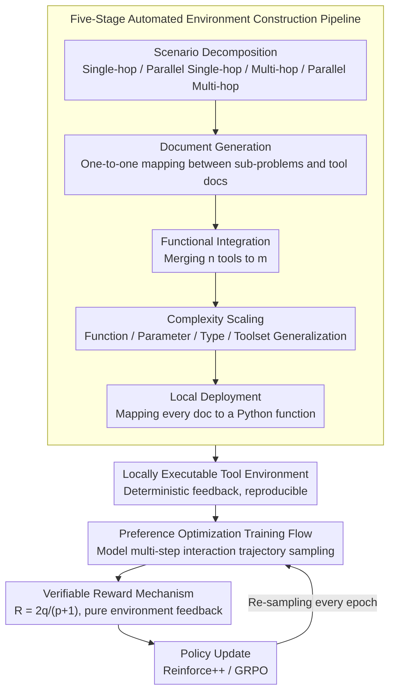

# Feedback-Driven Tool-Use Improvements in Large Language Models via Automated Build Environments

**Conference**: ACL 2026
**arXiv**: [2508.08791](https://arxiv.org/abs/2508.08791)  
**Code**: [https://github.com/bytedance/FTRL](https://github.com/bytedance/FTRL)  
**Area**: Reinforcement Learning / Tool Use
**Keywords**: Tool invocation, Reinforcement Learning, Automated Environment Construction, Verifiable Reward, LLM Training

## TL;DR

This paper proposes the FTRL framework, which constructs a stable and controllable tool-use training environment through a five-stage automated pipeline. It designs a verifiable reward mechanism combining tool call precision and task completion. When paired with preference optimization RL algorithms, it achieves an average tool-use performance improvement of over 10% on 7B-14B models, even surpassing the strongest closed-source models.

## Background & Motivation

**Background**: The tool-use capability of LLMs is critical for achieving complex real-world tasks. Current methods to enhance this capability include fine-tuning open-source models on interactive trajectories generated by proprietary models or using RL methods to learn through interaction with environments.

**Limitations of Prior Work**: RL-based tool-use training frameworks face two core limitations: (1) Difficulty in building stable training environments—frameworks relying on many online tools are susceptible to API rate limits and service interruptions, with high standardized deployment costs; (2) Lack of verifiable reward signals—the complexity of tool interactions and diversity of valid trajectories usually require high-level LLM evaluation, which introduces model bias and reduces training efficiency and algorithmic stability.

**Key Challenge**: Effective tool-use RL training needs to satisfy both "stable and controllable environments" and "reliable reward signals," but existing solutions cannot address both simultaneously.

**Goal**: (1) Automatically generate a large volume of high-quality tool-use training environments; (2) Design a verifiable reward mechanism that relies solely on environment feedback; (3) Seamlessly integrate with standard RL algorithms for feedback-driven training.

**Key Insight**: Decompose tool environment construction into five automated stages (Scenario Decomposition → Document Generation → Functional Integration → Complexity Scaling → Local Deployment), where all tools are executed locally as code to avoid external dependencies.

**Core Idea**: Automated construction of locally executable tool environments + F1-based precision-completion balanced reward = stable, verifiable tool-use RL training.

## Method

### Overall Architecture

FTRL aims to solve the two major problems of tool-use RL—unstable environments and untrustworthy rewards—by making both "localized and computable." It consists of two components: the front end is a five-stage automated pipeline that recursively breaks user inputs into sub-problems, generates accompanying tool documentation, and implements them as locally executable Python functions to mass-produce stable training environments; the back end is a feedback-driven training framework where the model samples trajectories through multi-step environment interactions, using a verifiable reward mechanism based solely on environmental feedback and preference optimization RL algorithms to iteratively update the strategy.

### Key Designs

**1. Five-Stage Automated Environment Construction Pipeline: Eliminating External API Dependencies**

Online tools suffer from API rate limits and service interruptions, and standardized deployment costs are high. FTRL generates the entire environment locally: (a) Scenario Decomposition defines four scenarios based on the logic of sub-problems (single-hop, parallel single-hop, multi-hop, parallel multi-hop); (b) Document Generation produces one tool document for each sub-problem, establishing a one-to-one mapping; (c) Functional Integration merges overlapping tools from $n$ to $m \leq n$; (d) Complexity Scaling increases difficulty through functional generalization, parameter expansion, type generalization, and toolset expansion; (e) Local Deployment finally maps each tool document to a Python function.

In this pipeline, scenario decomposition ensures training data covers different sub-problem structures, complexity scaling forces the model to generalize to more complex tools, and local deployment is the key step—all tools are executed locally as code with deterministic and reproducible feedback, completely removing reliance on external service availability.

**2. Verifiable Reward Mechanism: Balancing Precision and Completion using F1 Logic**

Rewarding only invocation precision makes the model lazy (tasks left unfinished), while rewarding only completion induces tool abuse. FTRL combines both into one formula based on F1-score concepts. Let $p$ be the number of calls, $q$ be the number of successfully resolved sub-problems, $t$ be the remaining unresolved sub-problems, and $a$ be the correct answer. The main reward for $p>0$ is $R = \frac{2q}{p+1}$, with penalties of $-0.5$ and $-0.3$ for empty output and format errors respectively, and an additional reward of $\frac{1}{t+1}$ when the answer is correct.

The primary benefit is that the reward is calculated entirely from environmental feedback without any LLM-as-judge bias, making it both stable and inexpensive. Ablation studies confirm this is more balanced than variants like $q/p$, $q$, or $q^2/p$, which either favor one metric or fail to train due to fragmented reward distributions.

**3. Preference Optimization Training Flow: Path Discovery via Environmental Interaction**

With a stable environment and trustworthy rewards, the model learns through "trial and error": model $\mathcal{M}$ samples trajectories via multi-step interactions in the constructed environment, recording tool calls, intermediate results, and final answers, which are fed into preference optimization RL algorithms like Reinforce++ or GRPO for policy updates.

To expand the exploration space, a new set of training trajectories is re-sampled using the current model at the start of each epoch. The entire process requires no manually labeled solution paths; the model autonomously discovers effective tool-use strategies through interaction, which is why it avoids dependency on distillation data from proprietary models.

### Loss & Training

Trained using the VeRL framework with a learning rate of $1\times10^{-6}$, batch size of 512, mini-batch of 32, and 16 rollouts per update. Max response length is 1024 for non-reasoning mode and 8192 for reasoning mode. Training lasts 3 epochs, with trajectories re-sampled at the beginning of each epoch. Conducted on 8 A100 GPUs.

## Key Experimental Results

### Main Results

**Tool-Use Performance of Different Model Scales (Solve-F1 / Average across benchmarks)**

| Model | Benchmark Avg | FTRL-Reinforce++ | FTRL-GRPO |
|------|---------|-----------------|-----------|
| Qwen2.5-7B | 26.52 | 37.09 (+10.57) | 37.80 (+11.28) |
| Qwen2.5-14B | 34.33 | 44.25 (+9.92) | 41.23 (+6.90) |
| Qwen3-8B (Non-Reasoning) | 31.01 | 42.41 (+11.40) | 45.43 (+14.42) |
| Qwen3-14B (Non-Reasoning) | 33.34 | 44.14 (+10.80) | 44.90 (+11.56) |
| GPT-4o | 42.79 | — | — |
| Claude-4.0-Sonnet | 42.71 | — | — |

### Ablation Study

**Comparison of Different Reward Mechanisms on Solve-F1 (Qwen2.5-7B)**

| Reward Design | Effect | Description |
|---------|------|------|
| $R_{\text{Solve-P}} = q/p$ | High Solve-P but low Solve-R | Optimizes precision only, incomplete task execution |
| $R_{\text{Solve-R}} = q$ | High Solve-R but low Solve-P | Optimizes completion only, leading to tool abuse |
| $R_{\text{Solve-PR}} = q^2/p$ | Unstable | Sparse reward distribution hinders training |
| **$R = 2q/(p+1)$** | **Optimal Balance** | Balanced improvement in precision and completion |

### Key Findings

- Open-source 7B-14B models trained with FTRL outperform strongest closed-source models like GPT-4o (42.79) and Claude-4.0-Sonnet (42.71) on average scores.
- Layer-wise analysis reveals that performance gains primarily stem from updates in the bottom-level MLP parameters (layers 0-2), suggesting the method enhances the model's understanding and representation of context rather than simple pattern matching.
- Reasoning mode performs better in complex scenarios (multi-hop, parallel multi-hop) but shows degraded performance in simple scenarios (single-hop), indicating current reasoning mechanisms are not yet optimized for tool use.
- Post-training models show no performance loss on general capability benchmarks such as MMLU, BBH, and GSM8K.

## Highlights & Insights

- The five-stage environment construction pipeline is elegantly designed—forming a closed loop from scenario decomposition to local deployment, ensuring both environmental diversity and feedback stability. This is transferable to other RL training scenarios requiring stable interaction.
- The F1-style reward design is simple and efficient—simultaneously constraining precision and completion with one formula, avoiding the complexity of multi-objective optimization.
- The discovery that "bottom-level MLP drives performance" is insightful—improvements in tool-use capability are rooted in better contextual understanding rather than surface-level pattern matching.

## Limitations & Future Work

- The method mainly improves tool-calling behavior without optimizing the underlying reasoning process; there is an alignment gap between the reasoning mode of current open-source models and tool-use tasks.
- Validated only on 7B-14B models due to resource constraints; performance on larger models remains unknown.
- Environment construction relies on GPT-4o for generation; future work could explore fully automated generation schemes.
- Training data lacks multi-turn user interactions and noisy environments, though the model remains effective on multi-turn benchmarks like $\tau$-bench, indicating strong generalization.

## Related Work & Insights

- **vs SFT-based methods (e.g., ToolLlama)**: SFT methods rely on proprietary models to generate trajectories for fine-tuning. FTRL learns autonomously through RL interaction with the environment, avoiding proprietary model dependency.
- **vs Existing RL Tool-Use methods**: Existing methods rely on online APIs and LLM-as-judge rewards. FTRL's local environment and verifiable rewards solve the issues of stability and reward reliability.
- **vs Ye et al. (2024)**: Their controllable environment construction is limited to multi-hop scenarios and test data. FTRL covers four scenarios and supports training.

## Rating

- Novelty: ⭐⭐⭐⭐ The combination of five-stage environment construction and F1-style reward is a solid engineering-oriented system innovation.
- Experimental Thoroughness: ⭐⭐⭐⭐⭐ Very comprehensive, covering multiple model families, RL algorithms, benchmarks, reward ablations, and parameter analysis.
- Writing Quality: ⭐⭐⭐⭐ Clear structure with deep experimental analysis, though technical details on environment construction could be more granular.
- Value: ⭐⭐⭐⭐⭐ Provides a complete and usable tool-use RL training framework; the 7B model surpassing GPT-4o offers significant practical value.

<!-- RELATED:START -->

## Related Papers

- [\[ACL 2026\] Robust Tool Use via Fission-GRPO: Learning to Recover from Execution Errors](robust_tool_use_via_fission-grpo_learning_to_recover_from_execution_errors.md)
- [\[ACL 2026\] Don't Adapt Small Language Models for Tools; Adapt Tool Schemas to the Models](don39t_adapt_small_language_models_for_tools_adapt_tool_schemas_to_the_models.md)
- [\[ICLR 2026\] ToolWeaver: Weaving Collaborative Semantics for Scalable Tool Use in Large Language Models](../../ICLR2026/llm_agent/toolweaver_weaving_collaborative_semantics_for_scalable_tool_use_in_large_langua.md)
- [\[ACL 2025\] ToolHop: A Query-Driven Benchmark for Evaluating Large Language Models in Multi-Hop Tool Use](../../ACL2025/llm_agent/toolhop_multi_hop_tool_use.md)
- [\[ACL 2026\] ImplicitMemBench: Measuring Unconscious Behavioral Adaptation in Large Language Models](implicitmembench_measuring_unconscious_behavioral_adaptation_in_large_language_m.md)

<!-- RELATED:END -->
