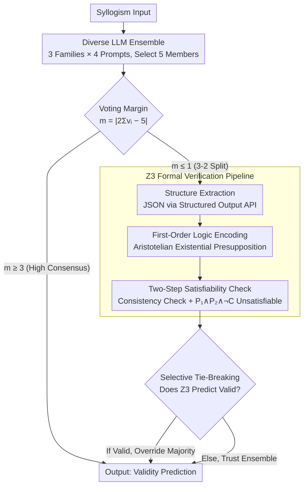

# FregeLogic at SemEval 2026 Task 11: A Hybrid Neuro-Symbolic Architecture for Content-Robust Syllogistic Validity Prediction

**Conference**: ACL 2026  
**arXiv**: [2604.18328](https://arxiv.org/abs/2604.18328)  
**Code**: None  
**Area**: LLM Agent / Neuro-Symbolic Reasoning  
**Keywords**: Syllogistic Reasoning, Content Effect, Neuro-Symbolic, LLM Ensemble, Z3 Solver

## TL;DR

The authors propose FregeLogic, a hybrid neuro-symbolic system that combines a five-member LLM ensemble with a Z3 SMT solver as a tie-breaking judge, reducing the content effect by 16% while improving accuracy by 0.9% in syllogistic validity judgment.

## Background & Motivation

**Background**: Syllogistic reasoning is a fundamental form of deductive reasoning. SemEval-2026 Task 11 requires systems to judge the logical validity of syllogisms while evaluating the extent to which the system is influenced by content believability (the content effect). The scoring formula $\text{Score} = \text{Accuracy} / (1 + \ln(1 + \text{CE}))$ simultaneously rewards high accuracy and low content effect.

**Limitations of Prior Work**: LLMs exhibit human-like content effects—tending to judge a syllogism as valid when the content is realistic and believable, and vice versa. Mechanistic analysis suggests that reasoning circuits developed by LLMs during pre-training are easily contaminated by world knowledge.

**Key Challenge**: How to leverage the powerful reasoning capabilities of LLMs while overcoming their systematic sensitivity to content believability?

**Goal**: Design a reasoning system that minimizes the content effect while maintaining high accuracy.

**Key Insight**: Use the degree of disagreement in an LLM ensemble vote to signal cases of content bias, then hand these cases to a content-neutral formal logic solver.

**Core Idea**: Narrow margins in ensemble voting (3-2 splits) disproportionately correspond to content bias errors—precisely the cases where a formal verifier can add value.

## Method

### Overall Architecture

The core problem FregeLogic addresses is maintaining the high accuracy of LLMs while suppressing their systematic sensitivity to content believability (content effect) when judging syllogism validity. The system employs a five-member LLM ensemble to vote on each question, assigning high-confidence cases directly to the majority vote. Only when the vote results in a narrow 3-2 split—which empirically corresponds to the cases with the strongest content bias—is the decision-making authority transferred to a content-neutral Z3 formal verification pipeline. The output is a validity prediction with significantly enhanced content independence and no sacrifice in accuracy.

### Key Designs

**1. Diverse LLM Ensemble: Building a High-Accuracy Baseline with Uncorrelated Errors**

The value of the ensemble depends entirely on the uncorrelation of errors among members. Therefore, the authors introduce diversity across two dimensions: architecture and prompting. For architecture, three different families of open-source models are selected (MoE-based Llama 4 Maverick / Llama 4 Scout, and dense Qwen3-32B). Four prompting strategies are applied (Zero-shot, Few-shot, Few-shot CoT, Simple CoT), totaling 12 "Model × Prompt" combinations. In each fold, nested cross-validation is used to select the 5 configurations with the highest combined scores to serve as the ensemble members. This combination of architectural diversity (MoE vs. dense) and prompt diversity ensures that errors made by different members on the same question are decoupled, making the majority vote more stable than any single configuration.

**2. Z3 Formal Verification Pipeline: A Logic Judge Completely Stripped of Semantic Content**

This pipeline follows three steps: first, an LLM with a structured output API extracts the logical structure of the syllogism into JSON. Next, it is encoded into first-order logic (utilizing the Aristotelian existential presupposition). Finally, a two-step satisfiability check is performed—verifying first if the two premises are self-consistent, and then whether $P_1 \wedge P_2 \wedge \neg C$ is unsatisfiable (if so, the syllogism is valid). The Z3 encoding inherently removes all semantic content, making its judgment entirely independent of whether the "content is realistic," thus compensating for the LLM's weakness. The engineering key here is structure extraction: switching to a structured output API reduced the extraction failure rate from approximately 22% to nearly zero, preventing format noise from contaminating downstream encoding.

**3. Selective Tie-Breaking Mechanism: Intervening Only When Necessary**

The tie-breaking decision is determined by the voting margin $m = |2 \sum v_i - 5|$. Only when $m \leq 1$ (i.e., a 3-2 split) and Z3 predicts "valid" is the ensemble's majority vote overridden by the Z3 result; in all other cases, the ensemble is trusted. This strict constraint is based on empirical evidence: 3-2 splits disproportionately correspond to content bias errors, which is where formal verification is most effective. Expanding this to high-consensus cases leads to performance degradation because Z3's accuracy on valid syllogisms is only 48.6%, meaning excessive intervention would miscorrect right answers. Utilizing the ensemble's consensus level as a "bias probe" to precisely time the intervention is the core ingenuity of this hybrid strategy.

### A Complete Example

Consider an "invalid but believable" question: Three out of five members are swayed by reality-based believability and vote "valid," while two vote "invalid," resulting in a 3-2 split ($m=1$). The system does not directly adopt the "valid" majority vote. Instead, it triggers tie-breaking. The Z3 pipeline extracts the JSON, encodes it into first-order logic, and performs the satisfiability check. It finds that $P_1 \wedge P_2 \wedge \neg C$ is satisfiable, judges it "invalid," and overrides the majority vote. This is the source of the accuracy jump from 90.2% to 94.5% in the "Invalid-Believable" subgroup in the main experiment. Conversely, if a question receives a 5-0 or 4-1 consensus ($m \geq 3$), the system skips Z3 and follows the ensemble, preventing Z3's "validity bias" from corrupting high-confidence correct answers.

### Loss & Training

The system is training-free (non-parametric). Model and prompt selection, and fusion strategy selection are performed via nested 5-fold cross-validation. In each fold, all 12 combinations are evaluated on an internal subset of 200 samples to select the top-5 configurations for that fold's ensemble.

## Key Experimental Results

### Main Results (Nested 5-fold CV, N=960)

| Strategy | Accuracy | Content Effect | Combined Score |
|----------|----------|----------------|----------------|
| Pure Ensemble | 93.4% | 3.39 | 39.12 |
| **+ Z3 Tie-break** | **94.3%** | **2.85** | **41.88** |
| Z3 Only | 74.7% | 26.28 | 17.39 |
| Confidence + Z3 | 91.7% | 6.15 | 31.77 |

### Sub-group Accuracy Analysis

| Strategy | Valid-Believable | Valid-Unbelievable | Invalid-Believable | Invalid-Unbelievable |
|----------|------------------|--------------------|--------------------|----------------------|
| Pure Ensemble | 95.9% | 96.0% | 90.2% | 91.9% |
| + Z3 Tie-break | 95.6% | 93.8% | **94.5%** | 93.5% |

### Key Findings
- The tie-breaking mechanism primarily gains in the "Invalid-Believable" sub-group (90.2% → 94.5%), which contains the cases with the strongest content bias.
- 3-2 splits account for only 7.9% of cases, yet Z3 resulted in a net gain of 8 correct decisions across 30 override instances.
- Z3 exhibits a significant "invalidity bias"—97.6% accuracy on invalid syllogisms but only 52.2% on valid ones, primarily due to structure extraction errors.
- All 11 erroneous flips occurred in the same direction: Z3 incorrectly rejected valid syllogisms, mainly due to extraction errors involving double negatives or complex term boundaries.
- The Scout model appeared most frequently in minority alliances (53.9%), indicating it is more susceptible to content bias.

## Highlights & Insights
- Elegant System Design: Rather than simply replacing the LLM with formal logic, the system uses ensemble consensus as a bias signal to precisely target cases requiring formal verification.
- In-depth analysis of Z3's invalidity bias reveals that the bottleneck lies in extraction rather than encoding, with a directional asymmetry (Valid → Invalid).
- The engineering insight that structured output APIs significantly reduce extraction failure rates is of high practical value.
- The choice of the Aristotelian existential presupposition was validated by the labeling of Felapton-type syllogisms in the dataset.

## Limitations & Future Work
- The inference cost is relatively high, requiring 6 LLM calls + 1 Z3 solve per sample.
- The setup complexity for model and prompt selection via nested cross-validation is high.
- The Z3 pipeline relies on LLMs for structure extraction; extraction errors remain the primary bottleneck.
- No comparison was made with larger monolithic models (70B+); whether architectural diversity is superior to a single large model remains an open question.
- Adaptive adjustment of the tie-breaking threshold $\tau=1$ was not explored.

## Related Work & Insights
- **vs. Pure LLM methods**: FregeLogic compensates for LLM content bias through formal verification rather than relying solely on better prompting.
- **vs. Purely formal methods (e.g., LINC)**: FregeLogic only uses formal verification in low-consensus cases, preventing extraction errors from contaminating high-confidence cases.
- **vs. Activation steering (Valentino et al., 2025)**: FregeLogic is a black-box solution that does not require access to internal model states.
- **Insight**: The idea of using ensemble disagreement as a bias signal can be generalized to other reasoning tasks.

## Rating
- Novelty: ⭐⭐⭐⭐ The selective hybrid strategy using ensemble disagreement as a trigger for formal verification is cleverly designed.
- Experimental Thoroughness: ⭐⭐⭐⭐ Rigid nested cross-validation, with deep subgroup and error attribution analysis.
- Writing Quality: ⭐⭐⭐⭐⭐ Clear system description and thorough analysis; each design choice is well-justified.
- Value: ⭐⭐⭐ As a shared task system paper, the methodology is inspiring but direct generalizability might be limited.

<!-- RELATED:START -->

## Related Papers

- [\[ICML 2026\] Lifting Traces to Logic: Programmatic Skill Induction with Neuro-Symbolic Learning for Long-Horizon Agentic Tasks](../../ICML2026/llm_agent/lifting_traces_to_logic_programmatic_skill_induction_with_neuro-symbolic_learnin.md)
- [\[ACL 2026\] MAGMA: A Multi-Graph based Agentic Memory Architecture for AI Agents](magma_a_multi-graph_based_agentic_memory_architecture_for_ai_agents.md)
- [\[ACL 2026\] Robust Tool Use via Fission-GRPO: Learning to Recover from Execution Errors](robust_tool_use_via_fission-grpo_learning_to_recover_from_execution_errors.md)
- [\[ACL 2026\] IntrAgent: An LLM Agent for Content-Grounded Information Retrieval through Literature Review](intragent_an_llm_agent_for_content-grounded_information_retrieval_through_litera.md)
- [\[ACL 2026\] Don't Act Blindly: Robust GUI Automation via Action-Effect Verification and Self-Correction](don39t_act_blindly_robust_gui_automation_via_action-effect_verification_and_self.md)

<!-- RELATED:END -->
