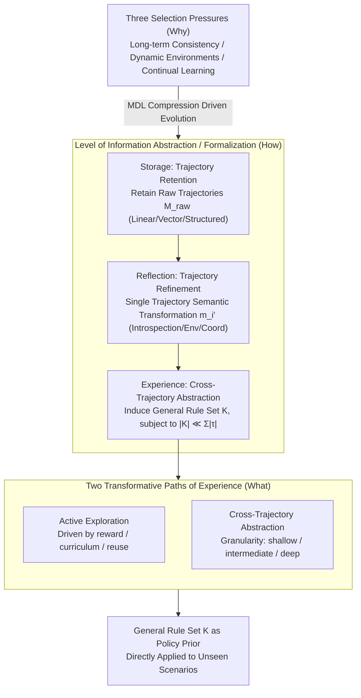

# From Storage to Experience: A Survey on the Evolution of LLM Agent Memory Mechanisms

**Conference**: ACL 2026 Findings  
**arXiv**: [2605.06716](https://arxiv.org/abs/2605.06716)  
**Code**: https://github.com/FeishuLuo/Evolving-LLM-Agent-Memory-Survey  
**Area**: LLM Agent / Memory Mechanism / Survey / Continual Learning  
**Keywords**: Agent Memory, Storage, Reflection, Experience, MDL, Cross-Trajectory Abstraction

## TL;DR
This paper provides a systematic survey of LLM Agent memory mechanisms using an evolutionary framework of "Storage → Reflection → Experience." It utilizes formal definitions to map these three stages to three functional signatures: "Trajectory Retention → Trajectory Refinement → Cross-Trajectory Abstraction." The storyline is structured around three RQs (Why-How-What), with a deep dive into two transformative mechanisms of the Experience stage: Active Exploration and Cross-Trajectory Abstraction.

## Background & Motivation

**Background**: LLM agents (such as ReAct, AutoGPT, AutoGen) have become a primary battlefield for AI over the past two years. However, LLMs themselves are stateless—accumulating errors during multi-step reasoning, persona drift, and loss of memory across sessions necessitate an "external memory module." The community has produced a vast array of memory solutions (MemGPT, Reflexion, Generative Agents, Voyager, CLIN, Mem0, etc.), yet each introduces unique concepts, lacking a unified perspective.

**Limitations of Prior Work**: The authors identify two fundamental obstacles: (i) **Paradigmatic Fragmentation**: Existing work follows either an "Operating Systems" route (e.g., MemGPT managing LLM context as virtual memory) or a "Cognitive Science" route (mimicking human hippocampal consolidation), with the two lines **seldom citing each other**; (ii) **Absence of Technological Synthesis**: Existing surveys (Zhang 2024, Hu 2025, Du 2025, Wu 2025, etc.) provide only static classifications without revealing the internal drivers of "why one generation evolves into the next."

**Key Challenge**: Current surveys are essentially "cross-sectional snapshots" (modularized by function) and fail to answer "where to go next" because they do not reveal the **evolutionary drivers**. This leaves new researchers without an actionable roadmap.

**Goal**: To organize literature through an "evolutionary" lens, formally defining three stages, identifying the "selection pressure" driving each transition, and providing an in-depth expansion of the frontier Experience stage.

**Key Insight**: The authors borrow the **level of information abstraction** as the classification axis—Storage preserves raw trajectories (priority: fidelity), Reflection performs semantic transformation within an intra-trajectory (priority: quality), and Experience performs cross-trajectory induction (priority: universality). This axis is orthogonal to the "OS vs. Cognitive Science" divide, allowing for their unification.

**Core Idea**: To view LLM agent memory mechanisms as an **MDL (Minimum Description Length) driven evolutionary process**—from redundant storage to single-trajectory refinement and finally to cross-trajectory compression into a general rule set $\mathcal{K}$.

## Method

> Note: This paper is a survey and does not propose a new algorithm. This section outlines its framework and core definitions.

### Overall Architecture

The authors view the LLM agent memory mechanism as an evolutionary process driven by MDL (Minimum Description Length) and use a three-tier "Why-How-What" set of RQs to link the entire storyline: RQ1 (§3) asks which three selection pressures drive the evolution of memory mechanisms; RQ2 (§4) characterizes the evolutionary path of Storage → Reflection → Experience; and RQ3 (§5) focuses on the two qualitative changes brought by the frontier Experience stage. The three stages share a unified formalization—at time $t$, the agent samples an action $a_t \sim \pi_\theta(a_t \mid \mathcal{I}, o_t, m_t)$, where the local memory $m_t = \text{Retrieve}(\mathcal{M}, o_t)$ comes from the global memory $\mathcal{M}$. The true divergence among the three stages lies in how $\mathcal{M}$ is constructed: by retaining raw trajectories, refining single trajectories, or inducing general rules across trajectories.

### Key Designs

**1. Decomposing Evolutionary Drivers into Three Localizable Selection Pressures (Why)**

Instead of vague claims that "memory is important," the authors decompose the evolution from Storage to Experience into three specific pressures, each tied to a surge in literature. First is long-term consistency: agents must maintain reasoning chains without self-contradiction and avoid local optima, leading to the earliest memory modules (MemGPT, Sumers 2023). Second is dynamic environments: knowledge has expiration dates without automatic error reporting (Lazaridou 2021), and causality involves delayed cascading effects (Joshi 2024), driving mechanisms like active management, temporal decay, and causal graphs. Third is continual learning: episodic memory capacity is finite, and infinite expansion contaminates the memory with error propagation (Xiong 2025), necessitating a shift from "recording" to "abstraction"—the Experience stage.

**2. Three-Stage Formalization Using "Level of Information Abstraction" (How)**

The core design of the survey is the shift in the classification axis. Previous work classified by "long-term/short-term" (CogSci style) or "memory hierarchy" (OS style), neither of which explains why Reflexion and Voyager belong to different generations. The authors use the level of information abstraction and assign an exact functional signature to each stage. Storage retains the raw trajectory $\tau = \langle(o_1,a_1),\dots,(o_T,a_T)\rangle$ whereby $\mathcal{M}_{raw} = \{\tau_i\}_{i=1}^N$ (sub-divided into Linear/Vector/Structured). Reflection performs intra-trajectory semantic transformation $m_i' = \mathcal{F}_{ref}(\tau_i \mid \phi)$, where $\phi$ is the evaluation criterion (sub-divided into Introspection/Environment/Coordination). Experience performs inter-trajectory induction $\mathcal{F}_{exp}: \mathcal{T}_{batch} \to \mathcal{K}$ with an MDL constraint $|\mathcal{K}| \ll \sum_{\tau\in\mathcal{T}_{batch}} |\tau|$ (sub-divided into Explicit/Implicit/Hybrid).

**3. Splitting the Experience Stage into Active Exploration and Cross-Trajectory Abstraction (What)**

The Experience phase is the highest-value differentiator of this survey. The authors separate frontier work from late 2025 onwards from other memory research using two orthogonal mechanisms. One is Active Exploration: the agent changes from a passive recorder to a goal-driven experience collector, categorized by drivers (reward-driven / curriculum-driven / reuse-driven) and dimensions (breadth for cognitive gaps / depth for high-level skills / strategy for long-horizon optimization). The other is Cross-Trajectory Abstraction: abstraction mechanisms include contrastive induction (success vs. failure), multi-granularity chunking, code function encapsulation, and fine-tuning internalization. Abstraction levels range from shallow (NL rules) to intermediate (modular skeletons) and deep (internalized weights).

### Loss & Training

This is a survey; no training is performed. Cited references $\geq 200$, covering 2022 to the first half of 2026.

## Key Experimental Results

### Comparison of Reflection vs. Experience Structures

| Dimension | Reflection | Experience |
|------|-----------|-----------|
| Functional signature | Intra-trajectory: $\mathcal{F}_{ref}(\tau_i\|\phi) = m_i'$ | Inter-trajectory: $\mathcal{F}_{exp}(\mathcal{T}_{batch}) = \mathcal{K}$ |
| Output form | Refined memory unit $m_i'$, bound to task context | General rules/skill $\mathcal{K}$, detached from scenarios |
| Retrieval dependency | Retrieves past tasks with semantic similarity at inference | Used directly as policy prior for unseen scenarios |
| Representative Work | Reflexion (Shinn 2023), CLIN (Majumder 2023) | FLEX (Cai 2025), MemSkill (Zhang 2026) |

### Sub-category Comparison of Storage Stage

| Sub-category | Core Idea | Representative Work | Key Limitations |
|------|---------|---------|---------|
| Linear | FIFO + context window / attention modification | StreamingLLM (Xiao 2023) | Capacity limited by attention complexity |
| Vector | embedding + semantic/temporal decay retrieval | Generative Agents (Park 2023) | Retrieval ambiguity |
| Structured | Relational tables / hierarchy / graphs | MemGPT (Packer 2023) | High design complexity |

### Abstraction Granularity Comparison for Experience Stage

| Level | Abstraction Product | Interpretability | Generalization Boundary |
|------|---------|--------|----------|
| Shallow | NL Rules / Heuristics | High | Intra-domain cross-task |
| Intermediate | Executable modular skeletons (code / skill) | Medium | Intra-task family |
| Deep | Compressed into model weights (intuition) | Low | Global, but non-editable |

### Key Findings

- **Evolution Direction is "Compression"**: Moving from raw $\mathcal{M}_{raw}$ to refined $\{m_i'\}$ to general $\mathcal{K}$, each step performs information compression (MDL); higher compression rates correlate with a closer approach to "General Intelligence."
- **Experience is a Qualitative Shift**: Reflection units remain tied to the original trajectory, whereas Experience's $\mathcal{K}$ serves as a policy prior independent of the trajectory—a paradigm shift from "case-based" to "rule-based."
- **Multi-agent + Multimodal + Distributed Shared Memory** are recognized as the three next-generation directions.
- **Overlap of Implicit Experience with RL/Meta-Learning**: The authors point out that Implicit Experience (fine-tuning experience into weights) overlaps technically with fine-tuning/RL/meta-learning. This framework treats it as a role within the memory-centric agent architecture—a mediator between interaction trajectories and parameter updates.

## Highlights & Insights

- **Evolutionary Narrative is a Major Unlock**: Unlike previous surveys that used static classifications, this paper provides a **directional roadmap** by explaining which pressures birthed which generations.
- **Formal Signatures for Three Stages**: Mapping the three stages to mathematical objects ($\mathcal{M}_{raw}/m_i'/\mathcal{K}$) and distinguishing $\mathcal{F}_{ref}$ vs. $\mathcal{F}_{exp}$ as intra vs. inter trajectory provides the community with precise, citable terminology.
- **MDL Perspective as a Key Insight**: Constraining the Experience stage as $|\mathcal{K}|\ll \sum|\tau|$ suggests the ultimate form of agent memory is an information-theoretically optimal policy prior, linking statistical learning theory to agent engineering.
- **Reflection vs. Experience Comparison (Table 1)**: This establishes a clear boundary where terminology was previously conflated (e.g., Reflexion vs. Voyager).
- **GitHub Living Survey**: The commitment to continuous updates adds lasting value to this rapidly evolving field.

## Limitations & Future Work

- **Ours acknowledges**: (1) Lack of quantitative horizontal comparison—due to differing goals and lack of unified benchmarks; (2) Technical overlap between Implicit Experience and fine-tuning/RL; (3) Recency bias in citing 2025/2026 works that may lack peer review.
- **Hidden issues**: (1) Idealized boundaries—real-world systems often mix stages; (2) Lack of a "failure mode evolution" perspective; (3) Future directions (e.g., Distributed Shared Memory) are vision-heavy but lack operational research problem decomposition.
- **Future directions**: (1) Establishing unified benchmarks to compare the evolution gain (e.g., success rate vs. memory size); (2) Identifying "anti-evolutionary" cases where simpler Storage outperforms Experience; (3) Discussing how reasoning models (e.g., o1, R1) with long internal CoT change the necessity of external memory.

## Related Work & Insights

- **vs. Zhang et al. 2024**: Focuses on engineering modules; Ours adds the evolutionary driver perspective.
- **vs. Hu et al. 2025**: Observes dynamics but stays at functional categories; Ours identifies MDL and cross-trajectory abstraction as the underlying needs.
- **vs. MemGPT (Packer 2023)**: Representing the Storage stage (Hierarchical sub-category).
- **vs. Reflexion (Shinn 2023)**: Representing the Reflection stage (Introspection sub-category), bound to single trajectories.
- **vs. Voyager (Wang 2023) / FLEX (Cai 2025)**: Representing the Experience stage (Explicit vs. Implicit).

## Rating
- Novelty: ⭐⭐⭐⭐ The "evolutionary narrative + formalization" is a survey-level innovation.
- Experimental Thoroughness: ⭐⭐⭐ No empirical experiments; however, reference coverage is extensive ($\geq 200$ papers).
- Writing Quality: ⭐⭐⭐⭐⭐ Extremely clear structure with the "Why-How-What" RQs and precise definitions.
- Value: ⭐⭐⭐⭐⭐ Provides a much-needed standardized vocabulary for the LLM agent memory field.

## Related Papers

- [\[ACL 2026\] CoEvolve: Training LLM Agents via Agent-Data Mutual Evolution](coevolve_training_llm_agents_via_agent-data_mutual_evolution.md)
- [\[ICML 2026\] SE-GA: Memory-Augmented Self-Evolution for GUI Agents](../../ICML2026/llm_agent/se-ga_memory-augmented_self-evolution_for_gui_agents.md)
- [\[ACL 2026\] Mem^p: Exploring Agent Procedural Memory](memp_exploring_agent_procedural_memory.md)
- [\[ACL 2026\] Lightweight LLM Agent Memory with Small Language Models](lightweight_llm_agent_memory_with_small_language_models.md)
- [\[AAAI 2026\] When Refusals Fail: Unstable Safety Mechanisms in Long-Context LLM Agents](../../AAAI2026/llm_agent/when_refusals_fail_unstable_safety_mechanisms_in_long-context_llm_agents.md)

<!-- RELATED:END -->

<!-- RELATED:START -->

## Related Papers

- [\[ACL 2026\] CoEvolve: Training LLM Agents via Agent-Data Mutual Evolution](coevolve_training_llm_agents_via_agent-data_mutual_evolution.md)
- [\[ACL 2026\] Lightweight LLM Agent Memory with Small Language Models](lightweight_llm_agent_memory_with_small_language_models.md)
- [\[ACL 2026\] Mem^p: Exploring Agent Procedural Memory](memp_exploring_agent_procedural_memory.md)
- [\[ACL 2026\] Shopping Companion: A Memory-Augmented LLM Agent for Real-World E-Commerce Tasks](shopping_companion_a_memory-augmented_llm_agent_for_real-world_e-commerce_tasks.md)
- [\[ACL 2026\] OCR-Memory: Optical Context Retrieval for Long-Horizon Agent Memory](ocr-memory_optical_context_retrieval_for_long-horizon_agent_memory.md)

<!-- RELATED:END -->
