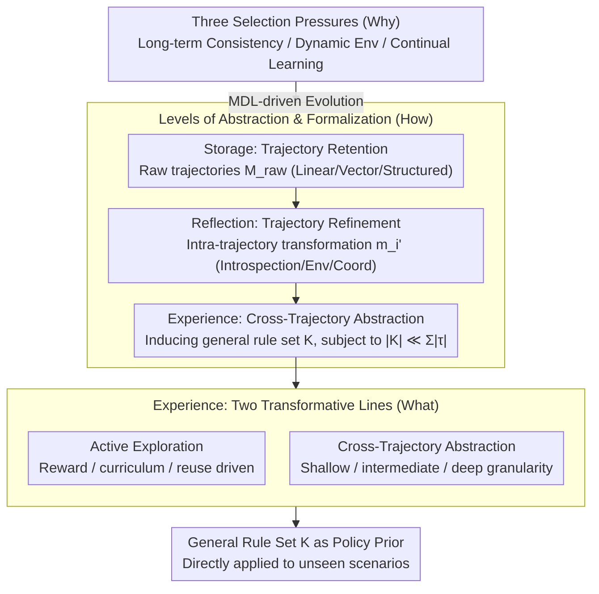

# From Storage to Experience: A Survey on the Evolution of LLM Agent Memory Mechanisms

**Conference**: ACL 2026 Findings  
**arXiv**: [2605.06716](https://arxiv.org/abs/2605.06716)  
**Code**: https://github.com/FeishuLuo/Evolving-LLM-Agent-Memory-Survey  
**Area**: LLM Agent / Memory Mechanisms / Survey / Continual Learning  
**Keywords**: Agent Memory, Storage, Reflection, Experience, MDL, Cross-Trajectory Abstraction

## TL;DR
This paper provides a systematic survey of LLM Agent memory mechanisms using a three-stage evolutionary framework: "Storage → Reflection → Experience." It utilizes formal definitions to map these stages to three functional signatures—"trajectory retention → trajectory refinement → cross-trajectory abstraction"—and structures the storyline through a "Why-How-What" triple-layer RQ, with a specific focus on two transformative mechanisms of the Experience stage: Active Exploration and Cross-Trajectory Abstraction.

## Background & Motivation

**Background**: LLM agents (ReAct, AutoGPT, AutoGen, etc.) have become a primary AI battlefield. However, LLMs are inherently stateless, leading to accumulated errors in multi-step reasoning, persona drift, and loss of memory across sessions. This necessitates an "external memory module." While the community has produced numerous memory solutions (MemGPT, Reflexion, Generative Agents, Voyager, CLIN, Mem0, etc.), most introduce disparate concepts without a unified perspective.

**Limitations of Prior Work**: The authors identify two fundamental obstacles: (i) **Paradigmatic Fragmentation**: Existing works either follow an "Operating Systems Engineering" route (e.g., MemGPT managing context as virtual memory) or a "Cognitive Science" route (mimicking hippocampal memory consolidation), with **minimal cross-citation** between these lines; (ii) **Absence of Technological Synthesis**: Existing surveys (Zhang 2024, Hu 2025, Du 2025, Wu 2025, etc.) focus on static classification, failing to reveal the internal drivers of why one generation evolves into the next.

**Key Challenge**: Current surveys are essentially "cross-sectional snapshots" (categorizing by module functions) and cannot answer "where to go next" because they do not reveal the **evolutionary drivers**. This prevents new researchers from obtaining an actionable roadmap.

**Goal**: To organize literature through an "evolutionary" lens, formally define the three stages, identify the "selection pressure" driving each transition, and provide an in-depth exploration of the frontier Experience stage.

**Key Insight**: The authors use the **level of information abstraction** as the classification axis—Storage preserves raw trajectories (fidelity priority), Reflection performs semantic transformation within an intra-trajectory (quality priority), and Experience performs cross-trajectory induction (generalization priority). This axis is orthogonal to the old "OS vs. CogSci" lines and unifies them.

**Core Idea**: Conceptualizing LLM agent memory mechanisms as an **MDL (Minimum Description Length) driven evolutionary process**—moving from redundant storage to single-trajectory refinement, and finally to cross-trajectory compression into a general rule set $\mathcal{K}$.

## Method

> Note: As this is a survey, no new algorithm is introduced. The "Method" section outlines its framework and core definitions.

### Overall Architecture

The authors view the LLM agent memory mechanism as an evolutionary process driven by MDL and link the storyline via "Why-How-What" RQs: RQ1 (§3) investigates the three selection pressures; RQ2 (§4) characterizes the evolutionary path of Storage → Reflection → Experience; RQ3 (§5) focuses on the qualitative changes brought by the Experience stage. All three stages share a formalization: at time $t$, the agent samples an action $a_t \sim \pi_\theta(a_t \mid \mathcal{I}, o_t, m_t)$, where the local memory $m_t = \text{Retrieve}(\mathcal{M}, o_t)$ is derived from the global memory $\mathcal{M}$. The distinction lies in how $\mathcal{M}$ is constructed: retaining raw trajectories, refining single trajectories, or inducing general rules across trajectories.

### Key Designs

**1. Decomposing evolutionary drivers into three locatable Selection Pressures (Why)**
Rather than stating "memory is important," the authors break down the transition from Storage to Experience into three pressures. First, **Long-term Consistency**: forcing agents to maintain non-contradictory reasoning chains, leading to early modules like MemGPT. Second, **Dynamic Environments**: addressing time-sensitive knowledge (Lazaridou 2021) and delayed causal effects (Joshi 2024), leading to active management and causal graphs. Third, **Continual Learning**: addressing limited episodic memory capacity and the prevention of error propagation (Xiong 2025), necessitating the leap from "recording" to "abstraction" (Experience).

**2. Three-Stage Formalization based on "Levels of Information Abstraction" (How)**
The core design shifts the classification axis to information abstraction levels, assigning a precise functional signature to each stage. 
- **Storage** preserves raw trajectories $\tau = \langle(o_1,a_1),\dots,(o_T,a_T)\rangle$, where $\mathcal{M}_{raw} = \{\tau_i\}_{i=1}^N$.
- **Reflection** performs intra-trajectory semantic transformation $m_i' = \mathcal{F}_{ref}(\tau_i \mid \phi)$, where $\phi$ is the evaluation criterion.
- **Experience** performs cross-trajectory induction $\mathcal{F}_{exp}: \mathcal{T}_{batch} \to \mathcal{K}$ under the MDL constraint $|\mathcal{K}| \ll \sum_{\tau\in\mathcal{T}_{batch}} |\tau|$. This allows a clear distinction between works like Reflexion (Refinement) and Voyager (Abstraction).

**3. Bifurcation of the Experience stage: Active Exploration & Cross-Trajectory Abstraction (What)**
Experience is categorized into two orthogonal mechanisms. **Active Exploration** shifts the agent from a passive recorder to a goal-driven experience collector (classified by drivers: reward/curriculum/reuse). **Cross-Trajectory Abstraction** includes contrastive induction, multi-granularity chunking, code encapsulation, and fine-tuning internalization. The abstraction granularity ranges from shallow (NL rules) to intermediate (modular skeletons) to deep (internalized weights).

### Loss & Training
N/A (Survey). Citations $\ge$ 200, covering 2022 to the first half of 2026.

## Key Experimental Results

### Structural Comparison: Reflection vs. Experience

| Dimension | Reflection | Experience |
|------|-----------|-----------|
| Functional signature | Intra-trajectory: $\mathcal{F}_{ref}(\tau_i\|\phi) = m_i'$ | Inter-trajectory: $\mathcal{F}_{exp}(\mathcal{T}_{batch}) = \mathcal{K}$ |
| Output Form | Refined memory unit $m_i'$, bound to original context | General rule/skill $\mathcal{K}$, detached from specific scenario |
| Retrieval Dependency | Retrieves semantically similar past tasks at inference | Used as policy prior for unseen tasks; no trajectory matching needed |
| Representative Work | Reflexion (Shinn 2023), CLIN (Majumder 2023), AgentFold (Ye 2025) | FLEX (Cai 2025), MemSkill (Zhang 2026), SkillRL (Xia 2026) |

### Storage Stage Sub-classification

| Subcategory | Core Idea | Representative Work | Key Limitation |
|------|---------|---------|---------|
| Linear | FIFO + context window extension / Attention modification | StreamingLLM (Xiao 2023) | Capacity limited by attention complexity |
| Vector | Embedding + semantic/temporal decay retrieval | Generative Agents (Park 2023) | Retrieval ambiguity |
| Structured | Relational tables / Hierarchy / Graphs | MemGPT (Packer 2023), AriGraph (2024) | High design complexity |

### Experience Abstraction Granularity

| Level | Abstraction Product | Interpretability | Generalization Boundary |
|------|---------|--------|----------|
| Shallow | NL Rules / Heuristics | High | Intra-domain cross-task |
| Intermediate | Executable modular skeletons (code / skill) | Medium | Same task family |
| Deep | Internalized model weights (intuition) | Low | Global, but non-editable |

### Key Findings
- **Evolutionary direction is "Compression"**: From raw $\mathcal{M}_{raw}$ to refined $\{m_i'\}$ to general $\mathcal{K}$, each step performs MDL-based compression; higher compression rates correlate with "General Intelligence."
- **Experience is qualitative change, not quantitative**: Reflection units stay bound to the original trajectory, while Experience $\mathcal{K}$ detaches to serve as a policy prior—a paradigm shift from "case library" to "rule library."
- **Multi-agent + Multimodal + Distributed Shared Memory** are identified as the three next-generation directions.
- **Implicit Experience overlaps with RL/Meta-Learning**: The framework views fine-tuning experience into weights as a role within memory-centric agent architecture rather than a completely separate paradigm.

## Highlights & Insights
- **Evolutionary Narrative as a "Unlock"**: Unlike previous static classifications, this "Evolutionary Theory" provides an **actionable roadmap** with clear direction.
- **Formalized Functional Signatures**: Mapping the three stages to mathematical objects ($\mathcal{M}_{raw}/m_i'/\mathcal{K}$) and defining $\mathcal{F}_{ref}$ vs. $\mathcal{F}_{exp}$ (intra vs. inter trajectory) provides the community with precise terminology.
- **MDL Perspective**: Defining the Experience stage via $|\mathcal{K}|\ll \sum|\tau|$ characterizes the ultimate goal of agent memory as an information-theoretically optimal policy prior.
- **Table 1 as Industry Standard**: This comparison table provides the first clean boundary between historically conflated terms like Reflexion and Voyager.

## Limitations & Future Work
- **Limitations**: (1) Lack of quantitative cross-comparison due to disparate goals of the three stages; (2) Technical overlap between Implicit Experience and fine-tuning/RL; (3) Recency bias given that the Experience stage matured recently in late 2025.
- **Hidden Problems**: (1) Idealized boundaries (actual works often mix stages); (2) Lack of a "failure mode evolution" perspective (i.e., what new failures Experience introduces, such as over-abstraction); (3) Future directions like Distributed Shared Memory lack operational research question decomposition.
- **Future Directions**: (1) Establishing uniform benchmarks for cross-stage comparison; (2) Investigating "counter-evolutionary" scenarios where simple Storage outperforms Experience; (3) Analyzing how reasoning models (e.g., o1, DeepSeek-R1) with long CoT change the necessity of external memory.

## Related Work & Insights
- **vs. Zhang et al. 2024**: Zhang is engineering-focused; Ours adds the evolutionary driver perspective.
- **vs. Hu et al. 2025**: Hu observes dynamics; Ours identifies MDL and cross-trajectory abstraction as the underlying needs.
- **vs. Du et al. 2025**: Du provides an operational taxonomy; Ours provides the "why" behind those operations.
- **vs. MemGPT/Reflexion/Voyager**: Classified as Storage (Hierarchical), Reflection (Introspection), and Experience (Explicit) respectively, providing a chronological and logical hierarchy.

## Rating
- Novelty: ⭐⭐⭐⭐ The "evolutionary theory + formalization" is a survey-level innovation.
- Experimental Thoroughness: ⭐⭐⭐ Survey only; covers $\ge 200$ papers, but lacks unified benchmark comparisons.
- Writing Quality: ⭐⭐⭐⭐⭐ "Why-How-What" structure + formal definitions are highly clear and citable.
- Value: ⭐⭐⭐⭐⭐ Establishes a common evolutionary lexicon for the LLM agent memory field.

<!-- RELATED:START -->

## Related Papers

- [\[ACL 2026\] CoEvolve: Training LLM Agents via Agent-Data Mutual Evolution](coevolve_training_llm_agents_via_agent-data_mutual_evolution.md)
- [\[ICML 2026\] SE-GA: Memory-Augmented Self-Evolution for GUI Agents](../../ICML2026/llm_agent/se-ga_memory-augmented_self-evolution_for_gui_agents.md)
- [\[ACL 2026\] Mem^p: Exploring Agent Procedural Memory](memp_exploring_agent_procedural_memory.md)
- [\[ACL 2026\] Lightweight LLM Agent Memory with Small Language Models](lightweight_llm_agent_memory_with_small_language_models.md)
- [\[ACL 2026\] ExpSeek: Self-Triggered Experience Seeking for Web Agents](expseek_self-triggered_experience_seeking_for_web_agents.md)

<!-- RELATED:END -->
