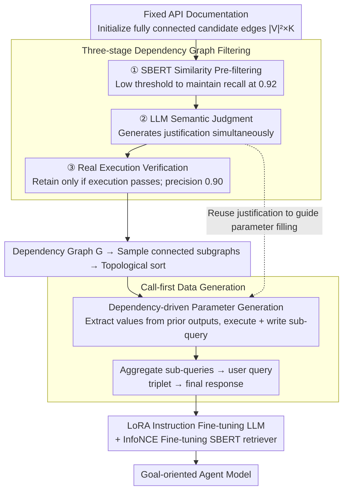

# GOAT: A Training Framework for Goal-Oriented Agent with Tools

**Conference**: ACL 2026 Findings  
**arXiv**: [2510.12218](https://arxiv.org/abs/2510.12218)  
**Code**: https://github.com/KU-MIIL/GOAT (Available)  
**Area**: LLM Agent / Tool Use  
**Keywords**: Goal-oriented, API calling, synthetic data, call-first generation, dependency graph

## TL;DR
GOAT enables small open-source models to decompose high-level goals into sequences of interdependent API calls without human annotation. By automatically constructing a "dependency graph + call-first synthetic data" pipeline from API documentation, it drives open-source models to SOTA performance on RestBench, API-Bank, and the self-constructed GOATBench, even surpassing closed-source models in specific scenarios.

## Background & Motivation

**Background**: LLMs acting as agents to invoke external tools/APIs have become a mainstream paradigm. However, most existing tool-learning benchmarks remain at a simple level of "single-step API calls" or "instructions where every step is clearly defined" (e.g., ToolFormer, Gorilla, ToolLLM, API-Bank).

**Limitations of Prior Work**: Real-world scenarios are **goal-oriented**—users provide only a high-level goal (e.g., "Find high-rated movies featuring actors from The Dark Knight and add them to my playlist"). The agent must autonomously decompose tasks, select APIs, and pass outputs from previous APIs as parameters for subsequent ones. Small open-source models exhibit nearly a 0% success rate in such settings, and while GPT-4 can function, a significant gap remains due to the **lack of goal-oriented training data**. Dependency relationships between APIs require expensive manual annotation, making them difficult to scale.

**Key Challenge**: Existing synthetic data pipelines generally adopt an **instruction-first** approach—letting the LLM generate a query first and then infer the API call sequence. This is the very capability being trained, leading to **self-reinforcement bias**: models only synthesize "simple cases" they already know how to perform. Consequently, synthetic data can only be used for distillation and fails to improve the complex reasoning capabilities of open-source models.

**Goal**: (1) Automatically synthesize goal-oriented training data that captures inter-API dependencies without human annotation; (2) Enable open-source models to reach or exceed the performance of closed-source models on in-domain real-world APIs.

**Key Insight**: The authors observe that agents are typically deployed on fixed sets of APIs with **existing documentation**. Documentation implicitly encodes input/output specifications sufficient to derive inter-API dependencies. Furthermore, generating natural language queries from "already executed call sequences" is more LLM-friendly than "inferring calls from queries"—the former is abstract summarization, while the latter is planning and reasoning.

**Core Idea**: Use an LLM with three-level filtering to transform API documentation into a reliable dependency graph. Sample connected subgraphs and then **execute APIs before generating the query** (call-first), transforming the LLM's summarization capability into reliable supervision for the inverse task.

## Method

### Overall Architecture

GOAT addresses the dilemma of wanting to build a goal-oriented agent with small open-source models despite the lack of labeled data. The pipeline consists of two stages: the input is a set of fixed API documents, and the output is a fine-tuned model capable of reasoning through API dependencies. The first stage constructs a dependency graph from API documents—initializing a fully connected multigraph and passing it through three levels of filtering to retain only executable dependencies $G=(\mathcal{V}, \mathcal{E})$. An edge $(n_i, n_j, k)$ indicates that the output of $n_i$ can be filled into the $k$-th parameter of $n_j$. The second stage samples connected subgraphs from the graph and applies "call-first" data synthesis after topological sorting. Finally, the LLM is fine-tuned using LoRA, and an SBERT retriever is fine-tuned via InfoNCE.

### Key Designs

**1. Three-stage dependency graph filtering: Funnel-based budget control for executable dependencies**

The number of candidate edges is $|\mathcal{V}|^2 \times K$. Relying solely on LLMs or real execution for verification is prohibitively expensive. The authors use a three-level funnel ordered from "cheap to expensive" and "high recall to high precision." The first level uses inexpensive SBERT cosine similarity, with a low threshold $\tau$ to maintain recall. The second level uses single LLM calls to judge semantic compatibility and generates a "justification" for why the edge is reasonable. The third level performs the most expensive but rigid execution-level verification: the LLM generates parameters for $n_i$ to get output $o_i$, then extracts content from $o_i$ to fill the $k$-th parameter of $n_j$ for execution $c_j$. The edge is retained only if $c_j$ executes successfully. Precision/Recall across the three stages are 0.25/0.92 → 0.59/0.42 → 0.90/0.36. This funnel ensures expensive checks are only applied to likely candidates, and execution verification is critical as semantic-only descriptions may miss "format/unit" mismatches.

**2. Call-first data generation: Reversing data synthesis direction**

Traditional instruction-first pipelines let the LLM generate a query and then infer API calls. Since this is the ability being trained, they only synthesize simple cases the model already knows, leading to self-reinforcement bias. GOAT reverses this: given a topologically sorted sequence $(n_{k_1}, \dots, n_{k_L})$, it instantiates them sequentially. For the $\ell$-th API, if a parameter has a dependency edge from a previous $m < \ell$, values are extracted from $o_{k_m}$; otherwise, the LLM creates a reasonable value based on documentation. Executing these yields $o_{k_\ell}$ and a natural language sub-query $s_{k_\ell}$. After all calls, all sub-queries are summarized into a user query $u$, and the final response $r$ is generated using all triplets $\{(s, c, o)\}$. Summarizing from (call, output) to query is far easier for LLMs than complex planning from query to call. Table 5 proves instruction-first inferiority: with Llama2-13B, call-first leads in TMDB (7.0% vs 5.0%) and Spotify (28.1% vs 17.5%).

**3. Dependency-driven parameter generation + justification reuse**

API outputs are often nested JSON. LLMs often fail to extract the correct field. GOAT cleverly reuses the "justification" text generated during the second stage of graph filtering ("why $n_i$'s output can fill $n_j$'s $k$-th parameter") as a prior in the parameter-filling prompt. One LLM call generates value twice: once for filtering and once for data synthesis, reducing costs and providing a strong structural prior.

### Complete Example

Consider "Find high-rated movies featuring actors from The Dark Knight and add them to my playlist": A 4-node connected subgraph (search_movie → get_cast → discover_movies → add_to_playlist) is sampled and topologically sorted. Call-first synthesis begins: execute `search_movie` to get the movie ID, use it via the dependency edge to `get_cast` for an actor ID, then `discover_movies` for high-rated films, and finally `add_to_playlist`. A sub-query is written after each step. Finally, sub-queries are aggregated into the user query, and the final response is generated from the (sub-query, call, output) triplets. During training, specific parameter values are masked to force the model to learn the structure of API calls and data flow rather than memorizing IDs.

### Loss & Training

The LLM uses standard instruction fine-tuning (next-token CE) on sequences covering the plan, API calls, and final response. LoRA is configured with $r=8, \alpha=16$, and 0.05 dropout, trained for 3 epochs on an H100. The retriever uses SBERT (all-MiniLM-L6-v2) with InfoNCE loss, where positive samples are (query, correct API doc) pairs. Masking parameter values during training forces structural learning. Synthetic data scale: 8,570 for RestGPT-TMDB and 108 for API-Bank (which still yielded significant gains).

## Key Experimental Results

### Main Results

**RestBench** (Success% / Correct Path% / Δ Solution Length):

| Backbone | Method | TMDB SR% | TMDB CP% | Spotify SR% | Spotify CP% |
|---|---|---|---|---|---|
| text-davinci-003 (Closed) | RestGPT | 75.0 | 79.0 | 72.7 | 74.5 |
| Llama2-13B | Baseline (zero-shot) | 0.0 | 0.0 | 3.5 | 7.0 |
| Llama2-13B | **GOAT FT (Ours)** | **7.0** | **13.0** | **28.1** | **28.1** |
| Vicuna-13B | RestGPT | 9.0 | 15.0 | 12.7 | 20.6 |
| Vicuna-13B | **GOAT FT (Ours)** | **17.0** | **14.0** | **29.8** | **33.3** |

**API-Bank** (Plan+Retrieve+Call subset):

| Backbone | Method | Success% | CP% | Correctness% | ROUGE |
|---|---|---|---|---|---|
| GPT-4 (Closed) | API-Bank prompting | - | - | 70.00 | 0.4808 |
| Llama-7B | Baseline | 0.0 | 0.0 | 0.00 | 0.0048 |
| Llama-7B | **GOAT FT (Ours)** | **38.0** | **42.0** | **42.22** | 0.3173 |

**GOATBench** (660 instances, 4 domains, SA/IA/SR metrics):

| Backbone | Method | Inter SA | Inter SR | Single SA | Single SR |
|---|---|---|---|---|---|
| GPT-4.1 (Closed) | Baseline | 22.7 | 27.4 | 45.4 | 51.3 |
| Llama2-7B | ReACT + ToolLLM FT | 13.1 | 1.0 | 28.7 | 3.9 |
| Llama2-7B | **ReACT + GOAT FT** | **33.2** | **1.9** | **41.0** | **7.2** |
| Llama3-8B | Baseline | 9.7 | 7.2 | 18.2 | 7.9 |
| Llama3-8B | **GOAT FT (Ours)** | **59.4** | **12.3** | **69.1** | **16.5** |

### Ablation Study

| Configuration | TMDB SR% | Spotify SR% | Note |
|---|---|---|---|
| Instruction-first generation | 5.0 | 17.5 | Traditional paradigm |
| **Call-first generation (GOAT)** | **7.0** | **28.1** | 60% relative Gain on Spotify |

Dependency graph filtering precision/recall (Tab 6):

| Stage | Precision | Recall | Note |
|---|---|---|---|
| Embedding Similarity | 0.25 | 0.92 | High-recall pre-filtering |
| LLM Semantic Judgment | 0.59 | 0.42 | Mid precision, justification reuse |
| API Real Execution | 0.90 | 0.36 | High-precision final filtering |

### Key Findings
- **Call-first is the decider**: The +10.6 absolute point increase on Spotify proves that "executing before writing the query" is significantly more learnable for open-source models.
- **Small data drives performance**: With only 108 synthetic samples in API-Bank, Llama-7B jumped from 0% → 38% Success, showing signal quality matters more than scale.
- **Robust across prompting paradigms**: GOAT improves performance under both baseline and ReACT prompting, showing it enhances inherent model capability.
- **Execution verification is essential**: Filtering at the execution level pulled precision from 0.59 to 0.90, ensuring edges are semantically and practically valid.
- **Outperforms ToolLLM FT**: When trained on RapidAPI data, GOAT significantly outperformed ToolLLM (instruction-first, parallel-API) in goal-oriented settings, validating task alignment.

## Highlights & Insights
- **Cognitive Engineering via Reversal**: The authors exploit a key asymmetry—summarizing a query is easier than planning a sequence. Using "LLM strengths to feed LLM weaknesses" is a versatile strategy applicable to code synthesis or math tasks.
- **Funnel-based LLM Budgeting**: The embedding → LLM → execution flow manages cost while maximizing quality—a template for selecting gold samples from huge candidate spaces.
- **Zero-cost Justification Reuse**: Using filter justifications as parameter-filling priors is a clever engineering feat that amortizes costs and provides structural priors.
- **Significant gains from minimal samples**: GOAT proves that with proper distribution alignment, open-source models can unlock immense capability from as few as 108 high-quality samples.

## Limitations & Future Work
- **Weak generalization to unseen APIs**: GOAT is an in-domain design. Changing the API set requires re-running the entire pipeline.
- **Dependency on documentation quality**: Vague documentation or missing parameter descriptions can lead to noisy edges and lower synthetic data quality.
- **Execution dependency on endpoints**: Verification is difficult for paid, authenticated, or side-effect-heavy APIs (e.g., database writes, transfers).
- **Lack of cost reporting**: The total tokens used for Llama3-70B synthesis were not disclosed, making replication cost assessment difficult.
- **Future Directions**: (i) Cross-domain dependency graph transfer; (ii) Sandboxed execution for write-access APIs; (iii) Semantic clustering on graphs for better sampling coverage of rare patterns.

## Related Work & Insights
- **vs ToolLLM**: ToolLLM uses RapidAPI but follows an instruction-first approach focused on parallel multi-API. GOAT's call-first approach for goal-oriented tasks improved ReACT+ToolLLM FT from 13.1 to 33.2 SA.
- **vs RestGPT**: RestGPT is a strong prompting-only baseline for GPT-4. GOAT moves the competition from "prompt engineering" to "data synthesis engineering," allowing LoRA-tuned open-source models to surpass RestGPT-Vicuna.
- **vs ToolFlow / Magnet / ToolDial**: While these use dependency graphs, they rely on semantic heuristics without real execution verification and are not targeted at goal-oriented queries.
- **vs API-Bank Training**: API-Bank uses non-executable Python functions and instruction-first data. GOAT’s use of real executable APIs and call-first generation is the key factor in its superior performance.

## Rating
- Novelty: ⭐⭐⭐⭐ The combination of Call-first + Funnel filtering + Justification reuse creates a 1+1+1 > 3 effect for goal-oriented tasks.
- Experimental Thoroughness: ⭐⭐⭐⭐ Covers 3 benchmarks, multiple backbones, prompting paradigms, and ablation studies. Seed reporting and cost analysis are missing.
- Writing Quality: ⭐⭐⭐⭐ Clear pipeline diagrams and convincing precision/recall analysis for the filter stages.
- Value: ⭐⭐⭐⭐⭐ Provides a practical, deployable solution for industrial users wanting agents without manual annotation. Strong potential for community impact.

<!-- RELATED:START -->

## Related Papers

- [\[ACL 2026\] OctoTools: An Agentic Framework with Extensible Tools for Complex Reasoning](octotools_an_agentic_framework_with_extensible_tools_for_complex_reasoning.md)
- [\[NeurIPS 2025\] AgentChangeBench: A Multi-Dimensional Evaluation Framework for Goal-Shift Robustness](../../NeurIPS2025/llm_agent/agentchangebench_a_multi-dimensional_evaluation_framework_for_goal-shift_robustn.md)
- [\[ACL 2026\] CoEvolve: Training LLM Agents via Agent-Data Mutual Evolution](coevolve_training_llm_agents_via_agent-data_mutual_evolution.md)
- [\[ACL 2026\] Supplement Generation Training for Enhancing Agentic Task Performance](supplement_generation_training_for_enhancing_agentic_task_performance.md)
- [\[ICLR 2026\] Efficient Agent Training for Computer Use](../../ICLR2026/llm_agent/efficient_agent_training_for_computer_use.md)

<!-- RELATED:END -->
