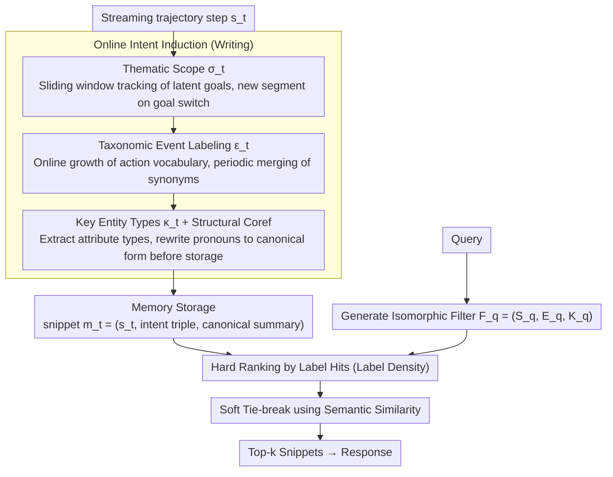

# Grounding Agent Memory in Contextual Intent

**Conference**: ACL 2026  
**arXiv**: [2601.10702](https://arxiv.org/abs/2601.10702)  
**Code**: https://contextual-intent.github.io/ (Available)  
**Area**: LLM Agent / Memory Systems  
**Keywords**: Long-term Memory, Agent, Contextual Intent, Event Structure Theory, Retrieval Cue

## TL;DR
STITCH introduces "contextual intent" (thematic scope + event type + key entity types) triples as structured retrieval cues for LLM agent long-term memory. These triples are induced online at each trajectory step. During inference, retrieval follows "label density ranking," performing structural matching before semantic scoring. On the newly constructed CAME-Bench, STITCH maintains performance as trajectories grow, outperforming the strongest baseline by 35.6% absolute (100% relative) on the Large subset.

## Background & Motivation

**Background**: LLM agents are deployed in long-term tasks (multi-turn collaboration, deep research, tool-augmented autonomous environments), requiring the tracking of states, resolution of implicit references, and integration of multi-step information across dozens to hundreds of trajectory steps. Existing agentic memory systems mainly fall into three categories: (i) Vector RAG (embedding similarity retrieval); (ii) Hierarchical summarization (RAPTOR, Secom); (iii) Knowledge-graph-based (GraphRAG, A-mem).

**Limitations of Prior Work**: (1) **Semantic similarity $\neq$ Contextual relevance**—"Hotel prices on Day 1" and "Hotel prices on Day 2" are semantically nearly identical but have completely different answers; (2) **Summarization erases episode boundaries**—adjacent segments are merged, but the same goal may persist across non-adjacent segments (e.g., "Day 2 itinerary" scattered and interrupted); (3) **Knowledge graphs lack episode-level disambiguation**—the same entity mentioned under different latent goals is merged into one node; (4) **Long-context LLMs** (GPT-5-mini 400k, Gemini 2.5) fail after the window is exceeded and incur high real-time retrieval overhead.

**Key Challenge**: Many steps in long-term trajectories are **semantically similar but contextually distinct**. The retrieval bottleneck is not recalling more content but "cue quality"—identifying what kind of index can precisely retrieve the correct contextual fragment from noisy history.

**Goal**: (1) Design a domain-agnostic structured retrieval cue that can both (a) connect non-adjacent segments with the same goal and (b) distinguish different occurrences of the same entity by role; (2) Construct a benchmark that truly evaluates "context-aware retrieval" rather than the "local retrieval" traps of turn-taking and thematic blocks in existing benchmarks.

**Key Insight**: Drawing from **Event Structure Theory** in cognitive science (Zacks & Tversky 2001), humans organize long-term experiences by (i) superordinate goal context (partonomy) and (ii) recurring action categories (taxonomy), then anchor details using entity roles.

**Core Idea**: Index each step using a triple $\iota_t = (\sigma_t, \epsilon_t, \kappa_t)$—thematic scope (episode segment label) + event type (action category) + key entity types (attribute schema). At inference, rank by label overlap first, then by semantic score.

## Method

### Overall Architecture
STITCH addresses how to precisely retrieve steps that are semantically similar but contextually different in long trajectories. It splits the process into online writing and on-demand reading: the writing end progressively induces a contextual intent triple $\iota_t=(\sigma_t, \epsilon_t, \kappa_t)$ for the streaming trajectory $T=\{s_1,\dots,s_n\}$ (where each step $s_t=(r_t, a_t, \tau_t)$), encoding the latent goal segment, action category, and entity attribute focus. It then performs pronoun disambiguation to store a canonical summary (memory snippet $m_t=(s_t, \iota_t, c_t)$ where $c_t=\mathcal{M}_{\text{sum}}(s'_t, \iota_t)$). The reading end generates an isomorphic filter $F_q=(\mathcal{S}_q, \mathcal{E}_q, \mathcal{K}_q)$ for the query, using a hard ranking based on structural hits followed by a soft tie-break using semantic similarity to retrieve the top-$k_{\text{retrieve}}$ (set to 40). The core design ensures that the contextual intent of "why this content was mentioned" becomes an indexable structured cue.

### Key Designs

**1. Thematic Scope $\sigma_t$: Tracking Latent Goals Across Steps**

The most hidden trap in long-term dialogue is facts like "Day 1 hotel price" vs. "Day 2 hotel price," where semantic similarity is high but goals differ. STITCH uses thematic scope to partition trajectories into behavior episodes, assigning a stable segment name (e.g., "Day 2 Itinerary"). Steps within the same episode share a scope until the LLM detects goal-state divergence.

This is predicted by an LLM predictor $\sigma_t=\mathcal{M}_{\text{scope}}(s_t, H_{\text{scope}}, \sigma_{t-1})$ using a sliding window $H_{\text{scope}}$ (default 50 turns). It also maintains a compressed summary $\Sigma_\sigma$ to pass the current scope's gist, preventing context explosion. This design is critical: removing $\sigma_t$ causes the Small subset F1 to drop from 0.844 to 0.463 (-38 points), as scope-based retrieval naturally performs disambiguation for similar facts.

**2. Taxonomic Event Labeling $\epsilon_t$: Online Evolving Action Vocabulary**

The same "Booking" action can occur across "Day 1", "Day 2", and "Day 3" scopes. An orthogonal action dimension is needed for fine-grained distinction. STITCH labels each step with an event label (e.g., "searching", "comparing", "Price Inquiry"). The vocabulary $\mathcal{V}_\epsilon$ grows online: starting with a seed vocabulary from the first $N_{\text{start}}=50$ steps, it then performs semantic retrieval of the top-$k_{\text{event}}=5$ candidates for the LLM to select $\epsilon_t = \mathcal{M}_{\text{label}}(s_t, \text{Retrieve}(\mathcal{V}_\epsilon, s_t, k_{\text{event}}))$. New labels are introduced if no existing label fits, and synonyms are merged every $k_{\text{update}}=50$ steps.

This is highly effective for fine-grained retrieval; removing $\epsilon_t$ drops Large F1 from 0.592 to 0.273 (-32 points). However, there is a granularity trade-off where overly fine labels may split related steps, slightly hurting Type 4 (Information Synthesis) queries.

**3. Key Entity Types $\kappa_t$ and Structural Coref: Grounding Before Storage**

STITCH extracts "attribute types" rather than specific instances (e.g., "Metric" instead of a value, "Price/Rating" instead of a specific hotel). $\kappa_t=\mathcal{M}_{\text{entity}}(s_t, \mathcal{V}_\kappa)$, where $\mathcal{V}_\kappa$ also follows online expansion and merging. Using types instead of instances ensures cross-domain generalizability. Based on this, it performs coreference resolution: retrieving history steps from the same scope with compatible event types to form alignment context $C_{\text{align}}$, allowing the LLM to rewrite "Book it" into "Book Apollo Hotel" ($s'_t=\mathcal{M}_{\text{rewrite}}(s_t, C_{\text{align}})$).

The principle is that disambiguation must occur **before storage**; otherwise, retrieval returns ambiguous "it" snippets. Removing coreference resolution drops Large F1 from 0.592 to 0.404 (-19 points).

### Loss & Training
STITCH is training-free. All intent construction and retrieval utilize gpt-5-mini online inference without parameter updates. Hyperparameters are fixed at $N_{\text{start}}=50$, $k_{\text{update}}=50$, $k_{\text{retrieve}}=40$, and $k_{\text{event}}=5$. The retrieval token budget is 4096 for fair comparison. LLM-as-judge uses gpt-4.1-mini.

## Key Experimental Results

### Main Results

Comparison on CAME-Bench, LongMemEval, and LoCoMo:

| Method | CAME-S F1 | CAME-M F1 | CAME-L F1 | LongMemEval Acc-O | LongMemEval Acc-S | LongMemEval Acc-M | LoCoMo Acc |
|---|---|---|---|---|---|---|---|
| DeepSeek V3.1 (128k) | 0.228 | 0.010 | 0.000 | 0.620 | 0.240 | 0.267 | 0.587 |
| GPT-4.1-mini (1M ctx) | 0.712 | 0.362 | 0.213 | 0.720 | 0.200 | 0.067 | 0.682 |
| GPT-5-mini (400k ctx) | **0.804** | 0.566 | 0.212 | **0.860** | 0.820 | 0.533 | **0.811** |
| text-embedding-3-large RAG | 0.317 | 0.168 | 0.195 | 0.800 | 0.800 | 0.267 | 0.661 |
| RAPTOR | 0.329 | 0.117 | 0.139 | 0.680 | 0.480 | 0.467 | 0.671 |
| GraphRAG | 0.371 | 0.165 | 0.156 | 0.820 | 0.840 | 0.667 | 0.648 |
| HippoRAG 2 | 0.390 | 0.191 | 0.186 | 0.820 | 0.800 | 0.667 | 0.725 |
| A-mem | 0.376 | 0.196 | 0.186 | 0.780 | 0.740 | 0.667 | 0.731 |
| Secom | 0.501 | 0.114 | 0.236 | 0.520 | 0.580 | 0.600 | 0.640 |
| **STITCH (Ours)** | **0.844** | **0.682**† | **0.592**† | **0.860** | **0.860** | **0.800** | 0.703 |

†: Paired t-test vs. strongest baseline on subset, $p < 0.05$.

**Key scaling phenomenon**: From Small ($N=144$) to Medium ($N=168$, ~6× length) and Large ($N=61$, ~17× length), all baselines collapse (GPT-5-mini F1 from 0.804 to 0.212), while STITCH remains robust (0.844 to 0.592).

### Ablation Study

| Configuration | CAME-S F1 | CAME-M F1 | CAME-L F1 | Description |
|---|---|---|---|---|
| **STITCH (full)** | **0.844** | **0.682** | **0.592** | Full Model |
| w/o thematic scope $\sigma_t$ | 0.463 | 0.257 | 0.213 | **Largest drop**—scope is core |
| w/o event type $\epsilon_t$ | 0.753 | 0.527 | 0.273 | -32 points on Large |
| w/o coreference | 0.578 | 0.489 | 0.404 | No coref → "it" in snippets |
| w/o key entity type $\kappa_t$ | 0.735 | 0.511 | 0.458 | Entity anchoring is vital |

### Key Findings
- **Thematic scope is more critical than event or entity types**: This aligns with Event Structure Theory, where humans recall by episode first.
- **Advantages scale with trajectory length**: STITCH matches GPT-5-mini on Small, but leads by 37 points on Large, proving intent-aware indexing solves the length bottleneck.
- **Long-context LLMs fail on Large tasks**: The "lost in the middle" phenomenon is evident; GPT-5-mini achieves less than 1/3 of STITCH's F1 on the Large subset.
- **Granularity trade-off is an open problem**: Fine-grained events favor factual recall but hurt information synthesis.
- **Stable across backbones**: Replacing GPT-5-mini with 4o-mini or 4.1-mini maintains the performance lead, proving gain is method-driven.

## Highlights & Insights
- **Cognitive Science to Engineering Mapping**: Using the "partonomy + taxonomy + figure" triple provides a principled design for memory cues beyond intuition.
- **Elegance of Label Density Ranking**: The two-stage "hard filter + soft tie-break" strategy avoids the mutual dilution of structural matching and semantic similarity.
- **Online Dynamic Vocabulary**: The ability to grow schemas online without a domain ontology allows for native cross-domain functionality.
- **Pre-storage Grounding**: Forcing disambiguation before storage prevents the accumulation of errors typical of "on-the-fly" resolution.

## Limitations & Future Work
- **High Ingestion Cost**: Multiple LLM calls per step make ingestion significantly slower than embedding-only memory.
- **Flat Granularity**: A single-layer event vocabulary forces a choice between fine and coarse, hurting synthesis.
- **Buffered Update Latency**: $k_{\text{update}}=50$ introduces a minor delay in formalizing new event types.
- **Strong LLM Dependency**: Performance on smaller open-source models for intent induction remains unverified.

## Related Work & Insights
- **vs. GraphRAG / A-mem**: KG methods merge occurrences, losing latent goal dimensions; STITCH's episode-level disambiguation is superior in long trajectories.
- **vs. RAPTOR / Secom**: Hierarchical summaries can fragment non-adjacent segments with the same goal; STITCH's sliding-window scope maintains better multi-hop continuity.
- **vs. HippoRAG 2**: HippoRAG relies on entity co-occurrence; STITCH explicitly codes the "why" via $\iota_t$.
- **vs. Long-context LLM**: Expanding context windows is not equivalent to structural memory once trajectories are long enough.

## Rating
- Novelty: ⭐⭐⭐⭐⭐ 
- Experimental Thoroughness: ⭐⭐⭐⭐⭐ 
- Writing Quality: ⭐⭐⭐⭐ 
- Value: ⭐⭐⭐⭐⭐ 

<!-- RELATED:START -->

- Zacks & Tversky, 2001: Event Structure Theory in Perception and Conception.
- Sarthi et al., 2024: RAPTOR: Recursive Abstractive Processing for Tree-Organized Retrieval.

<!-- RELATED:END -->

## Related Papers

- [\[ACL 2026\] OCR-Memory: Optical Context Retrieval for Long-Horizon Agent Memory](ocr-memory_optical_context_retrieval_for_long-horizon_agent_memory.md)
- [\[ACL 2026\] Lightweight LLM Agent Memory with Small Language Models](lightweight_llm_agent_memory_with_small_language_models.md)
- [\[NeurIPS 2025\] TAI3: Testing Agent Integrity in Interpreting User Intent](../../NeurIPS2025/llm_agent/tai3_testing_agent_integrity_in_interpreting_user_intent.md)
- [\[ACL 2026\] Mem^p: Exploring Agent Procedural Memory](memp_exploring_agent_procedural_memory.md)
- [\[ACL 2026\] From Storage to Experience: A Survey on the Evolution of LLM Agent Memory Mechanisms](from_storage_to_experience_a_survey_on_the_evolution_of_llm_agent_memory_mechani.md)

<!-- RELATED:END -->
