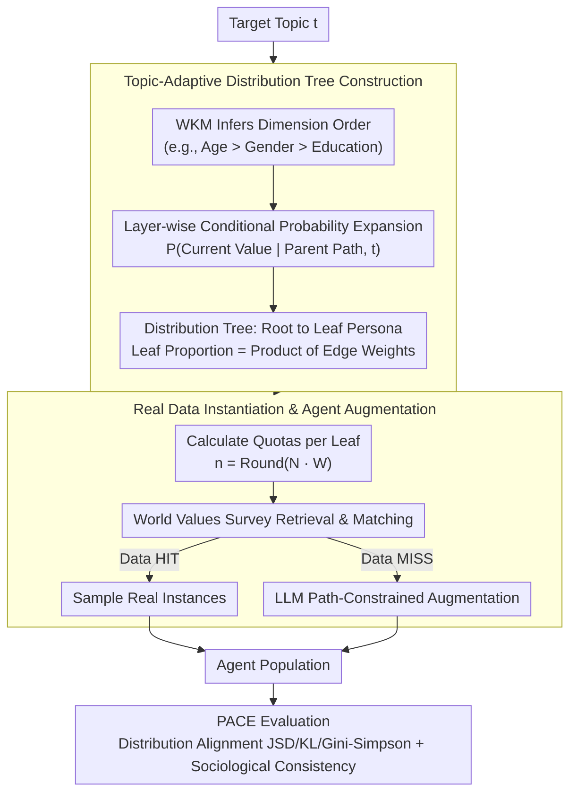

# HAG: Hierarchical Demographic Tree-based Agent Generation for Topic-Adaptive Simulation

**Conference**: ACL 2026  
**arXiv**: [2601.05656](https://arxiv.org/abs/2601.05656)  
**Code**: [https://github.com/Libra117/HAG](https://github.com/Libra117/HAG)  
**Area**: LLM Agent  
**Keywords**: Agent Generation, Population Simulation, Hierarchical Decision-making, Topic-Adaptive, Agent-Based Modeling

## TL;DR
The HAG framework is proposed, formalizing population Agent generation as a two-stage hierarchical decision process. It uses a world knowledge model to construct a topic-adaptive demographic distribution tree for macro-distribution alignment, followed by real data retrieval and Agent augmentation to ensure micro-level individual consistency. On multi-domain benchmarks, it reduces aggregate alignment error by an average of 37.7% and improves sociological consistency by 18.8%.

## Background & Motivation

**Background**: Agent-Based Modeling (ABM) is increasingly critical in fields such as computational social science, economic modeling, and personalized recommendation. These simulation systems rely heavily on user Agents to simulate preferences and interaction behaviors. The quality of Agents directly determines the fidelity of the simulation system.

**Limitations of Prior Work**: Existing Agent generation methods fall into two categories: (1) Data retrieval methods construct Agent pools from real user logs but are naturally static and cannot adapt to unseen or data-scarce topics; (2) LLM-based generation methods create Agent personas via predefined schemas or textual reasoning but lack explicit modeling of the joint distribution of multi-dimensional attributes. Generating each Agent independently leads to population distributions that do not align with reality.

**Key Challenge**: No existing method simultaneously achieves "topic-adaptive macro-distribution modeling of the population" and "sociological plausibility of micro-individual attributes." Independently generated Agents may exhibit attribute contradictions (e.g., mismatch between age and occupation), while static retrieval cannot cover new topics.

**Goal**: Design an Agent population generation framework that satisfies both macro-distribution alignment and micro-individual consistency.

**Key Insight**: The authors observe that demographic structures are topic-dependent (e.g., the population distribution of users discussing technology vs. elderly care differs significantly). Therefore, population generation is modeled as a hierarchical conditional probability inference problem.

**Core Idea**: A world knowledge model (WKM) is used to build a topic-adaptive demographic distribution tree top-down. The joint distribution of multi-dimensional attributes is captured through hierarchical conditional probabilities, followed by a combination of real data filling and LLM-based augmentation to generate the final population.

## Method

### Overall Architecture
HAG addresses two conflicting challenges: ensuring that the macro-distribution of the population adapts to the topic while maintaining the sociological plausibility of micro-attributes. It models the process as a top-down hierarchical conditional probability inference: given a target topic, the WKM first infers the hierarchical order of demographic attributes and the layer-wise conditional probabilities. This grows a distribution tree from a topic root node to complete persona leaf nodes, where each path from root to leaf corresponds to a population segment and its target proportion. Using the target proportions of each leaf node as quotas, instances are retrieved and filled from a real user database (World Values Survey). For nodes with insufficient data, LLM augmentation is performed under the constraints of the path. This process links "Topic → Distribution → Individual" into an interpretable chain rather than independent sampling. Finally, the PACE framework is used to quantify quality across distribution alignment and micro-sociological consistency.

### Key Designs

**1. Topic-Adaptive Distribution Tree Construction: Translating Abstract Topics into Multi-dimensional Joint Distributions**

The fundamental problem with direct LLM persona generation is that Agents are sampled independently, lacking explicit modeling of joint distributions, which results in deviations from real-world distributions. HAG instead uses a distribution tree to represent dependencies between attributes. The WKM identifies and ranks relevant demographic dimensions based on the topic (e.g., Age > Gender > Education for technology discussions) to determine the tree hierarchy, then expands top-down.

The value and edge weight of each node are provided by the WKM's inferred conditional probability $P(f^{(l)}=v^{(l)} \mid f^{(1:l-1)}=v^{(1:l-1)}, t)$. Thus, each leaf node corresponds to a complete persona whose target proportion is the product of all edge weights from the root. Modeling with a conditional probability chain ensures that real-world dependencies (e.g., Age-Occupation-Education) are explicitly captured, guaranteeing that the macro joint distribution matches the topic.

**2. Real Data Instantiation and Agent Augmentation: Anchoring Micro-Authenticity with Real Data**

Once the distribution tree is established, it must be instantiated into specific individuals without creating "Frankenstein Agents" (e.g., contradictory age and occupation). HAG calculates the required number of individuals for each leaf persona $n(\mathbf{v}) = \text{Round}(N \cdot W(\mathbf{v}\mid t))$ and retrieves matching real users from the World Values Survey database. "HIT" nodes with sufficient data sample directly from real records, while "MISS" nodes trigger LLM augmentation constrained by the full path of the persona.

This prioritization ensures that micro-consistency is largely anchored by real data. The LLM only steps in where data is scarce, and generation is always restricted by the tree path, preventing incompatible attribute combinations.

**3. PACE Evaluation Framework: Quantifying Quality via Alignment and Consistency**

Agent population generation previously lacked specialized quantitative metrics, as focusing on a single dimension often neglects others. PACE splits evaluation into two complementary axes: the Population Alignment side uses JSD/KL divergence to measure fidelity to real distributions and the Gini-Simpson index to quantify diversity error; the Sociological Consistency side evaluates typicality by extracting mainstream prototypes via clustering and performs individual-level checks for internal self-consistency and contextual plausibility.

Statistical alignment ensures "population resemblance," while semantic plausibility ensures "individual realism." Combined, they prevent both distribution drift and attribute contradictions, making this framework transferable to other population simulation tasks.

### Loss & Training
HAG is training-free. It calls a pretrained LLM directly as a WKM for conditional probability inference, followed by retrieval and on-demand augmentation from existing databases, involving no parameter updates.

## Key Experimental Results

### Main Results
Evaluation across three domains: Bluesky (social simulation), Amazon (product recommendation), and IMDB (movie reviews):

| Method | Bluesky JSD↓ | Bluesky KL↓ | Bluesky ArchRel↑ | Bluesky IndCon↑ |
|------|-------------|-------------|-------------------|-----------------|
| Random Select | 0.628 | 2.489 | 3.000 | 2.599 |
| Topic-Retrieval | 0.578 | 5.725 | 3.250 | 2.928 |
| LLM Generate | 0.539 | 2.487 | 3.063 | 3.197 |
| HAG-Flat | 0.401 | 2.436 | 3.750 | 3.324 |
| **HAG (Ours)** | **0.345** | **1.657** | **3.813** | **3.617** |

### Ablation Study

| Configuration | JSD↓ | KL↓ | Description |
|------|------|-----|------|
| HAG (Full) | 0.345 | 1.657 | Full model |
| HAG-Flat | 0.401 | 2.436 | Removed hierarchical tree, flattened generation |
| LLM Generate | 0.539 | 2.487 | Direct LLM generation without tree structure |

### Key Findings
- HAG reduces population alignment error by an average of 37.7% and improves sociological consistency by 18.8% across all three domains.
- The hierarchical tree structure is critical: HAG-Flat (without hierarchical conditional probability) degrades JSD by approximately 16% compared to the full HAG.
- The real data retrieval + augmentation strategy effectively avoids the "Frankenstein Agent" problem (pieced-together Agents with contradictory attributes).

## Highlights & Insights
- Formalizing Agent population generation as a hierarchical decision process is an elegant modeling choice. Combining conditional probability chains with tree structures balances interpretability and generation quality.
- The PACE evaluation framework fills a gap in Agent population assessment, providing a systematic evaluation protocol from both statistical and semantic dimensions, which can be reused for other simulation tasks.
- Leveraging the world knowledge of WKMs to infer topic-related demographic distributions avoids bottlenecks caused by manual expert design.

## Limitations & Future Work
- Tree construction depends on WKM quality; it may infer distributions inaccurately for very rare or emerging topics.
- Dependency on the World Values Survey as the primary real data source limits cultural and geographic coverage.
- Dimension ordering affects results, but the optimality of automatic ordering lacks theoretical guarantees.
- Future work could explore dynamic tree structure updates to adapt to real-time evolving social trends.

## Related Work & Insights
- **vs LLM Generate (Direct Generation)**: Direct generation ignores the joint distribution of the population. HAG explicitly models attribute dependencies via the tree structure.
- **vs Topic-Retrieval**: Retrieval methods are limited by existing data coverage. HAG achieves adaptability for zero-shot topics via WKM inference and LLM augmentation.
- **vs WorldValuesBench**: HAG inherits its attribute system but extends it with dynamic topic-adaptive capabilities.

## Rating
- Novelty: ⭐⭐⭐⭐ The modeling of hierarchical distribution trees is innovative, merging population generation with conditional probability inference.
- Experimental Thoroughness: ⭐⭐⭐⭐ Broad coverage across three domains with a logically designed PACE evaluation framework.
- Writing Quality: ⭐⭐⭐⭐ Clear structure with coherent problem definitions and methodological descriptions.
- Value: ⭐⭐⭐⭐ Practical value for Agent simulation; the evaluation framework is extensible.
- Overall: ⭐⭐⭐⭐ Clear problem definition, reasonable design, and thorough experimental validation.

<!-- RELATED:START -->

## Related Papers

- [\[ACL 2026\] LiTS: A Modular Framework for LLM Tree Search](lits_a_modular_framework_for_llm_tree_search.md)
- [\[AAAI 2026\] A2Flow: Automating Agentic Workflow Generation via Self-Adaptive Abstraction Operators](../../AAAI2026/llm_agent/a2flow_automating_agentic_workflow_generation_via_self-adaptive_abstraction_oper.md)
- [\[ACL 2026\] AdaRubric: Task-Adaptive Rubrics for Reliable LLM Agent Evaluation and Reward Learning](adarubric_task-adaptive_rubrics_for_reliable_llm_agent_evaluation_and_reward_lea.md)
- [\[CVPR 2025\] ATA: Adaptive Transformation Agent for Text-Guided Subject-Position Variable Background Generation](../../CVPR2025/llm_agent/ata_adaptive_transformation_agent_for_text-guided_subject-position_variable_back.md)
- [\[AAAI 2026\] Prune4Web: DOM Tree Pruning Programming for Web Agent](../../AAAI2026/llm_agent/prune4web_dom_tree_pruning_programming_for_web_agent.md)

<!-- RELATED:END -->
