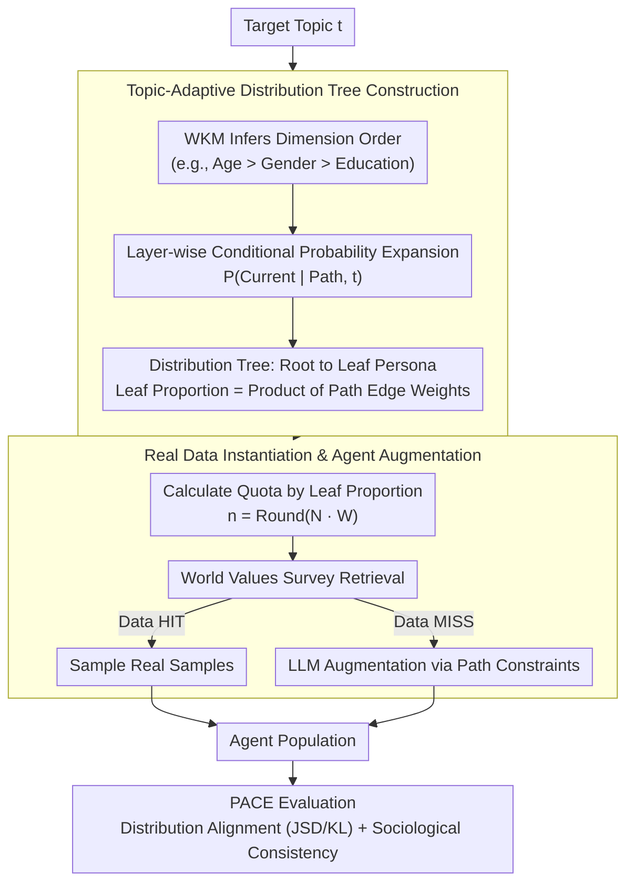

# HAG: Hierarchical Demographic Tree-based Agent Generation for Topic-Adaptive Simulation

**Conference**: ACL 2026  
**arXiv**: [2601.05656](https://arxiv.org/abs/2601.05656)  
**Code**: [https://github.com/Libra117/HAG](https://github.com/Libra117/HAG)  
**Area**: LLM Agent  
**Keywords**: Agent Generation, Population Simulation, Hierarchical Decision-making, Topic-Adaptive, Agent-Based Modeling

## TL;DR
The HAG framework is proposed to formalize group agent generation as a two-stage hierarchical decision-making process. It first utilizes a World Knowledge Model to construct a topic-adaptive population distribution tree for macro-distribution alignment, and then employs real-world data retrieval combined with agent augmentation to ensure micro-individual consistency. Across multi-domain benchmarks, HAG reduces group alignment error by an average of 37.7% and improves sociological consistency by 18.8%.

## Background & Motivation

**Background**: Agent-Based Modeling (ABM) is increasingly vital in fields such as computational social science, economic modeling, and personalized recommendation. These simulation systems rely heavily on user agents to simulate preferences and interaction behaviors. The quality of these agents directly determines the fidelity of the simulation system.

**Limitations of Prior Work**: Existing agent generation methods fall into two categories: (1) Data retrieval methods construct agent pools from real user logs but are inherently static and cannot adapt to unseen or data-scarce topics; (2) LLM-based generation methods create agent personas via pre-defined schemas or textual reasoning but lack explicit modeling of the joint distribution of multi-dimensional attributes, resulting in group distributions that do not match reality due to independent agent generation.

**Key Challenge**: No existing method simultaneously achieves "topic-adaptive group macro-distribution modeling" and "sociological plausibility of micro-individual attributes." Independently generated agents may exhibit attribute contradictions (e.g., mismatch between age and occupation), while static retrieval fails to cover new topics.

**Goal**: To design an agent population generation framework that satisfies both macro-distribution alignment and micro-individual consistency.

**Key Insight**: The authors observe that demographic structure is topic-dependent (e.g., the user distribution for technology discussions differs significantly from that of retirement topics). Thus, population generation is modeled as a hierarchical conditional probability inference problem.

**Core Idea**: A World Knowledge Model (WKM) is utilized to construct a topic-adaptive population distribution tree top-down. The joint distribution of multi-dimensional attributes is captured through hierarchical conditional probabilities. Finally, the population is generated using a combination of real-world data filling and LLM-based augmentation.

## Method

### Overall Architecture
HAG addresses two interdependent challenges: ensuring group macro-distributions are topic-adaptive while maintaining the sociological plausibility of micro-attributes. The process is modeled as a top-down hierarchical conditional probability inference: given a target topic, the WKM first infers the hierarchical order of demographic attributes and the layer-wise conditional probabilities. This produces a distribution tree branching from the topic root to complete persona leaves, where each path from root to leaf corresponds to a demographic group and its target proportion. Using these leaf proportions as quotas, instances are retrieved from the World Values Survey user database. For leaf nodes with insufficient data, LLMs are used for augmented generation under the constraints of that specific path. This workflow chains "Topic → Distribution → Individual" into an interpretable link rather than sampling each agent independently. After generation, the PACE framework is used to quantify quality via group distribution alignment and micro-sociological consistency.

### Key Designs

**1. Topic-Adaptive Distribution Tree Construction: Translating Abstract Topics into Joint Distributions**

The fundamental problem with direct LLM persona generation is independent sampling without explicit modeling of joint distributions, leading to deviations from real-world distributions. HAG uses a distribution tree to carry attribute dependencies: WKM first identifies and ranks relevant demographic dimensions based on the topic (e.g., Age > Gender > Education for technology), establishing the tree hierarchy, then expands it top-down. 

The values and edge weights of each layer are determined by the conditional probability $P(f^{(l)}=v^{(l)} \mid f^{(1:l-1)}=v^{(1:l-1)}, t)$ inferred by the WKM. Consequently, each leaf node represents a complete persona, and its target proportion is the cumulative product of edge weights along the path. Modeling via conditional probability chains ensures that real-world dependencies (e.g., Age-Occupation-Education) are explicitly characterized.

**2. Real-world Data Instantiation and Agent Augmentation: Ensuring Micro-Realism**

Once the tree is constructed, it must be instantiated without creating "Frankenstein Agents" with contradictory attributes. HAG calculates the required count $n(\mathbf{v}) = \text{Round}(N \cdot W(\mathbf{v}\mid t))$ for each leaf persona and retrieves matching real users from the World Values Survey. HIT nodes (sufficient data) sample real instances directly, while MISS nodes (insufficient data) use LLMs to generate agents constrained by the full persona path. 

This priority ensures micro-consistency is grounded in real data, with LLMs filling gaps under strict path constraints to prevent incompatible attribute combinations.

**3. PACE Evaluation Framework: Quantifying Quality via Alignment and Consistency**

Agent population generation lacked a specialized quantitative metric. PACE splits evaluation into two complementary axes: Group Alignment measures the fidelity of the generated distribution to reality using JSD/KL divergence and diversity via the Gini-Simpson index; Sociological Consistency evaluates typicality by clustering mainstream archetypes and checks internal self-consistency and contextual rationality per individual.

## Loss & Training
HAG is a training-free framework. It directly calls pre-trained LLMs as WKMs for conditional probability inference and performs retrieval and on-demand augmentation from existing databases without parameter updates.

## Key Experimental Results

### Main Results
Evaluated across three domains: Bluesky (social simulation), Amazon (product recommendation), and IMDB (movie reviews).

| Method | Bluesky JSD↓ | Bluesky KL↓ | Bluesky ArchRel↑ | Bluesky IndCon↑ |
|------|-------------|-------------|-------------------|-----------------|
| Random Select | 0.628 | 2.489 | 3.000 | 2.599 |
| Topic-Retrieval | 0.578 | 5.725 | 3.250 | 2.928 |
| LLM Generate | 0.539 | 2.487 | 3.063 | 3.197 |
| HAG-Flat | 0.401 | 2.436 | 3.750 | 3.324 |
| **HAG (Ours)** | **0.345** | **1.657** | **3.813** | **3.617** |

### Ablation Study

| Configuration | JSD↓ | KL↓ | Description |
|------|------|-----|------|
| HAG (Full) | 0.345 | 1.657 | Full model |
| HAG-Flat | 0.401 | 2.436 | Flat generation without hierarchical tree |
| LLM Generate | 0.539 | 2.487 | Direct LLM generation without tree structure |

### Key Findings
- HAG reduces group alignment error by an average of 37.7% and improves sociological consistency by 18.8% across three domains.
- The hierarchical tree structure is critical: HAG-Flat (no hierarchical conditional probability) shows a ~16% degradation in JSD compared to the full model.
- The real data retrieval + augmentation strategy effectively avoids the "Frankenstein Agent" problem (attributes contradiction).

## Highlights & Insights
- Formalizing agent population generation as a hierarchical decision process is an elegant choice, combining conditional probability chaining with tree structures to balance interpretability and quality.
- The PACE evaluation framework fills a gap in assessing agent populations, providing a systematic approach across statistical and semantic dimensions.
- Leveraging WKM for world knowledge inference of topic-related distributions avoids bottlenecks associated with manual expert design.

## Limitations & Future Work
- Tree construction depends on WKM quality; inferences may be inaccurate for extremely rare or emerging topics.
- Reliance on the World Values Survey limits cultural and geographical coverage.
- Dimension ordering affects results, but the optimality of automated ordering lacks theoretical guarantees.
- Future work could explore dynamic updates to tree structures to adapt to real-time evolving social trends.

## Related Work & Insights
- **vs LLM Generate**: Direct generation ignores group joint distributions; HAG explicitly models attribute dependencies via tree structures.
- **vs Topic-Retrieval**: Retrieval is limited by existing data coverage; HAG achieves topic adaptation via WKM inference and LLM augmentation.
- **vs WorldValuesBench**: HAG inherits its attribute system but extends it with dynamic topic-adaptive capabilities.

## Rating
- Novelty: ⭐⭐⭐⭐ The hierarchical distribution tree modeling is innovative, merging group generation with conditional probability inference.
- Experimental Thoroughness: ⭐⭐⭐⭐ Wide coverage across three domains; PACE framework is well-designed.
- Writing Quality: ⭐⭐⭐⭐ Clear structure with logical flow in problem definition and methodology.
- Value: ⭐⭐⭐⭐ Practical value for agent simulation; the evaluation framework is generalizable.
- Overall: ⭐⭐⭐⭐ Clearly defined problem, rational design, and strong experimental validation.

<!-- RELATED:START -->

## Related Papers

- [\[ACL 2026\] LiTS: A Modular Framework for LLM Tree Search](lits_a_modular_framework_for_llm_tree_search.md)
- [\[AAAI 2026\] A2Flow: Automating Agentic Workflow Generation via Self-Adaptive Abstraction Operators](../../AAAI2026/llm_agent/a2flow_automating_agentic_workflow_generation_via_self-adaptive_abstraction_oper.md)
- [\[ACL 2026\] AdaRubric: Task-Adaptive Rubrics for Reliable LLM Agent Evaluation and Reward Learning](adarubric_task-adaptive_rubrics_for_reliable_llm_agent_evaluation_and_reward_lea.md)
- [\[CVPR 2025\] ATA: Adaptive Transformation Agent for Text-Guided Subject-Position Variable Background Generation](../../CVPR2025/llm_agent/ata_adaptive_transformation_agent_for_text-guided_subject-position_variable_back.md)
- [\[ACL 2026\] OPeRA: A Dataset of Observation, Persona, Rationale, and Action for Evaluating LLMs on Human Online Shopping Behavior Simulation](opera_a_dataset_of_observation_persona_rationale_and_action_for_evaluating_llms_.md)

<!-- RELATED:END -->
