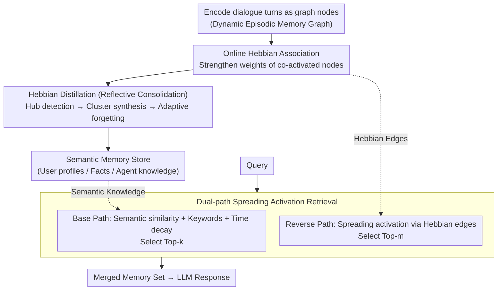

# HeLa-Mem: Hebbian Learning and Associative Memory for LLM Agents

**Conference**: ACL 2026  
**arXiv**: [2604.16839](https://arxiv.org/abs/2604.16839)  
**Code**: [GitHub](https://github.com/hela-mem)  
**Area**: LLM Agent / Memory Systems  
**Keywords**: Hebbian Learning, Associative Memory, Long-term Dialogue, Episodic-Semantic Dual-path, Spreading Activation

## TL;DR
HeLa-Mem proposes a neuroscience-inspired memory architecture for LLM agents that models conversation history as a dynamic graph with Hebbian learning dynamics. It strengthens inter-memory connections through co-activation, condenses hub memories into semantic knowledge via reflective distillation, and combines semantic similarity with Hebbian spreading activation in a dual-path retrieval process, achieving state-of-the-art performance on LoCoMo with significantly fewer tokens.

## Background & Motivation

**Background**: Long-term memory in LLM agents is a critical challenge, as fixed context windows cannot maintain coherence across extended interactions. Existing memory systems typically represent conversation history as unstructured embedding vectors and retrieve information based on semantic similarity.

**Limitations of Prior Work**: (1) Embedding-based retrieval fails to capture the associative structure inherent in human memory, where related experiences strengthen connections through repeated co-activation; (2) existing methods optimize single dimensions (structure, retrieval, or updates) in isolation, ignoring their interactions; (3) more fundamentally, the dynamic evolution of memory is overlooked, as current systems treat storage and retrieval as independent static processes, failing to capture the continuous reorganization of connectivity between memories.

**Key Challenge**: Semantic similarity only captures surface-level associations. However, associations in human memory are deeper; a topic discussed today may trigger a memory from a month ago not due to keyword similarity, but because they belong to the same evolving narrative.

**Goal**: To build an LLM agent memory architecture that simulates three biological mechanisms: association, consolidation, and spreading activation.

**Key Insight**: Drawing on Hebbian learning principles ("neurons that fire together, wire together") and the dual-system theory of episodic and semantic memory.

**Core Idea**: Representing episodic memory as a dynamic graph driven by Hebbian learning dynamics + producing semantic memory through reflective distillation + retrieval via dual-path spreading activation.

## Method

### Overall Architecture
HeLa-Mem constructs a dynamic graph of conversation history with Hebbian learning dynamics, allowing memories to continuously reorganize their connections during use, similar to the biological brain. The system follows a three-module cognitive cycle: the online encoding and association phase encodes each dialogue turn into graph nodes, strengthening edge weights between co-activated nodes using Hebbian rules; the reflective consolidation phase periodically detects high-connectivity hub nodes, distilling dense memory clusters into structured semantic knowledge while forgetting low-weight, stale nodes; the dual-path retrieval phase simultaneously utilizes semantic similarity (base path) and spreading activation along strong Hebbian edges (reverse path) to merge into the final memory set. This couples storage and retrieval through the same graph dynamics—"memories recalled together are linked more tightly"—thereby capturing associative structures invisible to pure embedding retrieval.

### Key Designs

**1. Online Hebbian Association: Growing associations invisible to semantics**

Embedding similarity only captures surface correlations. In contrast, human "associations" (e.g., today's topic reminding one of something from a month ago) often result from repeated co-activation within the same narrative. HeLa-Mem implements this via an edge weight update rule: $w_{ij}^{(t+1)} = (1-\lambda)\cdot w_{ij}^{(t)} + \eta\cdot\mathbb{I}(v_i, v_j \in \mathcal{K}_t)$, where $\mathbb{I}$ indicates if two nodes are co-activated in the current retrieval set $\mathcal{K}_t$, $\eta$ is the learning rate for reinforcement, and $\lambda$ is synaptic decay that allows unused connections to fade. This allows episodic memories to build strong connections over time, providing the physical basis for retrieval to "jump" to semantically distant but associated memories.

**2. Hebbian Distillation (Reflective Consolidation): Abstracting frequent clusters into stable knowledge**

A dynamic graph that only grows would expand infinitely and accumulate noise. HeLa-Mem introduces a reflection agent: when the cumulative edge weight of a node $D(v_i)=\sum_{j\in\mathcal{N}(i)} w_{ij}$ exceeds a hub threshold $\delta_{hub}$, it signifies a repeatedly activated memory hub. The system then retrieves this hub and its strong neighbors, using an LLM to synthesize the cluster into structured semantic knowledge (user profiles, factual memory, agent knowledge) stored in a semantic memory pool. Simultaneously, adaptive forgetting is applied to low-weight nodes. This mimics the consolidation process between episodic and semantic systems.

**3. Dual-path Spreading Activation Retrieval: Retrieving semantic and associative neighbors**

Retrieval solely based on semantic similarity misses "semantically distant but highly associated" memories. HeLa-Mem first calculates base activation $S_{base}(v_i)=(\text{sim}(\mathbf{q}, \mathbf{e}_i)+\alpha\cdot\text{keyword})\cdot\gamma(v_i)$, combining semantic similarity, keyword matching, and time decay $\gamma$. It then performs spreading activation: $S(v_j)=S_{base}(v_j)+\beta\sum_{i\in\mathcal{N}(j)} S_{base}(v_i)\cdot w_{ij}$, allowing high-scoring nodes to pass activation to neighbors via strong Hebbian edges. The final set is a union of the base path Top-k and reverse path Top-m, the latter specifically capturing nodes that only emerge through spreading.

### Loss & Training
HeLa-Mem is training-free. Parameters such as $\eta$, $\lambda$, $\beta$, and $\tau$ are hyperparameters. Hebbian learning occurs online during retrieval, updating weights instantly without gradient optimization.

## Key Experimental Results

### Main Results (LoCoMo Benchmark)

| Method | Multi-hop F1 | Temporal F1 | Open-domain F1 | Single-hop F1 | Tokens ↓ |
|--------|--------------|-------------|----------------|---------------|----------|
| MemGPT | -            | -           | -              | -             | High     |
| A-Mem  | -            | -           | -              | -             | Med      |
| **Ours** | **SOTA**     | **SOTA**    | **SOTA**       | **SOTA**      | **Min**  |

### Ablation Study

| Configuration | Description |
|---------------|-------------|
| w/o Hebbian Learning | Degrades to pure semantic retrieval; significant drop in multi-hop performance. |
| w/o Reflective Distillation | Graph expands indefinitely; increased retrieval noise. |
| w/o Spreading Activation | Base path only; fails to discover associative memories. |

### Key Findings
- HeLa-Mem achieves SOTA across all four question categories while using significantly fewer tokens (positioned in the ideal "top-left" of the performance-efficiency trade-off).
- Spreading activation contributes most to multi-hop reasoning, justifying the value of latent associations captured by Hebbian learning.
- Average rank of 1.25 across categories, showing consistent superiority across four different LLM backbones.

## Highlights & Insights
- **Unified modeling of biological memory mechanisms** (association + consolidation + spreading activation) provides an elegant cognitive science perspective.
- The "Hub detection → Cluster synthesis → Semantic knowledge" pipeline in Hebbian distillation effectively simulates human memory consolidation.
- Token efficiency gains suggest that precise retrieval (rather than more retrieval) is the key to effective long-term memory.

## Limitations & Future Work
- Hyperparameters ($\eta, \lambda, \delta_{hub}$, etc.) require manual adjustment and may be sensitive to different scenarios.
- Evaluation is limited to the LoCoMo benchmark; verification in broader long-term dialogue scenarios is needed.
- Computational overhead of graph operations increases with dialogue length.

## Related Work & Insights
- **vs A-Mem**: A-Mem uses a Zettelkasten-style notebook network, whereas HeLa-Mem uses a dynamic graph driven by Hebbian dynamics, where connections are "learned" from interaction.
- **vs Mem0/MemGPT**: These methods optimize single dimensions separately; HeLa-Mem unifies association, consolidation, and retrieval.
- **vs APEX-MEM**: APEX-MEM uses attribute graphs with append-only storage, while HeLa-Mem evolves graph structure through Hebbian learning.

## Rating
- **Novelty**: ⭐⭐⭐⭐⭐ First introduction of Hebbian-learning-driven memory architecture for LLM agents.
- **Experimental Thoroughness**: ⭐⭐⭐⭐ Four backbones + four categories + ablation, though limited to a single benchmark.
- **Writing Quality**: ⭐⭐⭐⭐⭐ Clear cognitive science motivation and systematic architectural description.
- **Value**: ⭐⭐⭐⭐⭐ Provides a new bio-inspired paradigm for LLM long-term memory.

<!-- RELATED:START -->

## Related Papers

- [\[ACL 2026\] Mem^p: Exploring Agent Procedural Memory](memp_exploring_agent_procedural_memory.md)
- [\[NeurIPS 2025\] A-MEM: Agentic Memory for LLM Agents](../../NeurIPS2025/llm_agent/a-mem_agentic_memory_for_llm_agents.md)
- [\[ACL 2026\] AnchorMem: Anchored Facts with Associative Contexts for Building Memory in Large Language Models](anchormem_anchored_facts_with_associative_contexts_for_building_memory_in_large_.md)
- [\[ACL 2026\] Mem²Evolve: Towards Self-Evolving Agents via Co-Evolutionary Capability Expansion and Experience Distillation](mem2evolve_towards_self-evolving_agents_via_co-evolutionary_capability_expansion.md)
- [\[ACL 2026\] Hierarchical Reinforcement Learning with Augmented Step-Level Transitions for LLM Agents](hierarchical_reinforcement_learning_with_augmented_step-level_transitions_for_ll.md)

<!-- RELATED:END -->
