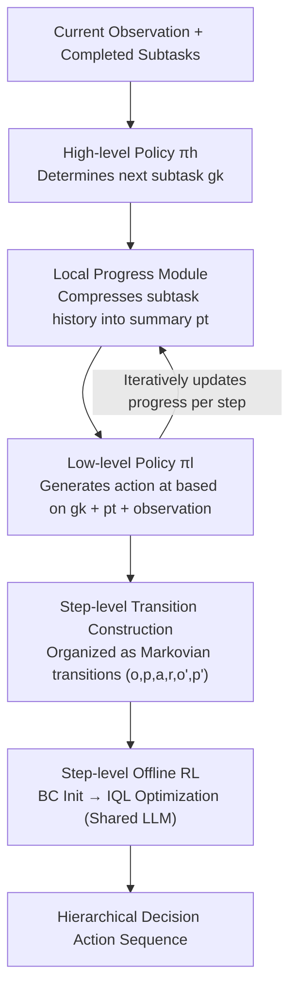

# Hierarchical Reinforcement Learning with Augmented Step-Level Transitions for LLM Agents

**Conference**: ACL 2026  
**arXiv**: [2604.05808](https://arxiv.org/abs/2604.05808)  
**Code**: [GitHub](https://github.com/TonyStark042/STEP-HRL)  
**Area**: LLM Agent / Hierarchical Reinforcement Learning  
**Keywords**: Hierarchical Reinforcement Learning, Step-Level Transition, Local Progress, Token Efficiency, Offline RL

## TL;DR

Ours proposes STEP-HRL, which introduces a Local Progress module to iteratively compress interaction history into compact text summaries. This enables high-level and low-level policies to make decisions based only on step-level transitions (rather than the full history), significantly improving performance and generalization on ScienceWorld and ALFWorld while reducing token usage.

## Background & Motivation

**Background**: LLM agents have demonstrated powerful capabilities in interactive decision-making tasks. RL provides a principled mechanism for improving agents by optimizing policies via environment interaction and reward feedback. Existing LLM agents commonly adopt a "history-conditioned" paradigm—where policies are conditioned on increasingly long historical sequences.

**Limitations of Prior Work**: (1) The quadratic complexity of attention mechanisms makes inference costs high for long histories; (2) Unfiltered history accumulates redundant or irrelevant information, which may obscure critical decision signals; (3) Although existing HRL methods introduce temporal abstraction, both high-level and low-level policies still condition on cumulative history, inheriting the long-context dependency issue.

**Key Challenge**: Long-history conditioning is a modeling choice rather than a necessity for RL—conflating long-term decision-making with long context introduces unnecessary computational burden and inference noise.

**Goal**: Design a progress-based rather than history-based HRL framework, enabling policies to make decisions based solely on step-level transitions.

**Key Insight**: The sequence of completed subtasks naturally forms a compact summary of global progress; the remaining challenge is how to compactly represent the local interaction history within each subtask.

**Core Idea**: Introduce a local progress policy $\pi_\theta^p$ to iteratively compress the interaction history within a subtask into a compact text representation. The low-level policy then conditions only on the current subtask + local progress + current observation, eliminating reliance on the complete history.

## Method

### Overall Architecture

The core problem STEP-HRL addresses is allowing LLM agents to make hierarchical decisions in long-range interactions without the burden of an "ever-growing history." It decomposes decision-making into three policies sharing the same LLM parameters: the high-level policy $\pi_\theta^h$ observes the current observation and completed subtasks to decide the next subtask; the low-level policy $\pi_\theta^l$ generates primitive actions step-by-step within the subtask; and the local progress policy $\pi_\theta^p$, sandwiched between them, re-compresses the intra-subtask history into a compact text summary at each step to serve as context for the low-level policy. Consequently, no part of the chain from observation to action requires looking back at the full history; all decisions rely on constant-sized "step-level transitions." The system is initialized via Behavior Cloning and further refined using step-level offline RL.

### Key Designs

**1. Local Progress Module: Iterative Compression instead of History Accumulation**

The interaction history within a subtask expands over time, making it expensive and noisy for policies. The local progress policy replaces "accumulation" with "compression": at each step, it generates a fixed-size summary $p_t^k \sim \pi_\theta^p(\cdot \mid g_k, a_{t-1}^k, o_t^k, p_{t-1}^k)$ based on the previous progress, the last action, and the current observation. The initial progress is empty $p_0^k = \varnothing$.

This is fundamentally different from simple history truncation—truncation mechanically discards old content, whereas local progress is **selective**: it retains only information truly relevant to the current subtask, actively filtering out redundancy and noise. This step is equivalent to inserting an information bottleneck within each subtask, compressing long-context dependencies into a compact state variable.

**2. Step-Level Transition Construction: Making Every Decision Markovian**

With local progress as a compact state, the entire trajectory can be reorganized into a sequence of fixed-length "step-level transitions." Low-level transitions are defined as $(o_t^k, p_t^k, a_t^k, \hat{r}_t^k, o_{t+1}^k, p_{t+1}^k)$, and high-level transitions as $(\hat{p}_{k-1}, o_0^k, g_k, R_k, \hat{p}_k, o_0^{k+1})$, where $\hat{p}_k$ is the final local progress at the end of subtask $g_k$, serving as the global progress summary across subtasks.

Crucially, these transitions are Markovian—decisions depend only on constant-sized variables within the current transition, without recoiling into the full history. This decouples "long-term decision-making" from "long context" and provides training samples with clear state definitions and stable value estimation for offline RL.

**3. Step-Level Offline RL: Discovery Beyond Imitation**

Behavior cloning (BC) only mimics experts, restricted by the data itself. After BC initialization, STEP-HRL performs a round of offline RL based on Implicit Q-Learning (IQL). The three policies continue to share the LLM backbone but are assigned independent critics ($V$ and $Q$ at the utterance level). Expectile regression is used to learn value functions, and advantage-weighted regression optimizes the policies. The low-level uses intrinsic rewards (1 for subtask completion), while the high-level uses external environment rewards.

Because trajectories are organized into Markovian transitions, value estimation does not need to propagate through long histories, making optimization more stable and efficient, allowing the model to search for policies that surpass expert demonstrations.

### Loss & Training

The BC phase uses an autoregressive cross-entropy loss to align with expert demonstrations. The offline RL phase jointly optimizes three components: the TD regression loss for the Q-function, the expectile loss for the value function, and the advantage-weighted loss for the policy. Sharing LLM parameters across the three policies reduces training and inference overhead while facilitating cross-level knowledge transfer between planning, execution, and compression.

## Key Experimental Results

### Main Results

**ScienceWorld (30 Science Task Families)**

| Method | Total Score | Token Usage | Generalization (Unseen) |
|------|------|-----------|-----------------|
| ReAct | 32.1 | High | Low |
| GLIDER (HRL) | 48.2 | High | Medium |
| STEP-HRL (BC only) | 52.7 | **Low** | Medium |
| **STEP-HRL (BC + RL)** | **57.3** | **Low** | **High** |

### Ablation Study

| Configuration | ScienceWorld | ALFWorld |
|------|------------|---------|
| No Local Progress (Full History) | 44.8 | 62.3 |
| Fixed Window Truncation | 47.2 | 65.1 |
| **Local Progress (STEP-HRL)** | **57.3** | **78.4** |

### Key Findings

- STEP-HRL in the BC phase already outperforms existing HRL baselines (52.7 vs 48.2), validating the effectiveness of step-level transitions.
- Offline RL provides a further 4.6 percentage point improvement, proving that step-level transitions make RL optimization more efficient.
- The Local Progress module improves performance by 10.1 percentage points over fixed window truncation—selective information retention is significantly superior to simple truncation.
- Parameter sharing among the three policies reduces overhead while promoting cross-level knowledge transfer.

## Highlights & Insights

- The core insight "Long-term decision-making $\neq$ long context" is profound—step-level transitions demonstrate that information compression can replace history accumulation.
- Local progress acts as an information bottleneck, naturally achieving attention focusing and noise filtering.
- The shared-parameter design for the three policies achieves a strong balance between efficiency and performance.

## Limitations & Future Work

- The quality of local progress depends on the LLM's summarization capability—weaker LLMs might generate low-quality progress.
- Subtask decomposition and progress labeling for expert demonstrations were generated by DeepSeek, potentially inheriting its biases.
- Evaluation was limited to text-based environments (ScienceWorld, ALFWorld); applicability to visual or multimodal environments remains unknown.
- Offline RL is constrained by the quality and diversity of the collected data.

## Related Work & Insights

- **vs GLIDER**: GLIDER uses HRL but still conditions on full history; STEP-HRL eliminates history dependence via local progress.
- **vs ReAct**: ReAct interleaves reasoning and acting but lacks a hierarchical structure; STEP-HRL adds hierarchical abstraction and step-level optimization.
- **vs Decision Transformer**: DT treats decision-making as sequence prediction requiring full trajectories; STEP-HRL requires only step-level transitions.

## Rating

- Novelty: ⭐⭐⭐⭐ The design of step-level transitions + local progress in HRL is novel and sound.
- Experimental Thoroughness: ⭐⭐⭐⭐ Two benchmarks + detailed ablations + token analysis + generalization evaluation.
- Writing Quality: ⭐⭐⭐⭐⭐ Problem definition is clear, and methodological derivation is complete.
- Value: ⭐⭐⭐⭐ Provides a more efficient framework for long-term decision-making in LLM agents.

<!-- RELATED:START -->

## Related Papers

- [\[AAAI 2026\] MoralReason: Generalizable Moral Decision Alignment For LLM Agents Using Reasoning-Level Reinforcement Learning](../../AAAI2026/llm_agent/moralreason_generalizable_moral_decision_alignment_for_llm_agents_using_reasonin.md)
- [\[ACL 2026\] Verified Critical Step Optimization for LLM Agents](verified_critical_step_optimization_for_llm_agents.md)
- [\[ACL 2026\] Temp-R1: A Unified Autonomous Agent for Complex Temporal KGQA via Reverse Curriculum Reinforcement Learning](temp-r1_a_unified_autonomous_agent_for_complex_temporal_kgqa_via_reverse_curricu.md)
- [\[ICLR 2026\] Reducing Belief Deviation in Reinforcement Learning for Active Reasoning of LLM Agents](../../ICLR2026/llm_agent/reducing_belief_deviation_in_reinforcement_learning_for_active_reasoning.md)
- [\[ICML 2026\] On Information Self-Locking in Reinforcement Learning for Active Reasoning of LLM Agents](../../ICML2026/llm_agent/on_information_self-locking_in_reinforcement_learning_for_active_reasoning_of_ll.md)

<!-- RELATED:END -->
