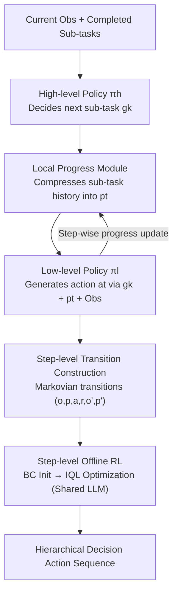

# Hierarchical Reinforcement Learning with Augmented Step-Level Transitions for LLM Agents

**Conference**: ACL 2026  
**arXiv**: [2604.05808](https://arxiv.org/abs/2604.05808)  
**Code**: [GitHub](https://github.com/TonyStark042/STEP-HRL)  
**Area**: LLM Agent / Hierarchical Reinforcement Learning  
**Keywords**: Hierarchical Reinforcement Learning, Step-Level Transitions, Local Progress, Token Efficiency, Offline RL

## TL;DR

Ours proposes STEP-HRL, which iteratively condenses interaction histories into compact text summaries through a local progress module. This allows high-level and low-level policies to make decisions based only on step-level transitions rather than full histories, significantly improving performance and generalization on ScienceWorld and ALFWorld while reducing token consumption.

## Background & Motivation

**Background**: LLM agents exhibit strong capabilities in interactive decision-making tasks. RL provides a principled mechanism for enhancing agents by optimizing policies through environment interaction and reward feedback. Existing LLM agents commonly adopt a "history-conditioned" paradigm, where policies are conditioned on increasingly long historical sequences.

**Limitations of Prior Work**: (1) The quadratic complexity of attention mechanisms makes inference with long histories expensive; (2) Unfiltered history accumulates redundant or irrelevant information, which may obscure critical decision signals; (3) Existing HRL methods introduce temporal abstraction, but both high-level and low-level policies still condition on cumulative history, inheriting the long-context dependency issue.

**Key Challenge**: History-conditioning is a modeling choice rather than an RL necessity. Conflating long-term decision-making with long context introduces unnecessary computational burden and inference noise.

**Goal**: Design a progress-based rather than history-based HRL framework, enabling policies to make decisions based solely on step-level transitions.

**Key Insight**: Sequences of completed sub-tasks naturally form a compact summary of global progress; the remaining challenge is how to compactly represent the local interaction history within each sub-task.

**Core Idea**: A local progress policy $\pi_\theta^p$ is introduced to iteratively compress the interaction history within a sub-task into a compact text representation. The low-level policy is then conditioned only on the current sub-task, local progress, and current observation, eliminating dependence on the full history.

## Method

### Overall Architecture

The core problem STEP-HRL addresses is enabling LLM agents to perform hierarchical decision-making in long-range interactions without the burden of an ever-growing history. The framework decomposes decision-making into three policies that share the same LLM parameters: the high-level policy $\pi_\theta^h$ observes the current observation and completed sub-tasks to decide the next sub-task; the low-level policy $\pi_\theta^l$ generates primitive actions step-by-step; and the intermediary local progress policy $\pi_\theta^p$ re-compresses the intra-sub-task history into a compact summary at each step. None of the modules in the chain from observation to action require looking back at the full history; all decisions depend on constant-sized "step-level transitions." The system is initialized with Behavior Cloning (BC) and further refined using step-level offline RL.

### Key Designs

**1. Local Progress Module: Iterative Compression instead of History Accumulation**

Intra-sub-task interaction history expands with step count, making it expensive and noisy for policies. The local progress policy replaces "accumulation" with "compression": at each step, it re-generates a fixed-size summary $p_t^k \sim \pi_\theta^p(\cdot \mid g_k, a_{t-1}^k, o_t^k, p_{t-1}^k)$ based on the previous progress, the last action, and the current observation, with initial progress $p_0^k = \varnothing$. 

Unlike simple history truncation, local progress is **selective**, retaining only information truly relevant to the sub-task. This effectively inserts an information bottleneck within each sub-task, compressing long-context dependencies into a compact state variable and resolving issues related to attention complexity and noise.

**2. Step-Level Transition Construction: Making Every Decision Markovian**

With local progress as a compact state, the trajectory can be reorganized into a series of constant-length "step-level transitions." Low-level transitions are structured as $(o_t^k, p_t^k, a_t^k, \hat{r}_t^k, o_{t+1}^k, p_{t+1}^k)$, and high-level transitions as $(\hat{p}_{k-1}, o_0^k, g_k, R_k, \hat{p}_k, o_0^{k+1})$, where $\hat{p}_k$ is the final local progress of sub-task $g_k$, serving as a global progress summary across sub-tasks.

Crucially, these transitions are Markovian. Decision-making only requires viewing a few constant-sized variables within the current transition, with no need to backtrack through the full history. This decouples long-term decision-making from long context and provides training samples with clear state definitions and stable value estimates for offline RL.

**3. Step-Level Offline RL: Discovering Superior Policies Beyond Imitation**

Behavior Cloning (BC) is capped by the quality of the expert data. STEP-HRL follows BC initialization with a round of offline RL based on Implicit Q-Learning (IQL). While the three policies share the LLM backbone, they each utilize independent critics ($V$ and $Q$ at the utterance level). Value functions are learned via expectile regression, and policies are optimized using advantage-weighted regression. Low-level policies use intrinsic rewards (sub-task completion), while high-level policies use external environment rewards. 

Because the trajectories are organized into Markovian step-level transitions, value estimates do not need to propagate over long histories, making optimization more stable and efficient, allowing the agent to discover policies that surpass expert demonstrations.

### Loss & Training

The BC phase utilizes an autoregressive cross-entropy loss to align with expert demonstrations. The offline RL phase jointly optimizes three components: the TD regression loss for the Q-function, the expectile loss for the value function, and the advantage-weighted loss for the policy. Sharing LLM parameters across all three policies compresses training and inference overhead while facilitating cross-level knowledge transfer between high-level planning, low-level execution, and progress compression.

## Key Experimental Results

### Main Results

**ScienceWorld (30 Scientific Task Families)**

| Method | Total Score | Token Usage | Gen. (Unseen) |
|------|------|-----------|-----------------|
| ReAct | 32.1 | High | Low |
| GLIDER (HRL) | 48.2 | High | Mid |
| STEP-HRL (BC only) | 52.7 | **Low** | Mid |
| **STEP-HRL (BC + RL)** | **57.3** | **Low** | **High** |

### Ablation Study

| Configuration | ScienceWorld | ALFWorld |
|------|------------|---------|
| No Local Progress (Full History) | 44.8 | 62.3 |
| Fixed Window Truncation | 47.2 | 65.1 |
| **Local Progress (STEP-HRL)** | **57.3** | **78.4** |

### Key Findings

- STEP-HRL at the BC-only stage already outperforms existing HRL baselines (52.7 vs 48.2), validating the effectiveness of step-level transitions.
- Offline RL further improves performance by 4.6 percentage points, proving that step-level transitions enable more efficient RL optimization.
- The local progress module outperforms fixed-window truncation by 10.1 percentage points, showing that selective information retention is superior to simple truncation.
- Parameter sharing across the three policies reduces overhead while promoting cross-level knowledge transfer.

## Highlights & Insights

- The insight that "Long-term Decision $\neq$ Long Context" is profound; step-level transitions demonstrate that information compression can replace history accumulation.
- Local progress acts as an information bottleneck, naturally achieving attention focus and noise filtering.
- The shared-parameter design for the three policies strikes a balance between efficiency and performance.

## Limitations & Future Work

- The quality of local progress depends on the LLM's summarization capability; weaker LLMs may produce low-quality progress summaries.
- Sub-task decomposition and progress labeling for expert demonstrations were generated by DeepSeek, potentially inheriting its biases.
- Validation is limited to text-based environments (ScienceWorld, ALFWorld); applicability to visual or multimodal environments is unknown.
- Offline RL is constrained by the quality and diversity of the collected data.

## Related Work & Insights

- **vs GLIDER**: GLIDER uses HRL but remains conditioned on full history; STEP-HRL eliminates history dependency via local progress.
- **vs ReAct**: ReAct interleaves reasoning and acting but lacks a hierarchical structure; STEP-HRL adds hierarchical abstraction and step-level optimization.
- **vs Decision Transformer**: DT treats decision-making as sequence prediction requiring full trajectories; STEP-HRL requires only step-level transitions.

## Rating

- Novelty: ⭐⭐⭐⭐ The HRL design combining step-level transitions and local progress is novel and sound.
- Experimental Thoroughness: ⭐⭐⭐⭐ Two benchmarks, detailed ablations, token analysis, and generalization evaluations.
- Writing Quality: ⭐⭐⭐⭐⭐ Clear problem definition and complete methodological derivation.
- Value: ⭐⭐⭐⭐ Provides a more efficient framework for long-term decision-making in LLM agents.

<!-- RELATED:START -->

## Related Papers

- [\[AAAI 2026\] MoralReason: Generalizable Moral Decision Alignment For LLM Agents Using Reasoning-Level Reinforcement Learning](../../AAAI2026/llm_agent/moralreason_generalizable_moral_decision_alignment_for_llm_agents_using_reasonin.md)
- [\[ACL 2026\] Verified Critical Step Optimization for LLM Agents](verified_critical_step_optimization_for_llm_agents.md)
- [\[ACL 2026\] Temp-R1: A Unified Autonomous Agent for Complex Temporal KGQA via Reverse Curriculum Reinforcement Learning](temp-r1_a_unified_autonomous_agent_for_complex_temporal_kgqa_via_reverse_curricu.md)
- [\[ACL 2026\] HeLa-Mem: Hebbian Learning and Associative Memory for LLM Agents](hela-mem_hebbian_learning_and_associative_memory_for_llm_agents.md)
- [\[ICLR 2026\] Reducing Belief Deviation in Reinforcement Learning for Active Reasoning of LLM Agents](../../ICLR2026/llm_agent/reducing_belief_deviation_in_reinforcement_learning_for_active_reasoning.md)

<!-- RELATED:END -->
