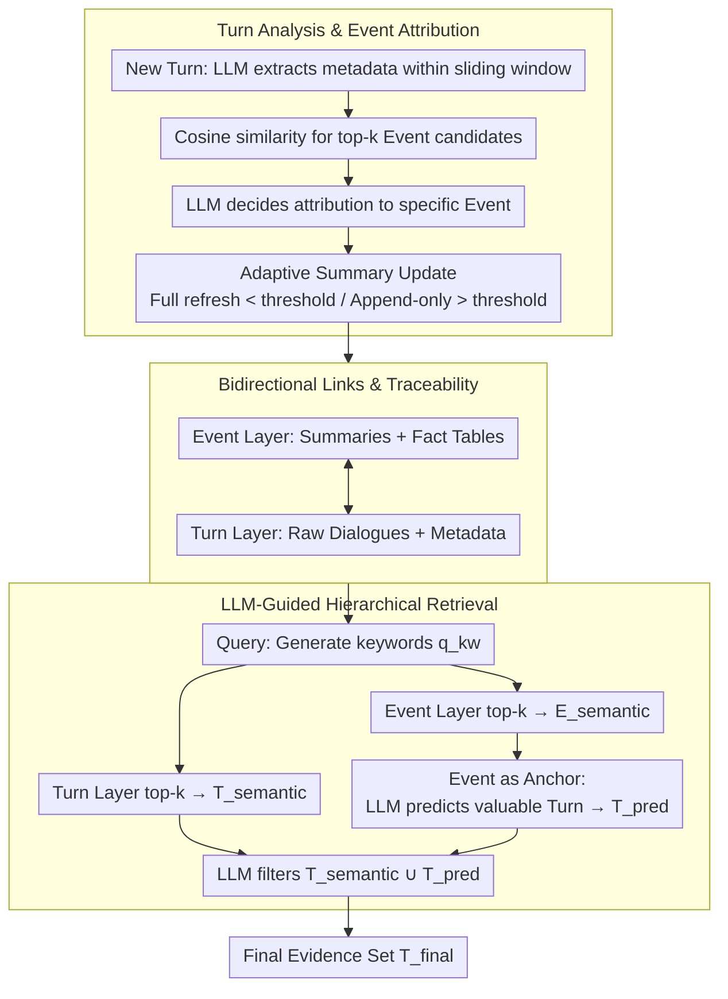

# HiGMem: A Hierarchical and LLM-Guided Memory System for Long-Term Conversational Agents

**Conference**: ACL 2026 Findings  
**arXiv**: [2604.18349](https://arxiv.org/abs/2604.18349)  
**Code**: [https://github.com/ZeroLoss-Lab/HiGMem](https://github.com/ZeroLoss-Lab/HiGMem)  
**Area**: LLM Evaluation  
**Keywords**: Long-term conversational memory, hierarchical memory system, LLM-guided retrieval, evidence streamlining, event-turn architecture

## TL;DR
This paper proposes HiGMem, a two-layer event-turn memory system. By enabling the LLM to browse event summaries first before predicting which fine-grained dialogue turns are worth reading, it achieves state-of-the-art F1 scores in four out of five categories on the LoCoMo10 benchmark with an order of magnitude lower retrieval volume.

## Background & Motivation

**Background**: LLM agents require memory systems to recover relevant evidence from historical interactions during long-term conversations. Existing systems like MemGPT and A-Mem extend long-range interaction capabilities through external memory storage and vector similarity retrieval.

**Limitations of Prior Work**: Existing memory systems (including hierarchical ones) still primarily rely on vector similarity for retrieval. This approach tends to produce "bloated evidence sets"—once the most relevant memories are recalled, continuing to add surface-similar segments yields diminishing returns while eroding retrieval precision, inflating downstream context, and making the evidence set difficult to inspect and manage.

**Key Challenge**: Vector similarity itself cannot determine whether a memory is "truly worth reading." It lacks the capability to reason across different levels of abstraction and cannot actively assess which fine-grained details contribute meaningfully to answering a query.

**Goal**: To develop a retrieval strategy that maintains high recall, high precision, and controllable token overhead, delivering compact and high-fidelity evidence sets.

**Key Insight**: Mimic the human way of processing information—skim high-level summaries to determine relevant topics, then dive deep into specific details. Let the LLM act as an "information gatekeeper," using event summaries as semantic anchors to reason about which underlying dialogue turns merit detailed reading.

**Core Idea**: Organize memory using a two-layer event-turn architecture. The LLM first retrieves event summaries as semantic anchors and then predicts which associated dialogue turns are worth reading. This replaces brute-force vector retrieval with reasoning to obtain a streamlined and reliable evidence set.

## Method

### Overall Architecture

HiGMem aims to solve the "dirty evidence set" problem in long-term conversations: pure vector similarity continuously incorporates surface-similar but useless dialogue turns, diluting precision. The solution is to mimic human reading habits—skim summaries to lock onto relevant topics, then drill down into details. To this end, the system organizes memory into two layers: the bottom is the Turn Layer, storing raw dialogues and LLM-extracted metadata (keywords, tags, timestamps, context) turn by turn; the top is the Event Layer, grouping related dialogue turns into coherent narrative units accompanied by summaries and structured fact tables. Bidirectional links between the layers ensure traceability. For a query, the system retrieves candidates from both layers, then lets the LLM use event summaries as semantic anchors to reason which underlying turns are truly worth reading, finally delivering a compact, high-precision evidence set.

### Key Designs

**1. Turn Analysis and Event Attribution: Linking memory during conversation**

When a new dialogue turn $D_t$ arrives, the system uses the context within a sliding window $\mathcal{W}_t$ to let the LLM extract metadata like keywords and tags, forming a Turn node. Subsequently, the cosine similarity between its embedding and all event nodes is calculated, and the top-$k_{\text{event}}$ candidates are passed to the LLM to decide which event the turn should belong to.

The adaptive update strategy is a clever design: when the number of Turns attached to an event is below a threshold $\tau=10$, the event summary is fully refreshed to ensure quality; once the event grows larger, it switches to append-only updates. This keeps memory up-to-date while resolving the conflict between summary quality and computational cost as scale increases.

**2. Bidirectional Links and Traceability: Structural foundation for hierarchical retrieval**

Each Event node maintains a link set $\mathcal{L}_E$, recording indices of all attributed Turn nodes. When a new Turn is assigned, it is updated via $\mathcal{L}_E = \mathcal{L}_E \cup \{l\}$.

These links provide the structural foundation for hierarchical retrieval: they enable both "drilling down from event to turn" and "tracing up from turn to event." This allows the Event Layer to act as a semantic gateway to fine-grained evidence rather than just an isolated summary.

**3. LLM-Guided Hierarchical Retrieval: Reasoning over brute-force retrieval**

This is the core of HiGMem. For a query $Q$, keywords $q_{\text{kw}}$ are generated, followed by a dual-path process: $k_{\text{turn}}=10$ semantically related Turn nodes are retrieved to form $\mathcal{T}_{\text{semantic}}$, and $k_{\text{event}}=10$ related Event nodes are retrieved to form $\mathcal{E}_{\text{semantic}}$. Using Event nodes as semantic anchors, the LLM evaluates the Turns linked to these events individually to predict which are worth reading, resulting in $\mathcal{T}_{\text{pred}}$. Finally, the LLM filters the merged set $\mathcal{T}_{\text{semantic}} \cup \mathcal{T}_{\text{pred}}$ to output the final evidence set $\mathcal{T}_{\text{final}}$.

The weakness of pure vector retrieval is that it only returns "surface-similar" results and cannot judge if a turn "actually answers the question." Event summaries provide a low-cost semantic overview, allowing the LLM to make precise selections without reading every memory—this is key to reducing retrieval volume by an order of magnitude without compromising recall.

### Loss & Training

HiGMem does not involve end-to-end training. All LLM calls use GPT-4o-mini, and embeddings use all-MiniLM-L6-v2. Reasoning at each stage is implemented through prompt engineering.

## Key Experimental Results

### Main Results
F1 scores across five question categories on the LoCoMo10 benchmark (average 587 turns/dialogue):

| Method | Multi-Hop | Temporal | Open-Domain | Single-Hop | Adversarial | Avg Rank |
|------|-----------|----------|-------------|------------|-------------|---------|
| Base LLM | 0.25 | 0.39 | 0.12 | 0.44 | 0.30 | 2.2 |
| A-Mem | 0.27 | **0.39** | 0.10 | 0.42 | 0.54 | 2.2 |
| **Ours** | **0.31** | 0.34 | **0.15** | **0.49** | **0.78** | **1.2** |

### Ablation Study

| Configuration | F1 | Recall@K |
|------|-----|----------|
| w/o Hierarchy (No Event Layer) | 0.39 | 0.55 |
| HiGMem (Full) | **0.49** | **0.72** |

Retrieval Efficiency Comparison:

| Method | Avg Retrieved Turns | Precision@K | Recall@K |
|------|------------|-------------|----------|
| A-Mem | 99.84 | 0.0101 | 0.7502 |
| Ours | **8.09** | **0.1909** | 0.7241 |

### Key Findings
- HiGMem's retrieval volume is only 1/12 of A-Mem's, yet recall remains nearly the same (0.72 vs 0.75), and precision improves by nearly 19x.
- On adversarial questions, F1 increased from 0.54 to 0.78, indicating that a streamlined evidence set effectively reduces interference from misleading information.
- Performance on temporal questions was slightly lower than A-Mem, suggesting that current event-level abstractions might weaken certain fine-grained temporal clues.
- In hybrid deployment (GPT-4o-mini for memory + GPT-5 for answers), total cost dropped from $17.43 to $6.43, a reduction of approximately 2.7x.

## Highlights & Insights
- The hierarchical retrieval paradigm of "check the summary before deciding to check details" aligns with human information processing intuition. This approach can be transferred to RAG, document QA, and other scenarios requiring evidence filtering from large candidate sets.
- Improving retrieval precision by 19x while maintaining recall proves that "less is more"—a large amount of low-relevance memory is not just useless but harmful.
- The significant boost in adversarial questions shows that compact evidence sets help LLMs resist distractor information.

## Limitations & Future Work
- The memory construction phase requires additional LLM calls, increasing time and token overhead (15.59s per turn vs. 6.38s for A-Mem).
- System effectiveness depends on the LLM's ability to infer relevance from event summaries and candidate turns.
- Performance on temporal issues is insufficient, indicating that event-level abstraction may lose fine-grained time-dimension information.
- Currently only validated on the LoCoMo10 benchmark; robustness needs to be evaluated in more scenarios like multi-party or noisy dialogues.

## Related Work & Insights
- **vs A-Mem**: A-Mem uses vector retrieval to return ~100 turns with very low precision (1%); HiGMem uses LLM guidance to reduce the volume to 8 turns, improving precision to 19% with better F1.
- **vs RAPTOR**: RAPTOR uses recursive summarization for multi-granularity retrieval but lacks an active LLM reasoning/filtering stage; HiGMem's Event Layer is similar to RAPTOR's summary layer but adds the critical "worth reading" prediction step.
- **vs MemGPT**: MemGPT manages memory like an operating system but still relies on vector retrieval; HiGMem uses hierarchical structures to explicitly guide the LLM in precise filtering.

## Rating
- Novelty: ⭐⭐⭐⭐ The combination of hierarchical design and LLM guidance is a natural yet effective innovation.
- Experimental Thoroughness: ⭐⭐⭐⭐ Comprehensive evaluation across five categories, efficiency, and cost, though limited to a single benchmark.
- Writing Quality: ⭐⭐⭐⭐ Clear problem definition and intuitive methodology.
- Value: ⭐⭐⭐⭐ The "streamlined evidence set" concept provides universal inspiration for RAG and dialogue systems.

<!-- RELATED:START -->

## Related Papers

- [\[ACL 2026\] TiMem: Temporal-Hierarchical Memory Consolidation for Long-Horizon Conversational Agents](timem_temporal-hierarchical_memory_consolidation_for_long-horizon_conversational.md)
- [\[ICLR 2026\] From Single to Multi-Granularity: Toward Long-Term Memory Association and Selection of Conversational Agents](../../ICLR2026/llm_agent/from_single_to_multi-granularity_toward_long-term_memory_association_and_selecti.md)
- [\[ICLR 2026\] Seeing, Listening, Remembering, and Reasoning: A Multimodal Agent with Long-Term Memory](../../ICLR2026/llm_agent/seeing_listening_remembering_and_reasoning_a_multimodal_agent_with_long-term_mem.md)
- [\[ACL 2026\] What Makes an LLM a Good Optimizer? A Trajectory Analysis of LLM-Guided Evolutionary Search](what_makes_an_llm_a_good_optimizer_a_trajectory_analysis_of_llm-guided_evolution.md)
- [\[ACL 2026\] RecMem: Recurrence-based Memory Consolidation for Efficient and Effective Long-Running LLM Agents](recmem_recurrence-based_memory_consolidation_for_efficient_and_effective_long-ru.md)

<!-- RELATED:END -->
