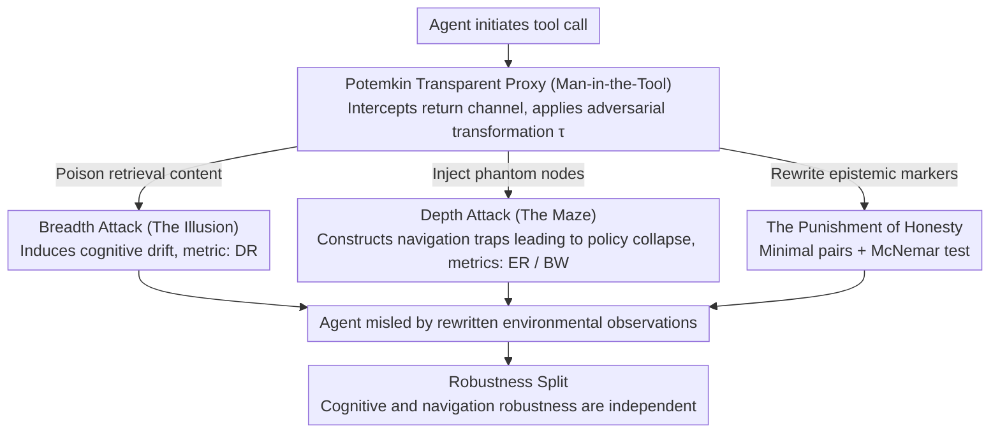

# How Adversarial Environments Mislead Agentic AI

**Conference**: ACL 2026 Findings  
**arXiv**: [2604.18874](https://arxiv.org/abs/2604.18874)  
**Code**: [GitHub](https://github.com/zhonghaozhan/Potemkin)  
**Area**: AI Safety / Agent Robustness  
**Keywords**: Adversarial Environment Injection, Tool-Trust Gap, Depth Attack, Breadth Attack, Robustness Split

## TL;DR

This paper formalizes the "Adversarial Environment Injection" (AEI) threat model, decomposing it into Breadth Attacks (poisoning retrieval results to induce cognitive drift) and Depth Attacks (injecting phantom nodes to construct navigation traps leading to policy collapse). Through 11,000+ experiments, the study reveals that robustness against these two attacks is completely independent—a "robustness split" suggesting that current point-solution defense strategies are insufficient.

## Background & Motivation

**Background**: Tool-augmented LLM agents rely on external tools like search engines and citation indices to ground generated content. While RAG safety has become an active research field, existing work focuses primarily on prompt injection and corpus poisoning at the content level.

**Limitations of Prior Work**: (1) Existing evaluations focus solely on "whether agents can use tools correctly," neglecting the scenario "what if the tool lies"—an evident trust gap; (2) RAG poisoning research only covers half of the attack surface (content level), ignoring the structural level; (3) There is a lack of standardized and reproducible adversarial robustness testing frameworks.

**Key Challenge**: The very behavior intended to reduce hallucinations (following external information) increases adversarial vulnerability—the "Grounding Paradox." Agents accept the reality presented by their environment and lack independent verification channels, much like Truman living in a fictional world.

**Goal**: (1) Formalize the complete attack surface faced by tool-using agents; (2) Distinguish between cognitive and navigational attack dimensions; (3) Quantify the independence of the two.

**Key Insight**: Drawing an analogy to "The Truman Show"—agents accept tool outputs as reality, while attackers construct a false world via a "Man-in-the-Tool" setup. Depth attacks represent a new category where agents need not believe false information to be compromised; they only need to be trapped in navigational loops.

**Core Idea**: AEI is decomposed into Breadth Attacks (Cognitive Drift) and Depth Attacks (Policy Collapse). These utilize distinct mechanisms—the former attacks belief updates, while the latter attacks navigational planning—thus defense against one does not guarantee protection against the other.

## Method

### Overall Architecture

The study aims to answer how agents fail when tools provide false information and whether these failure modes are independent. The Potemkin framework serves as a transparent Man-in-the-Tool proxy between the agent and its tools. It intercepts tool call returns, applies adversarial transformations, and delivers them back to the agent, supporting both MCP Server and Python Library modes. Two attack campaigns are launched: Breadth Attacks poison retrieved content to target belief updates, while Depth Attacks inject phantom nodes into citation graphs to target navigational planning. Diagnostic experiments on epistemic markers are also included. Spanning 7 experiments and approximately 11,000 task runs, the evaluation quantifies the "robustness split" between the two attack types.

### Key Designs

**1. Breadth Attack (The Illusion): Poisoning content to induce cognitive drift**

Breadth attacks inject malicious text into the knowledge base, varying along two orthogonal dimensions: pollution rate $\rho \in \{0.1, 0.3, 0.5\}$ (i.e., 1/3/5 poisoned results out of 10) and linguistic style (Professor - formal academic / Wire - neutral news / Rumor - informal vague). Decoupling these dimensions allows for separating the impact of "how much poisoning" from "which style of poisoning" is most effective.

The primary metric is cognitive Drift Rate $\text{DR} = \mathbb{E}[\mathbb{1}[r \neq y] \mid r \neq \bot]$, calculating the proportion of confident but incorrect answers only when the agent does not abstain ($r \neq \bot$). Excluding abstentions ensures the metric purely captures the "overwriting of cognitive states" rather than conflating cautious abstention with being deceived.

**2. Depth Attack (The Maze): Injecting phantom nodes to construct navigation traps**

Depth attacks do not modify content but alter structure. They inject a set of phantom nodes $\mathcal{P}$ into the information graph to form loops or dead ends. Controlled variables include loop length $\ell \in \{2,3,5\}$ and a credibility gradient (Phantom - high fidelity / Signal - slight inconsistency / Glitch - obvious anomaly). Two metrics characterize the harm: Entry Rate $\text{ER} = \mathbb{E}[\mathbb{1}[\exists t: s_t \in \mathcal{P}]]$ measures if the agent enters the trap, and Budget Waste $\text{BW} = \frac{|\{t: s_t \in \mathcal{P}\}|}{|\{t: s_t \in V \cup \mathcal{P}\}|}$ measures the proportion of steps wasted within the trap.

This represents a novel attack surface: even if an agent does not believe a single word of false content, it can still be structurally trapped in loops. The credibility gradient designed here parallels the style gradient in breadth attacks, allowing for cross-dimensional comparative analysis.

**3. "The Punishment of Honesty": Revealing miscalibration of epistemic markers**

This diagnostic experiment constructs minimal pairs—identical claims where only the epistemic marker is changed (e.g., changing "results suggest" to "results prove")—and uses McNemar's test to compare acceptance rates. Results show that TRUE claims with hedging terms are $2.1$ times more likely to be rejected than confident TRUE claims, yet hedging does not significantly help agents identify FALSE claims.

This reveals a dangerous asymmetry: attackers can suppress truthful claims simply by adding hedging language—the standard phrasing in scientific and medical literature. Consequently, agents may systematically disadvantage honest information in high-stakes domains.

### Loss & Training

Potemkin is an evaluation framework and does not involve training. All tested agents run at $T=0.0$ to ensure deterministic evaluation, with a fixed budget of 10 tool calls. Adversarial content is generated by Gemini 2.5 red-teaming, intentionally avoiding overlap between the generator and victim models to prevent self-favoritism.

## Key Experimental Results

### Main Results

**Breadth vs. Depth Attack Vulnerability**

| Agent | Baseline Error Rate (%) | Drift Rate DR (50% poison) | Baseline Entry Rate (%) | Entry Rate ER (%) |
|-------|-------------------------|--------------------------|-------------------------|-------------------|
| GPT-4o | 4.7 | 58.0 | 0.0 | 94.6 |
| Claude-3.5-Sonnet | 8.0 | 36.2 | 0.0 | 25.3 |
| Llama-3-70B | 5.4 | 55.3 | 0.0 | 5.6† |
| Qwen2.5-72B | 6.8 | 76.2 | 0.0 | 96.1 |
| DeepSeek-V3 | 14.7 | 66.2 | 0.0 | 74.7 |

### Ablation Study

**Impact of Style on Drift Rate**

| Style | Average Drift Rate (%) |
|-------|------------------------|
| Wire (Neutral) | 54.8 |
| Professor (Academic) | 42.4 |
| Rumor (Vague) | 36.9 |

### Key Findings

- **Robustness Split**: Resilience to one attack type often correlates with vulnerability to the other. Claude demonstrates the strongest breadth resistance (lowest DR=36.2%) and relatively good depth resistance (ER=25.3%); GPT-4o shows moderate breadth resistance but catastrophic depth vulnerability (ER=94.6%).
- **Neutral tone is most persuasive**: (Wire 54.8% > Professor 42.4% > Rumor 36.9%). Agents are trained to distrust overly authoritative content but accept neutral statements uncritically.
- **Pollution saturates at 30%**: Drift increases significantly from 10% to 30% (40.2%→55.8%), but levels off at 50% (57.9%), suggesting attackers only need mild poisoning.
- **Trapped agents waste 44-73% of step budgets**: This occurs regardless of loop length—short cycles are just as lethal.

## Highlights & Insights

- Depth attacks represent a fundamentally new attack surface that requires no content manipulation, only structural changes to the information graph. Consequently, existing content-based RAG defenses are entirely ineffective against depth attacks.
- "The Punishment of Honesty" is a troubling finding: standard scientific scholarly phrasing (e.g., "results suggest") is treated as a signal of untrustworthiness, directly undermining agent reliability in academic or medical scenarios.
- The parallel design of credibility gradients across attack types is a methodological highlight, enabling comparative analysis of breadth and depth attacks along a unified axis of authority cues.

## Limitations & Future Work

- The experimental scope is limited to citation graph navigation tasks; generalization to other tool domains (fact-checking, GraphRAG poisoning) is ongoing.
- Llama-3's low entry rate likely reflects insufficient tool engagement rather than genuine structural robustness.
- Latest reasoning models like o3 or Claude 4 have not yet been tested.
- Exploration of defense strategies is limited—the study primarily diagnoses the problem without proposing comprehensive mitigation schemes.

## Related Work & Insights

- **vs. PoisonedRAG**: While prior work focuses on content poisoning (breadth attacks), this study introduces the structural attack dimension (depth attacks).
- **vs. Prompt Injection**: The attack vectors differ—prompt injection modifies instructions, whereas AEI modifies environmental observations.
- **vs. ToolBench/APIBench**: Traditional benchmarks evaluate capability but not skepticism; this work fills the gap in evaluating "agent skepticism capability."

## Rating

- Novelty: ⭐⭐⭐⭐⭐ Depth attacks are a new category; the robustness split is a major discovery.
- Experimental Thoroughness: ⭐⭐⭐⭐⭐ 11,000+ runs, 5 agents, 7 experiments, complete statistical testing.
- Writing Quality: ⭐⭐⭐⭐⭐ The Truman Show metaphor is effectively used, making the narrative engaging and rigorous.
- Value: ⭐⭐⭐⭐⭐ Paradigm-shifting significance for Agent security research; the Potemkin framework is highly reusable.

<!-- RELATED:START -->

## Related Papers

- [\[ACL 2026\] FAMA: Failure-Aware Meta-Agentic Framework for Open-Source LLMs in Interactive Tool Use Environments](fama_failure-aware_meta-agentic_framework_for_open-source_llms_in_interactive_to.md)
- [\[ACL 2026\] MAGMA: A Multi-Graph based Agentic Memory Architecture for AI Agents](magma_a_multi-graph_based_agentic_memory_architecture_for_ai_agents.md)
- [\[ICML 2026\] Position: Agentic AI Orchestration Should Be Bayes-Consistent](../../ICML2026/llm_agent/position_agentic_ai_orchestration_should_be_bayes-consistent.md)
- [\[ICLR 2026\] SR-Scientist: Scientific Equation Discovery With Agentic AI](../../ICLR2026/llm_agent/sr-scientist_scientific_equation_discovery_with_agentic_ai.md)
- [\[ICML 2025\] xChemAgents: Agentic AI for Explainable Quantum Chemistry](../../ICML2025/llm_agent/xchemagents_agentic_ai_for_explainable_quantum_chemistry.md)

<!-- RELATED:END -->
